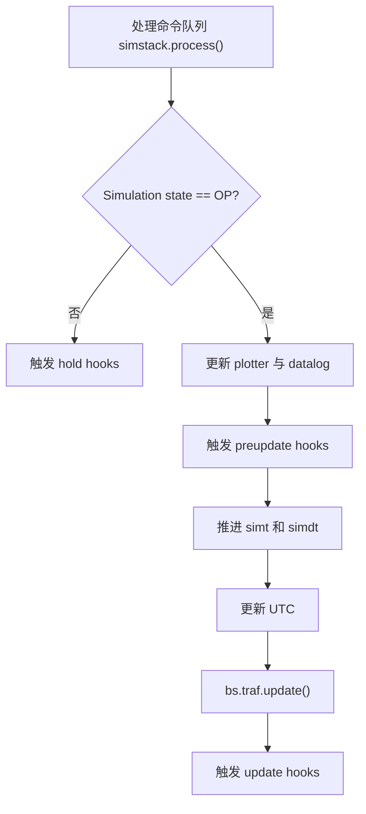
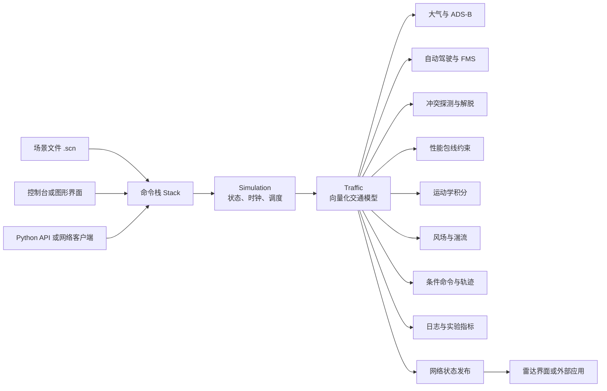

# BlueSky 二次开发技术指南

> 适用项目：TU Delft BlueSky Open Air Traffic Simulator  
> 目标读者：准备扩展仿真能力、实现算法、开发插件、改造界面或接入外部系统的开发人员  
> 文档语言：简体中文  
> 最后核对：2026-08-11，本地源码快照
> 配套业务需求：[BlueSky 仿真业务需求规格说明书](SIMULATION_REQUIREMENTS.zh-CN.md)

## 快速导航

- [1–3：目标、项目概览与开发环境](#1-文档目标与阅读建议)
- [4–7：架构、启动、核心框架与仿真循环](#4-仓库结构与架构分层)
- [8–10：交通数据、命令场景与插件开发](#8-交通数据模型与单位体系)
- [11–13：FMS、性能、ASAS 与导航工具](#11-航路自动驾驶与飞机性能)
- [14–16：网络、用户界面与模块定位](#14-网络与分布式模型)
- [17–21：测试、集成、调试、构建与发布](#17-测试策略)
- [22–27：常见陷阱、热点、导览和开发流程](#22-常见陷阱)
- [28：仿真模拟能力完整盘点](#28-仿真模拟能力完整盘点)

## 1. 文档目标与阅读建议

BlueSky 是一个面向空中交通管理（ATM）研究的开源仿真平台。它并不只是一个带雷达界面的桌面程序，而是由仿真内核、交通状态模型、命令语言、航空领域算法、网络通信和多个用户界面共同组成的分布式 Python 应用。

本文档帮助开发者回答以下问题：

- BlueSky 从启动到完成一个仿真步经历了什么；
- 飞机状态如何存储，新增逐飞机数据时应遵循什么规则；
- 命令、场景文件和插件如何驱动仿真；
- 自动驾驶、性能模型、冲突探测与解脱分别位于哪里；
- GUI 为什么不能总是直接访问真实仿真对象；
- 一项新功能应该写成插件，还是修改核心模块；
- 如何建立可重复的测试、调试和交付流程。

如果是第一次接触本项目，建议依次阅读第 2、4、5、6、7、9 和 17 章；如果目标已经明确，可直接查阅第 16 章的“需求到模块映射”。

## 2. 项目概览

### 2.1 项目定位

BlueSky 用于模拟和研究：

- 航空器运动与交通流；
- 航路、航路点、SID/STAR 和飞行管理；
- LNAV、VNAV、航向、高度和速度控制；
- 飞机性能、推力、油耗和性能包线；
- 冲突探测（CD）与冲突解脱（CR/ASAS）；
- 风场、湍流和 ADS-B 等环境或监视模型；
- 大规模场景、指标计算与实验数据输出；
- 单机或多节点分布式仿真；
- Qt/OpenGL、pygame 和文本控制台显示。

项目主语言是 Python，数值计算大量依赖 NumPy；Qt6 和 OpenGL 负责默认图形界面，ZeroMQ 负责进程间与网络通信。部分地理计算和冲突探测存在可选 C++ 加速实现。

### 2.2 许可证

仓库代码使用 MIT License，二次开发和再发布时需要保留原版权和许可声明。

BADA 3.x 数据不随仓库分发，且受 EUROCONTROL 的单独许可约束。代码许可不等于数据许可；如果产品需要携带或分发 BADA 数据，必须单独确认授权范围。

### 2.3 当前本地源码状态

当前本地目录 `bluesky-master` 来自 ZIP 解压，不包含项目自己的 `.git` 元数据。它适合阅读和试验，但不适合长期开发，原因包括：

- 无法正常获取提交历史、标签和上游差异；
- `hatch-vcs` 无法从 Git 标签计算包版本；
- 不方便创建特性分支、变基和提交 Pull Request；
- 父目录虽然是 Git 工作树，但并不是 BlueSky 源码自身的正常检出。

正式开发建议建立独立克隆：

```powershell
cd E:\workspace
git clone https://github.com/TUDelft-CNS-ATM/bluesky.git bluesky-dev
cd bluesky-dev
git switch -c feature/my-feature
```

## 3. 技术栈与开发环境

### 3.1 主要依赖

| 类别 | 组件 | 用途 |
|---|---|---|
| 语言 | Python 3.10+ | 主体实现 |
| 数值计算 | NumPy、SciPy | 向量化交通状态和科学计算 |
| 数据分析 | pandas、matplotlib | 数据处理、绘图和实验分析 |
| 通信 | pyzmq、msgpack | 网络传输和消息序列化 |
| 默认 GUI | PyQt6、PyQt6-WebEngine、PyOpenGL | Qt/OpenGL 雷达界面 |
| 备用 GUI | pygame | 兼容性显示界面 |
| 控制台 | textual | 终端客户端 |
| 性能模型 | OpenAP | 默认开源飞机性能模型 |
| 导航数据 | bluesky-navdata | 航路点、机场等导航数据 |
| GUI 数据 | bluesky-guidata | 图形界面所需资源 |

### 3.2 推荐的隔离环境

Windows 上不要直接使用系统 `pip`，尤其要先确认 `python` 没有指向 Python 2.x。推荐使用项目独立虚拟环境：

```powershell
uv venv .venv --python 3.12
uv pip install --python .venv\Scripts\python.exe -e ".[full]"
uv pip install --python .venv\Scripts\python.exe pytest flake8
```

如果源码不是正常 Git 克隆，editable 构建可能因 `hatch-vcs` 无法确定版本而失败。此时应优先使用正常 Git 克隆，而不是长期依赖伪造版本号。

### 3.3 可选原生扩展

源码构建会尝试编译部分 C++ 扩展。Windows 上需要 Microsoft Visual C++ 14.0+ Build Tools。如果没有编译器，BlueSky 可以回退到 Python 地理计算实现，但性能会低于编译版本。

涉及以下工作时建议安装 Build Tools：

- 大规模交通场景性能优化；
- 地理计算或冲突探测性能修改；
- 构建可分发 wheel；
- 验证 Python 与 C++ 实现的一致性。

### 3.4 环境自检

```powershell
.\.venv\Scripts\python.exe check.py
```

自检应确认 NumPy、SciPy、Qt、PyOpenGL、pygame 和 BlueSky 模块能够加载。OpenGL GUI 通常需要 OpenGL 3.3 或更高版本。

## 4. 仓库结构与架构分层

```text
bluesky-master/
├─ bluesky/
│  ├─ core/               核心框架：Entity、Signal、Timer、插件、交通数组
│  ├─ simulation/         仿真循环与状态输出
│  ├─ traffic/            飞机状态、自动驾驶、航路、性能、ASAS、风场
│  ├─ stack/              命令注册、解析、执行、场景调度和录制
│  ├─ network/            ZMQ 服务器、节点、客户端、订阅与共享状态
│  ├─ navdatabase/        导航数据加载和查询
│  ├─ tools/              航空、地理、区域、日志和通用计算工具
│  ├─ ui/                 QtGL、pygame 和 console 用户界面
│  ├─ plugins/            内置插件和示例
│  ├─ resources/          默认配置、性能和其他资源
│  └─ test/               pytest 测试
├─ plugins/               工作目录中的用户插件
├─ scenario/              场景与回归场景
├─ docs/                  文档和示例 Notebook
├─ extra/                 额外数据或辅助内容
├─ output/                仿真输出
├─ cache/                 运行时缓存
├─ pyproject.toml         依赖、入口点和打包配置
├─ hatch_build.py         wheel 构建和 C++ 扩展钩子
├─ BlueSky.py             兼容启动器
├─ BlueSky_pygame.py      pygame 启动器
└─ check.py               运行环境自检
```

### 4.1 分层职责

| 架构层 | 主要目录 | 核心职责 |
|---|---|---|
| 启动与核心 | `bluesky/__main__.py`、`bluesky/core/` | 初始化、单例、可替换实现、信号和仿真时间 |
| 仿真引擎 | `bluesky/simulation/` | 驱动仿真步、状态机、批处理和状态发布 |
| 交通仿真 | `bluesky/traffic/` | 飞机状态、运动学、FMS、性能、ASAS、天气 |
| 命令系统 | `bluesky/stack/` | 命令语言、场景文件、参数解析和执行队列 |
| 网络 | `bluesky/network/` | Server/Node/Client、ZMQ、发现、共享状态 |
| 导航数据 | `bluesky/navdatabase/` | 航路点、机场、导航台和航路查询 |
| 工具库 | `bluesky/tools/` | 大气、单位、地理、区域、日志、绘图 |
| 用户界面 | `bluesky/ui/` | QtGL、pygame、文本客户端 |
| 扩展 | `plugins/`、`bluesky/plugins/` | 实验算法、外部数据、指标和功能扩展 |
| 测试与交付 | `bluesky/test/`、`.github/` | 单元测试、网络测试、CI 和 wheel 构建 |

## 5. 启动模式与进程模型

### 5.1 主入口

标准入口是：

```powershell
.\.venv\Scripts\python.exe -m bluesky
```

`pyproject.toml` 同时注册了 `bluesky` 控制台命令，最终进入 `bluesky/__main__.py:main()`。入口解析参数后调用 `bluesky.init()`，再根据模式启动服务器、客户端、仿真节点或 GUI。

### 5.2 主要运行模式

| 模式 | 示例 | 说明 |
|---|---|---|
| Server + GUI | `python -m bluesky` | 默认桌面运行方式，启动服务器和 QtGL 客户端，并生成仿真节点 |
| Headless Server | `python -m bluesky --headless` | 无 GUI 服务器，适合远程或批处理 |
| Qt 客户端 | `python -m bluesky --client HOST` | 只启动 GUI，连接已有服务器 |
| Console 客户端 | `python -m bluesky --console HOST` | 启动文本客户端 |
| Simulation Node | `python -m bluesky --sim` | 启动网络仿真节点 |
| Detached Simulation | Python API 中 `detached=True` | 单进程、无网络仿真，适合算法测试和 Notebook |

### 5.3 初始化顺序

`bluesky.init()` 的关键顺序如下：

1. 校验 mode、gui、detached 等参数；
2. 初始化资源路径和工作目录；
3. 加载 `settings.cfg`；
4. 初始化通用工具和参考数据；
5. 加载导航数据库；
6. 根据模式创建 Server、Traffic、Simulation、Screen 和 Node；
7. 初始化变量浏览器；
8. 扫描并加载插件；
9. 初始化命令栈；
10. 如果指定场景文件，将 `IC` 命令加入命令队列。

### 5.4 全局对象

BlueSky 通过包级全局变量暴露主要服务：

```python
import bluesky as bs

bs.traf   # Traffic 或 GUI 中的 TrafficProxy
bs.sim    # Simulation
bs.navdb  # Navdatabase
bs.net    # Node、Detached Node 或网络客户端
bs.scr    # ScreenIO、pygame Screen 等
bs.server # Server 模式中的服务器
```

这些对象是项目事实上的服务定位器。它们方便插件开发，但也造成较强的全局耦合。测试代码应显式完成初始化和 reset，避免多个测试之间共享残余状态。

## 6. 核心框架设计

### 6.1 Base 与可替换实现

`bluesky/core/base.py` 提供可替换实现框架。核心类可声明 `replaceable=True`，插件通过继承它们提供新的实现，例如：

- `Autopilot`；
- `Route`；
- `PerfBase`；
- `ConflictDetection`；
- `ConflictResolution`；
- 风、湍流和 ADS-B 模型。

加载替代实现后，可通过 `IMPLEMENTATION`/`IMPL` 类命令选择具体实现。这种方式适合研究算法对比，因为能够在不改动调用方的情况下替换策略。

### 6.2 Entity 单例

`bluesky/core/entity.py` 使用元类控制 `Entity` 的实例化，主要实体通常在一个进程内只创建一次。扩展功能时应区分：

- 新增独立能力：继承 `core.Entity`；
- 替换已有能力：继承对应的 replaceable 类；
- 仅提供无状态函数：可以使用普通模块函数，但可管理性较弱。

### 6.3 Signal 事件机制

`bluesky/core/signal.py` 提供发布/订阅机制。项目使用信号解耦：

- 仿真状态变化；
- 网络节点加入或离开；
- 共享状态更新；
- GUI 与数据模型交互；
- 仿真生命周期钩子。

开发新模块时，如果需求是“某事件发生后通知多个组件”，优先考虑信号，而不是在核心循环里逐个硬编码调用。

### 6.4 仿真时间、Timer 与 timed_function

仿真时间由 `bluesky/core/simtime.py` 管理，与真实墙钟时间分离。BlueSky 支持实时、倍速、快速前进、基准测试和批处理模式，因此算法不得直接把 `time.time()` 当成仿真时间。

周期逻辑应使用：

```python
@core.timed_function(name="my-update", dt=1.0)
def update(self):
    ...
```

或使用 `Timer` 和仿真 hooks。这样在快速仿真和变步长条件下仍能保持正确调度。

## 7. 仿真循环

### 7.1 Simulation 状态

主要状态包括：

- `INIT`：初始化，等待交通或待执行场景；
- `HOLD`：暂停；
- `OP`：运行；
- `END`：结束。

### 7.2 单个仿真步

`Simulation.step()` 的核心流程是：



`Simulation.update()` 在 `step()` 外层处理实时节拍、休眠、延迟补偿、快速前进和基准测试停止条件。

### 7.3 交通更新顺序

`Traffic.update()` 在存在飞机时依次执行：

1. 根据当前高度更新大气状态；
2. 更新 ADS-B 模型；
3. 更新自动驾驶/FMS 指令；
4. 按 ASAS 周期执行冲突探测、解脱和恢复导航；
5. 决定采用自动驾驶还是 ASAS 指令；
6. 根据性能模型限制目标速度、垂直速度和高度；
7. 更新空速、地速和位置；
8. 更新湍流；
9. 检查条件命令；
10. 更新航迹尾迹等后处理。

修改这条链路时必须明确数据属于：当前状态、目标状态、受限目标状态还是积分后的新状态。随意调整顺序会改变仿真物理意义。

## 8. 交通数据模型与单位体系

### 8.1 向量化数组模型

BlueSky 不为每架飞机维护一个完整 Python 对象，而是按属性维护 NumPy 数组：

```python
traf.id[i]
traf.lat[i]
traf.lon[i]
traf.alt[i]
traf.tas[i]
traf.hdg[i]
```

同一索引 `i` 在所有数组中代表同一架飞机。这种“结构分离数组”设计可以让大量飞机的状态更新通过 NumPy 向量化完成。

优点：

- 大规模计算速度高；
- 易于批量筛选和广播计算；
- 适合冲突探测和性能计算。

约束：

- 所有逐飞机数组必须保持相同长度；
- 删除飞机后索引可能变化，不能长期缓存数组索引；
- 直接追加或删除某一个数组会破坏整体一致性；
- 插件需要使用交通数组注册机制。

### 8.2 注册自定义逐飞机状态

```python
class MyEntity(core.Entity):
    def __init__(self):
        super().__init__()
        with self.settrafarrays():
            self.score = np.array([])
            self.mode = []

    def create(self, n=1):
        super().create(n)
        self.score[-n:] = 0.0
```

注册后，BlueSky 会在飞机创建、删除和 reset 时同步维护这些数组。覆写 `create()` 时必须调用 `super().create(n)`。

### 8.3 常用内部单位

| 变量 | 内部单位 | 典型输入形式 |
|---|---|---|
| `lat`, `lon` | 度 | 十进制度 |
| `alt`, `selalt` | 米 | 英尺或 Flight Level |
| `tas`, `cas`, `gs` | 米/秒 | 节或 Mach |
| `vs`, `selvs` | 米/秒 | 英尺/分钟 |
| `distflown` | 米 | 海里 |
| `hdg`, `trk` | 度 | 度 |
| `p` | Pa | 内部计算 |
| `rho` | kg/m³ | 内部计算 |
| `Temp` | K | 内部计算 |

常用转换常量和函数位于 `bluesky/tools/aero.py`，例如 `ft`、`kts`、`fpm`、`nm`、CAS/TAS/Mach 转换。算法边界应明确执行单位转换，内部尽量保持 SI 单位。

## 9. 命令栈与场景文件

### 9.1 命令系统的地位

命令栈是 BlueSky 最稳定的控制接口。GUI 控制台、场景文件、插件和外部客户端最终都可以通过命令驱动仿真。

核心模块：

- `stack/cmdparser.py`：命令注册、函数签名解析和帮助文本；
- `stack/argparser.py`：BlueSky 特有参数类型和输入校验；
- `stack/stackbase.py`：队列和转发；
- `stack/simstack.py`：仿真侧执行、定时命令和场景合并；
- `stack/clientstack.py`：客户端侧命令；
- `stack/basecmds.py`：内置命令集合；
- `stack/recorder.py`：命令录制和保存。

### 9.2 新增命令

推荐使用装饰器：

```python
from bluesky import stack, traf

@stack.command
def score(acid: "acid", value: float = -1.0):
    """Query or update an aircraft score."""
    if value < 0:
        return True, f"{traf.id[acid]} score queried"
    return True, f"{traf.id[acid]} score set to {value}"
```

常见约定：

- 命令名默认取函数名的大写形式；
- Python 类型注解用于生成参数解析器；
- 字符串注解如 `"acid"` 可使用 BlueSky 专用解析类型；
- 成功通常返回 `(True, message)`；
- 参数或业务失败返回 `(False, message)`；
- 函数 docstring 会参与帮助信息生成。

### 9.3 场景文件

`.scn` 文件由带时间戳的命令组成：

```text
# 创建飞机
00:00:00.00>CRE KL204,B744,52,4,90,FL250,350

# 设置起终点并启用航路跟随
00:00:00.00>KL204 ORIG EHAM
00:00:00.00>KL204 DEST EGLL
00:00:01.00>KL204 LNAV ON
00:00:01.00>KL204 VNAV ON

# 改变控制目标
00:00:10.00>KL204 HDG 235
00:00:11.00>KL204 SPD M.82
00:00:12.00>KL204 ALT FL200
```

场景文件既是实验输入，也是非常有价值的回归测试载体。算法修改应至少保存：

- 最小复现场景；
- 固定的初始条件；
- 期望事件或关键数值；
- 与版本对应的输出数据。

## 10. 插件开发

### 10.1 为什么优先使用插件

插件是二次开发的首选边界，因为它可以：

- 添加命令；
- 注册逐飞机状态；
- 周期运行算法；
- 访问交通、导航和仿真对象；
- 监听生命周期事件；
- 替换自动驾驶、航路、性能、CD/CR 等实现；
- 降低与上游代码合并时的冲突。

工作目录中的 `plugins/` 会加入 `bluesky.plugins` 搜索路径。内置示例位于 `bluesky/plugins/example.py`。

### 10.2 最小完整插件

在项目根目录创建 `plugins/myplugin.py`：

```python
"""Example BlueSky development plugin."""

import numpy as np
from bluesky import core, stack, traf


def init_plugin():
    MyPlugin()
    return {
        "plugin_name": "MYPLUGIN",
        "plugin_type": "sim",
    }


class MyPlugin(core.Entity):
    def __init__(self):
        super().__init__()
        with self.settrafarrays():
            self.score = np.array([])

    def create(self, n=1):
        super().create(n)
        self.score[-n:] = 0.0

    @core.timed_function(name="myplugin-update", dt=1.0)
    def update(self):
        if traf.ntraf:
            self.score[:] += 1.0

    @stack.command
    def myscore(self, acid: "acid"):
        return True, f"{traf.id[acid]} score={self.score[acid]:.1f}"
```

在 BlueSky 控制台执行：

```text
PLUGINS LIST
PLUGINS LOAD MYPLUGIN
MYSCORE KL204
```

也可以在 `settings.cfg` 中将插件加入 `enabled_plugins`，使其启动时自动加载。

### 10.3 插件输出原则

如果已有命令能够表达修改，优先使用：

```python
stack.stack("KL204 ADDWPT SPY")
```

而不是直接修改深层内部数组。命令接口相对稳定，还能被记录、转发和复现。只有对性能或原子操作有明确要求时，才直接调用内部对象方法。

### 10.4 替换核心实现

研究型算法常见做法是继承 replaceable 类：

```python
from bluesky.traffic.asas import ConflictResolution

class MyResolution(ConflictResolution):
    def __init__(self):
        super().__init__()

    def resolve(self, conf, ownship, intruder):
        ...
```

替换实现需要遵守父类数据契约、输出形状、单位和更新周期，并针对无交通、单机、多冲突和删除飞机等边界情况测试。

## 11. 航路、自动驾驶与飞机性能

### 11.1 Route 与 ActiveWaypoint

`traffic/route.py` 负责：

- 航路点列表；
- 当前航段；
- 起点和终点；
- SID/STAR 等程序；
- 航路点插入、删除和查询；
- 与 LNAV/VNAV 相关的航路命令。

`traffic/activewpdata.py` 保存当前活动航路点和下一航段引导所需数据。

修改航路逻辑时需要同时考虑：

- 航路对象与交通数组索引的一致性；
- 飞机删除后的对象生命周期；
- 航路点命名冲突；
- 导航数据库和用户自定义航路点；
- 起飞、进近和跨越航路点的判定。

### 11.2 Autopilot

`traffic/autopilot.py` 处理航向、速度、高度、LNAV、VNAV 和航路跟随目标。它产生的是控制目标，最终还会经过 ASAS 选择和性能包线限制。

因此调试“飞机没有按期望飞行”时，应依次检查：

1. 用户选择目标 `selspd/selalt/selvs`；
2. Autopilot 输出；
3. APorASAS 是否选择了 ASAS 指令；
4. 性能模型是否裁剪目标；
5. 运动学积分是否达到目标；
6. 风和湍流是否改变了地速或航迹。

### 11.3 性能模型

性能层以 `traffic/performance/perfbase.py` 为统一接口，主要实现包括：

- OpenAP：默认开源模型；
- BADA：需要外部许可数据；
- Legacy：BlueSky 旧性能模型。

性能模型负责的典型输出包括：

- 推力与阻力相关计算；
- 油耗；
- 最大加速度；
- 可用速度、垂直速度和高度限制；
- 飞行阶段识别。

新增性能模型时，应先实现与 `PerfBase` 相同的逐飞机数组和方法契约，再通过统一场景比较爬升、巡航、下降和油耗曲线。

## 12. 冲突探测与解脱（ASAS）

相关模块位于 `bluesky/traffic/asas/`：

- `detection.py`：冲突探测抽象与冲突数据库；
- `statebased.py`：状态向量冲突探测；
- `resolution.py`：冲突解脱抽象和激活状态；
- `mvp.py`：MVP 解脱算法；
- `resumenav.py`：冲突结束后的恢复导航；
- `pastcpa.py`：CPA 相关判断；
- `src_cpp/`：部分原生加速实现。

### 12.1 关键概念

- RPZ/HPZ：水平和垂直保护区；
- look-ahead time：冲突预判窗口；
- conflict pair：预计进入保护区的飞机对；
- loss of separation：已经发生的间隔丧失；
- resolution channel：航向、速度、垂直速度或高度解脱；
- resume navigation：冲突解除后恢复原航迹。

### 12.2 算法开发检查项

- 自机/入侵机顺序是否影响结果；
- 飞机对是否需要去重；
- 角度是否正确处理 0/360 度环绕；
- 水平距离和垂直距离单位是否一致；
- 零相对速度、平行航迹和共点是否稳定；
- 多冲突时单个解脱指令如何合并；
- 结果是否满足飞机性能限制；
- 冲突结束后是否正确恢复 LNAV/VNAV；
- 算法复杂度是否能支持目标飞机规模。

## 13. 导航数据、航空计算与空间区域

### 13.1 导航数据库

`bluesky/navdatabase/` 负责加载和查询：

- 航路点；
- 导航台；
- 机场与跑道；
- 航路连接；
- FIR/空域和国家信息；
- 用户自定义航路点。

`navdatabase.py` 是主要查询接口，`loadnavdata.py` 和 `loadnavdata_txt.py` 负责加载、缓存和解析。

### 13.2 工具库

| 文件 | 用途 |
|---|---|
| `tools/aero.py` | 标准大气、速度和单位转换 |
| `tools/geo/_geo.py` | WGS84 距离、方位和位置计算 |
| `tools/areafilter.py` | 多边形/区域和空间过滤 |
| `tools/position.py` | 名称、机场、航路点和经纬度位置解析 |
| `tools/misc.py` | 高度、速度、航向、颜色等文本解析 |
| `tools/datalog.py` | 仿真数据记录 |
| `tools/plotter.py` | 绘图更新 |
| `tools/cachefile.py` | 数据缓存 |

地理和航空计算应尽量复用这些工具，避免在插件中重复实现不同精度或不同单位的版本。

## 14. 网络与分布式模型

### 14.1 角色

BlueSky 网络层主要包含：

- Server：管理连接、发现和仿真节点；
- Simulation Node：运行真实仿真；
- Client：Qt、console 或外部客户端；
- Publisher/Subscriber：发布和订阅消息；
- Shared State：跨节点同步状态；
- Discovery：查找可连接服务器。

### 14.2 通信技术

- ZeroMQ 提供消息传输；
- msgpack 负责结构化序列化；
- NumPy 数据有专门的编码支持；
- topic 和 group ID 用于路由消息；
- 共享状态与原始消息订阅是不同的数据模式。

### 14.3 GUI 开发的重要约束

GUI 进程中的 `bs.traf` 可能是 `TrafficProxy`，而不是仿真节点中的 `Traffic`。界面需要的数据通常通过：

- `ScreenIO` 发布；
- shared state 同步；
- subscriber 接收；
- stack command 发送控制请求。

不要在 Qt 控件中直接假设能够访问仿真节点的全部 Python 对象，否则在单机看似可用的代码，在独立客户端或多机部署时会失败。

### 14.4 修改网络层的风险

`network/server.py`、`node.py`、`subscriber.py` 和 `sharedstate.py` 属于复杂度热点。修改消息协议时需要同时核对：

- 服务端与客户端版本兼容；
- topic 名称和订阅时机；
- 节点重连后的重新订阅；
- NumPy dtype、形状和字节序；
- 进程退出和 socket 清理；
- 超时、发现和多节点竞争；
- 大数组发布频率与带宽。

## 15. 用户界面

### 15.1 Qt/OpenGL 界面

主要目录为 `bluesky/ui/qtgl/`：

| 模块 | 职责 |
|---|---|
| `gui.py` | Qt 应用启动和主流程 |
| `mainwindow.py` | 主窗口、菜单、布局和对话框 |
| `radarwidget.py` | 雷达视图、缩放、平移和坐标转换 |
| `glhelpers.py` | Shader、VAO、纹理、字体和 OpenGL 基础设施 |
| `gltraffic.py` | 飞机符号、标签、航迹和航路渲染 |
| `glnavdata.py` | 机场、航路点等导航覆盖层 |
| `glpoly.py` | 区域和多边形绘制 |
| `console.py` | Qt 命令控制台 |
| `settingswindow.py` | 设置界面 |

OpenGL 相关开发需要注意：

- OpenGL 上下文只能在合适线程和生命周期内使用；
- CPU 数组与 GPU Buffer 的形状和容量必须匹配；
- 数据更新频率不应无条件等于仿真步频率；
- 坐标转换要区分屏幕、OpenGL、经纬度和地图瓦片坐标；
- GUI 数据来自网络共享状态，需处理尚未收到数据的情况。

### 15.2 pygame 与文本界面

`ui/pygame/` 是兼容性较好的 2D 界面；`ui/console/` 提供文本客户端。开发纯算法时优先使用 detached 或 headless 模式，避免 GUI 影响测试速度和稳定性。

## 16. 需求到模块的映射

| 需求 | 推荐扩展方式 | 主要代码位置 |
|---|---|---|
| 新增控制命令 | 插件命令 | `plugins/`、`stack.command` |
| 新增逐飞机属性 | 插件 Entity | `core.Entity`、`settrafarrays()` |
| 新指标/日志 | 插件 + datalog | `plugins/`、`tools/datalog.py` |
| 生成交通流 | 插件 | `plugins/trafgen.py`、`synthetic.py` |
| 外部实时航迹接入 | 数据源插件 | `plugins/adsbfeed.py`、`opensky.py` |
| 新冲突探测算法 | replaceable 插件 | `traffic/asas/detection.py` |
| 新冲突解脱算法 | replaceable 插件 | `traffic/asas/resolution.py` |
| 修改 LNAV/VNAV | 核心或替代实现 | `traffic/autopilot.py`、`route.py` |
| 新性能模型 | `PerfBase` 实现 | `traffic/performance/` |
| 新风场/天气源 | 插件或模型替换 | `traffic/windfield.py`、天气插件 |
| 新导航数据源 | 导航加载层 | `navdatabase/`、`refdata.py` |
| 新雷达图层 | QtGL 渲染模块 | `ui/qtgl/` + shared state |
| 新外部应用 | detached API 或网络客户端 | `network/client.py`、Python API |
| 批量实验 | SCN + headless/detached | `scenario/`、`Simulation.step()` |

## 17. 测试策略

### 17.1 当前测试结构

现有 pytest 测试主要覆盖：

- TrafficArrays 创建、删除和 reset；
- Traffic 基础行为；
- Route 航路点操作；
- Windfield；
- TCP/网络客户端简单通信。

测试目录：

```text
bluesky/test/
├─ traffic/
│  ├─ test_trafficarrays.py
│  ├─ test_traffic.py
│  ├─ test_route_wpt.py
│  └─ test_windfield.py
└─ tcp/
   ├─ conftest.py
   └─ test_simple.py
```

### 17.2 本地测试命令

```powershell
# 环境自检
.\.venv\Scripts\python.exe check.py

# 快速交通层测试
.\.venv\Scripts\python.exe -m pytest bluesky\test\traffic -q

# 全部 pytest
.\.venv\Scripts\python.exe -m pytest -q

# 只检查严重语法和未定义名称问题
.\.venv\Scripts\python.exe -m flake8 . --count --select=E9,F63,F7,F82 --ignore=F821 --show-source --statistics
```

### 17.3 CI 现状

`.github/workflows/python-test.yml` 覆盖 Python 3.10、3.11、3.12 和 3.13，但当前 pytest 执行步骤被注释，实际主要执行依赖安装和 flake8 严重错误检查。

维护自己的分支时建议恢复 pytest，并增加：

- Windows 测试；
- headless 冒烟测试；
- 最小场景执行测试；
- 输出数据或关键状态回归；
- 插件加载测试；
- 网络断开和重连测试；
- 性能基准和大规模飞机数量测试。

### 17.4 算法测试层次

建议分四层：

1. **纯函数单元测试**：航空、地理、单位转换和数学算法；
2. **组件测试**：Entity、性能模型、CD/CR、Route；
3. **detached 仿真测试**：初始化 BlueSky 后逐步调用 `bs.sim.step()`；
4. **场景回归测试**：运行 `.scn`，比较冲突数、航迹、到达时间或输出文件。

浮点数测试应使用合理容差，不要直接比较完整数组的字符串表示。

## 18. Detached API 与外部集成

不需要 GUI 和网络时，可以把 BlueSky 当作 Python 库：

```python
import bluesky as bs

bs.init(mode="sim", detached=True)
bs.stack.stack("CRE KL204 B744 EHAM/RW27")

for _ in range(100):
    bs.sim.step()

print(bs.traf.id)
print(bs.traf.lat)
print(bs.traf.lon)
```

需要注意：

- 命令加入队列后，要执行仿真步才会被处理；
- 同一解释器内重复初始化可能受到全局单例影响；
- 测试结束要 reset 或使用独立进程隔离；
- 无 GUI 模式仍可能需要导航和性能数据；
- 大规模实验应明确随机种子、初始场景和输出目录。

如果外部系统需要连接正在运行的 BlueSky，应使用网络客户端和命令/订阅接口，而不是通过进程内全局对象集成。

## 19. 设置、资源和运行目录

### 19.1 settings.cfg

首次运行会从默认资源复制 `settings.cfg`。常见设置包括：

- 性能模型；
- 场景目录；
- 插件目录和自动加载插件；
- 仿真步长；
- 网络地址和端口；
- GUI、颜色和显示参数。

模块可通过 `settings.set_variable_defaults()` 注册默认设置。插件应给自己的设置使用明确名称，避免与核心配置冲突。

### 19.2 运行时目录

- `scenario/`：场景输入；
- `plugins/`：用户插件；
- `output/`：日志和实验输出；
- `cache/`：导航和图形数据缓存；
- `settings.cfg`：当前工作目录配置。

生产或批处理任务建议通过 `--workdir` 为每个实验指定独立工作目录，避免多个任务共享配置、缓存和输出。

## 20. 调试方法

### 20.1 从命令跟踪状态

遇到命令行为异常时按以下链路定位：

```text
命令文本
  -> argparser 参数转换
  -> cmdparser 命令函数
  -> simstack 调度与执行
  -> traf/ap/route 等状态修改
  -> 下一个 Simulation.step()
  -> ScreenIO/shared state
  -> GUI 显示
```

### 20.2 常用调试模式

- 使用 detached 模式消除网络和 GUI 干扰；
- 使用只有一到两架飞机的最小场景；
- 暂停在单步仿真，检查 `bs.sim.simt` 和 `bs.sim.simdt`；
- 同时记录选择目标、ASAS 目标、性能限制后目标和最终状态；
- 使用 NumPy 掩码打印异常飞机，而不是输出全部飞机；
- 网络问题分别记录服务器、仿真节点和客户端日志；
- OpenGL 问题先确认数据是否已到达 GUI，再检查 Buffer 和 Shader。

### 20.3 性能分析

优先关注：

- Python 层逐飞机循环；
- O(n²) 飞机对计算；
- 每步重复分配大型 NumPy 数组；
- 过高频率的网络发布；
- GUI 每帧重建 GPU Buffer；
- 重复导航查询或文本解析；
- 不必要的 pandas/DataFrame 转换。

优化前应先建立可重复基准，并区分仿真计算时间、网络时间和渲染时间。

## 21. 构建与发布

项目使用 Hatchling 和 hatch-vcs：

- `pyproject.toml` 定义依赖、可选 extras 和 `bluesky` 命令入口；
- hatch-vcs 从 Git 标签生成版本；
- `hatch_build.py` 参与 C++ 扩展构建；
- `.github/workflows/build-wheels.yml` 定义 wheel 构建流水线。

发布前建议验证：

1. 源码来自包含 Git 元数据和标签的正常克隆；
2. Python 3.10–3.13 均能安装；
3. Windows/Linux 目标平台的原生扩展能够编译；
4. wheel 安装后包含所需资源；
5. headless、Qt、console extras 分别可用；
6. 插件和场景路径在源码与安装包模式下都正确；
7. 许可证和第三方数据清单完整。

## 22. 常见陷阱

### 22.1 使用错误 Python

Windows 的 `python` 或 `pip` 可能指向旧版本。始终使用虚拟环境解释器：

```powershell
.\.venv\Scripts\python.exe -m bluesky
```

### 22.2 混淆用户单位和内部单位

命令中的 FL250、350 节并不意味着内部数组也是英尺和节。内部高度和速度主要使用 SI 单位。

### 22.3 缓存飞机索引

删除飞机后数组会压缩，原索引可能指向另一架飞机。跨仿真步长期保存索引时，应同时校验呼号或重新查询。

### 22.4 忘记注册交通数组

插件中的普通 NumPy 数组不会自动随飞机创建/删除调整，必须放在 `with self.settrafarrays()` 中。

### 22.5 覆写 create 时没有调用 super

这会导致父类数组与子类数组长度不一致。

### 22.6 在 GUI 进程直接修改 Traffic

GUI 中可能只有 `TrafficProxy`。控制操作应发命令，显示数据应通过共享状态或订阅获取。

### 22.7 使用墙钟时间驱动算法

快速前进、暂停和变步长会破坏基于 `time.time()` 的算法。应使用仿真时间与 Timer。

### 22.8 修改核心但没有场景回归

自动驾驶、性能和 ASAS 的小改动可能只在特定交叉角、飞行阶段或多冲突条件下暴露问题。必须保存最小复现场景和数值断言。

### 22.9 把 BADA 数据和代码一起分发

BADA 数据有独立许可，不能因为 BlueSky 是 MIT 就自动随产品分发。

### 22.10 忽略无原生扩展时的性能差异

Python 回退实现功能上可能可用，但大规模场景性能和数值路径可能与 C++ 扩展不同，发布前应在目标构建配置上测试。

## 23. 复杂度热点

以下模块耦合较高、状态较多或算法复杂，建议在理解调用链并建立测试后再修改：

| 模块 | 风险原因 |
|---|---|
| `simulation/simulation.py` | 控制全局时间、状态与生命周期 |
| `traffic/traffic.py` | 汇总大部分逐飞机状态和更新顺序 |
| `traffic/autopilot.py` | LNAV/VNAV、目标选择和航路跟随 |
| `traffic/route.py` | 航路对象、程序和航路点边界情况多 |
| `traffic/asas/` | 飞机对、时间预测、多冲突和恢复导航 |
| `traffic/performance/` | 物理模型、飞行阶段和性能限制 |
| `stack/argparser.py` | 大量 BlueSky 特有输入类型 |
| `stack/cmdparser.py` | 装饰器、函数反射和命令元数据 |
| `stack/simstack.py` | 场景时序、队列、合并和命令执行 |
| `network/server.py` | 多节点生命周期和进程管理 |
| `network/sharedstate.py` | 跨进程状态一致性 |
| `network/subscriber.py` | 动态订阅、重连和 topic 管理 |
| `ui/qtgl/glhelpers.py` | OpenGL 生命周期和 GPU 资源 |
| `ui/qtgl/gltraffic.py` | 大规模动态交通渲染 |
| `ui/qtgl/radarwidget.py` | 多坐标系转换和交互状态 |

## 24. 推荐源码导览

按以下顺序阅读可以逐步建立完整模型：

1. `README.md`、`pyproject.toml`：项目目标、依赖与入口；
2. `bluesky/__main__.py`：命令行入口和模式分派；
3. `bluesky/__init__.py`：全局对象和初始化顺序；
4. `core/base.py`、`entity.py`、`signal.py`、`simtime.py`：核心框架；
5. `simulation/simulation.py`：仿真循环；
6. `stack/simstack.py`、`cmdparser.py`、`argparser.py`：命令驱动；
7. `traffic/traffic.py`、`core/trafficarrays.py`：数据模型；
8. `traffic/autopilot.py`、`route.py`：FMS 与引导；
9. `tools/aero.py`、`tools/geo/_geo.py`：领域计算与单位；
10. `traffic/performance/`：性能模型；
11. `traffic/asas/`：冲突探测与解脱；
12. `navdatabase/`：导航数据；
13. `network/`、`simulation/screenio.py`：跨进程数据；
14. `ui/qtgl/` 或目标界面；
15. `core/plugin.py`、`plugins/example.py`：可扩展机制；
16. `bluesky/test/` 和 GitHub Actions：验证与交付。

## 25. 推荐开发流程

### 25.1 开始开发前

- 使用独立 Git 克隆；
- 创建特性分支；
- 建立 Python 3.12 虚拟环境；
- 安装 full、pytest 和 flake8 依赖；
- 执行 `check.py`；
- 运行现有测试；
- 保存一个与需求相关的最小基准场景。

### 25.2 实现过程中

- 优先插件，必要时才修改核心；
- 明确所有输入输出单位；
- 避免逐飞机 Python 循环，优先 NumPy 向量化；
- 使用仿真时间，不使用墙钟时间驱动算法；
- 用命令接口表达可复现控制；
- 给新行为补充单元测试和 `.scn` 回归场景；
- 定期在 headless/detached 模式运行快速测试；
- 若涉及 UI，同步验证独立客户端模式。

### 25.3 提交前

- 运行环境自检、pytest 和 flake8；
- 验证无交通、单机、多机和飞机删除情况；
- 对数值结果使用合理容差；
- 比较性能基准；
- 检查配置和输出是否污染仓库；
- 更新用户命令帮助和技术文档；
- 检查第三方数据与许可证；
- 在目标 Python 和操作系统版本上验证。

## 26. 第一项练习建议

为了最低风险地熟悉项目，建议完成一个“飞机评分插件”：

1. 从 `bluesky/plugins/example.py` 复制结构；
2. 在根目录 `plugins/` 创建插件；
3. 注册一个 `score` 逐飞机数组；
4. 添加 `MYSCORE` 查询命令；
5. 用 `timed_function` 每秒更新一次；
6. 创建两架飞机的 `.scn`；
7. 测试飞机创建和删除后数组仍然对齐；
8. 使用 detached API 写 pytest；
9. 在 Qt GUI 中通过命令验证；
10. 最后尝试把评分结果通过共享状态显示到 GUI。

这个练习覆盖插件、Entity、TrafficArrays、命令、仿真时间、场景、测试和网络/UI 边界，是进入复杂算法前最完整的入门路径。

## 27. 参考文件

- 项目说明：`README.md`
- 构建配置：`pyproject.toml`
- 环境检查：`check.py`
- 启动入口：`bluesky/__main__.py`
- 初始化：`bluesky/__init__.py`
- 仿真循环：`bluesky/simulation/simulation.py`
- 交通模型：`bluesky/traffic/traffic.py`
- 交通数组：`bluesky/core/trafficarrays.py`
- 插件模板：`bluesky/plugins/example.py`
- 命令解析：`bluesky/stack/cmdparser.py`
- 场景示例：`scenario/_tutorial_example_commands.scn`
- Python API 示例：`docs/python_demo.ipynb`
- 测试：`bluesky/test/`
- CI：`.github/workflows/python-test.yml`
- BADA 说明：`bluesky/resources/performance/BADA/README.md`

## 28. 仿真模拟能力完整盘点

本章结合当前源码、本地 Wiki、内置插件和示例场景，对 BlueSky 已实现的仿真能力进行集中梳理。这里的“仿真模拟部分”不只指 `bluesky/simulation/`：该目录主要负责状态、时钟和调度，实际航空器行为位于 `traffic/`，场景驱动位于 `stack/`，实验扩展位于 `plugins/`，外部控制和并行运行则由 `network/` 提供。

### 28.1 总体定位与模型边界

BlueSky 是一套面向空中交通管理研究的快速时间仿真平台。它实现的核心可以概括为：

> 多航空器运动学仿真 + FMS/自动驾驶 + 飞机性能约束 + 冲突探测与解脱 + 场景实验 + 数据记录。

它并不是完整的高保真六自由度飞行动力学模拟器。航空器位置由经纬度、高度、地速和垂直速度直接积分，转弯率由速度和滚转角近似计算，速度和爬降能力受性能模型包线限制。源码中没有完整的气动力矩、舵面、发动机瞬态、飞控内环和机体姿态六自由度方程。因此，BlueSky 适合交通流、航迹、空域和冲突算法研究，不适合直接替代驾驶舱训练或适航级飞行力学仿真软件。

### 28.2 仿真执行链



单个仿真步的实际顺序以 [`traffic.py`](../bluesky/traffic/traffic.py) 为准：

1. 根据高度更新大气压力、密度和温度；
2. 更新 ADS-B 观测状态；
3. 自动驾驶和 FMS 计算目标航向、速度和高度；
4. 按 ASAS 周期执行冲突探测、冲突解脱和恢复航路；
5. 在自动驾驶与 ASAS 指令之间进行选择；
6. 使用性能模型限制目标速度、垂直速度、高度和加速度；
7. 更新空速、航向、垂直速度、地速和位置；
8. 叠加湍流扰动；
9. 检查高度、速度或距离条件并触发命令；
10. 更新航空器飞行轨迹。

### 28.3 功能总表

| 功能领域 | 当前实现 | 成熟度判断 |
|---|---|---|
| 仿真状态与时间 | INIT、OP、HOLD、END，固定步长、实时模式、快速时间、倍率、基准测试、UTC、随机种子 | 核心完整 |
| 场景系统 | 时间戳命令、场景加载/重载、合并、子场景、延迟和定时命令、保存当前状态 | 核心完整 |
| 批量与并行实验 | 多场景批处理、多仿真节点、服务器自动分发场景 | 可用 |
| 交通实体 | 创建、批量创建、冲突几何创建、删除、移动、分组、查询 | 核心完整 |
| 飞行运动 | 航向、转弯率、加减速、高度、垂直速度、经纬度积分、风修正地速 | 核心完整 |
| 自动驾驶与 FMS | HDG、ALT、VS、SPD、LNAV、VNAV、航路点、RTA、起降航路逻辑 | 可用，研究级 |
| 飞机性能 | OpenAP、Legacy、BADA 接口，推力、阻力、油耗、质量、阶段和包线 | OpenAP 固定翼较完整 |
| 冲突探测 | CPA、水平/垂直保护区、前视时间、冲突对和失去间隔检测 | 核心完整 |
| 冲突解脱 | MVP、水平/垂直解脱、优先规则、单机禁用、恢复原航路 | 核心可用 |
| 气象环境 | 2D/3D 风场、垂直风廓线、插值、GFS/ECMWF 插件 | 基础完整，在线天气依赖外部数据 |
| 监视误差 | ADS-B 更新周期、位置和高度随机误差、数据延迟/截断 | 基础可用 |
| 湍流噪声 | 航向、横向和高度随机扰动，可固定随机种子 | 简化统计模型 |
| 空域和地理区域 | BOX、CIRCLE、POLY、POLYALT、LINE、实验区、GeoJSON 围栏 | 可用 |
| 条件触发 | 到达高度、速度或距离阈值时执行任意命令 | 可用 |
| 数据记录 | 自定义变量、周期/事件日志、CSV、场景录制、轨迹线 | 核心完整 |
| 实验指标 | 扇区航空器数量、冲突数、距离、航路效率和能量消耗 | 插件级 |
| 交通流生成 | 机场源点、汇点、流量、跑道队列、合成冲突交通 | 插件级 |
| 实时交通接入 | OpenSky、Mode-S/ADS-B 数据源接入 | 插件级，依赖外部服务 |
| 外部控制 | Python 嵌入、无界面运行、ZMQ 客户端、状态订阅发布 | 可用 |
| 算法扩展 | 可替换性能、CD、CR、风、湍流、ADS-B、Route 和 Autopilot | 扩展性较强 |

### 28.4 仿真状态、时钟和快速时间

核心实现位于 [`simulation/simulation.py`](../bluesky/simulation/simulation.py)，默认仿真步长为 `0.05 s`。主要能力包括：

- `OP`：开始或继续仿真；
- `HOLD`：暂停仿真；
- `RESET`：重置交通、场景、日志、区域、绘图和插件状态；
- `FF [秒数]`：不限时或定时快速仿真；
- `DT`：修改仿真步长；
- `DTMULT`：设置运行倍率；
- `REALTIME`：根据墙钟时间调节仿真推进；
- `BENCHMARK`：运行场景并测量指定仿真时段的执行性能；
- `TIME`、`DATE`：设置仿真 UTC 时钟；
- `SEED`：固定 NumPy 随机种子，使噪声和随机交通可重复。

仿真循环在 OP 状态下推进仿真时钟、交通和插件；在 HOLD 状态下仍然处理网络、界面和允许在暂停状态执行的定时回调。

### 28.5 场景、条件命令和批量实验

场景调度实现在 [`stack/simstack.py`](../bluesky/stack/simstack.py)，场景录制实现在 [`stack/recorder.py`](../bluesky/stack/recorder.py)。支持：

- 使用 `.scn` 文件按时间戳执行命令；
- `IC` 加载场景，或重新加载上一次场景；
- `PCALL` 调用子场景，并支持相对时间、绝对时间和参数；
- 将多个场景合并到当前事件队列；
- `SCHEDULE` 在绝对仿真时间执行命令；
- `DELAY` 在相对时间后执行命令；
- `SAVEIC` 将当前交通状态和后续命令录制为新场景；
- `BATCH` 将批量文件拆分成多个实验；
- 由服务器把批量实验分配给多个仿真节点并行运行。

[`traffic/conditional.py`](../bluesky/traffic/conditional.py) 还支持 `ATALT`、`ATSPD` 和 `ATDIST`：航空器跨越指定高度、速度或距离阈值时，可自动向命令栈提交任意后续命令。

仓库当前包含约 324 个 `.scn` 文件，覆盖 VNAV、ASAS、风场、跑道、滑行、交通生成、批处理和数据记录。例如：

- [`scenario/0-VNAV-Fullflight.SCN`](../scenario/0-VNAV-Fullflight.SCN)；
- [`scenario/ASAS/ASAS-SUPER8-WIND.scn`](../scenario/ASAS/ASAS-SUPER8-WIND.scn)；
- [`scenario/EHAM-TAXI.SCN`](../scenario/EHAM-TAXI.SCN)；
- [`scenario/TRAFGEN/trafgen-example.scn`](../scenario/TRAFGEN/trafgen-example.scn)。

这些场景证明相应能力存在设计或人工验证样例，但并不等同于完整的自动化回归测试。

### 28.6 交通状态和运动学模型

[`traffic/traffic.py`](../bluesky/traffic/traffic.py) 使用 NumPy 数组集中保存全部航空器状态，包括：

- 呼号和机型；
- 经纬度、高度、航向和航迹；
- TAS、CAS、Mach、地速及南北/东西速度分量；
- 垂直速度、纵向加速度；
- 压力、密度、温度和非 ISA 温差；
- 风场分量；
- 自动驾驶选择速度、高度、垂直速度和 LNAV/VNAV 开关；
- 性能模型的质量、推力、阻力、油耗、飞行阶段和包线；
- 飞行距离和做功等累计状态。

支持的交通操作包括：

- `CRE` 创建一架航空器；
- `MCRE` 批量创建；
- `CRECONFS` 根据冲突角度、CPA 和预计失去间隔时间生成冲突航空器；
- `DEL` 删除；
- `MOVE` 直接修改位置和运动状态；
- `GROUP`、`UNGROUP` 按组控制航空器；
- `POS` 查询航空器、机场、航路点或跑道位置。

实际运动过程包括：

- 根据目标空速与性能模型给出的最大加速度调整 TAS；
- 根据滚转角和空速计算近似转弯率；
- 向目标航向渐变，而不是瞬时改变；
- 使用简化的垂直加速度和高度捕获逻辑调整垂直速度；
- 将空速矢量与风矢量合成地速和航迹；
- 根据地速、垂直速度和仿真步长更新经纬度、高度和飞行距离。

这种结构适合大量航空器并行计算，但任何新增逐飞机状态都必须注册到 `TrafficArrays` 生命周期，确保创建、删除和重置时数组长度始终与交通数量一致。

### 28.7 自动驾驶、航路和 FMS

自动驾驶实现在 [`traffic/autopilot.py`](../bluesky/traffic/autopilot.py)，航路管理实现在 [`traffic/route.py`](../bluesky/traffic/route.py)。当前支持：

- 航向、高度、垂直速度和速度选择；
- 起点和终点机场；
- LNAV 横向航迹跟随；
- VNAV 高度和速度剖面；
- Fly-by、Fly-over 和 Fly-turn 航路点；
- 航路点高度/速度约束；
- `DIRECT` 直飞指定航路点；
- `BEFORE`、`AFTER` 在航路中插入航路点；
- `AT` 在航路点增加高度、速度或执行命令约束；
- `RTA` 要求到达时间；
- Top of Climb 和 Top of Descent 计算；
- 起飞航路点、跑道方向保持和部分着陆跑道逻辑；
- 航路列表、导出、删除和巡航速度设置。

VNAV 的基本爬升、下降和约束逻辑已经实际存在：爬升倾向尽早完成，下降根据后续高度约束尽晚开始。需要注意，项目 README 仍把 VNAV 标记为“under construction”，源码中也保留了跑道方向查找和航路点风修正相关 TODO。因此应将其视为可研究和扩展的实现，而不是经适航验证的 FMS。

### 28.8 飞机性能模型

统一性能接口位于 [`traffic/performance/perfbase.py`](../bluesky/traffic/performance/perfbase.py)。可替换实现包括：

- OpenAP：默认开源性能模型；
- Legacy：BlueSky 历史内置模型；
- BADA 3.x：需要用户自行提供受许可保护的数据。

OpenAP 实现在 [`traffic/performance/openap/perfoap.py`](../bluesky/traffic/performance/openap/perfoap.py)，固定翼部分可计算：

- 起飞、初始爬升、爬升、巡航、下降、进近和地面等飞行阶段；
- 不同阶段的阻力极线；
- 最大推力、当前净推力和油耗；
- 航空器质量；
- 最小/最大速度、最大高度；
- 最大爬升、下降和纵向加速度；
- 发动机型号和性能信息查询。

性能模型首先限制自动驾驶或 ASAS 给出的目标状态，然后运动学层才进行积分。因此性能模型控制的是航空器“能否达到指令”，而不是独立求解完整刚体动力学。

旋翼机已有型号、发动机功率、速度和高度包线数据，但 OpenAP 源码明确保留了“旋翼机推力计算尚未实现”的 TODO。

BADA 代码接口存在，但仓库的 [`resources/performance/BADA`](../bluesky/resources/performance/BADA/README.md) 默认不包含数据。使用者必须取得 EUROCONTROL 相应许可并放置完整 BADA 3.x 文件。

### 28.9 冲突探测与解脱（ASAS）

默认冲突探测算法位于 [`traffic/asas/statebased.py`](../bluesky/traffic/asas/statebased.py)，实现：

- 航空器两两相对位置和速度计算；
- 最近接近点 CPA；
- CPA 水平距离；
- 进入和离开水平保护区的时间；
- 垂直保护区穿越时间；
- 水平和垂直冲突组合；
- 当前失去间隔 LOS；
- 每架航空器的冲突标志、冲突对和最大 tCPA。

可通过命令配置：

- 冲突探测方法；
- 水平保护区 RPZ；
- 垂直保护高度 HPZ；
- 前视时间和无前视时间；
- 全局或逐飞机参数。

默认冲突解脱算法是 [`traffic/asas/mvp.py`](../bluesky/traffic/asas/mvp.py) 中的 Modified Voltage Potential。它可以通过航向、速度、垂直速度或组合方式生成解脱指令，并将结果限制在飞机性能包线内。系统还支持：

- 优先规则；
- 指定航空器不执行解脱；
- 指定航空器不被其他航空器避让；
- 设置水平/垂直解脱放大系数；
- 冲突结束后恢复自动驾驶和原航路；
- 检查“反复进入/退出冲突”的 bouncing conflict，避免过早恢复航路。

内置插件还提供 EBY、SSD 和 SWARM 等算法。SSD 与 SWARM 源码注明尚未完全迁移到当前类实现，应归类为实验性扩展。

### 28.10 风场、湍流和 ADS-B 监视误差

[`traffic/windfield.py`](../bluesky/traffic/windfield.py) 和 [`traffic/windsim.py`](../bluesky/traffic/windsim.py) 支持：

- 单点恒定风；
- 多个地理点构成的二维风场；
- 随高度变化的三维风廓线；
- 水平反距离插值；
- 垂直高度插值；
- 规则网格上的 SciPy `RegularGridInterpolator`；
- 对一批航空器位置进行向量化风场查询；
- `WIND` 定义风，`GETWIND` 查询风。

`windgfs.py` 和 `windecmwf.py` 插件可以获取、解析和定时更新 GFS/ECMWF 风场，但依赖外部网络、天气数据格式和额外库。

[`traffic/turbulence.py`](../bluesky/traffic/turbulence.py) 使用正态随机扰动修改水平和垂直位置，属于简化的随机湍流模型。它并不模拟完整的谱模型、阵风响应或机体动力学。

[`traffic/adsbmodel.py`](../bluesky/traffic/adsbmodel.py) 将真实交通状态转换成用于冲突探测的 ADS-B 观测状态，可模拟：

- 纬度/经度随机误差；
- 高度随机误差；
- 周期性观测更新；
- 数据延迟或时间截断。

### 28.11 导航数据、空域和地理围栏

[`navdatabase/navdatabase.py`](../bluesky/navdatabase/navdatabase.py) 管理：

- 航路点和导航台；
- 机场；
- 航路连接；
- FIR/空域数据；
- 跑道入口、跑道标识和方向；
- 同名航路点的最近点选择；
- 自定义场景航路点；
- 航路和邻接点查询。

基础空间区域由 [`tools/areafilter.py`](../bluesky/tools/areafilter.py) 管理，支持矩形、圆形、多边形、带高度上下限的三维多边形和折线。区域可以用于交通筛选、实验范围、指标计算和显示。

[`plugins/geofence.py`](../bluesky/plugins/geofence.py) 在此基础上支持：

- 定义、删除、保存和加载地理围栏；
- 从 GeoJSON 读取围栏；
- 检查航迹线与围栏相交；
- 检测航空器当前位于围栏内部；
- 根据前视时间预测围栏侵入。

### 28.12 日志、轨迹和实验指标

通用日志器位于 [`tools/datalog.py`](../bluesky/tools/datalog.py)，支持：

- 使用 `CRELOG` 动态创建日志器；
- 周期日志和由算法主动调用的非周期日志；
- 从 `traf`、`sim` 和插件中选择任意可访问变量；
- 自动写入仿真时间；
- 同时写出标量和逐飞机数组；
- CSV 风格数据文件；
- 场景名、前缀和时间戳文件名；
- RESET 和退出时自动关闭文件。

[`traffic/trails.py`](../bluesky/traffic/trails.py) 记录航空器位置线段，可开关轨迹、设置采样间隔、缓冲前景/背景轨迹并按航空器修改颜色。

当前实际接入的实验指标主要位于插件：

- [`plugins/metrics.py`](../bluesky/plugins/metrics.py)：扇区占用和航路效率；
- [`plugins/area.py`](../bluesky/plugins/area.py)：二维/三维飞行距离、做功、区域内冲突数；
- [`plugins/sectorcount.py`](../bluesky/plugins/sectorcount.py)：扇区进入、离开和占用数量。

`traffic/metric.py` 虽然保留了 CoCa 和复杂度等旧算法，但当前 `Traffic` 构造和更新循环没有实例化它。二次开发时不应把该文件直接当作默认启用的指标模块，应优先扩展当前插件或通用日志器。

### 28.13 交通生成、实时数据和研究插件

内置仿真插件提供以下扩展能力：

- `synthetic`：生成圆形、球形、漏斗、矩阵、墙、行和列等标准冲突几何；
- `trafgen`：定义机场交通源、汇、流量、目的地和跑道队列；
- `opensky`：从 OpenSky 获取实时航空器状态并映射为 BlueSky 交通；
- `adsbfeed`：接收 Mode-S Beast/ADS-B 数据源；
- `area`：实验区域、交通退出删除和实验指标；
- `geofence`：三维地理围栏和侵入预测；
- `geovector`：地理向量约束；
- `metrics`、`sectorcount`：流量和效率指标；
- `optimize`：考虑风场的航迹优化接口；
- `mlcontrol`：外部机器学习智能体控制接口；
- `windgfs`、`windecmwf`：外部气象风场；
- `eby`、`ssd`、`swarm`：替代 ASAS 算法。

其中合成交通、AREA 和基本指标适合直接用于算法实验；实时数据、气象、优化、机器学习和部分 ASAS 插件依赖外部服务或仍带研究原型性质。

### 28.14 无界面、网络和并行仿真

BlueSky 支持多种部署方式：

- GUI、服务器和一个仿真节点的默认模式；
- `--headless` 无界面服务器；
- `--sim` 单独仿真节点；
- `--detached` 无网络、嵌入当前 Python 进程；
- 使用 ZMQ 和 MSGPack 连接外部客户端；
- 使用发布/订阅 topic 分发航空器、航路、轨迹和仿真状态；
- UDP 发现无界面服务器；
- `ADDNODES` 动态创建多个仿真节点；
- 服务器将批量场景分配给空闲节点。

界面和外部客户端可从 [`simulation/screenio.py`](../bluesky/simulation/screenio.py) 接收：

- 仿真速度、步长、仿真时间、UTC 和状态；
- 当前场景名称和航空器数量；
- 航空器位置、高度、速度、航向等状态；
- 冲突和 ASAS 状态；
- 当前选中航空器的航路；
- 新增飞行轨迹线段。

嵌入 Python 的最小示例：

```python
import bluesky as bs

bs.init(mode="sim", detached=True)
bs.stack.stack("CRE KL204 A320 52.0 4.0 90 10000 250")
bs.sim.step()

print(bs.traf.lat, bs.traf.lon)
```

这种模式特别适合 pytest、强化学习环境、参数扫描和算法服务集成。

### 28.15 机场地面运行的实际边界

Wiki 的基础说明声称支持机场滑行和滑行道，但当前源码中没有找到完整的通用机场滑行路网构建、自动路径搜索、推出、机位分配或场面管制引擎。

当前实际具备的是：

- 跑道入口和跑道方向导航数据；
- TAKEOFF 航路点；
- 起飞、进近、着陆和地面飞行阶段；
- Legacy/BADA 中的地面加速和减速；
- 手工定义滑行航路点的场景；
- AREA 插件的低空/地面航空器不自动删除选项；
- TRAFGEN 跑道队列和机场流量；
- 跑道侵入、滑行航路示例场景。

因此，更准确的结论是：BlueSky 支持基于航路点和脚本的地面运动实验，但不是完整的机场场面运行模拟器。如果二次开发目标是高级场面仿真，需要新增机场拓扑、路网寻路、冲突检测、占用规则、推出和机位调度等模块。

### 28.16 当前本地运行验证和降级项

2026-08-11 在当前 `.venv` 中进行了最小冒烟验证：

1. 以 detached 仿真模式初始化 BlueSky；
2. 创建一架 A320；
3. 下发航向、高度和速度指令；
4. 推进约 10 秒仿真时间；
5. 验证航空器位置、航向和高度发生变化。

验证结果表明核心仿真循环、命令处理、航空器创建、自动驾驶目标和运动学更新可以工作。初始化输出同时确认：

- OpenAP 加载成功；
- Legacy 性能模型加载成功；
- BADA 加载失败，原因是没有授权数据文件；
- 编译版地理函数不可用，已自动回退到 Python 地理函数；
- RTree 不可用，`areafilter` 的部分最近邻和相交查询功能不能工作；
- AREA 和 DATAFEED 是当前 `settings.cfg` 默认启用的插件，其余插件需要按需加载。

当前虚拟环境没有安装 `pytest`，因此本次没有执行仓库测试套件。这表示“测试尚未执行”，不表示测试失败。正式开发前应安装 pytest 并补跑全部测试。

### 28.17 工程成熟度与限制

项目 README 将 BlueSky 定义为“perpetual beta”。当前需要注意：

- VNAV 已有实现和示例，但文档仍标记为建设中；
- OpenAP 固定翼相对完整，旋翼机推力尚未实现；
- BADA 必须由使用者自行取得并配置数据；
- SSD 和 SWARM 插件标记为尚未完全迁移；
- 航路中仍有跑道方向和航路点风修正 TODO；
- 地面滑行不是通用自动路网仿真；
- 实时数据和天气插件依赖外部服务；
- 当前自动化测试覆盖交通数组、基本交通操作、航路点、风场和简单 TCP；
- `.github/workflows/python-test.yml` 中 pytest 执行步骤当前被注释，仅保留严重 flake8 检查；
- 大量示例 `.scn` 是人工验证资产，不等于持续集成中的自动断言。

文档与源码不一致时，应以当前源码、实际插件加载状态和运行验证为准。

### 28.18 成熟度分层结论

核心且相对完整：

- 仿真时钟和状态；
- 场景命令和调度；
- 向量化交通状态；
- 三维运动学；
- 基础自动驾驶；
- OpenAP 固定翼性能；
- 状态式冲突探测；
- MVP 冲突解脱；
- 基础风场；
- 通用日志；
- detached 和网络接口。

可用但属于研究级：

- VNAV 和完整航路飞行；
- RTA；
- 起飞、着陆和简化地面运动；
- 批量多节点实验；
- 飞行效率、油耗和区域指标；
- 机场交通流生成；
- 地理围栏预测。

实验性或依赖外部条件：

- 旋翼机性能；
- SSD、SWARM 等替代 ASAS；
- OpenSky 和实时 ADS-B；
- GFS/ECMWF 天气；
- 机器学习控制；
- 航迹优化；
- 完整机场场面运行。

### 28.19 适用和不适用场景

BlueSky 非常适合：

- 大规模空中交通流仿真；
- 冲突探测和解脱算法研究；
- 空域结构和扇区容量实验；
- FMS、LNAV、VNAV 策略验证；
- 航迹效率和油耗对比；
- 强化学习或外部算法闭环控制；
- 批量、可复现的快速时间实验；
- 分布式场景运行和实验数据采集。

BlueSky 不适合直接承担：

- 六自由度高保真飞行动力学；
- 飞行员或驾驶舱训练；
- 适航级 FMS/飞控验证；
- 完整机场场面运行和机位调度；
- 未经二次验证的生产级安全关键决策。

对二次开发而言，新增算法应优先通过插件和可替换 `Entity` 实现；新增实验应通过 `.scn`、固定随机种子和数据日志保证可复现；修改运动学、FMS、性能或 ASAS 核心时，则必须同步补充单元测试、场景回归和性能基准。

---

建议将本文档与业务算法设计文档分开维护：本文档描述 BlueSky 的通用开发约束；具体项目应另外记录需求、算法假设、输入输出、验证数据、性能目标和版本兼容策略。
