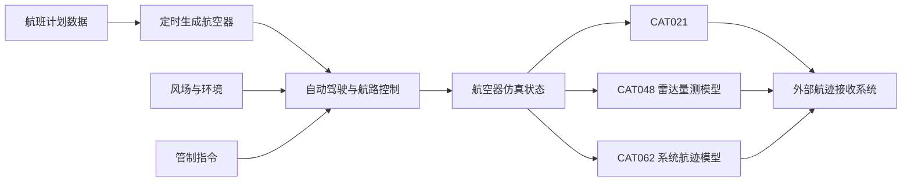

# BlueSky 仿真业务需求规格说明书

> 文档状态：需求基线草案
> 编制日期：2026-08-11
> 适用项目：TU Delft BlueSky Open Air Traffic Simulator 二次开发
> 配套技术文档：[BlueSky 二次开发技术指南](DEVELOPMENT_GUIDE.zh-CN.md)

## 1. 文档目的

本文档整理当前提出的 BlueSky 仿真业务需求，并给出：

- 统一的需求编号和业务描述；
- 可执行的验收标准；
- 当前 BlueSky 源码的满足程度；
- 必须二次开发的功能缺口；
- 实施前仍需确认的接口和业务参数。

本文档以当前本地源码快照为依据。需求与 BlueSky 现有能力冲突时，以本文件描述的目标需求为准；现状判断以当前源码和运行验证为准。

### 1.1 状态定义

| 状态 | 含义 |
|---|---|
| 满足 | 当前项目已有对应实现，完成配置和验证后即可使用 |
| 部分满足 | 已有基础能力，但缺少业务入口、字段、接口或完整语义 |
| 不满足 | 当前没有对应核心实现，需要新增模块 |
| 待确认 | 需求含义或接口参数尚未形成明确基线 |

## 2. 总体业务目标

目标系统应能够根据航班计划批量生成航空器，在仿真过程中通过管制指令控制飞机状态和航路，模拟风对飞行的影响，控制仿真生命周期，支持多组或多场景并行运行，并向外部系统输出 ASTERIX CAT021、CAT048、CAT062 航迹报文。

目标业务链如下：



## 3. 需求总览

| 编号 | 需求名称 | 当前满足度 | 主要缺口 |
|---|---|---|---|
| REQ-SIM-001 | 按航班计划批量、定时生成航空器 | 部分满足 | 缺少航班计划表导入器和完整航路生成流程 |
| REQ-SIM-002 | 控制航向、速度、高度和升降率 | 满足 | 需完成业务接口封装和验收测试 |
| REQ-SIM-003 | 模拟风对航空器运动的影响 | 部分满足 | 当前主要改变地速和航迹；空速变化语义待确认 |
| REQ-SIM-004 | 管制指令、直飞和航路修改 | 部分满足 | 缺少二次雷达代码和独立 FSA 字段 |
| REQ-SIM-005 | 仿真开始、暂停、恢复、结束和快进 | 满足 | “结束”的业务语义需要明确 |
| REQ-SIM-006 | 多组航空器或多场景同时仿真 | 满足 | 并发规模和隔离方式待确认 |
| REQ-IF-007 | 输出 ASTERIX CAT021 报文 | 不满足 | 缺少 ASTERIX 编码器和 ADS-B 完整字段 |
| REQ-IF-008 | 输出 ASTERIX CAT048 报文 | 不满足 | 缺少雷达传感器、量测和 ASTERIX 编码模型 |
| REQ-IF-009 | 输出 ASTERIX CAT062 报文 | 不满足 | 缺少 SDPS 系统航迹模型和 ASTERIX 编码器 |

## 4. 详细功能需求

### 4.1 REQ-SIM-001：按航班计划批量、定时生成航空器

#### 4.1.1 业务描述

系统应支持一次导入多条航班计划记录，并根据每条记录中的航空器出现时间、起飞机场、落地机场等信息，在对应仿真时刻创建航空器。

#### 4.1.2 建议输入字段

| 字段 | 必填 | 说明 |
|---|---|---|
| `appearance_time` | 是 | 航空器进入仿真的时间，可为场景相对时间或绝对 UTC |
| `acid` | 是 | 航空器呼号，仿真内唯一 |
| `actype` | 是 | ICAO 机型代码，例如 A320、B738 |
| `origin` | 是 | 起飞机场 ICAO 代码 |
| `departure_runway` | 否 | 起飞跑道；为空时需定义默认选择规则 |
| `destination` | 是 | 落地机场 ICAO 代码 |
| `arrival_runway` | 否 | 落地跑道；为空时需定义默认选择规则 |
| `route` | 否 | 航路点序列、航路字符串或外部航路标识 |
| `initial_heading` | 否 | 初始航向 |
| `initial_speed` | 否 | 初始 CAS/Mach 或地速，具体语义待确认 |
| `initial_altitude` | 否 | 初始高度 |
| `initial_vertical_rate` | 否 | 初始上升/下降率 |
| `squawk` | 否 | 二次雷达代码 |
| `selected_altitude` | 否 | 自动驾驶选择高度 |
| `final_selected_altitude` | 否 | 独立的最终选择高度 FSA，是否与选择高度分离待确认 |

#### 4.1.3 功能要求

1. 支持从结构化数据批量导入航班计划；输入格式可以是 CSV、JSON、数据库或外部接口，最终格式待确认。
2. 每条有效记录应在指定仿真时间创建航空器。
3. 创建位置应能够使用机场、跑道入口、航路点或经纬度。
4. 创建后应设置起飞机场和落地机场。
5. 提供航路时，应按给定顺序建立完整航路并启用所需 LNAV/VNAV 模式。
6. 未提供航路时，应按已确认的规则直飞目的机场，或调用指定的航路生成服务。
7. 无效机场、重复呼号、未知机型和错误时间应记录明确错误，不得静默忽略。
8. 在固定随机种子和相同输入下，生成结果应可重复。
9. 批量导入和航空器创建结果应可查询、记录和导出。

#### 4.1.4 验收标准

- 所有有效航班记录均在预定时间创建，时间误差不超过一个仿真步长；
- 创建后的呼号、机型、起点、终点、初始状态和航路与输入一致；
- 单条错误记录不会中断其他有效航班的生成；
- 重复执行同一输入时，确定性字段和固定随机种子控制的随机结果一致；
- 批量规模和允许的最大创建耗时在性能测试前另行确定。

#### 4.1.5 当前项目状态

当前项目部分满足：

- `.scn` 文件可以通过时间戳精确执行 `CRE`；
- `SCHEDULE` 和 `DELAY` 可以安排绝对或相对仿真时间命令；
- `CRE` 的位置参数可以解析机场、跑道、航路点或经纬度；
- `ORIG` 和 `DEST` 可以设置起点和终点；
- `TRAFGEN` 可以按机场源、汇、跑道和每小时流量随机生成航空器；
- `MCRE` 可以随机批量创建航空器。

当前缺口：

- 没有正式的航班计划表导入器；
- `MCRE` 不会根据起飞机场、落地机场和精确出现时间生成飞机；
- `TRAFGEN` 使用流量概率生成，不保证每个航班的精确出现时间；
- `ORIG` 当前主要用于航路记录；
- `DEST` 默认形成到目的地的直飞航迹，不会自动建立完整真实航路；
- 需要新增航班计划导入插件或转换服务。

### 4.2 REQ-SIM-002：控制航向、速度、高度和升降率

#### 4.2.1 业务描述

系统应允许对单架航空器、航空器组或全部航空器下发飞行状态控制指令。

#### 4.2.2 功能要求

1. 支持修改航空器目标航向。
2. 支持修改目标速度，至少支持 CAS 和 Mach；是否接受目标地速待确认。
3. 支持修改目标高度。
4. 支持修改上升率或下降率。
5. 支持“以指定升降率飞到指定高度”的组合指令。
6. 指令应返回成功、失败或受限原因。
7. 性能模型可以根据机型包线限制无法实现的指令。
8. 自动驾驶选择值与航空器实际状态应分别保存和输出。

#### 4.2.3 验收标准

- 航向指令能够使航空器按模型允许的转弯率转向目标航向；
- 速度指令能够修改选择速度，并在性能范围内使实际速度趋向目标；
- 高度指令能够修改选择高度；
- 组合高度/升降率指令能够以指定方向和近似升降率接近目标高度并完成高度捕获；
- 超出性能包线的指令不得导致数值异常；
- 单机与分组指令不能错误影响无关航空器。

#### 4.2.4 当前项目状态

当前项目满足基础要求，已有：

```text
HDG acid,heading
SPD acid,speed
ALT acid,altitude
VS acid,vertical_rate
ALT acid,altitude,vertical_rate
```

实际速度、爬降率和高度还会受到 OpenAP、Legacy 或 BADA 性能模型的限制。

### 4.3 REQ-SIM-003：模拟风对航空器运动的影响

#### 4.3.1 业务描述

系统应能够定义风场，并在航空器进入有风区域或高度层时改变其运动结果。

#### 4.3.2 功能要求

1. 支持定义风向和风速。
2. 支持按经纬度定义二维风场。
3. 支持随高度变化的三维风廓线。
4. 顺风和逆风应改变地速。
5. 侧风应改变航迹角，自动驾驶航向保持和航迹保持的行为应明确区分。
6. 风场查询和更新应支持多航空器向量化计算。
7. 是否要求风直接导致 IAS/TAS 波动，需要在需求基线中明确。
8. 是否需要随时间变化的风、阵风、湍流谱和天气文件导入，需要单独确认。

#### 4.3.3 验收标准

- 无风时，地速矢量与空速矢量一致；
- 给定顺风时，地速相对无风情况增加约相应风速分量；
- 给定逆风时，地速相应降低；
- 给定侧风时，航迹角出现可计算的偏移；
- 风场高度和空间插值结果在容差内符合预期；
- 风场不得导致经纬度、高度或速度出现 NaN/Inf。

#### 4.3.4 当前项目状态

当前项目可以将空速矢量与风矢量相加，从而改变地速和航迹，支持二维/三维插值。当前基础风场不直接改变自动驾驶保持的 CAS/Mach 或 TAS 目标。

本地验证结果：航空器无风时 TAS/GS 均为 `288.712 kt`；加入 `50 kt` 顺风后，TAS 保持 `288.712 kt`，GS 变为 `338.712 kt`。

因此：

- 如果“速度变化”指地速，当前项目满足；
- 如果要求 IAS/TAS 因阵风发生瞬时波动，则需要扩展湍流或动力学模型。

### 4.4 REQ-SIM-004：管制指令、直飞和航路修改

#### 4.4.1 业务描述

系统应支持通过指令控制航空器，并能够在运行中修改航路及监视相关字段。

#### 4.4.2 功能要求

1. 支持指定航空器以一定升降率飞到指定高度。
2. 支持直飞航路中的指定航路点。
3. 支持直飞任意已知导航点或经纬度；必要时系统应自动建立临时航路点。
4. 支持添加、插入、删除航路点。
5. 支持清空或替换完整航路。
6. 支持修改起飞机场、落地机场和最终进近/落地相关航路信息。
7. 支持设置航路点高度、速度和到达时间约束。
8. 支持修改二次雷达代码 SSR/Squawk。
9. 支持修改自动驾驶选择高度。
10. 是否需要独立修改 Final Selected Altitude、Cleared Altitude 和当前 Selected Altitude，必须明确数据语义。
11. 所有关键控制字段应能够通过日志和外部接口输出。

#### 4.4.3 验收标准

- `ALT + vertical_rate` 能完成指定升降率到指定高度的控制；
- 直飞指令能够正确切换当前活动航段；
- 任意点直飞能够创建临时航路点并正常跟随；
- 航路修改后 LNAV/VNAV 计算结果同步刷新；
- Squawk 修改后在 Traffic、日志、网络数据和目标 ASTERIX 报文中一致；
- Selected Altitude、FSA、Cleared Altitude 不得在未定义语义时相互覆盖；
- 非法二次代码、未知航路点和无效高度应返回明确错误。

#### 4.4.4 当前项目状态

当前已支持：

```text
ALT
VS
ADDWPT
ADDWAYPOINTS
BEFORE
AFTER
AT
DIRECT
DELWPT
DELRTE
DEST
RTA
LNAV
VNAV
```

当前缺口：

- `DIRECT` 要求目标点已经位于当前航路；任意点直飞需要先 `ADDWPT`；
- 核心 Traffic 没有 `squawk`、`ssr` 或 `transponder` 字段；
- 没有 `SQUAWK`/`SSR` 控制命令；
- OpenSky 插件虽能读取 Squawk，但没有保存到核心 Traffic；
- 已有 `traf.selalt` 作为自动驾驶选择高度；
- 没有独立的 `final_selected_altitude`/`fsa` 字段；
- 默认 `ACDATA` 网络输出没有发布 `selalt`、FSA 或 Squawk。

### 4.5 REQ-SIM-005：仿真生命周期控制

#### 4.5.1 功能要求

系统应支持：

- 开始或继续当前仿真；
- 暂停当前仿真；
- 从暂停状态恢复；
- 结束当前实验并清理状态；
- 关闭整个仿真进程；
- 不限时快速运行；
- 快速推进指定仿真时长；
- 设置仿真时间倍率；
- 在需要时切换实时模式。

#### 4.5.2 验收标准

- 暂停期间仿真时间和交通位置不继续推进；
- 恢复后从暂停时间继续运行；
- 快进模式不改变算法使用的仿真时间语义；
- 指定时长快进达到目标时间后自动停止快进；
- 重置后交通、场景事件、日志和仿真时间恢复到初始状态；
- 结束当前实验与关闭程序必须是两个可区分的操作。

#### 4.5.3 当前项目状态

当前项目满足基础要求：

| 业务操作 | BlueSky 指令 |
|---|---|
| 开始/继续 | `OP` |
| 暂停 | `HOLD` |
| 快进 | `FF` |
| 指定时长快进 | `FF duration` |
| 重置当前仿真 | `RESET` |
| 关闭仿真节点 | `QUIT` |
| 实时运行 | `REALTIME ON` |
| 时间倍率 | `DTMULT value` |

待确认：“结束”是指 `HOLD`、`RESET`、场景自然结束，还是 `QUIT` 关闭进程。

### 4.6 REQ-SIM-006：多组航空器或多场景同时仿真

#### 4.6.1 业务描述

系统应支持在同一时间运行多个仿真任务，或在同一仿真中对多个航空器组分别控制。

#### 4.6.2 功能要求

1. 支持启动多个独立仿真节点。
2. 每个节点应拥有独立的仿真时钟、交通、场景和插件状态。
3. 支持把批量场景分配给空闲节点。
4. 支持查看节点列表、运行状态、场景名和仿真时间。
5. 支持选择当前查看和控制的节点。
6. 支持在单一场景中创建多个航空器逻辑组。
7. 支持按组下发航空器控制命令。
8. 并发节点数量、CPU/内存限制和任务排队规则应形成部署基线。

#### 4.6.3 验收标准

- 多个节点能够同时推进不同场景，状态互不污染；
- 批量场景数量超过节点数时，剩余任务能够排队并在节点空闲后继续运行；
- GUI 或外部控制端能够区分不同节点；
- 同一仿真中的航空器组命令只影响目标组；
- 并发运行结果与单独运行结果在确定性配置下保持一致。

#### 4.6.4 当前项目状态

当前项目支持：

```text
ADDNODES count
BATCH batch-file.scn
GROUP group_name,aircraft...
UNGROUP group_name,aircraft...
```

服务器会为仿真节点创建独立进程，并向空闲节点分配批量场景。实际并发节点上限为 CPU 核心数与 `max_nnodes` 配置中的较小值。

同一仿真最多支持 64 个交通逻辑组；这些组共享同一仿真时钟、风场和冲突环境，不属于相互隔离的独立实验。

## 5. ASTERIX 航迹输出需求

### 5.1 通用要求

ASTERIX 输出模块应：

1. 按指定 ASTERIX Category 和 Edition 编码二进制 Data Block；
2. 正确生成 `CAT + LEN + FSPEC + Data Items`；
3. 按目标 Edition 的 UAP/FRN 顺序组织数据项；
4. 支持配置 SAC、SIC、发送周期和目标地址；
5. 支持接口 ICD 规定的 UDP 单播、UDP 组播或其他传输方式；
6. 支持独立配置不同 Category 的目的 IP、端口和频率；
7. 对无法提供的数据项采用明确的缺省、无效或不发送策略；
8. 输出前执行范围、比例因子、符号位、字节序和长度校验；
9. 使用独立 ASTERIX 解码器或接收系统验证报文；
10. 记录报文数量、字节数、编码失败和发送失败；
11. 支持保存二进制样本或 PCAP，用于回归验证；
12. Category Edition、Reserved Expansion Field 和目标系统 ICD 必须纳入版本管理。

当前官方页面列出的参考版本为：

- CAT021 Edition 2.7，ADS-B Target Reports；
- CAT048 Edition 1.32，Monoradar Target Reports；
- CAT062 Edition 1.21，System Track Data。

最终实现版本必须以目标接收系统 ICD 为准，不能仅依据当前最新官方版本决定。

### 5.2 REQ-IF-007：输出 CAT021 ADS-B Target Reports

#### 5.2.1 功能要求

1. 从 BlueSky 航空器状态或 ADS-B 模型生成 CAT021 目标报告。
2. 至少映射目标地址、呼号、时间、WGS-84 位置、高度、地速/航迹和垂直速度等已确认数据项。
3. 支持配置 SAC/SIC、Service Identification 和报告周期。
4. 补充或定义 ICAO 24-bit 地址、Squawk、Emitter Category、质量指标、MOPS 版本、数据时效和目标状态。
5. 当字段缺失时，应根据目标 UAP 和 ICD 决定不发送或使用明确状态，不得伪造未定义数据。

#### 5.2.2 当前项目状态

当前项目不支持 CAT021 输出。BlueSky 已有经纬度、高度、地速、航迹、垂直速度和呼号等基础状态，但没有 ASTERIX 编码器，也缺少 ICAO24、Squawk、质量指标和完整 ADS-B 状态字段。

### 5.3 REQ-IF-008：输出 CAT048 Monoradar Target Reports

#### 5.3.1 功能要求

1. 支持配置一个或多个雷达站的位置、高度、SAC/SIC 和覆盖参数。
2. 根据航空器真实状态生成雷达相对距离、方位、高度和其他量测信息。
3. 支持雷达扫描周期、覆盖范围、漏检、量测误差和目标可见性模型。
4. 根据业务需要模拟 PSR、SSR、Mode S 或组合探测类型。
5. 支持 Mode A/二次代码、Mode C 高度和目标报告描述符。
6. 支持 CAT048 航迹号、时间和接口 ICD 要求的数据项。

#### 5.3.2 当前项目状态

当前项目不支持 CAT048 输出，也没有完整雷达传感器模型。不能简单把航空器真实经纬度直接当作雷达量测；必须先建立雷达站坐标、极坐标量测、扫描、误差和探测状态，再进行 ASTERIX 编码。

### 5.4 REQ-IF-009：输出 CAT062 System Track Data

#### 5.4.1 功能要求

1. 将航空器仿真状态映射为系统航迹，或建立独立 SDPS 航迹层。
2. 为每条航迹分配稳定且可回收的 Track Number。
3. 支持 Track Status、航迹建立、更新、终止和丢失生命周期。
4. 支持位置、速度、加速度、高度、呼号、目标地址、Mode 3/A、选择高度等经确认数据项。
5. 定义单传感器映射还是多传感器融合语义。
6. 支持数据源、数据时效、更新周期和质量状态。

#### 5.4.2 当前项目状态

当前项目不支持 CAT062 输出。BlueSky 的航空器状态可以作为系统航迹的基础，但目前没有独立 SDPS 融合航迹、Track Number、Track Status、数据源和数据时效模型。

## 6. 数据模型扩展需求

为满足管制字段和 ASTERIX 输出，建议至少增加以下逐航空器字段：

| 字段 | 用途 | 当前状态 |
|---|---|---|
| `icao24` | CAT021 目标地址、实时数据关联 | 缺失 |
| `squawk` | 二次雷达 Mode 3/A 代码 | 缺失 |
| `selected_altitude` | 自动驾驶选择高度 | 已有 `traf.selalt` |
| `final_selected_altitude` | 独立 FSA | 缺失 |
| `cleared_altitude` | 管制许可高度；是否需要待确认 | 缺失 |
| `track_number` | CAT048/CAT062 航迹编号 | 缺失 |
| `track_status` | 航迹建立、确认、丢失、终止状态 | 缺失 |
| `sac`/`sic` | ASTERIX 数据源标识 | 缺少统一模型 |
| `emitter_category` | CAT021 发射机类别 | 缺失 |
| `quality` | ADS-B、雷达或系统航迹质量 | 仅有简化 ADS-B 噪声模型 |
| `data_age` | 监视数据时效 | 缺少统一模型 |
| `sensor_id` | CAT048/CAT062 数据源关联 | 缺失 |

新增逐飞机字段必须注册到 `TrafficArrays` 生命周期，以保证创建、批量创建、删除和重置时数组与航空器数量一致。

## 7. 外部接口需求

### 7.1 航班计划输入接口

待确定：

- CSV、JSON、数据库、消息队列或 REST；
- 时间格式和时区；
- 航路字符串格式；
- 错误处理和重复导入策略；
- 是否支持运行中增量导入和取消航班；
- 最大单批记录数和吞吐要求。

### 7.2 管制指令接口

外部接口至少应支持：

- 航向、速度、高度和升降率；
- 组合高度/升降率；
- 直飞和航路修改；
- Squawk；
- Selected Altitude/FSA/Cleared Altitude；
- 仿真生命周期；
- 节点和交通组选择。

每条指令应返回：

- 请求标识；
- 目标航空器或分组；
- 接收时间和执行仿真时间；
- 成功/失败状态；
- 失败原因；
- 执行后的关键选择值。

### 7.3 ASTERIX 输出接口

每个 Category 应分别配置：

- Edition；
- SAC/SIC；
- 发送频率；
- 源/目的 IP 和端口；
- 单播或组播；
- 网卡和组播 TTL；
- 目标 UAP/Data Items；
- Track Number 和生命周期策略；
- 无效值和字段缺失策略；
- 接收系统 ICD 版本。

## 8. 推荐实施优先级

以下为建议优先级，正式优先级由业务方确认。

### P0：形成基础业务闭环

1. 明确航班计划输入格式；
2. 开发航班计划批量导入和精确定时生成插件；
3. 增加 ICAO24、Squawk、FSA/Cleared Altitude 等字段；
4. 增加对应控制命令；
5. 把选择高度、Squawk 等字段发布到外部接口；
6. 为现有航向、速度、高度、升降率和航路指令建立自动化验收场景。

### P1：CAT021 输出

CAT021 与 BlueSky 现有航空器/ADS-B 状态最接近，建议优先实现。先确定 Edition、UAP、必选数据项和接收端 ICD，再开发编码和 UDP 输出。

### P2：CAT062 输出

建立系统航迹层、Track Number、Track Status 和航迹生命周期，再实现 CAT062 编码。

### P3：CAT048 输出

先开发雷达传感器和量测模型，再实现 CAT048。若只需要协议联调，可先开发明确标注为“简化合成量测”的版本，但不能与真实雷达性能模型混淆。

## 9. 端到端验收场景

| 场景 | 验证内容 |
|---|---|
| AT-001 航班计划导入 | 多条不同时间、机场、机型和航路记录按时创建 |
| AT-002 飞行状态控制 | HDG、SPD、ALT、VS 和组合高度/升降率 |
| AT-003 风场影响 | 无风、顺风、逆风、侧风和高度变化风场 |
| AT-004 航路控制 | 添加、删除、插入、直飞、清空、RTA、LNAV/VNAV |
| AT-005 监视字段 | Squawk、Selected Altitude、FSA、Cleared Altitude 一致性 |
| AT-006 生命周期 | OP、HOLD、恢复、FF、RESET、QUIT |
| AT-007 多节点 | 多场景并发、排队、节点切换和状态隔离 |
| AT-008 CAT021 | 独立解码器正确解析全部目标数据项 |
| AT-009 CAT048 | 雷达量测、扫描周期、误差和报文编码一致 |
| AT-010 CAT062 | Track Number、状态生命周期和系统航迹字段一致 |
| AT-011 长时间稳定性 | 长时间运行无内存持续增长、航迹号泄漏或报文阻塞 |
| AT-012 可重复性 | 相同场景和随机种子得到一致结果 |

## 10. 待确认事项

以下问题必须在详细设计前确认：

1. 航班计划输入格式是什么：CSV、Excel、JSON、数据库还是网络接口？
2. `appearance_time` 使用场景相对时间还是真实 UTC？是否跨日？
3. 起飞机场和落地机场之间是否要求自动生成真实航路？航路数据来源是什么？
4. 未指定跑道时按风向、固定配置还是随机规则选择？
5. “速度发生变化”是要求地速变化，还是 IAS/TAS 也要变化？
6. “二次代码”是否明确指 Mode 3/A Squawk？是否需要特殊代码规则？
7. Final Selected Altitude 是否与 Selected Altitude、Cleared Altitude 分开保存？
8. “结束仿真”是暂停、重置当前实验，还是关闭仿真进程？
9. “多组同时仿真”是同一场景中的航空器组，还是相互隔离的多仿真节点？
10. 预计最大航空器数量、并发仿真数、仿真倍率和持续时间是多少？
11. CAT021、CAT048、CAT062 分别采用哪个 Edition？
12. 三类报文的 SAC/SIC、目标数据项、发送频率、IP、端口和组播参数是什么？
13. 是否已有目标接收系统 ICD 和报文样例？
14. CAT048 需要哪类雷达：PSR、SSR、Mode S 还是组合雷达？
15. 雷达站数量、坐标、覆盖、扫描周期、误差和漏检模型是什么？
16. CAT062 是把仿真真值直接映射为系统航迹，还是需要模拟多传感器融合？
17. 是否要求保存原始 ASTERIX 文件、PCAP 和报文回放？

## 11. 需求追踪到当前源码

| 需求领域 | 当前主要实现位置 |
|---|---|
| 航空器创建 | `bluesky/traffic/traffic.py` |
| 创建和基础控制命令 | `bluesky/stack/basecmds.py` |
| 场景时间和调度 | `bluesky/stack/simstack.py` |
| 机场流量生成 | `bluesky/plugins/trafgen.py`、`trafgenclasses.py` |
| 自动驾驶选择值 | `bluesky/traffic/autopilot.py` |
| 航路和直飞 | `bluesky/traffic/route.py` |
| 风场 | `bluesky/traffic/windfield.py`、`windsim.py` |
| 仿真生命周期 | `bluesky/simulation/simulation.py` |
| 交通分组 | `bluesky/traffic/trafficgroups.py` |
| 多节点和批处理 | `bluesky/network/server.py` |
| 当前航空器网络输出 | `bluesky/simulation/screenio.py` |
| 当前网络编码 | `bluesky/network/node.py`、`npcodec.py` |
| Mode-S/ADS-B 输入 | `bluesky/plugins/adsbfeed.py`、`opensky.py` |
| ASTERIX 输出 | 当前不存在 |

## 12. 参考资料

- [BlueSky 二次开发技术指南](DEVELOPMENT_GUIDE.zh-CN.md)
- [EUROCONTROL ASTERIX 总览](https://www.eurocontrol.int/asterix)
- [EUROCONTROL CAT021](https://www.eurocontrol.int/publication/cat021-eurocontrol-specification-surveillance-data-exchange-asterix-part-12-category-21)
- [EUROCONTROL CAT048](https://www.eurocontrol.int/publication/cat048-eurocontrol-specification-surveillance-data-exchange-asterix-part4)
- [EUROCONTROL CAT062](https://www.eurocontrol.int/publication/cat062-eurocontrol-specification-surveillance-data-exchange-asterix-part-9-category-062)

---

本文档是当前需求基线草案。第 10 章的待确认事项完成后，应更新需求状态、接口字段、ASTERIX Edition、验收阈值和实施优先级，并形成正式需求基线版本。
