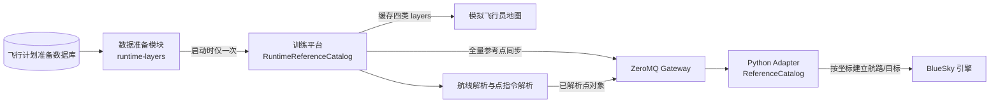

# 仿真引擎统一导航点数据源详细设计

日期：2026-08-26
状态：首版范围已实施；自动化回归与三进程联调按本文记录执行
适用模块：`data-prep-workbench`、`training-platform`、`bluesky/plugins/training_adapter`

## 1. 文档目的

本文定义训练平台、模拟飞行员地图和 BlueSky Adapter 统一使用飞行计划准备模块导航点数据的实现基线，覆盖数据范围、启动加载、内存目录、航路展开、Adapter 同步、运行就绪、失败降级、TDD 顺序、测试矩阵和验收标准。

本文是以下既有设计的增量约束：

- [`模拟飞行员地图图层与显示设置详细设计.md`](./模拟飞行员地图图层与显示设置详细设计.md)：保留四类地图图层和显示设置，修改地图数据的获取时机与导航数据失败语义。
- [`首版飞行仿真闭环详细设计.md`](./首版飞行仿真闭环详细设计.md)：替换“机场和航路点由 Adapter 查询 BlueSky 内置数据”的临时方案。
- [`adr/0012-versioned-zeromq-adapter-protocol.md`](./adr/0012-versioned-zeromq-adapter-protocol.md)：沿用版本化 ZeroMQ 消息信封，但本功能不增加导航快照版本或内容校验值。

冲突时，以本文关于导航点来源、加载时机、航路展开和运行就绪的规定为准。

## 2. 已确认需求

| 编号 | 主题 | 最终口径 |
| --- | --- | --- |
| N-01 | 唯一来源 | 仿真引擎使用与地图显示相同的 `GET /api/map/runtime-layers` 数据接口。 |
| N-02 | 调用方 | 训练平台调用数据准备模块，浏览器和 Adapter 均不直接调用数据准备模块。 |
| N-03 | 获取时机 | 训练平台启动时获取一次，运行期间不再次访问数据准备模块。 |
| N-04 | 数据冻结 | 本次训练平台进程使用启动时数据；数据库变化需重启训练平台后生效。 |
| N-05 | 缓存方式 | 数据仅保存在训练平台内存中，不落盘、不写训练平台数据库、不复用上次启动数据。 |
| N-06 | 超时 | 连接和读取超时可配置，默认均为 3 秒；本次启动只发起一次请求。 |
| N-07 | 点数据容器 | 直接使用 `WAYPOINT.features`，不新增重复的 `referencePoints` 字段。 |
| N-08 | 纳入类型 | 纳入标准导航点、机场和导航台：`FIX/REPORT/WAYPOINT`、`AIRPORT/AIRPORT_I`、`VOR/NDB/DME/VOR_DME/VORDME/ILS`。 |
| N-09 | 排除类型 | 排除 `OTHER/DUMMY`、风场点、雷达站、航路线段坐标及扇区/天气边界顶点。 |
| N-10 | 数据状态 | 只纳入未删除且 `ENABLED` 的记录；无状态字段的独立导航点按未删除和有效性判断。 |
| N-11 | 地图一致性 | 地图“航路点”图层与引擎参考点使用同一批 `WAYPOINT.features`，数量必须一致。 |
| N-12 | 内置数据 | 不与 BlueSky 内置导航数据库合并，不允许内置同名点参与平台航线或点指令解析。 |
| N-13 | 点校验 | 点必须具有稳定 ID、非空代码、合法经纬度；代码转大写后在可导航对象中全局唯一。 |
| N-14 | 名称与高程 | 名称可空；高程为可选米制字段，不参与代码唯一性和基础导航有效性判断。 |
| N-15 | 关键失败 | 任一纳入范围的导航点非法或代码重复时，整个启动数据加载失败。 |
| N-16 | 非关键几何 | 扇区和天气等非导航图层的单条坏几何继续按现有规则跳过，不阻断参考数据就绪。 |
| N-17 | 航路职责 | 仿真引擎不接收或解析 `AIRWAY` 要素；训练平台使用航路数据展开点序列。 |
| N-18 | 航路元数据 | `AIRWAY` 要素向训练平台提供有序点 ID、点代码和方向信息；不发送给仿真引擎。 |
| N-19 | 航线语法 | 支持直接点序列、`进入点 + 航路代码 + 离开点` 以及可选 `DCT`；不支持 SID、STAR、程序或文本经纬度点。 |
| N-20 | 航路方向 | 有方向限制时严格执行；无方向字段时按双向处理。 |
| N-21 | 航路歧义 | 重复航路代码、端点重复导致多条路径或令牌同时匹配点和航路时拒绝，不自动猜测。 |
| N-22 | 展开去重 | 只去除展开边界产生的相邻重复点，保留非相邻重复点。 |
| N-23 | 引擎点对象 | 向引擎传递 `id/code/type/latitude/longitude/elevationMeters?`，使用 WGS-84 十进制度和明确字段名。 |
| N-24 | 点指令 | 首版建机、直飞和航线变更由训练平台解析点，再向引擎传递点对象；后续 `ORBIT/HOLD` 等点指令接入时沿用同一规则。 |
| N-25 | 机场约束 | 起飞机场和目的机场必须解析为机场类型点，否则建机失败。 |
| N-26 | 全量同步 | 训练平台向 Adapter 一次性全量同步参考点；Adapter 全量校验后原子替换。 |
| N-27 | 同步确认 | Adapter 返回成功/失败、总数和各类型数量；数量不一致视为失败。 |
| N-28 | 重连 | Adapter 首次连接或断线重连时自动重发同一内存数据，不重新访问数据准备模块。 |
| N-29 | 无快照版本 | 运行态地图响应与同步协议均不包含快照版本、修订比对或内容校验值。 |
| N-30 | 运行门禁 | Adapter 连接且参考数据同步确认成功后才允许开始练习、创建航空器和执行依赖点的指令。 |
| N-31 | 失败界面 | 页面仍可进入，不弹窗；状态灯显示未就绪并通过悬停说明，相关操作禁用，日志记录原因。 |
| N-32 | 断线安全 | 运行中断线后保持或切换为暂停；重连同步成功后仍由操作员手动恢复。 |
| N-33 | 搜索来源 | 机场和航路点搜索改查训练平台内存目录，不再向 Adapter 查询。 |
| N-34 | 搜索分类 | 机场搜索只返回机场；航路点搜索返回非机场标准导航点和导航台；航线解析允许使用全部纳入类型。 |
| N-35 | 旧协议 | Adapter 旧参考查询能力保留并标记废弃；训练平台不再用它查询机场/航路点，机型查询可暂时保留原路径。 |
| N-36 | 历史引用 | 首版启动重置会清除上次运行的航空器和指令，因此当前无跨重启历史引用；未来取消启动重置时，必须先设计并实现坏引用保留、标记无效和运行阻断。 |
| N-37 | 空数据 | 导航点为 0 时未就绪；航路为 0 时仍可用直接点；扇区或天气为 0 不影响引擎就绪。 |

## 3. 范围

### 3.1 本次必须完成

1. 扩展现有运行态地图接口的导航点类型和航路点引用元数据。
2. 将训练平台地图读取从“页面请求时远程获取”改为“进程启动时获取一次并缓存”。
3. 建立训练平台内存参考数据目录，统一负责搜索、代码解析、点校验和航路展开。
4. 扩展 Java—Python Adapter 协议，支持参考点全量同步、原子替换和数量确认。
5. 将首版建机、DCT 和 RTE 改为传递已解析点对象，不依赖 BlueSky 内置导航查询。
6. 将机场、航路点搜索从 Adapter 迁移至训练平台内存目录。
7. 将引擎连接状态与参考数据就绪状态独立建模，并建立运行门禁。
8. 对启动失败、校验失败、同步失败和断线重连提供确定行为；历史坏引用留待取消首版启动重置时实现。
9. 补齐数据准备、训练平台、Adapter 和前端自动测试，并执行可重复的真实进程级联调。

### 3.2 明确不做

1. 不复制导航主数据到训练平台 MySQL。
2. 不保存或复用上一次启动的本地快照。
3. 不在运行期间轮询、刷新或增量订阅数据准备模块。
4. 不增加手工刷新按钮。
5. 不增加快照版本、修订比对、ETag 或内容校验值。
6. 不把风场点、雷达站或几何顶点作为引擎参考点。
7. 不让仿真引擎直接解析航路代码。
8. 不支持 SID、STAR、进离场程序、文本经纬度点或条件航路。
9. 不修改 BlueSky 核心导航数据库文件。
10. 不立即删除 Adapter 的旧参考查询协议。

## 4. 现状与目标差距

| 领域 | 当前实现 | 目标实现 |
| --- | --- | --- |
| 地图加载 | 页面首次请求时，训练平台再调用数据准备模块。 | 训练平台启动时调用一次，页面只读内存缓存。 |
| 导航点类型 | `WAYPOINT` 缺少原始类型和高程，包含范围未作为引擎契约。 | 类型白名单、标准化类型和可选高程成为正式契约。 |
| 航路要素 | 只有 `LineString` 坐标。 | 增加有序点引用和方向元数据，供训练平台展开。 |
| 参考搜索 | 训练平台通过 `REFERENCE_SEARCH` 查询 Adapter/BlueSky。 | 机场和航路点查询训练平台内存目录。 |
| 航线/点指令 | Java 传字符串，Adapter/BlueSky 再查点。 | Java 解析并传递完整点对象。 |
| 引擎导航源 | BlueSky 内置导航数据库参与解析。 | 只使用准备模块点数据，不合并、不兜底。 |
| 运行状态 | 只有 Adapter 连接状态。 | Adapter 连接与参考数据就绪独立，二者共同形成运行门禁。 |

## 5. 总体架构



关键约束：

1. 数据准备模块是运行导航点的唯一主数据来源。
2. 训练平台是本次进程内快照、搜索、航路展开和点解析的唯一权威。
3. Adapter 只消费训练平台提供的数据，不从 BlueSky 内置导航库补点。
4. 前端与 Adapter 读取同一训练平台内存对象的派生结果。

## 6. 数据准备运行态接口

### 6.1 端点与兼容

继续使用：

```http
GET /api/map/runtime-layers
```

路径、四层顺序及 `category/name/count/features` 结构保持不变。新增字段为向后兼容扩展。运行态响应删除 `revision`，训练平台不保存、比较或生成同步版本。

### 6.2 `WAYPOINT` 要素

```json
{
  "featureId": "waypoint:nav-001",
  "featureType": "WAYPOINT",
  "pointType": "VOR_DME",
  "code": "PUD",
  "name": "浦东导航台",
  "elevationMeters": 4,
  "geometry": {
    "type": "Point",
    "coordinates": [121.8082, 31.1421]
  }
}
```

字段规则：

| 字段 | 必填 | 规则 |
| --- | --- | --- |
| `featureId` | 是 | 稳定且全响应唯一，格式可沿用 `waypoint:{id}`。 |
| `featureType` | 是 | 固定为 `WAYPOINT`。 |
| `pointType` | 是 | 使用第 6.4 节的标准类型。 |
| `code` | 是 | 去首尾空格并转大写；全体可导航对象中唯一。 |
| `name` | 否 | 展示字段，不参与解析。 |
| `elevationMeters` | 否 | 有限数值，单位为米。 |
| `geometry` | 是 | `Point`，坐标为 `[longitude, latitude]`，EPSG:4326。 |

### 6.3 `AIRWAY` 平台展开元数据

`AIRWAY` 继续用 `LineString` 绘图，并增加：

```json
{
  "featureId": "airway:airway-a593",
  "featureType": "AIRWAY",
  "code": "A593",
  "name": "A593",
  "airwayDirection": "BOTH",
  "pointIds": ["nav-pud", "nav-pikop", "nav-akoma"],
  "pointCodes": ["PUD", "PIKOP", "AKOMA"],
  "segmentDirections": ["BOTH", "FORWARD"],
  "geometry": {
    "type": "LineString",
    "coordinates": [[121.80, 31.14], [120.95, 31.02], [119.88, 30.76]]
  }
}
```

约束：

1. `pointIds`、`pointCodes` 和 `geometry.coordinates` 长度相等且逐项对应。
2. 至少两个点；相邻点不得重复。
3. `segmentDirections` 长度等于点数减一。
4. 每个点引用必须存在于本响应的 `WAYPOINT.features`。
5. 航路代码忽略大小写后唯一。
6. 方向枚举至少支持 `FORWARD`、`REVERSE`、`BOTH`；缺失方向按 `BOTH`。
7. 这些字段只供训练平台展开，Adapter 不接收 `AIRWAY` 要素。

### 6.4 类型归一化

| 原始类型 | 标准类型 | 纳入 | 用途 |
| --- | --- | --- | --- |
| `FIX`、`REPORT`、`WAYPOINT` | `WAYPOINT` | 是 | 航线、直飞、盘旋、等待 |
| `AIRPORT`、`AIRPORT_I` | `AIRPORT` | 是 | 起降机场，也可出现在航线中 |
| `VOR` | `VOR` | 是 | 导航台与导航点 |
| `NDB` | `NDB` | 是 | 导航台与导航点 |
| `DME` | `DME` | 是 | 导航台与导航点 |
| `VOR_DME`、`VORDME` | `VOR_DME` | 是 | 导航台与导航点 |
| `ILS` | `ILS` | 是 | 导航台与导航点 |
| `OTHER`、`DUMMY` | 无 | 否 | 不返回到 `WAYPOINT` 层 |

### 6.5 服务端严格校验

数据准备模块必须先完整读取和校验关键导航数据，再构造成功响应。以下任一情况使端点返回非 2xx 和稳定错误码 `INVALID_RUNTIME_NAV_DATA`：

- 纳入类型的点缺少 ID、代码、类型或坐标；
- 经度不在 `[-180,180]` 或纬度不在 `[-90,90]`；
- 归一化后点代码重复；
- 启用航路缺少代码、点数少于 2、点引用不存在、点/坐标不对应或代码重复；
- 航路点序列或方向元数据无法形成唯一有序路径。

物理扇区和天气的单条非法几何继续记录 `WARN` 并跳过，不把非关键显示数据升级为引擎阻断错误。

## 7. 训练平台启动缓存

### 7.1 生命周期

训练平台创建进程级 `RuntimeReferenceCatalog`：

```text
EMPTY -> LOADING -> SNAPSHOT_READY -> SYNC_PENDING -> READY
                  \-> SOURCE_UNAVAILABLE
                  \-> VALIDATION_FAILED
                                 SYNC_PENDING -> SYNC_FAILED
```

- 启动阶段只执行一次数据准备 HTTP 调用。
- 默认连接超时 3000 ms、读取超时 3000 ms，均允许环境变量覆盖。
- 成功后在内存中保存不可变四层数据、点索引、航路索引和分类数量。
- 失败后不重试、不读取本地缓存；只能通过重启训练平台重新获取。
- Adapter 未连接不触发数据准备重取，只让状态停留在 `SYNC_PENDING`。

### 7.2 建议配置

```yaml
bluesky:
  data-prep:
    base-url: ${BS_PREP_BASE_URL:http://127.0.0.1:8090}
    connect-timeout-millis: ${BS_PREP_CONNECT_TIMEOUT_MS:3000}
    read-timeout-millis: ${BS_PREP_READ_TIMEOUT_MS:3000}
    startup-load-enabled: true
  reference-data:
    enforcement-enabled: true
    sync-max-attempts-per-connection: 3
```

正式配置固定启用启动加载和参考数据门禁。两个布尔开关仅用于隔离既有测试夹具，不得在生产环境关闭；同步重试只重发启动时已缓存的数据，不重新调用数据准备接口。

### 7.3 页面地图接口

`GET /api/v1/workstation/map-layers` 只读取 `RuntimeReferenceCatalog`：

- 快照有效：`200 available=true`，返回缓存的四层数据。
- 快照无效：`200 available=false, layers=[]`。
- 调用该端点、刷新页面、打开菜单或切换图层均不得访问数据准备模块。

前端仍可在每次应用挂载时调用一次训练平台接口，但远端数据准备请求计数在整个训练平台进程生命周期内必须恒为 1。

## 8. 内存索引与搜索

训练平台从 `WAYPOINT.features` 构建不可变索引：

```text
pointsByCode: UPPERCASE_CODE -> RuntimeNavigationPoint
airports: pointType == AIRPORT
waypoints: pointType != AIRPORT
airwaysByCode: UPPERCASE_CODE -> RuntimeAirway
```

搜索行为：

1. `/api/v1/reference/airports` 只搜索 `AIRPORT`。
2. `/api/v1/reference/waypoints` 搜索全部非机场标准导航类型。
3. 查询去首尾空格并忽略大小写；保持现有最多 20 条结果的约束。
4. 代码前缀匹配优先，其后为代码或名称包含匹配；相同等级按代码、ID 稳定排序。
5. `/api/v1/reference/aircraft-types` 仍可暂时使用 Adapter 性能模型查询，不属于本次导航点迁移。

## 9. 航线解析与展开

### 9.1 支持语法

```text
route       := point (separator? segment)*
segment     := point | airway point
separator   := DCT
```

示例：

```text
PUD AKOMA BEMAG
PUD A593 AKOMA
PUD A593 AKOMA DCT BEMAG
```

不支持 SID、STAR、其他程序对象、文本经纬度点或条件航路标记。

### 9.2 展开算法

1. 规范化令牌为大写并忽略 `DCT`。
2. 首令牌必须解析为点。
3. 当中间令牌匹配航路时，前一个已解析点为进入点，后一个令牌为离开点。
4. 进入点和离开点必须在同一航路中各出现一次，并满足航路/航段方向。
5. 把两点之间的有序点序列插入结果。
6. 只删除拼接边界产生的相邻重复点。
7. 非相邻重复点保留。
8. 任一步失败时整条航线拒绝，不产生部分结果，不修改现有航路。

### 9.3 稳定错误码

| 错误码 | 条件 |
| --- | --- |
| `REFERENCE_DATA_NOT_READY` | 参考数据未就绪。 |
| `UNKNOWN_NAVIGATION_POINT` | 点代码不存在。 |
| `AMBIGUOUS_NAVIGATION_POINT` | 点代码重复或无法唯一解析。 |
| `UNKNOWN_AIRWAY` | 航路代码不存在。 |
| `AMBIGUOUS_ROUTE_TOKEN` | 令牌同时匹配点和航路，或语法无法唯一判定。 |
| `AIRWAY_ENDPOINT_NOT_FOUND` | 进入点或离开点不在航路上。 |
| `AIRWAY_DIRECTION_NOT_ALLOWED` | 展开方向违反限制。 |
| `AIRWAY_PATH_AMBIGUOUS` | 同一点重复导致多条候选路径。 |
| `UNSUPPORTED_ROUTE_TOKEN` | SID、STAR、经纬度或其他不支持标记。 |
| `INVALID_AIRPORT_REFERENCE` | 起降代码不是机场类型。 |

## 10. Adapter 同步协议

### 10.1 新消息

控制通道新增 `REFERENCE_DATA_SYNC`，继续使用现有 `protocolVersion/requestId/type/payload` 信封。

请求 `payload`：

```json
{
  "points": [
    {
      "id": "nav-001",
      "code": "PUD",
      "type": "VOR_DME",
      "latitude": 31.1421,
      "longitude": 121.8082,
      "elevationMeters": 4
    }
  ]
}
```

成功响应 `payload`：

```json
{
  "accepted": true,
  "totalCount": 3880,
  "counts": {
    "WAYPOINT": 3020,
    "AIRPORT": 220,
    "VOR": 180,
    "NDB": 110,
    "DME": 90,
    "VOR_DME": 230,
    "ILS": 30
  }
}
```

协议明确不包含 `snapshotVersion`、`revision`、`checksum` 或增量游标。

### 10.2 原子替换

Adapter 必须：

1. 在临时目录对象中完整校验请求。
2. 校验 ID、代码、类型、坐标和归一化代码唯一性。
3. 计算总数和分类数量。
4. 全部成功后一次性替换当前参考点目录。
5. 任一错误时拒绝整批，并保持旧目录不变；训练平台仍把参考数据状态标记为未就绪，禁止利用旧目录运行。

### 10.3 连接与重连

- 训练平台获得有效内存数据且 Adapter 可用时立即同步。
- Adapter 首次连接或重连后自动重发同一内存数据；同步瞬时失败时按健康轮询重试同一批内存数据，默认每次连接最多 3 次。
- 重连同步不访问数据准备模块。
- Adapter 返回数量与训练平台预期不一致时状态为 `SYNC_FAILED`。
- 练习运行中断线时保持或切换为暂停；同步成功后不自动恢复。

### 10.4 旧查询协议

`REFERENCE_SEARCH` 暂时保留并标记废弃。训练平台不得再用 `kind=AIRPORT` 或 `kind=WAYPOINT` 查询 Adapter；`AIRCRAFT_TYPE` 可在性能数据迁移前继续使用。

## 11. 引擎命令契约

统一点对象：

```json
{
  "id": "nav-001",
  "code": "PUD",
  "type": "VOR_DME",
  "latitude": 31.1421,
  "longitude": 121.8082,
  "elevationMeters": 4
}
```

变更原则：

1. `AIRCRAFT_CREATE` 携带已解析的 `originPoint`、`destinationPoint` 和 `routePoints`。
2. 首版 `DCT` 携带 `waypointPoint`，`RTE` 携带 `routePoints`；后续指定点 `ORBIT/HOLD`、接回航线等点引用指令必须携带 `targetPoint` 或等价强类型字段。
3. Java 仍可保存和展示规范化代码，但 Adapter 执行必须使用明确经纬度，不得按名称查询 BlueSky 导航库。
4. BlueSky 航路通过坐标型 API 构建；不得把未知代码交给 BlueSky 再解析。
5. 单机请求解析失败时不下发 Adapter。
6. 批量请求仍按每架航空器独立生成子指令；某架解析失败不影响其他合法子指令。

## 12. 就绪状态与工作台门禁

Bootstrap/SSE 增加独立状态：

```json
{
  "engine": {
    "connected": true,
    "status": "READY"
  },
  "referenceData": {
    "ready": true,
    "status": "READY",
    "pointCount": 3880,
    "counts": {
      "AIRPORT": 220,
      "WAYPOINT": 3020
    },
    "message": "导航参考数据已就绪"
  }
}
```

`referenceData.status` 建议枚举：`LOADING`、`SOURCE_UNAVAILABLE`、`VALIDATION_FAILED`、`SYNC_PENDING`、`READY`、`SYNC_FAILED`。

运行条件：

```text
operable = engine.connected && referenceData.ready
```

当 `operable=false`：

- 页面和 bootstrap 仍可访问；
- 不弹出对话框或 Toast；
- 顶部状态灯显示未就绪，悬停展示 `message`；
- 开始/继续、创建航空器和依赖点的指令禁用；
- 地图数据无有效启动缓存时地图按钮禁用；
- 非点依赖操作是否可用不得绕过练习运行门禁。

## 13. 历史数据与空数据

1. 首版每次训练平台启动执行 `StartupReset`，清除默认训练组上次测试产生的航空器、航路和指令；本功能不实现跨重启历史恢复。
2. 未来取消启动重置前，必须另行实现历史引用重校验：坏引用保留用于审计、标记稳定失败原因、禁止运行，且不得自动替换成最近点或同名其他类型点。
3. `WAYPOINT` 数量为 0 时参考数据未就绪。
4. `AIRWAY` 数量为 0 不阻断就绪；直接点航线仍可用。
5. 扇区或天气数量为 0 不影响参考数据就绪。

## 14. 错误处理与可观测性

| 场景 | 参考状态 | 页面行为 | 服务行为 |
| --- | --- | --- | --- |
| 数据准备不可达/超时/非 2xx | `SOURCE_UNAVAILABLE` | 可进入；状态灯未就绪；相关操作禁用 | 本次启动不重试，记录 WARN |
| 关键导航点非法/重复 | `VALIDATION_FAILED` | 同上 | 整批拒绝，记录类型、ID/代码和原因 |
| 航路引用不存在点或存在歧义 | `VALIDATION_FAILED` | 同上 | 整批拒绝 |
| 单条扇区/天气几何非法 | 不改变参考状态 | 仅缺少该显示对象 | 跳过并记录 WARN |
| Adapter 未连接 | `SYNC_PENDING` | 可进入；不可运行 | 保留内存数据，等待连接 |
| Adapter 拒绝或数量不一致 | `SYNC_FAILED` | 可进入；不可运行 | 保持未就绪，记录预期/实际数量 |
| Adapter 重连 | `SYNC_PENDING` | 保持暂停 | 重发内存数据，成功后转 `READY` |
| 用户输入未知点/航路 | `READY` | 当前操作显示业务失败 | 不下发 Adapter，不修改原航路 |

日志不得输出整批导航数据，只记录状态、数量、错误类别和必要的实体标识。

## 15. TDD 实施方案

所有切片严格遵循 Red → Green → Refactor。每一阶段先提交能表达业务规则的失败测试，最小实现通过后再整理结构，并运行涉及模块的完整回归。

### TDD-0：现状特征测试

**Red**

1. 固化当前四层地图响应、页面接口和 Adapter `REFERENCE_SEARCH` 行为。
2. 固化现有建机、DCT、RTE 的 Adapter 消息结构和原子失败行为。
3. 增加调用计数测试，证明当前地图请求会触发远端调用，作为待替换行为。

**Green/Refactor**

只补测试夹具和可观测点，不改变生产行为。

### TDD-1：数据准备导航点契约

**Red**

1. `RuntimeMapApiTest` 断言类型别名被归一化，`OTHER/DUMMY` 被排除。
2. 断言返回 `pointType` 和可选 `elevationMeters`。
3. 断言停用、删除记录不返回。
4. 参数化非法 ID、空代码、越界坐标、非有限数和大小写重复代码，断言整个请求失败。
5. 断言地图 `WAYPOINT.count` 等于合格标准导航点总数。

**Green**

扩展查询、DTO 和严格校验，满足最小契约。

**Refactor**

集中类型映射、代码规范化和坐标校验，避免 Mapper、Service、测试重复维护白名单。

### TDD-2：航路平台元数据

**Red**

1. 断言 `AIRWAY` 返回有序点 ID/代码、方向和逐点对应几何。
2. 断言少于两点、断链、未知点、重复航路代码和元数据长度不一致使整个请求失败。
3. 断言无方向字段按双向输出。

**Green**

扩展航段查询和运行态航路组装。

**Refactor**

抽取有序航路构建器，保持编辑器接口不变。

### TDD-3：启动一次性缓存

**Red**

1. 训练平台应用启动只调用数据准备端点一次。
2. 连续请求页面地图接口、刷新 store、打开菜单和建机均不增加远端计数。
3. 超时、500、非法 JSON、关键校验失败分别进入确定状态且不重试。
4. 重建应用上下文会重新请求一次，不读取上次进程数据。
5. 断言默认超时 3000 ms 且可配置覆盖。

**Green**

实现启动加载器、不可变 `RuntimeReferenceCatalog` 和缓存地图响应。

**Refactor**

分离 HTTP 获取、契约验证、索引构建与状态机。

### TDD-4：本地参考搜索

**Red**

1. 机场搜索只返回机场类型。
2. 航路点搜索返回非机场标准类型且不返回 `OTHER/DUMMY`。
3. 断言忽略大小写、代码优先、名称兜底、20 条上限和稳定排序。
4. Mock `SimulationGateway`，断言机场/航路点搜索从不调用 Adapter。
5. 断言机型搜索仍可走现有性能查询。

**Green/Refactor**

把 `ReferenceService` 的导航搜索切换到内存目录，并把机型查询职责显式拆开。

### TDD-5：航线解析器

**Red**

参数化覆盖：

- 直接点序列；
- `进入点 航路 离开点` 正向和允许的反向展开；
- `DCT` 忽略；
- 相邻重复删除、非相邻重复保留；
- 未知点、未知航路、端点缺失、方向禁止、重复点路径、点/航路令牌歧义；
- SID、STAR 和经纬度文本拒绝；
- 失败时原航路不变且 Adapter 零调用。

**Green**

实现无副作用的 `RouteExpander`，输出不可变点对象列表。

**Refactor**

将词法分类、路径选择和结果拼接拆成纯函数。

### TDD-6：Adapter 全量同步

**Red**

1. Java 协议测试断言 `REFERENCE_DATA_SYNC` 请求不含版本/修订/校验值。
2. Python 协议测试断言合法数据返回总数与分类数量。
3. 重复代码、非法类型或坐标时整批拒绝，旧目录不变。
4. Java 收到数量不一致时进入 `SYNC_FAILED`。
5. 首次连接和重连均重发，且数据准备端点调用计数不变。

**Green**

实现 Gateway 方法、Adapter 临时目录校验、原子替换和确认。

**Refactor**

抽取跨语言共享 JSON 测试向量，避免 Java/Python 契约漂移。

### TDD-7：建机与点指令

**Red**

1. 建机必须把起降机场解析为机场点，并传递 `routePoints`。
2. 非机场代码作为起降场时失败且 Adapter 零调用。
3. 首版 DCT 和 RTE 传递完整点对象；ORBIT、HOLD 和其他点指令在其功能阶段复用该契约。
4. 未知/歧义点在训练平台失败，旧横向引导和原航路不变。
5. Python 测试证明使用经纬度构建 BlueSky 航路，不查询内置导航库。
6. 批量指令中每架独立解析和反馈。

**Green/Refactor**

扩展命令 DTO 与 Adapter 执行器，集中点对象转换。

### TDD-8：就绪门禁与断线

**Red**

1. bootstrap 同时返回 `engine` 与 `referenceData`。
2. 任一未就绪时开始、继续、建机和点指令被拒绝。
3. 页面可加载且无弹窗，状态灯提示原因。
4. 运行中 Adapter 断线后练习暂停；重连同步成功不自动恢复。
5. 导航点为 0 阻断，航路/扇区/天气为 0 不阻断。
6. 启用参考数据门禁的测试配置必须覆盖开始、建机和点指令；历史坏引用测试留待取消首版启动重置时增加。

**Green/Refactor**

实现独立状态、统一门禁策略和前端派生状态，禁止各 Controller 自行拼条件。

### TDD-9：真实进程级验收

1. 启动 8090、Adapter、8080，核对训练平台启动只读取一次数据准备端点，后续页面和指令路径不再读取。
2. 验证地图航路点数量、训练平台目录数量和 Adapter 确认数量一致。
3. 使用含航路段的航线建机，核对 Adapter/BlueSky 中的实际点序列与坐标。
4. 验证 DCT 使用准备模块坐标；通过 Adapter 单元测试证明同名点校验基于同步对象坐标，不查询 BlueSky 内置导航库。
5. 停止 8090 后继续打开/刷新多个页面，确认不产生新请求且当前进程仍使用内存数据。
6. 重启 8080 且保持 8090 停止，确认页面可进入但引擎未就绪、相关操作禁用。
7. 运行中重启 Adapter，确认暂停、重同步和手工恢复。

## 16. 自动测试矩阵

| 层级 | 建议测试 | 关键覆盖 |
| --- | --- | --- |
| 数据准备 MockMvc | `RuntimeMapApiTest` | 类型过滤、点字段、严格失败、航路引用、非关键几何跳过 |
| 训练平台 HTTP | `HttpMapDataClientTest` | 新字段、超时、非法响应、无 revision |
| 训练平台单元 | `MapDataServiceTest`、`HttpMapDataClientTest` | 一次加载、状态分类、服务端严格校验错误透传、元数据长度 |
| 训练平台 API | `ReferenceApiTest`、`MapDataApiTest` | 本地搜索分类、零 Adapter 调用、缓存地图响应 |
| 训练平台单元 | `RouteExpanderTest` | 语法、方向、歧义、去重、稳定错误码 |
| 训练平台协议 | `ZeroMqSimulationGatewayTest` | 全量同步和点对象命令，不含版本字段 |
| 训练平台服务 | `ReferenceDataResolverTest`、`InstructionProgressServiceTest` | 点解析前置、非点指令放行、排队点指令重校验 |
| 训练平台 API | `ReferenceDataReadinessApiTest` | 开始、建机、DCT 门禁与 HDG 非点指令放行 |
| 训练平台同步 | `ReferenceDataSynchronizerTest`、`EngineStateMonitorTest` | 有限重试、根因状态保留、暂停失败、断线暂停、SSE 状态发布 |
| Python Adapter | `test_reference_data.py` | 全量校验、原子替换、数量确认、点对象坐标一致性 |
| Python Adapter | `test_protocol.py`、`test_runner_ping.py` | 同步协议字段、真实 Adapter 请求链路 |
| 前端 store/组件 | `store.test.ts`、`MapLayerMenu.test.ts`、`aircraftReferenceValidation.test.ts` | 独立状态、地图菜单、参考数据门禁 |
| 进程级 E2E | 本文第 19 节命令 | 三服务就绪、点数量一致、建机/DCT、平台重启 |

## 17. 验收标准

### 17.1 数据源与加载

- **NAV-AC-01** 训练平台每次进程启动对 `/api/map/runtime-layers` 只发起一次请求。
- **NAV-AC-02** 页面刷新、打开地图菜单、切换图层、搜索、建机和执行指令均不触发第二次数据准备请求。
- **NAV-AC-03** 数据只保存在内存中；训练平台数据库和本地文件不存在导航快照副本。
- **NAV-AC-04** 数据准备数据库变更在当前训练平台进程中不生效，重启并成功加载后才生效。
- **NAV-AC-05** 协议和状态中不存在新增的快照版本、修订比对或内容校验值。

### 17.2 数据范围与一致性

- **NAV-AC-06** `WAYPOINT` 只包含已确认的标准导航点、机场和导航台类型。
- **NAV-AC-07** `OTHER/DUMMY`、风场点、雷达站和几何顶点不进入引擎参考点。
- **NAV-AC-08** 地图航路点数量、训练平台点目录总数和 Adapter 确认总数一致。
- **NAV-AC-09** 地图和引擎使用同一对象的相同代码、类型和经纬度。
- **NAV-AC-10** 禁用或逻辑删除点不显示、不被搜索、不进入航线解析且不发送给 Adapter。
- **NAV-AC-11** 代码规范化后重复、空代码、缺 ID 或非法坐标使整个启动数据加载失败。
- **NAV-AC-12** 单条非法扇区或天气几何只被跳过，不影响参考数据就绪。

### 17.3 搜索与航线展开

- **NAV-AC-13** 机场和航路点搜索只访问内存目录，训练平台不发送 Adapter `AIRPORT/WAYPOINT` 查询。
- **NAV-AC-14** 机场搜索只返回机场，航路点搜索不返回机场或排除类型。
- **NAV-AC-15** 直接点序列展开结果与输入点顺序一致。
- **NAV-AC-16** `进入点 + 航路 + 离开点` 按有序引用和方向展开正确。
- **NAV-AC-17** `DCT` 可作为分隔符且不进入结果点序列。
- **NAV-AC-18** 展开只删除相邻重复点，非相邻重复点保留。
- **NAV-AC-19** 未知点、未知航路、端点缺失、方向禁止和路径歧义均返回稳定错误，且不下发 Adapter。
- **NAV-AC-20** SID、STAR、文本经纬度点和其他未支持令牌被明确拒绝。

### 17.4 Adapter 与引擎

- **NAV-AC-21** Adapter 对全量点先校验后原子替换，失败时不存在部分新数据。
- **NAV-AC-22** Adapter 确认包含总数和各类型数量；数量不一致时训练平台未就绪。
- **NAV-AC-23** Adapter 连接或重连时自动接收同一内存数据，数据准备请求次数不增加。
- **NAV-AC-24** BlueSky 内置导航数据库不参与首版建机、航线和 DCT 的点解析；后续 ORBIT、HOLD 或接回航线也必须遵循该约束。
- **NAV-AC-25** 起降机场以完整机场点对象发送；非机场代码不能用作起降机场。
- **NAV-AC-26** 仿真引擎不接收 `AIRWAY` 对象或航路代码，只接收训练平台展开后的点对象。
- **NAV-AC-27** 单机点解析失败不改变原航路或横向引导；批量请求中其他合法航空器不受影响。

### 17.5 就绪、失败与恢复

- **NAV-AC-28** 页面接口分别报告 Adapter 连接状态和参考数据就绪状态。
- **NAV-AC-29** 任一状态未就绪时，页面可进入但开始/继续、建机和点依赖指令不可用。
- **NAV-AC-30** 未就绪不弹出对话框或 Toast；状态灯悬停说明原因，服务日志包含诊断信息。
- **NAV-AC-31** 数据准备超时、不可达、非 2xx 或关键数据非法后，本次进程不自动重试，也不使用历史缓存。
- **NAV-AC-32** 运行中 Adapter 断线后练习保持暂停；重新同步成功后不自动恢复。
- **NAV-AC-33** 首版启动重置后不存在跨重启运行记录；未来取消启动重置时，历史坏引用保留、标记无效并阻断运行，不自动删除或替换。
- **NAV-AC-34** 导航点为 0 时未就绪；航路、扇区或天气为 0 不单独阻断就绪。

### 17.6 回归与交付

- **NAV-AC-35** 四个地图开关、显示设置、航空器选择和平移缩放行为保持回归通过。
- **NAV-AC-36** 旧 `REFERENCE_SEARCH` 协议仍可兼容调用，但训练平台机场/航路点路径零调用。
- **NAV-AC-37** 数据准备 Java 测试、训练平台 Java 测试、Adapter Python 测试、前端测试、类型检查和生产构建全部通过。
- **NAV-AC-38** 交付前执行一次真实 8090/8080/Adapter 三进程联调，至少验证三服务就绪、点数量一致、建机/DCT 和平台重启后重新同步；瞬时失败、断线与坐标一致性由自动测试覆盖。

## 18. 完成定义

1. 第 17 节当前首版适用的验收标准均有自动测试或可重复人工证据；明确标为未来阶段的条目不计为当前已实现。
2. 新旧文档中不再存在“机场/航路点由 Adapter 查询 BlueSky 内置资源”的现行口径。
3. Java 与 Python 分别以契约测试验证同一字段集合 `accepted/totalCount/counts` 及完整点对象；共享 JSON 向量作为后续测试重构项。
4. 工作区不包含生成缓存、临时数据库或与本功能无关的改动。
5. 完成记录列出测试命令、通过数量、进程级验证步骤、已知限制和后续删除旧协议的条件。

## 19. 可重复验收命令

在仓库根目录执行：

```powershell
mvn -f data-prep-workbench/pom.xml test
mvn -f training-platform/pom.xml test
.\venv\Scripts\python.exe -m unittest discover -s tests/training_adapter -v
npm --prefix training-platform/frontend test
npm --prefix training-platform/frontend run typecheck
npm --prefix training-platform/frontend run build
```

三进程联调按 `8090 数据准备 -> Adapter -> 8080 训练平台` 顺序启动，检查：

1. `GET http://127.0.0.1:8090/api/map/runtime-layers` 成功且 `WAYPOINT.count > 0`。
2. `GET http://127.0.0.1:8080/api/workstation/bootstrap` 中引擎已连接、参考数据为 `READY`，其总数与 `WAYPOINT.count` 一致。
3. 使用目录中的机场创建航空器并开始练习，提交目录中的 DCT 点，均由 Adapter 接受。
4. 重启训练平台后再次达到 `READY`；运行期间刷新页面、打开地图菜单或提交指令不触发数据准备二次读取。

当前已知限制：首版启动重置不恢复历史航空器/指令；`ORBIT/HOLD` 尚不在首版指令范围；旧 `REFERENCE_SEARCH` 仅为兼容保留，训练平台导航搜索不得调用它。

## 20. 2026-08-26 验证记录

- 数据准备端：80 项 Java 测试通过，0 失败、0 错误。
- 训练平台：87 项 Java 测试通过，0 失败、0 错误。
- Adapter：41 项 Python `unittest` 通过，包含真实 Runner/ZMQ 用例。
- 前端：47 项 Vitest 通过，TypeScript 类型检查与 Vite 生产构建通过。
- 三进程联调：数据准备返回 3800 个 `WAYPOINT`、1465 条 `AIRWAY`；训练平台和 Adapter 确认 3800 个参考点并进入 `READY`。
- 业务闭环：使用 ZSSS/ZBAA 创建 A320，开始练习并提交 `DCT CEN`，指令进入 `EXECUTING`。
- 恢复闭环：运行中重启 Adapter 后训练组转为 `PAUSED`，参考数据重新同步为 `READY` 且不自动恢复；重启训练平台后参考数据再次为 `READY`，首版启动重置后航空器和指令均为 0。
