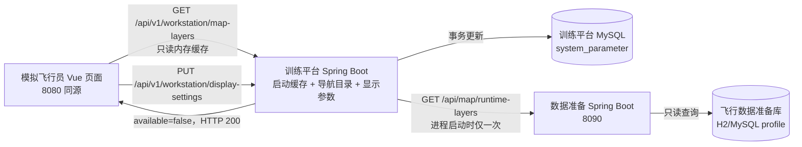
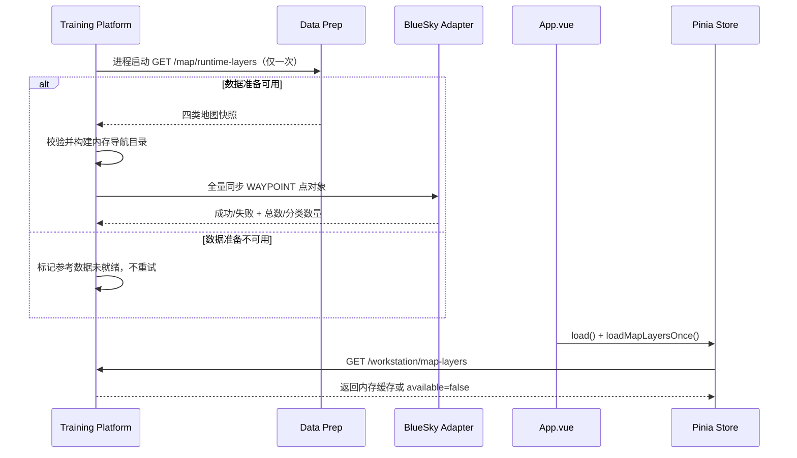

# 模拟飞行员地图图层与显示设置详细设计

日期：2026-08-23
状态：地图与显示设置已实施；统一导航点数据源变更已完成设计，待按配套 TDD 实施
适用模块：`training-platform`、`data-prep-workbench`
配套原型：[`../../design/pseudo-pilot-map-layers-mock.html`](../../design/pseudo-pilot-map-layers-mock.html)

导航点加载时机、类型范围、航路展开、Adapter 同步和运行门禁以 [`仿真引擎统一导航点数据源详细设计.md`](./仿真引擎统一导航点数据源详细设计.md) 为准。该文档替换本文原有“页面首次访问时远程取图”和“地图失败不影响仿真操作”的口径。

## 1. 文档目的

本文定义模拟飞行员工作台新增地图数据图层开关、地图数据读取链路和显示参数设置功能的完整实现基线。本文同时覆盖前端布局与交互、服务间接口、数据筛选与地图渲染、系统参数持久化、失败降级、TDD 实施顺序、测试矩阵及验收标准。

本文完成后，开发人员不应再自行解释以下问题：地图数据来自哪里、哪些记录可显示、四个图层如何开关、顶部状态条与左侧面板如何独立折叠、颜色在哪里配置、数据准备服务不可用时如何处理，以及什么结果才算验收通过。

## 2. 已确认需求

| 编号 | 主题 | 已确认口径 |
| --- | --- | --- |
| D-01 | 数据范围 | 使用飞行数据准备数据库中的当前数据，不按飞行计划或练习计划绑定关系筛选。 |
| D-02 | 图层种类 | 仅提供航路点、航线、物理扇区、天气四个业务图层。 |
| D-03 | 开关粒度 | 每类数据使用一个整体开关，不展开或逐条选择具体记录。 |
| D-04 | 组合方式 | 四个图层彼此独立，可任意多选组合显示。 |
| D-05 | 初始状态 | 每次进入或刷新页面时四个图层全部关闭；开关状态不持久化。 |
| D-06 | 数据加载 | 训练平台启动时从数据准备模块获取一次并保存在内存；页面只读取训练平台缓存。打开页面、菜单、切换图层及运行期间均不再次请求数据准备模块。 |
| D-07 | 失败策略 | 数据准备服务不可用或关键导航数据异常时，模拟飞行员仍可进入工作台且不弹窗；地图和仿真参考数据未就绪，开始/建机/点指令不可用。 |
| D-08 | 顶部布局 | 地图按钮位于顶部状态条“显示设置”按钮右侧。 |
| D-09 | 折叠状态 | 地图按钮随顶部状态条一起折叠和恢复；左侧航空器面板保持独立折叠。折叠顶部状态条时地图菜单关闭。 |
| D-10 | 天气范围 | 风场数据和重要天气区域统一由“天气”开关控制。 |
| D-11 | 天气时效 | 暂不按有效期过滤；启用状态的天气数据在本次页面会话中一直可显示。 |
| D-12 | 数据状态 | 只加载 `ENABLED` 的实体；航路点层只包含已确认的标准导航点、机场和导航台类型并排除 `OTHER/DUMMY`；物理扇区当前无状态字段，所有未删除且几何有效的物理扇区视为可用。 |
| D-13 | 标注 | 各对象常驻显示标注；代码优先，代码为空时显示名称。 |
| D-14 | 配色 | 航路点、航线、物理扇区、天气均可在显示设置中自定义颜色。 |
| D-15 | 区域填充 | 物理扇区和重要天气区域具有独立可配置填充色，固定 20% 透明度。 |
| D-16 | 设置职责 | 地图下拉菜单只负责图层显隐；颜色配置属于统一显示设置。 |
| D-17 | 设置能力 | 本次补齐当前尚未实现的显示设置入口、即时预览、保存和恢复默认值。 |
| D-18 | 设置范围 | 显示设置保存到训练平台 `system_parameter`，为系统级共享配置。 |
| D-19 | 部署降级 | 数据准备服务不作为进入工作台的硬依赖，但属于仿真运行就绪依赖；启动读取失败时静默进入工作台并禁止运行相关操作。 |

## 3. 范围

### 3.1 本次必须完成

1. 数据准备模块提供面向运行态、只读的四类地图图层接口。
2. 训练平台以服务端代理方式读取数据准备模块，不让浏览器跨端口直连。
3. 训练平台启动时只请求一次运行态地图快照；模拟飞行员页面初始化只读取训练平台内存缓存。
4. 顶部状态条在“显示设置”右侧增加“地图”按钮和四项多选下拉菜单。
5. 地图控件随顶部状态条共同折叠；航空器面板保持独立折叠，二者各自保留恢复入口。
6. `SituationMap` 增加六类实际矢量表现：航路点、航线、物理扇区边界与填充、风场点、重要天气边界与填充、对应常驻文字。
7. 地图业务图层不得拦截航空器选择、标牌拖动或地图平移缩放。
8. 显示设置增加可操作入口，支持草稿即时预览、保存、取消和恢复默认值。
9. 显示设置覆盖现有航迹色、选中航迹色及本次新增的六项地图颜色。
10. 后端严格校验颜色值并事务性保存系统参数。
11. 为数据准备后端、训练平台后端、Vue 状态与组件、OpenLayers 渲染及端到端交互补充自动测试。

### 3.2 明确不做

1. 不按飞行计划、练习计划、训练组或模拟飞行员席位筛选地图数据。
2. 不逐条选择航路点、航线、扇区或天气对象。
3. 不在运行期间轮询、SSE 推送或自动刷新地图数据库变化。
4. 不保存图层开关状态，不跨刷新恢复用户选择。
5. 不按天气 `effectiveFrom/effectiveTo` 或 `validFrom/validTo` 过滤。
6. 不显示机场天气；天气图层只包含风场点和重要天气区域。
7. 不提供在线瓦片底图，不依赖互联网地图服务。
8. 不让地图数据参与 BlueSky 飞行计算、航路激活或指令校验。
9. 不把地图数据失败投影为 Toast 或对话框；关键导航数据失败通过独立未就绪状态、状态灯说明和操作门禁表达。
10. 不在本次引入账号、角色授权或个人级显示配置。

## 4. 现状与差距

| 领域 | 当前实现 | 本次差距 |
| --- | --- | --- |
| 模拟飞行员地图 | `SituationMap.vue` 只有单一航空器矢量源。 | 缺少静态业务图层、图层显隐和标注。 |
| 顶部状态条 | 运行状态和显示设置入口。 | 缺少位于显示设置右侧的地图按钮及下拉菜单。 |
| 数据准备地图接口 | `/api/map/layers` 面向地图编辑器，返回导航、空域、航路、天气、雷达五类。 | 分类不匹配；未提供物理扇区；不能直接作为运行态契约。 |
| 服务拓扑 | 训练平台默认 `8080`，数据准备服务默认 `8090`，相互独立。 | 浏览器同源 `/api` 只指向训练平台，缺少服务端读取边界。 |
| 显示参数 | `system_parameter` 仅初始化并读取 `ui.trackColor`、`ui.selectedTrackColor`。 | 缺少设置 UI、写接口、默认值恢复和六项地图色。 |
| 设计文档 | 总体设计要求配色可配置并即时生效。 | 当前代码尚未落实该能力。 |

现有 `/api/map/layers` 继续服务数据准备地图编辑器。运行态新增独立接口，避免改变编辑器的五图层语义、全量数据行为和编辑能力。

## 5. 总体架构



### 5.1 边界原则

1. 浏览器只访问训练平台同源接口，避免 CORS、部署地址泄漏和双服务错误处理分叉。
2. 数据准备模块拥有地图基础数据的查询与几何组装规则。
3. 训练平台在内存中持有不可变四层快照，并从 `WAYPOINT` 构建导航目录；不复制地图主数据到训练平台 MySQL。
4. 快照失败不影响页面和 bootstrap 可访问，但关键导航数据未就绪会阻止训练运行、建机和点依赖指令。
5. 配色是训练平台运行界面参数，仍由训练平台 `system_parameter` 管理。

### 5.2 配置项

训练平台新增：

```yaml
bluesky:
  data-prep:
    base-url: ${BS_PREP_BASE_URL:http://127.0.0.1:8090}
    connect-timeout-millis: ${BS_PREP_CONNECT_TIMEOUT_MS:3000}
    read-timeout-millis: ${BS_PREP_READ_TIMEOUT_MS:3000}
```

数据准备服务不是训练平台进程可启动或页面可访问的硬依赖，但属于仿真运行就绪依赖。启动脚本可在 `8090` 不可达时继续启动 8080；此时参考数据状态为未就绪，必须启动数据准备服务并重启训练平台后才能运行。

## 6. 数据准备运行态接口

### 6.1 端点

`GET /api/map/runtime-layers`

用途：提供训练平台在启动时一次性读取的只读地图和导航快照。端点不接受分页和筛选参数；新增的导航点类型和航路有序点引用遵循统一导航点详细设计。

### 6.2 响应契约

```json
{
  "layers": [
    {
      "category": "WAYPOINT",
      "name": "航路点",
      "count": 2,
      "features": [
        {
          "featureId": "waypoint:seed-nav-pud",
          "featureType": "WAYPOINT",
          "pointType": "VOR_DME",
          "code": "PUD",
          "name": "浦东导航台",
          "elevationMeters": 4,
          "geometry": {
            "type": "Point",
            "coordinates": [121.8082, 31.1421]
          }
        }
      ]
    }
  ]
}
```

类型定义：

```ts
type RuntimeLayerCategory = 'WAYPOINT' | 'AIRWAY' | 'PHYSICAL_SECTOR' | 'WEATHER'
type RuntimeFeatureType =
  | 'WAYPOINT'
  | 'AIRWAY'
  | 'PHYSICAL_SECTOR'
  | 'WIND_FIELD_POINT'
  | 'SIGNIFICANT_WEATHER_AREA'

interface RuntimeMapFeature {
  featureId: string
  featureType: RuntimeFeatureType
  pointType?: 'WAYPOINT' | 'AIRPORT' | 'VOR' | 'NDB' | 'DME' | 'VOR_DME' | 'ILS'
  code: string | null
  name: string | null
  elevationMeters?: number | null
  pointIds?: string[]
  pointCodes?: string[]
  airwayDirection?: 'FORWARD' | 'REVERSE' | 'BOTH'
  segmentDirections?: Array<'FORWARD' | 'REVERSE' | 'BOTH'>
  geometry: GeoJSON.Point | GeoJSON.LineString | GeoJSON.Polygon | GeoJSON.MultiPolygon
}

interface RuntimeMapLayer {
  category: RuntimeLayerCategory
  name: string
  count: number
  features: RuntimeMapFeature[]
}
```

### 6.3 分类与筛选规则

| 分类 | 数据来源 | 可用条件 | 几何 | 标注 |
| --- | --- | --- | --- | --- |
| `WAYPOINT` | `navigation_point` | `deleted=FALSE AND status='ENABLED'`、类型在标准白名单、ID/代码/经纬度合法且代码全局唯一 | `Point` | `code` |
| `AIRWAY` | `airway` + 航段/顶点 | 航线 `deleted=FALSE AND status='ENABLED'`，有效顶点不少于 2，引用点均存在且方向/顺序合法 | `LineString` | `code`，为空时 `name` |
| `PHYSICAL_SECTOR` | `physical_sector` + `physical_sector_point` | 扇区未删除，未删除的有效点不少于 3；当前实体无 `status` 字段 | 闭合 `Polygon` | 当前无 code，显示 `name` |
| `WEATHER` 风场 | `wind_field` + `wind_field_point` | 风场 `deleted=FALSE AND status='ENABLED'`；不判断有效期 | `Point` | 风场 `code`，为空时 `name` |
| `WEATHER` 重要天气 | `significant_weather_area` | `deleted=FALSE AND status='ENABLED'`；不判断有效期 | `Polygon/MultiPolygon` | `code`，为空时 `name` |

补充规则：

1. 经纬度顺序统一为 GeoJSON `[longitude, latitude]`，坐标系为 EPSG:4326。
2. 物理扇区服务端闭合首尾坐标；数据库无需重复保存首点。
3. 标准导航点或启用航路存在非法/重复/断链数据时整个请求失败；扇区和天气等非导航图层的单条坏几何仍跳过并写 `WARN`。
4. 每个响应固定按 `WAYPOINT`、`AIRWAY`、`PHYSICAL_SECTOR`、`WEATHER` 顺序返回四类；无数据时仍返回 `count=0` 和空数组。
5. 响应不包含 `revision`、快照版本或内容校验值。
6. 端点只读。

### 6.4 与编辑器接口隔离

`GET /api/map/layers` 保持原样，不改变其五类编辑图层和现有测试。新端点使用独立 DTO 和查询方法，禁止通过修改原接口类别名称来兼容运行态界面。

## 7. 训练平台启动缓存与地图接口

### 7.1 浏览器端点

`GET /api/v1/workstation/map-layers`

成功响应：

```json
{
  "available": true,
  "layers": [
    { "category": "WAYPOINT", "name": "航路点", "count": 2, "features": [] }
  ]
}
```

降级响应：

```json
{
  "available": false,
  "layers": []
}
```

### 7.2 降级语义

启动缓存无效时，浏览器端点统一返回 HTTP `200` 和 `available=false`。导致启动缓存无效的情况包括：

1. 连接拒绝、连接超时或读取超时。
2. 数据准备服务返回非 2xx。
3. 响应 JSON 无法解析或不满足必要结构。
4. 未识别分类、非法 GeoJSON 导致整份响应无法安全使用。

训练平台记录结构化 `WARN`，包含目标服务、失败类别和 requestId，不记录整份地图响应。浏览器不弹窗、不写入 `store.error`，但 bootstrap 的参考数据状态为未就绪并触发运行门禁。

### 7.3 数据准备模块只请求一次

页面挂载流程：



`loadMapLayersOnce()` 仍具有浏览器应用生命周期内的幂等守卫。浏览器刷新可再次请求训练平台缓存，但任何页面行为均不得触发第二次数据准备 HTTP 请求。只有训练平台进程重启才重新获取数据准备数据。

## 8. 显示参数模型

### 8.1 参数键

| 参数键 | 用途 | 默认值 |
| --- | --- | --- |
| `ui.trackColor` | 普通航空器符号、标杆线和标牌 | `#3fae6d` |
| `ui.selectedTrackColor` | 选中航空器符号、标杆线和标牌 | `#27e58d` |
| `ui.mapWaypointColor` | 航路点符号和文字 | `#7fd3ff` |
| `ui.mapAirwayColor` | 航线线条和文字 | `#4aa8d8` |
| `ui.mapSectorColor` | 物理扇区边界和文字 | `#d6a7ff` |
| `ui.mapSectorFillColor` | 物理扇区填充基色 | `#7b4db3` |
| `ui.mapWeatherColor` | 风场符号、天气边界和文字 | `#ffcf66` |
| `ui.mapWeatherFillColor` | 重要天气区域填充基色 | `#d9822b` |

所有参数只保存大写 `#RRGGBB`。区域填充在渲染阶段固定追加 `0.20` alpha，不把透明度写入数据库。

### 8.2 Flyway 迁移

新增迁移向 `system_parameter` 插入六个地图参数。迁移必须幂等地尊重现有参数，不修改已有 `ui.trackColor` 和 `ui.selectedTrackColor` 值。

### 8.3 API

工作台 bootstrap 的 `uiParameters` 扩展为八项颜色，同时返回默认值：

```json
{
  "uiParameters": {
    "trackColor": "#3FAE6D",
    "selectedTrackColor": "#27E58D",
    "mapWaypointColor": "#7FD3FF",
    "mapAirwayColor": "#4AA8D8",
    "mapSectorColor": "#D6A7FF",
    "mapSectorFillColor": "#7B4DB3",
    "mapWeatherColor": "#FFCF66",
    "mapWeatherFillColor": "#D9822B"
  },
  "uiParameterDefaults": {
    "...": "..."
  }
}
```

保存端点：

`PUT /api/v1/workstation/display-settings`

请求体必须一次提交完整八项颜色。服务端执行允许键白名单、非空检查和 `^#[0-9A-Fa-f]{6}$` 校验，在单个事务内 upsert 八个参数，并返回规范化为大写的已保存对象。

错误响应沿用平台统一错误结构：

```json
{
  "code": "INVALID_DISPLAY_COLOR",
  "message": "显示颜色格式不合法",
  "fieldErrors": [
    { "field": "mapWeatherColor", "message": "必须使用 #RRGGBB 格式" }
  ]
}
```

### 8.4 前端草稿状态

显示设置维护三份状态：

- `savedSettings`：最近一次从后端读取或保存成功的值。
- `draftSettings`：设置面板当前编辑值。
- `previewSettings`：地图和界面正在使用的值。

交互规则：

1. 打开面板时 `draft=saved`，同时保持当前预览。
2. 修改颜色时立刻 `preview=draft`，无需后端请求。
3. 点击“取消”或按 `Esc` 时 `preview=saved` 并关闭。
4. 点击“恢复默认”时 `draft=defaults`、`preview=defaults`，但尚不写数据库。
5. 点击“保存”成功后 `saved=draft`、`preview=draft` 并关闭。
6. 保存失败时面板保持打开，展示设置面板内联错误；地图继续预览草稿值，用户可修正或取消。
7. 颜色保存不修改当前四个图层的开关状态。

## 9. 前端信息架构

### 9.1 顶部状态条与左侧面板展开态

```text
┌─────────────────────────────────────────────────────────────────────────────┐
│              顶部训练状态条                 [显示设置] [地图 ▾] [‹]        │
│                                                   ┌────────────────┐        │
│                                                   │ □ 航路点    23 │        │
│                                                   │ □ 航线       8 │        │
│                                                   │ □ 扇区       4 │        │
│                                                   │ □ 天气       6 │        │
│                                                   └────────────────┘        │
│                                                                             │
│  ┌────────────────────────────┐                                             │
│  │ [+ 创建]                [‹]│  ← 航空器面板独立折叠                       │
│  │ CES123 A320 ZSPD/ZBAA      │          全屏离线态势地图                    │
│  │ PUD A593 ...               │                                             │
│  └────────────────────────────┘                                             │
│                                                                             │
│                          [ 指令输入 ] [指令队列]                             │
└─────────────────────────────────────────────────────────────────────────────┘
```

### 9.2 独立折叠态

```text
┌─────────────────────────────────────────────────────────────────────────────┐
│ [顶部恢复 ›]                         [左侧恢复 ›]                            │
│  ↑ 顶部状态条、显示设置和地图按钮隐藏    ↑ 航空器面板独立隐藏                │
│                                                                             │
│                              态势地图                                       │
└─────────────────────────────────────────────────────────────────────────────┘
```

### 9.3 显示设置面板

```text
┌──────────────────────── 显示设置 ────────────────────────┐
│ 航迹                                                               │
│ 普通航迹       [■ #3FAE6D]    选中航迹       [■ #27E58D]            │
│                                                                     │
│ 地图图层                                                           │
│ 航路点         [■ #7FD3FF]    航线           [■ #4AA8D8]            │
│ 扇区边界/文字  [■ #D6A7FF]    扇区填充       [■ #7B4DB3]  20%       │
│ 天气边界/文字  [■ #FFCF66]    天气填充       [■ #D9822B]  20%       │
│                                                                     │
│ [恢复默认]                                      [取消] [保存]       │
└─────────────────────────────────────────────────────────────────────┘
```

配套 HTML 原型展示地图菜单、四图层叠加和显示设置即时预览，位置见本文页首。

## 10. 交互详细设计

### 10.1 地图菜单

1. 按钮文案固定为“地图”，带向下箭头和地图图标。
2. 点击按钮切换菜单开关；菜单开启时 `aria-expanded=true`。
3. 菜单使用原生复选框语义，允许键盘 Tab、Space 操作。
4. 选择一项后菜单保持打开，便于连续组合多个图层。
5. 点击菜单外或按 `Esc` 只关闭菜单，不改变已选图层。
6. 折叠顶部状态条时先关闭菜单，再隐藏状态条及地图入口；折叠左侧面板不影响地图入口。
7. 恢复顶部状态条后菜单保持关闭，四项图层选择保持当前会话值。
8. 某类 `count=0` 时该项仍显示、数量为 `0`、复选框禁用。
9. `available=false` 时地图按钮禁用；不附加错误文案、红色状态或弹窗。
10. 成功返回至少一个可用分类时地图按钮可用；空分类不影响其他分类。

### 10.2 页面重载

1. 浏览器刷新、关闭后重新进入或 Vue 应用重新挂载，都建立新会话。
2. 新会话四项开关必须为 `false`，即使上次页面中曾全部打开。
3. 显示颜色从系统参数恢复最近保存值，因为它们是系统级配置。

### 10.3 显示设置

1. 入口位于顶部训练状态条，使用“显示设置”可访问名称。
2. 面板覆盖在地图之上，不推动地图或状态栏布局。
3. 八项颜色均提供原生 color input 和可编辑的 `#RRGGBB` 文本值。
4. 无效文本在前端即标记，保存按钮禁用；后端仍执行同等校验。
5. 即时预览只作用于本地页面，不产生连续保存请求。
6. 面板关闭、取消或保存成功后焦点返回入口按钮。

## 11. 地图渲染设计

### 11.1 图层与 zIndex

| zIndex | 图层 | 说明 |
| ---: | --- | --- |
| 10 | 物理扇区填充与边界 | 大面积背景业务区。 |
| 20 | 重要天气填充与边界 | 显示在扇区上方，填充固定 20%。 |
| 30 | 航线 | 线条和中点标注。 |
| 40 | 航路点、风场点 | 点符号和文字。 |
| 100+ | 航空器、标杆线、航迹标牌 | 始终位于静态地图数据之上。 |

静态地图数据按四个独立 `VectorLayer` 管理，切换时调用 `setVisible`，不得重新解析 GeoJSON 或重建航空器图层。

### 11.2 样式

| 对象 | 几何样式 | 文字位置 |
| --- | --- | --- |
| 航路点 | 6px 空心圆，1.5px 配置色描边 | 点右上方偏移 7px/−7px |
| 航线 | 1.5px 配置色实线 | LineString 几何中点；同一航线显示一次 |
| 物理扇区 | 1.5px 边界色；独立填充色 20% | Polygon interior point |
| 风场点 | 风羽简化符号或 8px 十字，使用天气边界色 | 点右上方；显示风场代码/名称 |
| 重要天气区域 | 1.5px 天气边界色；独立填充色 20% | Polygon interior point |

文字统一采用与航迹标牌兼容的等宽字体、11px、配置色填充，并使用地图背景色 2px 描边提高可读性。所有标注常驻，不因缩放自动隐藏；缩放和平移时跟随几何位置。

### 11.3 渲染安全与交互隔离

1. 地图业务要素不设置 `aircraftId`，不进入航空器命中选择。
2. `singleclick` 命中地图业务要素时视为空白地图点击，不清空当前航空器选择。
3. 标牌拖动命中逻辑只检查现有航空器标牌几何盒，不受地图文字影响。
4. 业务图层设为非交互选择层，不增加修改、拖动、弹窗或悬停详情。
5. 图层开关只改变可见性，不修改地图中心、缩放级别或航空器布局。
6. 颜色预览只更新 Style，不清空或重建地图 View。

### 11.4 性能约束

1. 页面初始化将 GeoJSON 解析为 Feature 一次，之后只切换 `visible`。
2. 单次快照目标上限：10,000 航路点、5,000 航线、1,000 物理扇区、2,000 天气要素。
3. 在目标上限、1920×1080、Chrome 当前稳定版下，单项图层切换至首帧更新应小于 100ms；四层同时开启不应阻塞航空器 1Hz 状态更新。
4. 超出目标上限不是接口报错条件，但必须在性能测试报告中记录实际帧耗时。

## 12. 前端状态模型与组件拆分

```text
frontend/src/
├─ api.ts                         # mapLayers()、saveDisplaySettings()
├─ types.ts                       # RuntimeMap*、DisplaySettings
├─ store.ts                       # 一次性地图快照、saved/draft/preview 设置
├─ App.vue                        # 并行初始化、顶部地图控件、顶部与左侧独立折叠
├─ MapLayerMenu.vue               # 四项菜单，仅负责显隐
├─ DisplaySettingsDialog.vue      # 即时预览/默认/保存/取消
├─ SituationMap.vue               # 接收静态快照、可见状态和预览配色
├─ mapLayerStyles.ts              # 纯函数样式和标注规则
└─ style.css                      # 面板、菜单、设置对话框
```

建议状态：

```ts
interface MapLayerVisibility {
  WAYPOINT: boolean
  AIRWAY: boolean
  PHYSICAL_SECTOR: boolean
  WEATHER: boolean
}

interface DisplaySettings {
  trackColor: string
  selectedTrackColor: string
  mapWaypointColor: string
  mapAirwayColor: string
  mapSectorColor: string
  mapSectorFillColor: string
  mapWeatherColor: string
  mapWeatherFillColor: string
}
```

`SituationMap` 接收显式 props，不直接访问 Pinia 或调用 API，保持地图渲染可独立测试。

## 13. 后端组件设计

### 13.1 数据准备模块

```text
org.bluesky.dataprep.runtime/
├─ RuntimeMapController.java
├─ RuntimeMapService.java
├─ RuntimeMapMapper.java
├─ RuntimeMapResponse.java
├─ RuntimeMapLayer.java
└─ RuntimeMapFeature.java
```

允许复用现有 `MapRefMapper` 的只读查询，但不得让运行态服务依赖编辑操作 DTO。物理扇区查询必须一次获取扇区与有序边界点，避免逐扇区 N+1 查询。

### 13.2 训练平台

```text
org.bluesky.training.mapdata/
├─ MapDataClient.java
├─ MapDataProperties.java
├─ MapDataService.java
├─ MapDataController.java
├─ MapLayersResponse.java
├─ RuntimeReferenceCatalog.java
├─ ReferenceDataState.java
└─ RouteExpander.java

org.bluesky.training.display/
├─ DisplaySettingsController.java
├─ DisplaySettingsService.java
├─ DisplaySettingsRequest.java
└─ DisplaySettingsView.java
```

`MapDataClient` 使用 Spring `RestTemplate` 或项目统一 HTTP 客户端，连接/读取超时默认 3 秒。`MapDataService` 在进程启动时调用一次并构建不可变 `RuntimeReferenceCatalog`；页面控制器只读缓存。技术异常不得阻止页面启动，但必须进入参考数据未就绪状态。

`DisplaySettingsService` 只允许本文八个键，使用批量 upsert 或逐项更新的单事务方法。任一字段失败时全部回滚。

## 14. 数据库变更

训练平台新增一条 Flyway 迁移：

```sql
INSERT INTO system_parameter (parameter_key, parameter_value)
VALUES ('ui.mapWaypointColor', '#7FD3FF');
-- 其余五项同理
```

若生产数据库可能已经人工添加同名键，实施时采用项目 MySQL 版本支持的幂等写法，禁止覆盖现有值。

数据准备模块不新增业务表。物理扇区当前没有 `status` 字段，本需求不借机修改其模型；未删除且几何有效即视为可用。

## 15. 错误处理与可观测性

| 场景 | 用户界面 | HTTP/服务行为 | 日志 |
| --- | --- | --- | --- |
| 数据准备服务不可达 | 工作台可进入；地图按钮和运行相关操作禁用；无弹窗 | 启动缓存无效，参考数据未就绪 | 训练平台 `WARN` |
| 标准导航点/航路关键数据非法 | 工作台可进入；运行相关操作禁用 | 数据准备非 2xx 或训练平台校验拒绝整批 | 两端记录类型、ID/代码和原因 |
| 扇区/天气单条坏几何 | 跳过坏对象；其他对象可用 | 数据准备返回正常快照 | 数据准备 `WARN`，含实体类型和 ID |
| 地图快照整体格式非法 | 地图按钮禁用；无提示 | 训练平台降级 | 训练平台 `WARN` |
| 颜色前端格式非法 | 设置面板字段内联错误 | 不发送保存请求 | 无 |
| 颜色后端校验失败 | 设置面板显示字段错误 | `400 INVALID_DISPLAY_COLOR` | 可选 INFO |
| 保存数据库失败 | 保留设置面板与草稿预览 | `500` 统一错误 | `ERROR` |

静默仅指不向模拟飞行员提示地图读取失败，不等于吞掉服务端诊断信息。

## 16. TDD 实施方案

所有任务遵循 Red → Green → Refactor；先写能表达业务行为的失败测试，再添加最小实现。每一阶段完成后运行本模块完整回归，不依赖最后一次集中补测。

### TDD-1：数据准备运行态图层

**Red**

1. `RuntimeMapApiTest` 断言端点固定返回四类及稳定顺序。
2. 写入各点类型、启用/停用/逻辑删除记录，断言只返回标准白名单内启用且未删除数据，并带 `pointType/elevationMeters`。
3. 写入物理扇区和有序边界点，断言返回闭合 Polygon 和名称标注。
4. 写入启用、过期、未来的风场及重要天气，断言全部返回，不按有效期过滤。
5. 写入非法或重复标准导航点、断链航路，断言整批失败；写入非法扇区/天气几何，断言仅跳过该记录。
6. 断言航路返回有序点 ID/代码和方向元数据。

**Green**

实现 DTO、Mapper、Service、Controller，仅满足上述行为。

**Refactor**

抽取 GeoJSON 构建与 `code-or-name` 规则，消除与编辑器 MapService 的安全重复，但不合并两套契约。

### TDD-2：训练平台地图代理与静默降级

**Red**

1. Mock 远端成功，断言应用启动只请求一次并构建不可变缓存。
2. 连续调用地图接口、bootstrap 和搜索，断言远端请求计数仍为 1。
3. Mock 连接失败、超时、500、非法 JSON，断言页面接口可访问但参考数据未就绪。
4. 断言未知分类或非法整体结构拒绝整批，且本次进程不自动重试。

**Green**

实现 properties、HTTP client、service 和 controller。

**Refactor**

统一错误分类与结构化日志，确保不打印大响应体。

### TDD-3：显示参数持久化

**Red**

1. bootstrap 返回八项当前颜色和八项默认值。
2. 保存合法小写颜色后返回大写，并持久化八项。
3. 任一字段缺失、格式非法或存在未知字段时返回 400。
4. 模拟第 N 项写入失败，断言前 N−1 项也回滚。
5. 恢复默认草稿后保存，断言数据库为默认值。

**Green**

实现迁移、请求/响应、校验、事务和 mapper。

**Refactor**

把键定义、默认值和校验集中到单一 `DisplaySettingDefinition`，避免 Controller、Service 与 bootstrap 各自维护列表。

### TDD-4：前端状态与 API

**Red**

1. `loadMapLayersOnce` 连续调用两次只产生一次 HTTP 请求。
2. `store.load()` 再次执行不触发地图请求。
3. 地图请求失败或 `available=false` 不写 `store.error`。
4. 新 store 实例四项 visibility 全为 false。
5. 显示设置草稿修改即时更新 preview；取消恢复 saved；恢复默认只改草稿；保存成功更新 saved。

**Green**

实现 types、api 和 store。

**Refactor**

将显示设置草稿状态抽成可测试组合函数，减少 App.vue 状态分支。

### TDD-5：菜单与设置组件

**Red**

1. 菜单有四个正确标签、数量和独立 checkbox。
2. 默认均未选中；选择后菜单不关闭。
3. `count=0` 时单项禁用；`available=false` 时地图按钮禁用且无错误文字。
4. 外部点击、Esc、顶部状态条折叠关闭菜单但不清空可见状态；左侧折叠不影响地图入口。
5. 显示设置八项输入完整，预览、取消、默认、保存行为正确。
6. 键盘及 aria 属性符合设计。

**Green**

实现 Vue 组件和样式。

**Refactor**

抽取焦点返回和外部点击处理，避免对 document 事件重复注册。

### TDD-6：OpenLayers 渲染

**Red**

1. 每类数据映射到独立 VectorLayer，初始 visible=false。
2. 开关只调用对应 layer 可见性，不重建 View。
3. 标注执行 code 优先、name 兜底。
4. 扇区和重要天气填充 alpha 恒为 0.20。
5. 颜色预览更新所有对应符号、线、文字和填充。
6. 地图业务要素不产生 aircraft selection。
7. 开启/关闭静态层不改变地图中心和缩放。

**Green**

实现 GeoJSON Feature 转换、style 纯函数和四层管理。

**Refactor**

将航空器动态源和静态业务源拆分为明确职责，保留现有标牌拖动逻辑。

### TDD-7：端到端验收

1. 启动数据准备服务、Adapter 与训练平台，验证训练平台启动只读取一次、四项组合、折叠恢复和颜色保存。
2. 关闭数据准备服务后刷新多个页面，验证继续读取当前进程内存缓存；重启训练平台后验证工作台可进入但运行操作禁用。
3. 监控数据准备端点请求计数；打开/关闭菜单、刷新页面、创建航空器和切换图层后计数保持 1。
4. 截图比较 1920×1080 和 1366×768，确认无面板遮挡、文字裁切或恢复入口丢失。
5. 验证地图业务要素覆盖航空器附近时仍能选择和拖动航空器标牌。

## 17. 自动测试矩阵

| 层级 | 测试文件建议 | 关键覆盖 |
| --- | --- | --- |
| 数据准备 MockMvc | `RuntimeMapApiTest.java` | 四类、点类型、航路引用、关键数据严格失败、非关键坏几何跳过 |
| 训练平台单元 | `RuntimeReferenceCatalogTest.java` | 启动一次加载、索引、超时、解析失败、就绪状态 |
| 训练平台 MockMvc | `MapDataApiTest.java` | 只读缓存的成功/不可用响应契约 |
| 训练平台 MockMvc | `DisplaySettingsApiTest.java` | bootstrap、保存、校验、事务 |
| 前端单元 | `mapLayerStyles.test.ts` | 标注、颜色、20% alpha、几何样式 |
| 前端 store | `store.test.ts` | 一次加载、静默失败、草稿状态 |
| Vue 组件 | `MapLayerMenu.test.ts` | 四开关、数量、禁用、键盘、折叠 |
| Vue 组件 | `DisplaySettingsDialog.test.ts` | 预览、取消、默认、保存、错误 |
| 浏览器 E2E | `design/tools/pptr/verify-map-layers.js` | 地图视图稳定、命中隔离、请求次数、截图 |

每个实现提交至少运行：

```powershell
cd data-prep-workbench
mvn test
cd frontend
npm test
npm run build

cd ../../training-platform/frontend
npm test
npm run typecheck
npm run build
cd ..
mvn test
```

最终回归还应运行仓库根目录 `./build-platform.ps1`。

## 18. 验收标准

以下条目全部通过才可宣称完成。

### 18.1 功能验收

- **AC-01** 给定数据准备库含四类可用数据，训练平台进程启动时对运行态地图接口只发起一次请求。
- **AC-02** 页面进入后，地图菜单存在航路点、航线、扇区、天气四项，且默认全部关闭。
- **AC-03** 任意单项或多项可独立启用/关闭，操作一项不改变其他项。
- **AC-04** 每项控制整类数据，不提供具体对象列表或逐条选择。
- **AC-05** 航路点、航线、物理扇区、风场和重要天气均按本文样式绘制，并常驻显示代码或名称。
- **AC-06** 标注严格代码优先、名称兜底；物理扇区显示名称。
- **AC-07** 天气开关同时控制风场点和重要天气区域。
- **AC-08** 过期或未来但状态为 `ENABLED` 的天气仍在快照中；状态为 `DISABLED` 的天气不在快照中。
- **AC-09** 地图按钮紧邻顶部“显示设置”右侧；左侧面板折叠时仅隐藏航空器列表和创建入口，不影响地图按钮。
- **AC-10** 顶部状态条折叠时显示设置、地图按钮及已打开菜单一起隐藏；恢复后图层显隐状态不变，地图菜单保持关闭。
- **AC-11** 刷新或重新进入页面后四项显隐状态重新全部关闭。
- **AC-12** 打开/关闭菜单、切换图层、刷新页面、创建或删除航空器均不触发第二次数据准备模块请求。

### 18.2 显示设置验收

- **AC-13** 顶部状态条提供显示设置入口，包含本文八项颜色。
- **AC-14** 修改任意颜色后，相关地图或航迹无需保存即可即时预览。
- **AC-15** 点击取消后全部预览恢复最近保存值。
- **AC-16** 点击恢复默认后八项进入默认预览；点击保存后默认值持久化。
- **AC-17** 保存成功后刷新页面仍使用已保存颜色，且所有模拟飞行员终端读取同一系统级配置。
- **AC-18** 物理扇区和重要天气区域分别使用独立填充色，实际渲染 alpha 恒为 `0.20`。
- **AC-19** 非 `#RRGGBB` 输入无法保存；服务端同样拒绝绕过前端提交的非法颜色。
- **AC-20** 八项保存具有事务性，任何一项失败时系统参数不出现部分更新。

### 18.3 降级与兼容验收

- **AC-21** 数据准备服务在训练平台启动时停止、超时、返回 500 或非法 JSON 时，工作台仍正常进入且不弹窗，但参考数据状态未就绪。
- **AC-22** 参考数据未就绪时地图按钮、开始/继续、航空器创建和点依赖指令不可用；页面浏览、状态查看和诊断信息仍可用。
- **AC-23** 单条坏地图几何只被跳过，其他合法要素仍显示。
- **AC-24** 原数据准备地图编辑器 `/api/map/layers` 与编辑保存功能保持回归通过。
- **AC-25** 静态地图数据不得拦截航空器选择、标牌拖动、地图平移缩放，切换图层不得移动地图视图。

### 18.4 视觉、可访问性与性能验收

- **AC-26** 1920×1080 和 1366×768 下，地图菜单、航空器行、顶部状态条和底部指令区不相互遮挡。
- **AC-27** 地图菜单和显示设置可用键盘完成全部操作，并具有可识别 label/aria 状态。
- **AC-28** 颜色不是唯一状态信息：图层项始终有文字标签和 checkbox 状态。
- **AC-29** 在目标数据量下，单项图层切换到首帧更新小于 100ms，航空器 1Hz 更新无肉眼可见停顿。
- **AC-30** 两个后端完整测试、两个前端完整测试、类型检查和生产构建全部通过。

## 19. 实施顺序与提交边界

1. 数据准备运行态接口与测试。
2. 训练平台地图代理、配置和降级测试。
3. 显示参数迁移、读写 API 与测试。
4. 前端类型、API、store 一次性加载与测试。
5. 地图图层样式和 OpenLayers 渲染测试。
6. 地图菜单、顶部与左侧独立折叠和显示设置 UI 测试。
7. E2E、截图、性能与全量回归。
8. 同步更新 `CONTEXT.md`、概要设计或完成记录中与实现结果不一致的描述。

每个提交只跨越一个可回滚边界。不得在没有数据准备契约测试时先硬编码前端演示数据，也不得在前端直接访问 `http://127.0.0.1:8090`。

## 20. 完成定义

满足以下条件后，本工作包完成：

1. 第 18 节 30 条验收标准全部有自动测试或留存的人工验收证据。
2. 配套原型与最终实现的控件位置、折叠关系、菜单结构和设置字段一致。
3. 数据准备服务停机降级经过真实进程级验证，而非只验证 mock。
4. `git diff` 不包含生成缓存、依赖目录或无关改动。
5. 完成记录列出测试命令、通过数量、截图路径、已知限制和后续项。

## 21. 实施与复核记录

### 21.1 代码复核修正

- `V7__map_display_colors.sql` 改为仅在配置键不存在时插入，重复执行不会覆盖已有系统配置。
- 数据准备查询中的大文本转换统一使用 H2/MySQL 均支持的 `CHAR`，消除 MySQL 对 `CAST(... AS VARCHAR)` 的兼容风险。
- 航线或物理扇区任一顶点缺失、被删除或坐标越界时跳过整个要素，不再用残余顶点绘制变形几何。
- 训练平台代理严格校验四类图层、数量、要素类型、几何类型、坐标范围和标识唯一性；非法上游响应继续按既定策略静默降级。
- 显示设置保存一次返回全部非法字段，并拒绝未知字段；持久化失败与输入错误分别使用 500 和 400 响应。
- 显示设置对话框补充初始焦点、焦点循环、关闭后焦点恢复，并在保存期间禁止通过背景关闭。
- 静态图层维持在航空器图层以下，只有航空器要素可触发航空器选择。

### 21.2 自动化验证结果

| 验证项 | 结果 |
| --- | --- |
| 数据准备后端完整测试 | 70 个测试通过，0 失败，0 错误 |
| 训练平台后端完整测试 | 69 个测试通过，0 失败，0 错误 |
| 训练平台前端完整测试 | 12 个测试文件、47 个测试通过 |
| TypeScript 类型检查 | 通过 |
| 前端生产构建 | 通过，226 个模块完成转换 |
| SQL 迁移回归 | V7 重复执行不覆盖已有配置；本地演示库迁移校验记录已修复 |

### 21.3 人工验证与边界

- 已在本地演示页面验证四类图层入口、默认关闭、多选开关、静默降级、显示设置即时预览与取消恢复。
- 2026-08-25 根据界面复核将地图按钮移至顶部“显示设置”右侧；地图控件改为随顶部状态条折叠，左侧航空器面板保持独立折叠。
- 已在重新打包并启动的 8080 服务上复验：按钮顺序为“显示设置、地图、顶部折叠”；菜单四项显示正常；左侧折叠不影响地图入口；顶部折叠会关闭并隐藏地图菜单，恢复后菜单保持关闭。
- 当前本地环境使用 H2 演示库，未连接目标 MySQL；目标 MySQL 上仍需执行迁移和运行态接口部署验收。
- AC-29 的目标数据量 100ms 性能指标尚无自动化基准，必须在目标数据规模和部署硬件上测量后才能宣称通过。
