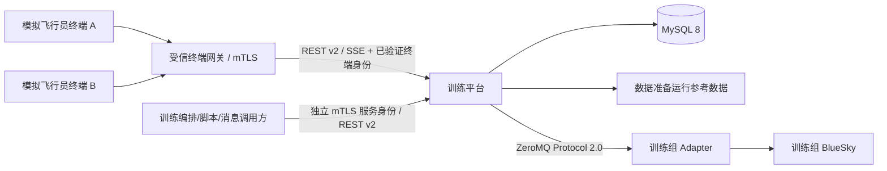

# 模拟飞行员工作台第二版详细设计

> 文档状态：第二版唯一实施基线
> 适用范围：模拟飞行员（模拟机长）工作台及其 Java 平台、MySQL、运行参考数据和 BlueSky Adapter 端到端链路
> 接口版本：REST/SSE `v2`，Java—Python Adapter Protocol `2.0`
> 文档修订：`2.2`（仍属于第二版，不建立并行基线）
> 生效规则：自本文进入仓库起，第二版需求解释、设计、开发、测试和验收均以本文为唯一依据；本文中的“待配置”只允许表示数值由部署配置提供，不允许表示接口、状态或验收语义待定。

## 1. 文档权威性

### 1.1 唯一参考原则

1. 本文完整替代此前的系统上下文、概要设计、首版详细设计、实施任务、验收用例、专项详细设计及 ADR。
2. 需求规范、外部厂商操作手册、BlueSky 原始资料和历史审计记录只用于说明需求来源或实现背景，不是第二版实施依据。
3. 本文与保留资料出现不一致时，以本文为准。
4. 本文未列入的能力不属于第二版完成范围，不允许通过旧文档扩大或缩小范围。
5. 修改本文必须同时修改功能追踪、接口、数据模型和验收标准；不得只更新其中一处。
6. 源码、测试或运行行为与本文不一致时，默认判定为实现偏差；确需改变设计时，先修订本文再修改实现。

### 1.2 修订记录

| 修订 | 内容 |
|---|---|
| 2.0 | 汇总机长席功能差距，建立第二版唯一基线。 |
| 2.1 | 消除 ID/IDENT、生命周期、指令调度和删除一致性歧义；补齐创建、REST/SSE、Adapter、恢复、安全和量化验收契约。 |
| 2.2 | 补齐 SIDSTAR 控制通道、纯业务字段指令执行路径、未出现航空器本地删除、训练组/终端运维管理接口、初始状态模板快照资源与已发布快照查询；补全 STARTING 失败回退边；删除无触发场景的 `TRAINING_PAUSED` HTTP 错误码；明确 HOLD 原地等待、VOR `T/F`、OFFSET 紧凑形式与厂商手册的兼容映射；新增 `TRUSTED_IDENTITY_REJECTED` 与 `TERMINAL_FREQUENCY_IN_USE` 错误码，终端频率/单位/启用列随 V8 迁移。 |

### 1.3 术语

| 术语 | 定义 |
|---|---|
| 模拟飞行员、模拟机长 | 本文视为同一席位角色，通过工作台执行管制指令。 |
| 训练组 | 共享练习计划、仿真时钟和独立 BlueSky 实例的业务隔离单元。 |
| 终端 | 一套模拟飞行员工作台实例，具有稳定终端 ID 和组内唯一频率。 |
| 责任席位 | 当前唯一有权对某航空器执行常规控制和删除操作的终端。 |
| 指令 | 经平台解析、校验、权限判断和调度后形成的航空器业务控制对象。 |
| 引导目标 | 指令完成后仍可由 BlueSky 持续保持的航向、高度、速度或程序目标；它与指令状态分开管理。 |
| 飞行报告 | 航空器到达目标、通过报告点、进入飞行阶段或发生异常时产生的业务事件。 |
| 命令报告 | 指令受理、执行、完成、失败、超时、取消或被覆盖的结果记录。 |
| 假目标 | 独立合成航迹或带假目标标志的 BlueSky 航空器。 |
| `TRANSPONDER_IDENT` | 标准应答机 IDENT 业务标志；第二版只保存和显示平台字段，不发送 ASTERIX。文本命令为 `IDENT`，不得写成 `ID`。 |
| `ID` | 厂商手册中的特殊地理位置标示能力槽；其行为由 `special_operation_profile(operationType=ID)` 定义，与应答机 IDENT 无关。 |
| `DECOMP` | 客舱失压能力槽；N、S、CLR 的具体航空动作由 `special_operation_profile` 定义。 |

## 2. 建设目标与范围

### 2.1 第二版目标

第二版必须使模拟飞行员能够在一个正式持久化的多席位训练组中完成从航空器创建、起飞、离场、航路飞行、雷达引导、等待、进近、复飞到着陆的完整操作，同时提供席位移交、进程单、报告、特情、假目标和完整态势辅助工具。

### 2.2 必须完成

1. 多训练组、多模拟飞行员终端和航空器责任分配。
2. 训练开始、暂停、继续及状态持久化；模拟飞行员不提供结束训练入口。
3. 航空器和飞行计划创建、延迟出现、删除及完整进程单。
4. 基础操纵、航路、等待、起飞、SID/STAR、ILS、复飞、VOR、偏置和航路约束。
5. Squawk、SSR Mode、`TRANSPONDER_IDENT`、正常代码恢复及重复代码警告。
6. 两类假目标、NSPEED，以及接口和状态语义已固定、航空数值由已发布 profile 提供的 ID/DECOMP 能力槽。
7. 同组直接原子移交、全组态势查看和非本席只读限制。
8. 命令报告、飞行报告、历史查询、脚本提醒和席位消息。
9. 未来航路、测距、局部地图、罗盘、距离环、速度矢量、历史点、标牌模式和标牌自动避让；不包含航空器自动防相撞控制。
10. `MET/IMP/MIX` 三种席位单位模式和完整屏幕方案保存/调用。
11. `/api/v2`、可靠 SSE 和 Adapter Protocol `2.0`。
12. 生产训练数据持久化、审计、可观测性和可重复验收。

### 2.3 明确范围外

1. 教员工作台界面；本文只规定机长席需要接收的教员消息、脚本和训练结束入站契约。
2. 智能机长语音识别、复诵和通信系统。
3. 模拟管制员席位、塔台席位和完整地空语音/PTT。
4. ASTERIX 编码与网络发送；Squawk、SSR Mode 和 `TRANSPONDER_IDENT` 只设计为平台权威业务字段。
5. 自动评分、训练回放、音视频录制和进程单打印。
6. 在线互联网地图服务。

## 3. 总体架构

### 3.1 技术基线

| 层次 | 第二版基线 |
|---|---|
| 前端 | Vue 3、TypeScript、Pinia、OpenLayers，地图优先单页工作台 |
| 业务平台 | Java 8、Spring Boot 2.7、MyBatis、Flyway，模块化单体 |
| 数据库 | MySQL 8；测试使用 H2 兼容迁移 |
| 仿真边界 | Python Adapter 插件 + 每训练组一个无界面 BlueSky 实例 |
| 平台接口 | REST 写入与查询，SSE 下发业务事件和态势快照 |
| Java—Python | ZeroMQ，版本化 UTF-8 JSON，Protocol `2.0` |
| 部署 | 受控隔离网络、固定终端 mTLS 身份绑定、无自然人登录模式 |

### 3.2 运行拓扑



### 3.3 架构约束

1. 前端不得直接调用 BlueSky、Adapter 或数据准备数据库。
2. 所有控制指令必须经过统一指令网关；不得在前端拼接 BlueSky 原生命令。
3. 每个训练组绑定一个独立 BlueSky 实例、Adapter 会话和仿真时钟。
4. Java/MySQL 是飞行计划、责任席位、Squawk、SSR Mode、`TRANSPONDER_IDENT`、报告和审计的业务权威。
5. BlueSky 真值是普通航空器和 `SIMULATED_AIRCRAFT` 的位置、航向、高度、速度、升降率和飞行阶段动态权威；`RADAR_SYNTHETIC` 的动态权威是 Java 合成目标调度器。两者在 SSE 中使用同一显示投影但不得混淆来源。
6. 参考数据在训练组启动时形成版本化运行快照；运行期间不得因后台主数据修改而改变已启动训练。
7. 生产环境不执行启动清空；只允许显式 `demo` 或 `test` 配置执行复位。
8. MySQL 事务与 Adapter 调用不得描述为同一原子事务；跨边界写操作必须使用持久化 Outbox、幂等请求和可恢复状态机。
9. 业务事件、动态状态帧和历史归档是三类不同数据：业务事件必须可靠保存，状态帧允许由新帧覆盖，历史归档按保留策略清理。

## 4. 容量、时间和单位

### 4.1 容量基线

| 项目 | 目标 |
|---|---:|
| 并行训练组 | 8 |
| 每组活动航空器 | 200 |
| 每组模拟飞行员终端 | 8 |
| 每终端可负责航空器 | 200 |
| BlueSky 状态帧 | 1 Hz |
| 工作台态势刷新 | 1 Hz |
| 连续运行 | 8 小时无需重启 |
| REST 业务受理 | P95 < 500 ms |
| Adapter 正常确认 | P95 < 200 ms |
| SSE 业务事件端到端 | P95 < 1 秒 |
| Java 平台峰值堆使用 | ≤ 6 GiB，`-Xmx` 固定为 8 GiB |
| 单训练组 Adapter + BlueSky 峰值 RSS | ≤ 2 GiB |
| 稳态内存增长 | 第 1 小时基线至第 8 小时增长 ≤ 10% |
| 业务请求错误率 | 排除明确的 4xx 后 < 0.1% |
| 状态归档压缩密度 | 全容量下平均 ≤150 byte/航空器帧，90 天至少预留 2 TiB |

### 4.2 时间

1. 业务事件同时记录 UTC 系统时间和训练组仿真时间。
2. 指令技术确认超时使用系统单调时间；飞行动作完成、稳定窗口和业务超时使用仿真时间。
3. 训练暂停时，仿真时间、航空器运动、延迟出现倒计时、排队等待预算和业务执行预算全部冻结。
4. UTC 仅用于审计和界面显示，不用于安排飞行动作。
5. 文本中的绝对仿真时刻统一写为 `D<日序>T<HH:MM:SS>`，例如 `D0T09:30:00`；相对时刻写为 `T+<秒>`。兼容输入 `HHMM` 只解释为当前仿真日且必须晚于当前时刻，不自动滚入下一日。
6. STARTING、PAUSED、RESUMING、RECOVERING、RECOVERY_FAILED、ENDING 和 ENDED 不推进仿真时间；RUNNING 推进。系统时间技术超时始终继续计算。
7. 进入 PAUSING 后禁止新调度，Adapter 必须在下一个事件循环暂停并返回 `actualPauseSimulationTimeSeconds`；平台采用该实际时刻，因此 PAUSING 最多允许推进一个状态周期，期间业务预算正常扣减。超过 5 秒系统时间未确认即进入 RECOVERING。

### 4.3 单位模式

| 模式 | 高度 | 速度 | 升降率 | 距离 |
|---|---|---|---|---|
| `MET` | m | km/h | m/s | km |
| `IMP` | ft | kt | ft/min | NM |
| `MIX` | m | kt | ft/min | NM |

规则：

1. 界面所有数值必须同时显示单位，不使用无说明的“百英尺”或“十米”缩放。
2. 文本指令无后缀时按当前终端单位模式解释；`FT`、`M`、`KT`、`KMH`、`FPM`、`MPS`、`NM`、`KM` 等显式后缀优先。
3. REST DTO 和 Adapter 载荷字段必须同时表达量值基准和单位，如 `altitudeFtMsl`、`indicatedAirspeedKt`、`verticalRateFpm`、`distanceNm`、`magneticHeadingDeg`。
4. 存储层保存规范值和原始输入文本，不允许依据数值大小猜测单位。

航空量值基准：

1. 平台规范存储采用 WGS-84 经纬度、`altitudeFtMsl`、`heightFtAgl`、`pressureAltitudeFt`、`indicatedAirspeedKt`、`trueAirspeedKt`、`groundSpeedKt`、`verticalRateFpm`、`trueHeadingDeg` 和 `magneticHeadingDeg`；不得再使用含义不明的 `altitude`、`speed` 或 `heading` 字段。
2. `ALT` 的普通数值目标是 MSL 高度；`FLxxx` 是以 1013.25 hPa 为基准的压力高度层；TAKEOFF 的 400 ft 和无线电高度相关判据使用 AGL。
3. `SPD` 指令控制 IAS，Mach 指令控制 Mach；BlueSky 需要 TAS 时由 Adapter 根据当时高度和大气状态转换，不得把 IAS 数值直接当作 TAS。
4. 所有航向指令和程序磁航向使用训练快照中的磁差模型转换为真航向；快照必须携带磁差模型名称、历元和适用区域。转换失败时拒绝相关命令。
5. 数据库存储航空规范单位，Adapter 边界转换为 BlueSky SI 单位；界面单位模式只影响输入解释和显示格式。
6. 第二版有意不沿用厂商界面的“十米/百英尺”无单位缩放。`MET` 的升降率显示为 m/s，与厂商旧界面的 ft/min 不兼容；界面必须显示单位，验收以本文为准。

## 5. 核心领域与数据模型

### 5.0 通用字段规则

1. 业务主键使用 UUID 文本，MySQL 类型为 `CHAR(36)`；外部自然代码只作为候选键，不充当主键。
2. UTC 时间使用 `DATETIME(3)`，仿真时间使用 `DECIMAL(15,3)` 秒，频率使用 `DECIMAL(6,3)` MHz，空间坐标使用 `DECIMAL(10,7)` 度。
3. 所有可并发修改的聚合根具有非空 `BIGINT revision`，每次成功写入递增 1；软删除实体具有 `deleted_at`，历史表不得物理级联删除。
4. 所有枚举必须由数据库 `VARCHAR` + Java 枚举 + OpenAPI enum 三方契约固定；遇到未知枚举值时拒绝写入，不静默映射。
5. `idempotency_record` 保存作用域、键、请求 SHA-256、响应和到期时间；`outbox_event` 保存待发布业务事件或待发 Adapter 动作；二者必须与业务写入处于同一 MySQL 事务。
6. 本节“保存/包含”的字段和约束都是必需语义，不是可选建议；Flyway 可以增加代理键、审计列或性能索引，但不得删除、改名或改变含义。M0 必须生成带类型、可空性、默认值、外键和 enum CHECK 的完整数据字典。

关键数据库约束：

| 聚合 | 必须约束 |
|---|---|
| 终端 | `UNIQUE(exercise_group_id, frequency)`；终端必须引用同组训练 |
| 航空器 | 使用未删除时非空、删除后置空的 `active_callsign_key` 实现 `UNIQUE(group_id, active_callsign_key)`；ICAO24 同理 |
| 飞行计划 | `UNIQUE(aircraft_id, plan_version)`；航段 `UNIQUE(flight_plan_id, sequence_number)` |
| 当前责任 | 每架未删除航空器恰有一条 `ended_at IS NULL` 的分配，通过航空器行锁和唯一 current key 保证 |
| 指令 | `UNIQUE(caller_scope, idempotency_key)`；`UNIQUE(aircraft_id, conflict_key, sequence_number)` |
| 业务事件 | `UNIQUE(exercise_group_id, group_sequence)`；终端投递 `UNIQUE(terminal_id, stream_epoch, delivery_sequence)` |
| Adapter Outbox | `UNIQUE(engine_instance_id, idempotency_key)`，状态为 `PENDING/SENT/CONFIRMED/FAILED` |

### 5.1 训练组与终端

`exercise_group` 至少包含：

- `id`、`name`、`state`、`simulation_time_seconds`、`state_reason`；
- `reference_snapshot_id`、`engine_instance_id`；
- `created_at`、`started_at`、`ended_at`、`last_checkpoint_id`、`revision`。

状态机：

```text
READY → STARTING → RUNNING → PAUSING → PAUSED → RESUMING → RUNNING
STARTING → READY（启动任一步失败，停止并对账已创建实例后回退并记录原因）
RUNNING / PAUSED → ENDING → ENDED
STARTING / PAUSING / RESUMING / RUNNING / PAUSED → RECOVERING → PAUSED
RECOVERING → RECOVERY_FAILED → RECOVERING / ENDING
```

- 模拟飞行员只能发起 `READY→STARTING`、`RUNNING→PAUSING`、`PAUSED→RESUMING`；Adapter 确认后分别进入 RUNNING、PAUSED、RUNNING。同一动作的幂等重试返回当前操作和状态。
- 训练编排方通过受信服务身份执行 `ENDING`。系统故障检测器可以进入 `RECOVERING/RECOVERY_FAILED`，任何浏览器均不得直接伪造这两个动作。
- `STARTING` 必须完成参考快照校验、Adapter 握手、BlueSky 实例创建和初始计划装载后才进入 `RUNNING`；任一步失败先停止并对账已创建实例，再回到 `READY` 并记录原因。
- PAUSING/RESUMING 都通过 Outbox 调用 Adapter；Adapter 明确拒绝，或确认超时且无法查询真实状态时，均进入 RECOVERING，不猜测当前是否运动。ENDING 的 STOP 被拒绝时保持 ENDING 并以原幂等键重试，只有确认停止或超时对账证明实例已停止后才能进入 ENDED。
- 从重启或引擎故障恢复成功后一律进入 `PAUSED`，由模拟飞行员核对态势后手工继续，不自动恢复运动。
- `ENDING` 先冻结仿真时钟，取消仍阻塞的指令，把执行中指令终结为 `CANCELLED/TRAINING_ENDED`，生成最终检查点和报告，再向 Adapter 发送 STOP；确认或超时对账完成后进入 `ENDED`。ENDED 永久只读，不允许恢复为 READY。

操作矩阵：

| 操作 | READY | STARTING/PAUSING/RESUMING/ENDING | RUNNING | PAUSED | RECOVERING/FAILED | ENDED |
|---|---|---|---|---|---|---|
| 创建/修改未出现计划 | 允许 | 拒绝 | 允许 | 允许 | 拒绝 | 拒绝 |
| 取消/删除未出现航空器 | 允许 | 拒绝 | 允许 | 允许 | 拒绝 | 拒绝 |
| 提交实时飞行指令 | 拒绝 | 拒绝 | 允许 | 接收并增加 `TRAINING_PAUSED` 阻塞原因 | 拒绝 | 拒绝 |
| 提交完成后执行指令 | 拒绝 | 拒绝 | 允许 | 接收并增加暂停阻塞原因 | 拒绝 | 拒绝 |
| 移交、删除活动航空器 | 拒绝 | 拒绝 | 允许 | 允许；移交只改业务权威，Adapter 在暂停态仍执行删除生命周期动作 | 拒绝 | 拒绝 |
| 查询、报告、设置 | 允许 | 允许 | 允许 | 允许 | 只读 | 只读 |

`workstation_terminal` 至少包含：

- `id`、`exercise_group_id`、`name`、`frequency`；
- `terminal_type=PSEUDO_PILOT`、`unit_mode`、`enabled`；
- `last_seen_at`、`revision`。

约束：`exercise_group_id + frequency` 唯一；频率以 `DECIMAL(6,3)` 保存并按相同精度比较，不使用二进制浮点等值。

训练组和终端由运维服务身份通过第 9.2 节管理接口创建和维护；终端证书绑定（第 14 节）在同一管理面维护。运行中训练组不得删除终端，只能停用。

`engine_instance` 保存 `id`、训练组、control/state 端点、协议版本、进程标识、`STARTING/CONNECTED/DEGRADED/DISCONNECTED/STOPPED` 状态、control 双向及 state 出站最后序号、参考快照 checksum、最后心跳、创建/停止时间和 revision。同组最多一个非 STOPPED 当前实例；旧实例只读保留，迟到消息因实例 ID 不同而拒绝。

### 5.2 航空器与飞行计划

`exercise_aircraft` 保存业务身份、生命周期、动态快照索引和当前责任席位；`flight_plan` 保存版本化计划字段；`flight_plan_leg` 保存有序航路点及约束。

航空器至少包含：

- 平台 ID、呼号、ICAO24、机型、尾流类别；
- 起飞机场、落地机场、计划 Squawk、当前 Squawk、SSR Mode；
- 当前责任终端、生命周期、控制状态、飞行阶段、真假目标标志；
- 最新 WGS-84 位置、真/磁航向、地面航迹、MSL/AGL 高度、IAS/TAS/地速、Mach、升降率；
- 当前目标磁航向、MSL 高度或飞行高度层、IAS/Mach、活动航路点和当前指令摘要；
- 创建、目标出现、实际出现、删除时间。

生命周期、飞行阶段和控制状态是三个独立枚举：

- `lifecycle` 使用本节下述 `PLANNED/CREATE_REQUESTED/CREATE_FAILED/ACTIVE/DELETE_REQUESTED/DELETE_FAILED/DELETED`。
- `flightPhase` 使用 `PRE_DEPARTURE/TAKEOFF_ROLL/INITIAL_CLIMB/CLIMB/CRUISE/DESCENT/APPROACH/FINAL/FLARE/ROLLOUT/LANDED/MISSED_APPROACH`；未 ACTIVE 的计划固定为 PRE_DEPARTURE，ACTIVE 后只有 Adapter 可以产生阶段变化事件。
- `controlStatus` 使用 `NORMAL/SPECIAL_OPERATION/DELETE_PENDING/ENGINE_FAILED`；是否只读由责任分配和训练状态计算，不复制为控制状态枚举。

飞行计划航段至少包含：

- 稳定导航点 ID、代码、坐标快照、顺序；
- `flyBy/flyOver`；
- 高度约束、速度约束、目标通过仿真时间；
- 所属 SID/STAR/进近/复飞程序及跑道。

航空器生命周期为：

```text
PLANNED → CREATE_REQUESTED → ACTIVE
CREATE_REQUESTED → CREATE_FAILED → CREATE_REQUESTED
PLANNED / ACTIVE / CREATE_FAILED → DELETE_REQUESTED
DELETE_REQUESTED → DELETED / DELETE_FAILED → DELETE_REQUESTED
```

创建与延迟出现流程：

1. 创建请求必须给出呼号、机型、起降机场、计划航路、计划 Squawk、目标出现仿真时间和初始责任终端；初始位置、航向、高度、IAS 可以由已发布模板补齐，但补齐后的最终值必须随响应返回并持久化。
2. 呼号规范化为大写 `[A-Z0-9]{2,12}`；同训练组未删除航空器的呼号唯一，非空 ICAO24 在组内唯一。重复 Squawk 允许创建但返回警告。
3. 创建事务写入 `exercise_aircraft(PLANNED)`、`flight_plan`、有序航段和 Outbox。目标出现时刻晚于当前仿真时间时不调用 Adapter；训练暂停时出现倒计时冻结。
4. 当组为 RUNNING 且目标时刻到达，调度器以条件更新把状态改为 `CREATE_REQUESTED` 并发送 `AIRCRAFT_APPLY`。Adapter 确认实体已存在且状态匹配后写 `ACTIVE` 和实际出现时刻。
5. Adapter 拒绝或超时进入 `CREATE_FAILED`，保留计划、责任席位和失败原因；具有相同幂等键的重试不得重复创建 BlueSky 实体。
6. 未出现计划可以修改或取消；“取消未出现计划”与删除共用第 7.9 节同一入口，终态为 `DELETED`，不引入独立的取消状态。修改目标出现时间不得早于当前仿真时间。活动航空器的航路修改必须走指令网关，不允许直接 PATCH 动态状态。
7. 组处于 READY 时允许预建计划但不出现航空器；STARTING 时调度所有到期计划，全部确认后才能进入 RUNNING。
8. `flight_plan` 采用版本号；每次 RTE、SID/STAR 或计划 PATCH 产生新版本，旧版本只读保留，便于 RESUME、报告和审计。
9. 尚未出现（`PLANNED`/`CREATE_FAILED`）的航空器没有 BlueSky 实体：其删除在预览确认后的同一 MySQL 事务内完成 `DELETE_REQUESTED → DELETED`、结束责任分配并保留历史与报告，不写 Adapter Outbox、不发送 `AIRCRAFT_DELETE`，因而不存在 `DELETE_FAILED`、重试删除或取消删除路径；该操作在 READY、RUNNING、PAUSED 状态均可执行。

### 5.3 责任分配与移交

`aircraft_assignment` 保存当前分配，`aircraft_handover` 保存历史。

直接移交流程：

1. 源终端提交目标频率和航空器修订号。
2. 服务端验证同组目标终端存在、启用且不是源终端。
3. 在同一事务中锁定航空器和当前分配，验证源终端仍有控制权。
4. 写移交历史、结束旧分配、创建新分配并递增航空器修订号。
5. 发布 `aircraft.handover.completed`；源席立即变为只读，目标席立即获得控制权。
6. 移交不切换常规飞行控制目标，不取消正在执行或排队的指令；后续操作只允许新责任席提交。

移交后的既有指令保留原 `source_terminal_id` 作为审计来源；新责任席可以查看、覆盖或取消这些指令。执行前不再次按原终端鉴权，但必须确认航空器当前仍有有效责任席位。移交事件响应必须返回新航空器修订号和全部活动/等待指令摘要。

并发移交只有第一个事务成功，其他请求返回 `409 AIRCRAFT_ASSIGNMENT_CHANGED`。

### 5.4 指令

`aircraft_instruction` 保存：

- ID、训练组、航空器、来源终端、原始文本、规范化结构参数；
- 类型、控制通道、冲突键、调度方式、执行阶段；
- 状态、序号、幂等键、前置指令、替代指令、父复合指令；
- 技术确认截止、业务截止、稳定窗口；
- 创建、下发、开始、完成时间及失败信息。

`instruction_blocker` 保存一个指令当前仍未满足的零到多个阻塞原因；`guidance_target` 保存 Adapter 已经采用且可能在指令完成后继续保持的控制目标；`composite_instruction_child` 保存复合指令对子通道的占用和终止策略。

指令状态只使用以下枚举：

```text
RECEIVED → VALIDATED → BLOCKED / DISPATCHING
VALIDATED → EXECUTING（纯业务字段指令本地直达）
BLOCKED → DISPATCHING / CANCELLED
DISPATCHING → EXECUTING / FAILED / TIMED_OUT
EXECUTING → COMPLETED / REPLACED / FAILED / TIMED_OUT / CANCELLED
RECEIVED / VALIDATED → REJECTED
```

不需要 Adapter 的纯业务字段指令（第 7.6 节 SQK、SSRMODE、NML、IDENT）从 `VALIDATED` 直达 `EXECUTING`，并可在同一数据库事务内进入 `COMPLETED`；它们不进入 `DISPATCHING`、不占用在途下发占位。其余指令必须经 `DISPATCHING` 取得 Adapter 技术确认。

阻塞原因枚举为 `TRAINING_PAUSED`、`PREDECESSOR_ACTIVE`、`ENGINE_RECOVERING` 和 `SCHEDULED_TIME_NOT_REACHED`。同一指令可以同时具有多个原因；只有全部删除后才从 `BLOCKED` 进入 `DISPATCHING`。文档、数据库和 API 中不得再使用未定义的泛化状态 `WAITING`。

`guidance_target` 状态为 `PENDING_APPLY/ACTIVE/SUPERSEDED/CLEARED/FAILED`。指令达到目标容差后可以进入 `COMPLETED`，其引导目标仍为 `ACTIVE`；后续覆盖只把旧引导目标改为 `SUPERSEDED`，不得把已经完成的指令倒改为 `REPLACED`。

复合指令的父状态由子项聚合：全部必需子项完成才 `COMPLETED`；任一必需子项失败则父项 `FAILED`；允许部分接管时，被接管子项 `REPLACED`，父项保持 `EXECUTING` 并带 `PARTIALLY_OVERRIDDEN`，直到剩余必需子项完成。全部子项被接管时父项 `REPLACED`。

### 5.5 报告、脚本和消息

- `command_report`：每次指令状态转移形成一条可查询结果，唯一键为 `instruction_id + transition_sequence`，终态必须含稳定错误码和人类可读说明。
- `flight_report`：事件类型固定为 `TARGET_REACHED/WAYPOINT_PASSED/PHASE_CHANGED/TAKEOFF/LANDED/MISSED_APPROACH/SPECIAL_OPERATION/ABNORMAL`，唯一键为 `aircraft_id + source_event_id`，避免重连重复报告。
- `exercise_script_item`：仿真时间、内容、严重级别、确认要求和 `PENDING/DELIVERED/ACKNOWLEDGED/CANCELLED` 状态。
- `terminal_message`：目标终端、正文、发送来源、`UNREAD/READ/DELETED` 状态及到达/已读/删除时间；删除是终端级软删除。
- 所有报告按训练组、航空器、终端、仿真时间建立组合索引。

### 5.6 假目标

`fake_target` 使用 `target_kind` 区分：

1. `RADAR_SYNTHETIC`：平台按经纬度、真航向、地速、高度和持续时间进行恒速运动推演；不创建 BlueSky 实体，不接受普通飞行控制，只允许更新、停止和删除。
2. `SIMULATED_AIRCRAFT`：创建带 `is_fake=true` 的 BlueSky 航空器，完整参与飞行控制、责任分配和报告；到期时执行受审计删除。

两类目标都必须保存 Squawk、开始仿真时间、到期仿真时间和创建终端。暂停时到期倒计时冻结。

假目标状态为 `SCHEDULED/ACTIVE/STOPPED/EXPIRED/DELETE_REQUESTED/DELETED/FAILED`。更新和停止必须带目标修订号；`RADAR_SYNTHETIC` 由 Java 仿真调度器每秒计算状态并写入状态归档，`SIMULATED_AIRCRAFT` 复用第 5.2、7.9 节的 Adapter 创建与删除状态机。

到期规则：RADAR_SYNTHETIC 到期转为 EXPIRED 并立即从活动态势移除、历史保留；SIMULATED_AIRCRAFT 到期自动进入 DELETE_REQUESTED，只有 Adapter 确认后才移除。STOPPED 合成目标保持最后位置并继续显示，直到显式删除或原到期时间到达；第二版不提供重新启动动作。

### 5.7 显示配置

- `display_profile`：终端级命名方案，保存视口、量程、单位、图层、面板、颜色、字体、距离环、历史点和速度矢量。
- `aircraft_label_layout`：终端 + 航空器级标牌角度、距离、模式和手工固定标志。
- 同一终端最多保存 20 个命名方案；名称在终端内唯一。

## 6. 指令网关与调度

### 6.1 控制通道

| 通道 | 指令 | 冲突规则 |
|---|---|---|
| `LATERAL` | HDG、LEFT/RIGHT、DCT、RTE、SIDSTAR、RESUME、ORBIT、HOLD、OFFSET、VOR | 同一航空器只有一个活动横向目标；SIDSTAR 与 RTE 共用横向冲突键（均原子改写未飞航路）；RER 只是前端候选航路编辑模式 |
| `VERTICAL` | ALT、VS、ILS 垂直段、TAKEOFF/MISSED 垂直段 | 同一航空器只有一个活动垂直目标 |
| `SPEED` | SPD、MACH、NSPEED | 同一航空器只有一个活动速度目标 |
| `BUSINESS_FIELD` | SQK、SSRMODE、NML、TRANSPONDER_IDENT、P_TIME、P_LEVEL | 按字段或航段作为独立冲突键 |
| `SPECIAL` | TAKEOFF、ILS、MISSED、ID、DECOMP | 通过复合子项声明受影响通道和接管策略；删除是航空器生命周期 Saga，不占飞行控制通道 |

### 6.2 调度方式

- `REPLACE`：Adapter 原子确认新目标生效后，原同冲突键且仍在 `EXECUTING` 的指令转为 `REPLACED`；已经 `COMPLETED` 的指令保持不变，其活动引导目标转为 `SUPERSEDED`。原等待队列转为 `CANCELLED/QUEUE_CLEARED_BY_REPLACE`。
- `AFTER_COMPLETION`：等待同冲突键前置指令完成；训练暂停时等待预算冻结。
- 实时工作台默认 `REPLACE`；操作者显式选择“完成后执行”时使用 `AFTER_COMPLETION`。
- 不同控制通道并行；横向覆盖不得清除垂直、速度或业务字段队列。
- `REPLACE` 涉及多个通道时必须一次提交完整 `affectedChannels`，Adapter 要么全部采用，要么全部拒绝；平台不得逐通道发送后再补偿。
- `AFTER_COMPLETION` 只在直接前置指令进入 `COMPLETED` 后删除 `PREDECESSOR_ACTIVE`。前置指令进入 FAILED、TIMED_OUT、CANCELLED、REPLACED 或 REJECTED 时，全部直接后继转为 `CANCELLED/PREDECESSOR_NOT_COMPLETED`，不自动越过失败继续执行。
- 同一冲突键的等待顺序按数据库 `sequence_number` 严格串行；不得依赖请求到达线程顺序。
- 取消 BLOCKED 指令直接进入 CANCELLED；取消 EXECUTING 指令必须先收到 Adapter `INSTRUCTION_CANCELLED` 再清除引导目标。COMPLETED 指令不可取消，必须使用新目标或对应 CLR/EXIT 命令覆盖。

复合指令接管策略：

| 指令 | 子通道 | 新指令接管结果 |
|---|---|---|
| TAKEOFF | 横向、速度 | 达到 400 ft AGL 前允许显式 `REPLACE`；子项转为 REPLACED，父项标记部分接管 |
| TAKEOFF | 垂直 | 新垂直目标接管后 TAKEOFF 垂直子项 REPLACED；其他未释放子项继续 |
| ILS | 横向或垂直 | 任一被接管即终止全部 ILS 引导子项，父项 REPLACED，并发送 `ILS_TERMINATED_BY_OVERRIDE` |
| MISSED | 横向或垂直 | 默认与 ILS 相同整体终止；profile 不得改变此安全规则 |
| ID/DECOMP | profile 声明 | 按已发布 profile 的 `overridePolicy=ALL_OR_NOTHING/PARTIAL` 执行；缺失时 profile 发布失败 |

### 6.3 技术确认与业务完成

1. 需要 Adapter 的指令进入 `DISPATCHING`，默认 5 秒系统单调时间内必须收到 `INSTRUCTION_APPLIED`；超时期间使用相同幂等键重试，累计不超过 3 次且总窗口不超过 5 秒。
2. Adapter 拒绝或确认超时只终结新指令，旧活动目标和旧队列保持不变。只有 `INSTRUCTION_APPLIED` 才允许提交旧目标替代和等待队列清理的数据库事务。
3. 业务完成采用“目标容差 + 仿真稳定时间 + 最大执行时间”。
4. 指令进入 `COMPLETED` 后可以释放后继指令，但最后选定目标由对应 `guidance_target` 继续保持，直到被覆盖、清除、程序退出或航空器删除。
5. 每个“航空器 + 冲突键”最多一个在途下发占位；相同幂等键重试返回原指令。
6. Adapter 已应用但平台在写确认前崩溃时，恢复程序以幂等键查询 Adapter 应用结果并补记，不得再次改变目标。

默认业务预算：

| 类别 | 最大执行/等待仿真时间 |
|---|---|
| AFTER_COMPLETION 排队 | 1,800 秒；超时为 `TIMED_OUT/QUEUE_WAIT_TIMEOUT` |
| HDG、LEFT、RIGHT | 180 秒 |
| ALT、VS | `max(300秒, 性能预测时间×2+60秒)`，上限 3,600 秒 |
| SPD、MACH、NSPEED | 600 秒 |
| RTE、P_LEVEL、P_TIME、SIDSTAR | Adapter 原子采用新计划的技术过程 30 秒 |
| DCT | `预计到达直飞点时间×2+120秒`，上限 3,600 秒 |
| RESUME、OFFSET、VOR | `预计截获/稳定时间×2+120秒`，上限 3,600 秒 |
| ORBIT、HOLD | 进入稳定执行阶段的预算 900 秒；完成后引导目标持续到 EXIT/覆盖 |
| TAKEOFF、MISSED、ILS | 分别为 600、900、1,800 秒 |
| 其他业务字段修改 | 30 秒 |

练习配置可以在表中默认值的 0.5–2 倍范围内调整并写入快照；超出范围必须修改本文。训练暂停时所有业务预算冻结，技术确认预算不冻结。

### 6.4 通用权限

模拟飞行员提交指令、删除、修改计划和移交前必须同时满足：

- 训练组相同；
- 终端启用；
- 航空器已出现且未删除；
- 当前责任终端匹配；
- 训练状态允许该操作；
- 航空器飞行阶段满足指令前置条件。

## 7. 指令详细设计

### 7.1 选机与基础操纵

| 功能 | 文本语法 | 结构化关键字段 | 完成判据 |
|---|---|---|---|
| ACID 选机 | `ACID 3582` | `callsignSuffix` | 后三或四个字符唯一匹配；多匹配时列出候选且不改变选择；仅改变界面选择，不创建指令 |
| 航向 | `HDG 090`、`HDG L 090`、`HDG R 090` | `magneticHeadingDeg`、`turnDirection` | 航向误差 ≤1°，稳定 2 秒 |
| 左/右转 | `LEFT 30`、`RIGHT 30`；三位数按绝对航向 | `mode=RELATIVE/ABSOLUTE`、`valueDeg` | 转换为带方向 HDG 后按 HDG 判定 |
| 高度 | `ALT 9000M`、`ALT 30000FT VS 1000FPM`、`ALT FL200` | `altitudeFtMsl` 或 `flightLevel`、可选 `verticalRateFpm` | 高度误差 ≤100 ft、VS ≤100 fpm，稳定 3 秒 |
| 升降率 | `VS +1000FPM`、`VS -5MPS`、`VS 0` | `verticalRateFpm` | VS 误差 ≤100 fpm，稳定 3 秒；目标继续保持到被替代 |
| 速度 | `SPD 500KMH`、`SPD 280KT` | `indicatedAirspeedKt` | IAS 误差 ≤5 kt，稳定 3 秒 |
| Mach | `MACH 0.78` | `mach` | 误差 ≤0.01，稳定 3 秒 |

文本命令忽略首尾空白、关键字大小写不敏感、参数之间允许一个或多个空格，十进制分隔符只接受 `.`。磁航向范围 000–360，360 规范化为 000；LEFT/RIGHT 的 1–2 位数是相对转角 1–99°，恰好三位是绝对磁航向，超过机型/程序包线时拒绝。

ALT 内嵌的无符号 VS 表示升降率绝对值，方向按指令真正开始执行时的当前高度与目标高度确定；显式正负号必须与目标方向一致，否则返回字段错误。单独 VS 必须使用 `+/-` 或 0，排队后开始时不重新改变其显式方向。

图形 PCA 面板提供 `INSTANT/MAX/FAST/NORMAL/SLOW` 五档变化率。除非练习配置显式启用 `allowInstantPilotControl`，`INSTANT` 必须禁用；其他档位均受机型性能包线限制。

厂商 PCA 面板的 Report（到达指定值产生报告）由飞行报告 `TARGET_REACHED` 等价承接，Point（引导至地标点）由 DCT 等价承接，第二版不在 PCA 面板重复这两个入口。

### 7.2 航路与导航

#### DCT

- `DCT <命名点>`；目标在未飞航路内时跳过前序点，通过后继续原后缀。
- 航路外命名点使用临时直飞，通过后接回指令开始时保存的第一个未飞点。
- 通过点以 Adapter 活动航路点切换事件判定，不在 Java 使用固定距离猜测。

#### RTE 与 RER

- `RTE <完整未飞航路点序列>` 原子替换全部未飞航路，最后一点必须是当前落地机场。
- `RER` 在图上选择开始点、中间改航点和接回点，生成候选 `RTE`，由用户确认提交。
- 候选航路在临时对象中完成点存在性、连续性、已飞越点和约束冲突校验；任一步失败保留原航路。
- RER 不创建独立业务指令、不进入控制通道；确认后只提交规范化 RTE，取消时不产生后端写操作。

#### RESUME

- `RESUME <原航路点>`：从指定未飞点恢复当前 `flight_plan` 最新版本的计划航路。
- `RESUME`：Adapter 选择第一个位于航空器前方且截获夹角不超过 90° 的计划未飞航段；不存在时选择第一个未飞点。
- `flight_plan` 最新版本是不可变恢复基线；`active_route` 是 Adapter 当前执行航路；`lateral_suspend_context` 只保存临时直飞、偏置或等待的退出锚点。新的横向指令可以覆盖临时锚点，但不得删除计划基线。因此 `HDG → HDG → RESUME` 始终按最新计划航路恢复。

#### ORBIT 与 HOLD

- `ORBIT L|R [半径]`、`ORBIT <中心点> L|R [半径]`、`ORBIT EXIT`；省略中心使用下发时位置，省略半径使用 5 NM，允许范围 1–20 NM。
- `HOLD <等待点> L|R <入航磁航向> <时长|距离>`、`HOLD <已发布等待程序名>`、`HOLD EXIT`；时长范围 30–180 秒，距离范围 2–20 NM，省略时使用已发布程序值，不存在程序值时拒绝。仅带方向的厂商“原地等待”输入（`HOLD L`、`HOLD R`）规范化为省略中心点的 `ORBIT L|R`（见第 7.10 节），不作为独立等待指令。
- Adapter 自动选择直接、平行或偏置加入；界面显示“加入中”和“稳定执行中”。
- 加入判据、容差、稳定 5 秒规则和恢复航路必须由 Adapter 状态机输出，不由前端推算。

#### OFFSET

- `OFFSET L|R <1–10NM>`、`OFFSET CLR`；兼容的空参数 `OFFSET` 等同 `OFFSET CLR`，裸数等同右偏置。
- Adapter 以当前活动航路为基线生成平行偏置航路，保留原航路用于清除后恢复。
- 偏置方向按航路飞行方向判断；交叉点、极短航段或偏置后无连续路径时拒绝。

#### VOR

- `VOR <台站> IN|OUT <径向度数>`；扩展形式允许 `DME <距离>` 建立 DME 弧。
- 台站必须是运行参考数据中的 VOR/VOR_DME；径向按磁方位。兼容厂商方向后缀 `T`（截入=`IN`）与 `F`（截出=`OUT`）；厂商以普通航路点为目标的旧形式（如 `090T P47`）不支持，返回字段错误并提示使用 DCT。
- 阶段为“截获中、沿径向、沿 DME 弧”；新横向指令可以覆盖。

### 7.3 SID、STAR、约束和复飞程序

- `SIDSTAR <程序名> [报告点]` 从运行参考数据选择与机场、跑道和飞行方向匹配的程序，原子写入未飞航路。
- `P_LEVEL <未来航路点> <高度>` 写入航段高度约束。
- `P_TIME <未来航路点> <D日序THH:MM:SS|T+秒|HHMM>` 写入目标通过仿真时间；过去时间或性能不可达时拒绝，`HHMM` 不隐式跨日。
- 高度、速度、时间约束必须保存到 `flight_plan_leg`，Adapter 使用 VNAV/RTA 能力执行；约束激活成功即完成修改指令，实际偏差另产生飞行报告。
- `MISSED` 只允许在 `APPROACH`（含 ILS 截获阶段）、`FINAL` 或 `FLARE` 阶段执行，即进入 `ROLLOUT` 之前；必须存在跑道匹配的复飞程序，否则拒绝。
- MISSED 是横向、垂直复合指令，阶段为 `MISSED_INITIATED → CLIMBING → PROCEDURE_TRACK → COMPLETED`。执行时原子终止 ILS，激活快照中的跑道复飞航路和首个高度约束；稳定跟踪复飞航路且达到首个复飞高度后完成，引导目标继续保持该程序。速度通道保持独立，除非复飞程序显式带速度约束。

### 7.4 TAKEOFF

语法：`TAKEOFF <跑道> [AT <D日序THH:MM:SS|T+秒|HHMM>] LEVEL <目标高度>`。

前置条件：

- 航空器处于 `PRE_DEPARTURE`；
- 跑道属于起飞机场且状态可用；
- 目标时刻不早于当前仿真时间；
- 机型存在起飞性能，跑道长度满足要求；
- 航空器不存在活动起飞或着陆程序。

阶段：`SCHEDULED → LINE_UP → TAKEOFF_ROLL → ROTATION → INITIAL_CLIMB → COMPLETED`。

TAKEOFF 是复合指令，锁定横向、垂直和速度子通道。航空器离地、达到 400 ft AGL、保持正升降率并稳定 5 秒后，横向和速度子项完成并释放；父指令继续 EXECUTING，直到垂直子项达到目标高度后才 COMPLETED。新实时指令可以按 `REPLACE` 覆盖对应子通道，并在报告中标记“起飞程序部分接管”。

### 7.5 ILS 与着陆

语法：`ILS <机场> <跑道> L|R <截获航向>`；机场可省略时使用飞行计划落地机场。

阶段：

```text
INTERCEPTING_LOCALIZER → LOCALIZER_CAPTURED → GLIDESLOPE_CAPTURED
→ FINAL_APPROACH → FLARE → ROLLOUT → LANDED
```

规则：

1. 运行参考数据必须提供跑道入口、磁航向、下滑角、截获点和最低截获条件。
2. 航向夹角、高度、速度和距离必须满足练习配置的 ILS 包线。
3. ILS 锁定横向和垂直通道，速度仍为独立通道；速度超限时保持进近并产生告警，达到硬限制时指令失败。
4. 接地、地速降至配置阈值并保持 5 秒后完成。跑道快照可提供 `landingStopSpeedKt`（有限数值，0–100 节），未配置时使用 0，要求完全停止；截获航向道或下滑道本身不能使指令完成。原生接地后减速停止，滑跑期间输出 `ROLLOUT`，停止后输出 `LANDED`。
5. `MISSED` 或新的横向/垂直覆盖终止 ILS；不得继续隐藏的自动着陆引导。

ILS 包线必须随参考快照保存 `minInterceptDistanceNm/maxInterceptDistanceNm/maxInterceptAngleDeg/maxAltitudeAboveThresholdFt/maxIndicatedAirspeedKt/hardOverspeedKt`。缺失任一字段时该跑道 ILS 不可用；STANDARD/EASY 只能是这些字段的命名参数集，不允许 Adapter 内置另一套隐藏阈值。

### 7.6 Squawk、SSR 和恢复

| 功能 | 语法 | 行为 |
|---|---|---|
| 修改代码 | `SQK 0042` 或 `SSRCODE 0042` | 四位八进制 `0001–7777`，保留前导零 |
| 清除 | `SQK CLR` | 置为无效，标牌显示 `----` |
| 模式 | `SSRMODE A|C` | 修改平台业务字段 |
| 正常恢复 | `NML` | 恢复飞行计划原 Squawk 和 SSR Mode；原值无效时清除 |
| 应答机 IDENT | `IDENT` | 将 `transponderIdentActive=true` 保持 `transponderIdentDurationSeconds` 后自动清除；配置范围 5–30 秒，未配置使用 18 秒；仅为平台业务字段 |

同组重复 Squawk 允许保存但返回 `warningCode=DUPLICATE_SQUAWK`，工作台显示警告，不阻断操作。

SQK、SSRMODE、NML 和 IDENT 都是 MySQL 业务字段指令，不发送 Adapter。NML 在一个数据库事务中同时锁定 `SQUAWK` 和 `SSR_MODE` 冲突键并恢复两个字段；任一计划原值校验失败时整个 NML 无副作用地拒绝。IDENT 使用独立 `TRANSPONDER_IDENT` 冲突键，重复 IDENT 以最新成功指令重新开始持续时间。

### 7.7 NSPEED

- `NSPEED` 清除人工 SPD/MACH 目标，恢复由飞行阶段、机型性能、高度和程序约束计算的 managed speed。
- Adapter 确认 managed speed 模式和当前 managed target 已生效后完成。
- 不得通过 NSPEED 绕过失速、超速或特情导致的有效性能降级。

### 7.8 ID 与 DECOMP 配置能力槽

厂商资料没有给出可验证的 ID 航空动作和 DECOMP N/S 数值。第二版把它们定义为受控 profile 能力：平台的语法、发布校验、通道调度、恢复和审计语义固定，具体航空动作及数值只能来自业务方签署的发布 profile，代码不得猜测。

`special_operation_profile` 至少包含：

- `operationType=ID|DECOMP`、`modeCode`、`enabled`、`status=DRAFT|PUBLISHED|RETIRED`、`revision`；
- `affectedChannels`、`adapterAction`、`durationSeconds`；
- `targetAltitudeFtMsl`、`verticalRateFpm`、`targetIndicatedAirspeedKt`、`recoveryPolicy`；
- `overridePolicy`、`parametersSchemaVersion`、`parametersJson` 扩展字段；
- `effectiveFrom`、`publishedBy`、`checksum`。

规则：

1. `ID` 和 `DECOMP N|S|CLR` 的语法、接口、权限、审计和报告始终存在。
2. 没有启用且 `PUBLISHED` 的 profile 时返回 `422 FEATURE_PROFILE_NOT_CONFIGURED`，不得下发 Adapter；`ID` 绝不回退为 `IDENT`。
3. profile 发布前必须通过 JSON Schema、通道非空、Adapter action 白名单、持续时间、性能包线、恢复策略和清除路径校验；所谓“合法 profile”仅指全部校验通过且具有固定 checksum 的发布版本。
4. 配置完整时，平台按 profile 声明的冲突通道调度，并把 profile 版本、checksum 和规范化参数交给 Adapter；Adapter 未加载相同 checksum 时拒绝。
5. profile 变更只影响变更后新指令，不追溯修改执行中指令。
6. 第二版完成包含“能力槽工程实现完成”，不宣称未提供航空业务 profile 的操作已经具备业务效能；部署验收必须至少提供一份经业务方签署的 ID 和 DECOMP 测试 profile，生产 profile 由业务配置包单独发布。

固定 profile 契约：`adapterAction` 只允许 `SPECIAL_MARK_APPLY/DECOMPRESSION_APPLY/SPECIAL_OPERATION_CLEAR`，不允许 BlueSky 原生命令文本；`overridePolicy` 只允许 `ALL_OR_NOTHING/PARTIAL`；`recoveryPolicy` 只允许 `RESTORE_PREVIOUS_GUIDANCE/RESTORE_MANAGED_TARGET/HOLD_RESULT`；`durationSeconds` 范围 1–3,600。ID 使用 `modeCode=DEFAULT`，DECOMP 必须分别发布 N、S profile，并为两者提供 CLR 清除映射。执行实例保存完整 profile 版本快照，CLR 按该快照恢复，不按当前最新 profile 猜测。

profile 发布后平台通过 Outbox 向所有 CONNECTED Adapter 发送 `SPECIAL_PROFILE_LOAD`；收到相同 checksum 的 ACK 后，该实例才可执行新 profile。未连接实例在 HELLO 后装载当前发布集合。装载期间旧 profile 继续服务已经执行中的指令，新指令返回 `503 PROFILE_NOT_LOADED`。

### 7.9 删除

- `DEL` 或界面删除操作作用于航空器及当前训练计划实例，不删除主数据。
- 删除前必须调用 deletion-preview，显示其返回的呼号、位置、责任席位和活动指令并二次确认。preview 返回绑定“航空器 ID + revision + 受信终端 + requestId”的一次性 30 秒确认 token；DELETE 必须携带 `X-Confirmation-Token`，版本变化或超时后重新预览。
- 文本 `DEL` 不作为普通 `POST /instructions` 下发；前端识别后执行 preview→确认→DELETE，与删除按钮共用同一后端流程。
- 删除请求的 MySQL 事务只把航空器改为 `DELETE_REQUESTED`、冻结新指令并写 Adapter Outbox；此时责任席位和航空器态势仍可见，标牌显示“删除中”。
- 未出现航空器（`PLANNED`/`CREATE_FAILED`）没有 BlueSky 实体：预览与一次性 token 同样适用，但确认事务在同一 MySQL 事务内完成 `DELETE_REQUESTED → DELETED` 并结束责任分配（见第 5.2 节），不写 Adapter Outbox、不发送 `AIRCRAFT_DELETE`，因此没有 `DELETE_FAILED`、重试删除或取消删除路径。
- Adapter 返回实体不存在或删除成功后，确认事务取消全部指令、清除引导目标、结束责任分配并写 `DELETED`；此后航空器不再出现在态势和可操作列表中，历史报告保留。
- Adapter 拒绝或 5 秒内无法确认时进入 `DELETE_FAILED`，航空器继续可见但只允许“重试删除”或由训练编排方取消删除；不得释放责任席位，不得把 BlueSky 中仍存在的目标隐藏。
- 删除 Outbox 使用航空器 ID + 删除请求 ID 作为幂等键；系统重启后必须先向 Adapter 查询实体存在性，再决定补记完成或重试。
- 重试删除创建新的 operationId 但复用原删除业务 ID；取消删除只有训练编排方可执行，并且必须先确认 Adapter 实体仍存在，随后恢复 ACTIVE 和普通控制。若 Adapter 已不存在，只能补记 DELETED，不能取消。

### 7.10 厂商快捷语法兼容表

第二版以左列为规范语法，右列兼容别名必须在同一个解析器中规范化；命令报告始终同时保存原始文本和规范化命令。

| 规范语法 | 兼容语法 | 规范化规则 |
|---|---|---|
| `ALT` | `LVL` | 按终端单位解释后转为 ALT；允许显式 `FT/M/FL` |
| `SPD` | `SPEED` | 转为 IAS 目标；高空不依据数值自动猜 Mach |
| `VS +值` | `CR 值` | 正值升降率 |
| `VS -值` | `DR 值` | 负值升降率 |
| `SQK` | `SSRCODE` | 保留四位前导零 |
| `POST handover` | `FRE <频率>` | 解析为直接原子移交，不进入飞行控制通道 |
| `IDENT` | 无 | 标准应答机 IDENT；不得接受 `ID` 作为别名 |
| `ID` | 厂商 `ID` | 特殊地理位置标示 profile |
| `OFFSET CLR` | 空参数 `OFFSET` | 清除偏置 |
| `OFFSET R 5` | `R1–R10` / `L1–L10` 紧凑形式 | `R5` 规范化为 `OFFSET R 5NM`，`L5` 规范化为 `OFFSET L 5NM` |
| `VOR <台站> IN <径向>` | 厂商 `T`/`F` 方向后缀（如 `090T P47`） | `T`→`IN`、`F`→`OUT`；仅接受 VOR/VOR_DME 台站，普通航路点目标拒绝并提示使用 DCT |
| `ORBIT L|R` | `HOLD L` / `HOLD R`（厂商原地等待） | 规范化为省略中心点的当前位置盘旋，不作为独立等待指令 |

未在本表和第 7 节出现的厂商命令不得静默接受。前端帮助、功能键标签、文本解析器和 OpenAPI 示例必须使用同一份机器可读命令目录生成。

## 8. 工作台详细设计

### 8.1 总体布局

```text
┌ 顶部训练状态/量程/单位/显示设置/地图工具 ┐
│ 左侧电子进程单     全屏态势图              │
│                    局部地图/报告/邮件浮窗   │
│ 底部快捷指令 + 图形命令面板 + 指令流水     │
└─────────────────────────────────────────────┘
```

保持地图优先，不复制厂商旧界面的像素布局。所有浮窗可移动、可关闭且不得遮蔽当前主选航空器时无替代入口。

### 8.2 顶部状态区

显示：训练组名、完整训练状态（含 `STARTING/PAUSING/RESUMING/RECOVERING/RECOVERY_FAILED/ENDING/ENDED`）、仿真时间、UTC、终端名、频率、单位模式、当前量程、本席/全组活动航迹数、引擎和参考数据状态。

操作：开始/暂停/继续、单位切换、显示设置、地图图层、屏幕方案、辅助工具、整体折叠。

### 8.3 电子进程单

每架本席航空器显示：

- 呼号、Squawk、SSR Mode、机型、尾流；
- 当前/目标航向、高度、速度、Mach、升降率和趋势；
- 起飞/落地机场、跑道、出现时间；
- 当前程序、偏置、下一个报告点、预计过点时间；
- 当前各控制通道指令和移交状态。

右击或展开显示完整未来航路及逐点高度、速度和时间约束。未出现航空器只在“待出现”分组显示，不进入活动航迹数。

### 8.4 报告窗口

- “命令”页按时间显示指令状态、来源、参数和失败原因。
- “飞行”页显示过点、目标到达、起飞、进近、复飞、着陆和特情报告。
- 点击一条报告可过滤同一航空器全部历史；再次点击恢复全组列表。
- 失败、超时和必须处置的告警可以弹出；普通成功只进入列表，不打断输入。

### 8.5 快捷指令与图形面板

- 文本框支持命令提示、历史、自动补全和字段级错误。
- `Enter=REPLACE`，`Shift+Enter=AFTER_COMPLETION`；`Ctrl+Enter` 只允许配置为 `REPLACE/AFTER_COMPLETION/DISABLED`，默认 DISABLED，不得承担第三种调度语义。
- `Esc` 按固定优先级处理：有 RER/测距等地图模式时只取消模式；否则输入非空时清空输入；否则先清空次选集合，再次按下才清空主选航空器。
- `~` 切换快捷键页；功能键绑定从终端配置读取。
- PCA、Routes、Takeoff、Handover、ILS、VOR、Create、FakeTarget 等面板全部提交结构化 v2 指令或资源请求，与文本指令共用后端校验。

### 8.6 地图与标牌

1. 左键空白拖动地图，滚轮以指针为中心缩放。
2. 点击符号或标牌设置唯一“主选航空器”；`Ctrl+点击`只增加态势比较用的次选集合。第二版飞行指令始终只作用于主选航空器，不提供隐式批量控制；非本席航空器只读。
3. 标牌可拖动并保存终端级布局；选中标牌置顶。
4. 支持 Normal/Extended 两种字段集和自动避让；人工拖动后自动避让不得覆盖手工位置。
5. 支持本人/全组航迹过滤、SSR ALL、未来航路、速度矢量、历史点和告警图层。
6. 测距支持点到点距离/方位，多条同时存在，点击标注删除。
7. 局部地图有独立中心和量程，但共享业务图层开关。
8. 罗盘、距离环、字体、引线长度、颜色和历史点数量均可配置。
9. 第二版不实现厂商中键交互（中键切换未来航路、中键删除测距线、中键缩放）：统一为滚轮以指针为中心缩放、未来航路图层开关和点击测距标注删除，属有意设计而非遗漏。

### 8.7 屏幕方案

保存内容：主/局部地图视口、量程、图层、颜色、单位、面板显隐与位置、标牌模式、历史点、速度矢量、距离环和罗盘。

调用方案不改变航空器选择、控制权、指令和训练状态。删除方案必须确认；默认方案不能删除。

### 8.8 脚本和消息

- 到达脚本仿真时间时弹出并闪烁；需要确认的项目保持未确认状态，普通项目 10 秒后停止闪烁但保留列表。
- 需要确认的脚本必须由操作者点击“确认”，成功写入确认接口后才改变状态；浏览器本地点击不得先行消除待确认标记。
- 新消息在左上方显示，支持已读和删除；删除只影响目标终端显示，不删除审计记录。
- 本文只建设机长席接收和平台入站 API，不建设教员发送界面。

## 9. REST API v2

### 9.1 通用约定

- 根路径 `/api/v2`；JSON UTF-8；时间使用 ISO-8601 UTC，仿真时间使用秒。
- 所有 POST、PUT、PATCH、DELETE 必须携带 `Idempotency-Key`。作用域是“受信调用方身份 + HTTP 方法 + 规范路径 + key”，保留到训练结束后 24 小时且不少于 24 小时；同作用域同 key 但请求 SHA-256 不同返回 `409 IDEMPOTENCY_KEY_REUSED`。
- 浏览器发送的终端 ID 只用于路由提示，不作为身份。受信终端身份由第 14 节的 mTLS 网关注入；路径、注入身份、训练组和责任分配不一致时拒绝。
- 训练结束、脚本和消息入站使用独立 `EXERCISE_ORCHESTRATOR` 服务身份；它不能提交航空器飞行控制指令。
- 乐观并发字段统一为 `revision`。PUT/PATCH/DELETE 使用 `If-Match: "<revision>"`；POST 动作在请求体携带对应聚合版本，如 `groupRevision/aircraftRevision/instructionRevision/targetRevision/messageRevision/scriptRevision/profileRevision`。缺失返回 `428 REVISION_REQUIRED`，冲突返回 `409 REVISION_CONFLICT`。
- 错误响应包含 `code`、`message`、`fields`、`warnings`、`requestId`。
- 只落库且无需立即调用 Adapter 的资源创建返回 `201` 和 `Location`；已落库但 Adapter 动作仍在处理返回 `202`；同步资源修改返回 `200`。幂等重放返回与首次相同的状态码和响应体。

### 9.2 主要接口

| 方法与路径 | 用途 |
|---|---|
| `GET /workstations/{terminalId}/bootstrap` | 原子终端快照、组状态、航空器、队列、未读脚本/消息、设置和 `snapshotSequence` |
| `GET /exercise-groups` | 运维服务身份查询训练组列表 |
| `POST /exercise-groups` | 运维服务身份创建训练组（初始 `READY`，不含终端） |
| `GET /exercise-groups/{groupId}/terminals` | 查询训练组终端及证书绑定状态 |
| `POST /exercise-groups/{groupId}/terminals` | 运维服务身份创建终端（名称、频率、单位模式） |
| `PATCH /terminals/{terminalId}` | 修改终端名称、启用状态或单位模式；运行中训练组只能停用不能删除 |
| `PUT /terminals/{terminalId}/trusted-binding` | 绑定或换绑受信证书指纹摘要（第 14 节） |
| `GET /reference-snapshots` | 训练编排方查询已发布快照（snapshotId、manifest checksum、发布时间） |
| `POST /exercise-groups/{groupId}/actions/start` | 开始训练 |
| `POST /exercise-groups/{groupId}/actions/pause` | 暂停训练 |
| `POST /exercise-groups/{groupId}/actions/resume` | 继续训练 |
| `POST /exercise-groups/{groupId}/actions/end` | 仅训练编排方结束训练 |
| `PUT /exercise-groups/{groupId}/reference-snapshot` | 训练编排方在 READY 状态固定已发布快照 |
| `GET /exercise-groups/{groupId}/aircraft` | 查询当前与待出现航空器 |
| `POST /exercise-groups/{groupId}/aircraft` | 创建航空器和飞行计划 |
| `GET /aircraft/{aircraftId}` | 查询航空器、计划版本和动态摘要 |
| `PATCH /aircraft/{aircraftId}/flight-plan` | 只修改 PLANNED/CREATE_FAILED 计划；ACTIVE 航空器返回 409 并要求使用指令 |
| `POST /aircraft/{aircraftId}/deletion-preview` | 获取绑定版本的一次性删除确认信息 |
| `DELETE /aircraft/{aircraftId}` | 发起可恢复删除 Saga |
| `POST /aircraft/{aircraftId}/actions/retry-delete` | 当前责任席重试 DELETE_FAILED |
| `POST /aircraft/{aircraftId}/actions/cancel-delete` | 仅训练编排方取消失败删除 |
| `POST /aircraft/{aircraftId}/instructions` | 提交文本或结构化指令 |
| `GET /aircraft/{aircraftId}/instructions` | 指令和队列历史 |
| `GET /instructions/{instructionId}` | 查询单条指令、阻塞原因、子项和引导目标 |
| `POST /instructions/{instructionId}/actions/cancel` | 取消等待或执行中的可取消指令 |
| `POST /aircraft/{aircraftId}/handover` | 按目标频率直接移交 |
| `GET /exercise-groups/{groupId}/assignments` | 全组责任分配 |
| `GET /exercise-groups/{groupId}/fake-targets` | 查询假目标 |
| `POST /exercise-groups/{groupId}/fake-targets` | 创建假目标 |
| `GET /fake-targets/{targetId}` | 查询单个假目标 |
| `PATCH /fake-targets/{targetId}` | 更新未过期合成目标参数 |
| `POST /fake-targets/{targetId}/actions/stop` | 停止目标运动并保留显示 |
| `DELETE /fake-targets/{targetId}` | 删除假目标 |
| `GET /exercise-groups/{groupId}/reports` | 命令/飞行报告查询 |
| `POST /exercise-groups/{groupId}/scripts` | 训练编排方写入脚本项目 |
| `GET /exercise-groups/{groupId}/scripts` | 目标终端查询脚本 |
| `POST /scripts/{scriptItemId}/actions/acknowledge` | 目标终端确认脚本 |
| `POST /exercise-groups/{groupId}/messages` | 外部消息入站 |
| `GET /workstations/{terminalId}/messages` | 查询目标终端消息 |
| `POST /messages/{messageId}/actions/read` | 标记已读 |
| `DELETE /messages/{messageId}` | 终端级软删除 |
| `GET /workstations/{terminalId}/display-profiles` | 查询屏幕方案 |
| `POST /workstations/{terminalId}/display-profiles` | 创建屏幕方案 |
| `PUT /display-profiles/{profileId}` | 更新屏幕方案 |
| `DELETE /display-profiles/{profileId}` | 删除非默认屏幕方案 |
| `PUT /workstations/{terminalId}/aircraft/{aircraftId}/label-layout` | 保存单机标牌布局 |
| `DELETE /workstations/{terminalId}/aircraft/{aircraftId}/label-layout` | 恢复单机标牌自动布局 |
| `GET /exercise-groups/{groupId}/reference-snapshot/{resourceType}` | 读取该组固定快照中的机场、跑道、程序、导航台或等待程序 |
| `GET /special-operation-profiles` | 运维查询 ID、DECOMP profile |
| `POST /special-operation-profiles` | 运维创建 ID、DECOMP 草稿 profile |
| `PUT /special-operation-profiles/{profileId}` | 更新草稿 profile |
| `POST /special-operation-profiles/{profileId}/actions/publish` | 校验并发布不可变 profile 版本 |
| `POST /special-operation-profiles/{profileId}/actions/retire` | 停用 profile，不影响执行中指令 |
| `GET /events?exerciseGroupId=...&terminalId=...` | SSE |

资源列表统一使用 `pageSize`（1–200）、`cursor` 和稳定排序键，不使用页码；报告默认按仿真时间和 ID 倒序。删除消息、屏幕方案和布局均为幂等操作。

训练组、终端和受信绑定只能由运维服务身份通过上表管理接口维护；终端换绑即时生效，使用旧证书的后续请求返回 403。已发布参考快照只能由数据准备子系统发布，训练编排方从 `GET /reference-snapshots` 取得 snapshotId 后再固定到训练组。

报告查询允许 `reportKind=COMMAND|FLIGHT`、`aircraftId`、`terminalId`、`eventType`、`fromSimulationTimeSeconds`、`toSimulationTimeSeconds` 过滤。`resourceType` 只允许 `airports/runways/procedures/navaids/holding-patterns/map-layers/aircraft-performance/initial-state-templates/magnetic-model`，未知类型返回 404，不透传文件路径或表名。

### 9.3 航空器创建请求

```json
{
  "aircraft": {
    "callsign": "CSN3582",
    "icao24": "780ABC",
    "aircraftType": "A320",
    "wakeCategory": "M",
    "isFake": false
  },
  "flightPlan": {
    "origin": "ZGGG",
    "destination": "ZBAA",
    "plannedSquawk": "0042",
    "ssrMode": "C",
    "cruiseAltitudeFtMsl": 32000,
    "cruiseIndicatedAirspeedKt": 280,
    "route": ["ZGGG", "LMN", "P47", "ZBAA"]
  },
  "initialState": {
    "latitudeDeg": 23.3924,
    "longitudeDeg": 113.2988,
    "altitudeFtMsl": 50,
    "trueHeadingDeg": 20,
    "indicatedAirspeedKt": 0
  },
  "targetAppearanceSimulationTimeSeconds": 600.0,
  "assignedTerminalId": "PP-01"
}
```

服务端返回规范化字段、计划版本、航空器修订号、生命周期和警告。`initialState` 缺失字段只能由机型/机场模板补齐；无法补齐时返回 `422 INITIAL_STATE_INCOMPLETE`。

出现时刻也可使用 `appearanceDelaySeconds` 表示相对延迟（有限非负秒数），与 `targetAppearanceSimulationTimeSeconds` 必须且只能提供一个。服务端以受理时当前训练组的持久化仿真时钟加上延迟，保存规范化的绝对出现时刻。前端“立即出现”提交相对延迟 0，避免使用页面缓存时钟产生已过期的绝对时刻；幂等重放沿用首次受理结果。

`GET /exercise-groups/{groupId}/reference/aircraft-types?query=B738` 查询该组当前原生引擎的性能机型目录。仅允许已绑定同组的终端访问；查询忽略首尾空白与大小写，按代码排序，最多返回 50 项，空查询返回前 50 项。响应为数组，条目包含 `code`、`name`、`airbornePerformanceAvailable` 和可空的 `performanceSourceAircraftType`。READY 且尚无引擎时，前端延后机型预校验，航空器实际创建仍须经过原生引擎校验；不得将缓存的其他组目录当作当前组能力。引擎未提供目录字段时返回 `422 FEATURE_NOT_SUPPORTED`。

### 9.4 指令请求

```json
{
  "aircraftRevision": 12,
  "scheduling": "REPLACE",
  "text": "HOLD LMN R 090 1MIN",
  "command": null
}
```

`text` 与 `command` 必须二选一。图形面板使用结构化形式：

```json
{
  "aircraftRevision": 12,
  "scheduling": "REPLACE",
  "command": {
    "type": "ILS",
    "parameters": {
      "airportCode": "ZGGG",
      "runway": "02L",
      "turnDirection": "L",
      "interceptMagneticHeadingDeg": 350
    }
  }
}
```

### 9.5 SSE 信封

```json
{
  "eventId": "PP-01:stream-uuid:1024",
  "streamEpoch": "stream-uuid",
  "deliverySequence": 1024,
  "groupSequence": 4096,
  "eventType": "instruction.updated",
  "exerciseGroupId": "group-id",
  "terminalId": "terminal-id",
  "entityId": "instruction-id",
  "systemTimeUtc": "2026-08-30T09:00:00.000Z",
  "simulationTimeSeconds": 3600.0,
  "payload": {}
}
```

可靠业务事件包括训练状态、引擎状态、责任移交、指令状态、报告、假目标生命周期、脚本、消息和显示配置修订。1 Hz 航空器动态帧是可覆盖状态流，事件类型为 `aircraft.state.frame`，使用独立 `stateFrameSequence`，不承诺逐帧续传。

可靠性规则：

1. `groupSequence` 在训练组内由 MySQL 单调分配；Outbox 为每个有权接收事件的终端生成持久化 `deliverySequence`。消息正文只投递目标终端，但序列仍连续。
2. `eventId` 固定为 `terminalId:streamEpoch:deliverySequence`，`Last-Event-ID` 只用于可靠业务事件。客户端按 eventId 幂等应用，不得用时间戳排序。
3. 服务端重启不得改变当前 `streamEpoch`；只有管理员执行不可兼容事件投影重建时才创建新 epoch，并强制所有客户端取得 bootstrap。
4. bootstrap 在同一数据库事务中读取当前投影和最大 `deliverySequence`，返回 `snapshotSequence`。连接 SSE 时只发送大于该序号的事件，因此快照和增量之间无窗口。
5. bootstrap 包含当前组状态、航空器/假目标摘要、责任分配、活动和等待指令、未确认脚本、未读消息、设置修订以及最新动态帧；完整报告历史通过报告接口分页查询。
6. 服务端至少保留每终端最近 10,000 条且不少于 30 分钟的可靠事件；任一条件尚未满足均不得删除。窗口外重连返回 `409 EVENT_CURSOR_EXPIRED`，客户端重新调用 bootstrap，而不是在旧连接中混发隐式 snapshot。
7. 单连接待发送可靠事件超过 2,000 条或 10 MiB 时主动断开并返回最后成功序号；动态帧只保留最新一帧，不积压。客户端按相同游标重连。

### 9.6 关键动作载荷

训练状态动作请求为 `{"groupRevision":12}`；结束请求另含非空 `reason`。开始、暂停、继续和结束都在持久化状态及 Outbox 后返回 `202` 和对应过渡状态，最终状态通过查询/SSE 得到。并发状态变化按 groupRevision 冲突。

移交请求：

```json
{"aircraftRevision": 12, "targetFrequencyMhz": 123.450}
```

成功响应包含 `aircraftId`、`sourceTerminalId`、`targetTerminalId`、`targetFrequencyMhz`、新 `aircraftRevision`、活动/等待指令摘要和 `completedSimulationTimeSeconds`。

假目标创建请求必须包含 `targetKind`、Squawk、开始/到期仿真时间和初始状态。`RADAR_SYNTHETIC` 使用 `trueHeadingDeg/groundSpeedKt/altitudeFtMsl`；`SIMULATED_AIRCRAFT` 使用第 9.3 节航空器与飞行计划结构并额外强制 `isFake=true`。PATCH 只允许修改尚未到期的合成目标航向、地速、高度和到期时间；BlueSky 假航空器必须通过普通指令修改。

脚本入站请求包含 `targetTerminalIds`、`triggerSimulationTimeSeconds`、`severity=INFO|WARNING|CRITICAL`、`ackRequired` 和 `content`；确认请求为 `{"scriptRevision":3}`。同一终端只能确认发给自己的项目，重复确认返回原确认时间。

取消指令请求为 `{"instructionRevision":4}`；停止假目标请求为 `{"targetRevision":2}`；消息已读请求为 `{"messageRevision":1}`。这些动作都必须同时满足当前责任或目标终端权限，不接受通用、无类型的 `revision` 字段。

异步资源响应统一包含：

```json
{
  "operationId": "operation-uuid",
  "resourceId": "resource-uuid",
  "state": "CREATE_REQUESTED",
  "revision": 3,
  "warnings": []
}
```

profile 的 `parametersJson` 必须通过与 `parametersSchemaVersion` 对应的服务器内置 JSON Schema；发布响应返回不可变版本号和 checksum，PUT 已发布版本返回 `409 PROFILE_IMMUTABLE`。
profile 发布和停用请求都携带 `profileRevision`；发布前服务端把 profile 规范化后计算 checksum，客户端不得自行指定 checksum。

## 10. Adapter Protocol 2.0

### 10.1 信封

控制消息包含：`protocolVersion`、`messageKind=REQUEST|RESPONSE|EVENT`、`messageType`、`exerciseGroupId`、`engineInstanceId`、`requestId`、`correlationRequestId`、`idempotencyKey`、`sequence`、`systemTimeUtc`、`simulationTimeSeconds`、`payloadSchemaVersion` 和 `payload`。REQUEST 的 `correlationRequestId` 为空；RESPONSE 的 `correlationRequestId` 必须等于对应 REQUEST 的 `requestId`，并复制其 `idempotencyKey`。

握手必须核对协议主版本、训练组和实例 ID；1.x 与 2.0 不兼容，错误组合拒绝启动训练组。

传输约定：

1. 每训练组 Adapter 暴露一个 control `ROUTER` socket 和一个 state `PUB` socket；Java 分别使用 `DEALER` 和 `SUB`。端点由 `engine_instance` 注册，不允许多个训练组复用同一实例 ID。
2. control 请求/响应必须可靠关联；state PUB/SUB 允许丢帧，以状态序号缺口触发 control 通道的 `STATE_SNAPSHOT_GET` 修复。
3. `sequence` 按“训练组 + engineInstanceId + 逻辑通道（control/state）+ 发送方向”从 1 单调递增；实例变化后重新从 1 开始。control 和 state 使用独立 socket，禁止跨 socket 共用序号，否则到达顺序无法保证。接收方忽略本通道重复序号，发现本通道缺口立即标记 `OUT_OF_SYNC`。
4. 单个 JSON 帧上限 1 MiB。完整状态快照超过 512 KiB 时使用 `snapshotId/chunkIndex/chunkCount/checksum` 分片，每片仍是合法 UTF-8 JSON；缺片 2 秒后整组重取。
5. 心跳每 1 秒发送；连续 3 秒未收到进入 `DEGRADED`，5 秒进入 `DISCONNECTED` 并禁止新指令。恢复连接后先握手和全量状态核对，再允许下发。
6. Adapter 对幂等写请求保存“训练组生命周期 + 24 小时”的结果缓存；相同键、不同 payload checksum 返回 `IDEMPOTENCY_PAYLOAD_MISMATCH`。
7. control 默认技术确认总窗口 5 秒，平台使用同一请求 ID 和幂等键最多重发 3 次。迟到响应仍可用于对账，但不得覆盖已确认的新实例状态。

`INSTRUCTION_APPLY` 表示“校验并原子采用新目标”，不是准备阶段。成功响应 `INSTRUCTION_APPLIED` 时，新目标必须已经在 Adapter 状态机中生效；协议不再使用含义不完整的 `INSTRUCTION_PREPARE/ACCEPTED`。

```json
{
  "protocolVersion": "2.0",
  "messageKind": "REQUEST",
  "messageType": "INSTRUCTION_APPLY",
  "exerciseGroupId": "group-id",
  "engineInstanceId": "engine-id",
  "requestId": "req-uuid",
  "correlationRequestId": null,
  "idempotencyKey": "instruction-uuid",
  "sequence": 88,
  "systemTimeUtc": "2026-08-30T09:00:00.000Z",
  "simulationTimeSeconds": 3600.0,
  "payloadSchemaVersion": "instruction.apply/1",
  "payload": {
    "instructionId": "instruction-uuid",
    "aircraftId": "aircraft-uuid",
    "type": "HDG",
    "affectedChannels": ["LATERAL"],
    "parameters": {"magneticHeadingDeg": 90},
    "replacesGuidanceTargetIds": ["target-uuid"]
  }
}
```

### 10.2 消息类型

- 生命周期：`HELLO`、`HELLO_ACK`、`HEALTH`、`START`、`STARTED`、`PAUSE`、`PAUSED`、`RESUME`、`RESUMED`、`STOP`、`STOPPED`、`RESET_DEMO_ONLY`。
- 参考数据：`REFERENCE_SNAPSHOT_LOAD`、`REFERENCE_SNAPSHOT_ACK`。
- 特情配置：`SPECIAL_PROFILE_LOAD`、`SPECIAL_PROFILE_ACK`。
- 航空器：`AIRCRAFT_APPLY`、`AIRCRAFT_APPLIED`、`AIRCRAFT_DELETE`、`AIRCRAFT_DELETED`、`AIRCRAFT_EXISTS_GET`、`AIRCRAFT_EXISTS_RESULT`。
- 指令：`INSTRUCTION_APPLY`、`INSTRUCTION_APPLIED`、`INSTRUCTION_REJECTED`、`INSTRUCTION_CANCEL`、`INSTRUCTION_CANCELLED`、`INSTRUCTION_STATUS_GET`、`INSTRUCTION_STATUS_RESULT`。
- 恢复：`RECOVERY_CHECKPOINT_LOAD`、`RECOVERY_CHECKPOINT_ACK`、`STATE_SNAPSHOT_GET`、`STATE_SNAPSHOT_CHUNK`。
- 过程事件：`INSTRUCTION_PHASE_CHANGED`、`WAYPOINT_PASSED`、`FLIGHT_PHASE_CHANGED`、`GUIDANCE_FAILED`。
- 假目标：仅 `SIMULATED_AIRCRAFT` 进入 Adapter；合成航迹不发送。

所有 RESPONSE 载荷至少包含 `accepted`、`code`、`message`、`appliedEntityRevision` 和 `resultChecksum`；拒绝必须是无副作用的。状态改变事件必须包含稳定 `sourceEventId`，供平台去重。

`HELLO` 载荷可携带 `aircraftTypeQuery` 字符串；对应 `HELLO_ACK` 在健康信息之外返回 `aircraftTypes` 数组，条目与第 9.3 节原生机型查询一致。此查询使用当前实例的统一持久化控制序号，不改变训练或航空器业务状态，也不生成待重试的业务 Outbox 行。未携带该字段的普通健康握手保持原有行为。

### 10.3 Adapter 职责

1. 把平台规范参数转换为 BlueSky SI 单位和内部对象。
2. 为 DCT 航路外直飞、RTE 原子替换、ORBIT、HOLD、OFFSET、VOR、TAKEOFF、ILS 和 MISSED 建立独立状态机。
3. 输出明确阶段和完成证据，不允许 Java 或前端根据位置猜测复杂程序阶段。
4. 保存指令开始时需要恢复的活动航路，但不成为飞行计划业务权威。
5. 使用幂等键防止重连重复执行；拒绝实例 ID 不匹配和迟到消息。
6. 不修改 BlueSky 核心；只有无法通过插件或公开对象实现且有独立评审记录时才允许核心例外。
7. 多通道 `INSTRUCTION_APPLY` 在单个 Adapter 事件循环周期内验证并替换全部子目标；任一通道失败则全部不改变。
8. 状态序号缺口、实例重建或平台恢复时输出全量航空器、活动航路、引导目标和程序阶段快照；Java 只做对账，不根据位置猜测程序阶段。

## 11. 运行参考数据

第二版运行快照必须包含：

- 导航点、机场、跑道入口与方向；
- VOR、DME、VOR_DME、ILS 台站参数；
- 编码航路、SID、STAR、进近、复飞程序；
- 标准等待程序及默认航段；
- 机型性能、起降性能、速度/高度/升降率包线；
- 机型/机场初始状态模板（第 9.3 节缺失初态的补齐来源，`initial-state-templates` 资源）；
- 地图航路点、航线、扇区和天气图层；
- 磁差模型名称、历元、适用区域和网格/计算参数；
- manifest、资源 Schema 版本、生成时间、来源批次和各资源 SHA-256。

缺少命令所需的参考数据时只拒绝相应命令，错误必须指出缺少的机场、跑道、台站或程序；训练组尚未固定快照、平台快照副本校验失败或 Adapter 未确认同一 checksum 时，视为参考快照整体不可用并禁止训练开始和新建航空器。数据准备服务暂时离线不影响已固定且校验通过的快照。

快照生命周期和装载流程：

1. 数据准备子系统产生 `DRAFT` 快照，完成引用完整性、坐标、程序连续性、跑道关联、性能包线和磁差覆盖校验后转为 `PUBLISHED`；已发布快照不可修改，只能发布新版本。
2. 训练组在 READY 状态固定一个 `reference_snapshot_id`。平台把 manifest 和资源副本保存到自己的只读快照存储；固定完成后即使数据准备服务离线，已固定训练仍可创建计划和运行。
3. STARTING 时平台校验所有 checksum，并通过 `REFERENCE_SNAPSHOT_LOAD` 把同一版本装入 Adapter。Adapter 返回 manifest 总 checksum；不相同则禁止进入 RUNNING。
4. 第 9.2 节的参考数据接口只读取训练组固定快照，不得读取数据准备系统当前主数据。
5. 快照选择只能由训练编排方在 READY 状态修改；已有计划引用新快照中不存在的稳定 ID 时拒绝切换并返回完整差异列表。

## 12. 错误处理与可观测性

### 12.1 核心错误码

| 错误码 | HTTP | 含义 |
|---|---:|---|
| `TERMINAL_NOT_FOUND` | 404 | 终端不存在 |
| `TERMINAL_NOT_IN_GROUP` | 403 | 终端与训练组不匹配 |
| `TRUSTED_IDENTITY_REJECTED` | 403 | 未经网关验证的身份属性、证书绑定不一致或调用方身份用途不匹配 |
| `TERMINAL_FREQUENCY_IN_USE` | 409 | 组内频率已被其他终端占用 |
| `AIRCRAFT_NOT_ASSIGNED` | 403 | 非责任席位操作 |
| `AIRCRAFT_ASSIGNMENT_CHANGED` | 409 | 分配修订冲突 |
| `REVISION_REQUIRED` | 428 | 缺少 If-Match 或航空器修订号 |
| `REVISION_CONFLICT` | 409 | 资源版本已经改变 |
| `IDEMPOTENCY_KEY_REUSED` | 409 | 同幂等键对应不同请求 |
| `TRAINING_STATE_INVALID` | 409 | 当前训练状态不允许该操作 |
| `CHANNEL_DISPATCH_IN_PROGRESS` | 409 | 同冲突键已有下发占位 |
| `INVALID_INSTRUCTION` | 400 | 指令语法或字段非法 |
| `INITIAL_STATE_INCOMPLETE` | 422 | 创建航空器所需初始状态无法补齐 |
| `DUPLICATE_CALLSIGN` | 409 | 训练组内存在同呼号未删除航空器 |
| `CONFIRMATION_REQUIRED` | 428 | 删除缺少有效的一次性确认 token |
| `PERFORMANCE_LIMIT_EXCEEDED` | 422 | 超出机型性能包线 |
| `REFERENCE_NOT_FOUND` | 422 | 必需参考数据不存在 |
| `PROCEDURE_STATE_INVALID` | 409 | 当前飞行阶段不允许该程序 |
| `FEATURE_PROFILE_NOT_CONFIGURED` | 422 | ID/DECOMP 配置缺失 |
| `PROFILE_IMMUTABLE` | 409 | 已发布或已停用 profile 不允许修改 |
| `PROFILE_NOT_LOADED` | 503 | Adapter 尚未确认所需 profile checksum |
| `ADAPTER_ACK_TIMEOUT` | 504 | Adapter 技术确认超时 |
| `GUIDANCE_FAILED` | 502 | 引导状态机失败 |
| `EVENT_CURSOR_EXPIRED` | 409 | SSE 游标超出可靠事件窗口，需重新 bootstrap |
| `ENGINE_RECOVERING` | 503 | 引擎正在恢复，只允许只读访问 |
| `DELETE_RECONCILIATION_REQUIRED` | 503 | 删除结果需要与 Adapter 对账 |

暂停与过渡态下的同步操作拒绝统一返回 `TRAINING_STATE_INVALID`；`TRAINING_PAUSED` 只作为第 5.4 节的指令阻塞原因存在，不作为 HTTP 错误码。

### 12.2 指令状态原因码

状态原因码不是 HTTP 错误码，必须出现在指令状态事件、命令报告和查询响应中：

| 原因码 | 适用状态 | 含义 |
|---|---|---|
| `QUEUE_CLEARED_BY_REPLACE` | CANCELLED | 同冲突键队列被实时替代清除 |
| `PREDECESSOR_NOT_COMPLETED` | CANCELLED | 前置指令未正常完成 |
| `TRAINING_ENDED` | CANCELLED | 训练结束终止指令 |
| `CANCELLED_BY_RESPONSIBLE_TERMINAL` | CANCELLED | 当前责任席主动取消 |
| `QUEUE_WAIT_TIMEOUT` | TIMED_OUT | 等待前置完成超过业务预算 |
| `TARGET_NOT_REACHED` | TIMED_OUT | 目标在最大执行预算内未达到 |
| `ADAPTER_ACK_TIMEOUT` | TIMED_OUT/FAILED | Adapter 技术结果无法确认；HTTP 请求同时返回对应错误 |
| `GUIDANCE_FAILED` | FAILED | Adapter 引导状态机报告失败 |
| `ILS_TERMINATED_BY_OVERRIDE` | REPLACED | 新横向或垂直指令整体终止 ILS |
| `PARTIALLY_OVERRIDDEN` | EXECUTING 标志 | 复合指令部分子项被接管，至少一个必需子项仍执行 |

阻塞原因只使用第 5.4 节四个枚举。Adapter 层的 `OUT_OF_SYNC/IDEMPOTENCY_PAYLOAD_MISMATCH` 映射为引擎告警或协议拒绝，不得作为航空器业务状态。

### 12.3 指标与日志

- 每组实例、Adapter 心跳、状态序号和快照延迟；
- 指令各状态计数、队列深度、确认/执行耗时、失败原因；
- SSE 连接、续传、游标过期、重新 bootstrap 和事件积压；
- 移交成功/冲突、报告数量、假目标数量；
- MySQL 慢查询、事务回滚、持久化失败和磁盘容量。

日志必须带 `exerciseGroupId`、`terminalId`、`aircraftId`、`instructionId`、`requestId`；不得记录敏感网络配置或完整数据库凭据。

状态归档磁盘使用率达到 70% 告警，85% 时禁止开始新训练组，95% 时先向仍运行实例发送紧急 PAUSE，确认停止运动后进入 RECOVERING；因存储不可用而无法完成恢复时转为 RECOVERY_FAILED，并保留最后可验证检查点。不得通过静默缩短 90 天保留期或覆盖未到期文件自救。

## 13. 持久化、迁移和保留

1. 第二版使用后续 Flyway 迁移增量扩展现有库，不修改已执行迁移文件。
2. 升级只允许所有训练组处于 `READY` 或 `ENDED`；STARTING、RUNNING、PAUSING、PAUSED、RESUMING、RECOVERING、RECOVERY_FAILED、ENDING 均视为活动训练并拒绝升级。
3. 现有默认训练组、终端、航空器和指令保留并迁移；默认终端补充频率和显示方案。
4. `/api/v1` 不再作为第二版运行依赖；第二版前端切换完成后可移除 v1 Controller。
5. 训练元数据、指令、报告、移交、消息和审计默认保存一年。
6. 高频航空器状态和合成假目标状态按 1 Hz 写状态归档，默认保存 90 天，不逐帧写 MySQL；MySQL 只保存最后状态索引、检查点元数据和 checksum。
7. 可靠 SSE 事件、Outbox、幂等记录、责任分配、指令、引导目标和程序阶段必须写 MySQL，不能只存在内存或状态文件。
8. 清理任务按训练组结束时间执行，删除动作记录统计但不删除业务审计摘要；存在未完成 Outbox 或删除 Saga 的训练组不得清理。

### 13.1 状态归档格式

1. 根目录由 `BS_STATE_ARCHIVE_DIR` 显式配置，禁止使用当前工作目录或用户主目录推断。目录结构为 `<groupId>/<UTC-date>/`，文件名只使用经过白名单校验的 UUID。
2. 每分钟生成一个 gzip 压缩 JSON Lines 状态段。首行是 `format=BSSTATE2`、组 ID、engineInstanceId、referenceSnapshotChecksum、开始/结束仿真时间和 SHA-256 manifest；其余行包含 `stateFrameSequence` 和全组动态帧。
3. 每 30 秒仿真时间生成一个全量恢复检查点，包含仿真时钟、全部活动航空器动态状态、活动航路、引导目标、复合程序阶段、合成目标和最后已处理 Adapter/Outbox 序号。
4. 写入先使用同目录 `.tmp` 文件，flush、fsync、校验后原子 rename；rename 完成后才在 MySQL 写 `engine_checkpoint` 元数据。启动时删除无数据库记录的过期 tmp 文件，但不得自动删除 checksum 不匹配的正式文件。
5. 归档读取必须校验格式版本、组 ID、实例 ID、参考快照 checksum 和文件 checksum；任一不符进入 `RECOVERY_FAILED`。

### 13.2 重启恢复

1. 平台启动时发现 `STARTING/RUNNING/PAUSING/RESUMING/RECOVERING` 训练组，使用条件更新转为 `RECOVERING` 并停止接收写操作；PAUSED 组若原 engineInstance 不存在也进入 RECOVERING。发现 ENDING 时不恢复飞行，只对账 STOP、补齐最终报告并进入 ENDED。
2. 平台读取最后有效检查点和其后的可靠业务事件，创建新的 engineInstance，加载相同参考快照，再发送 `RECOVERY_CHECKPOINT_LOAD`。
3. Adapter 恢复航空器状态、活动航路、引导目标和程序阶段后返回结果 checksum。平台随后对每条未决 Outbox、`DISPATCHING` 指令、`CREATE_REQUESTED` 和 `DELETE_REQUESTED` 查询幂等执行结果并补记。
4. 对账完成后生成新的全量状态快照。位置误差必须 ≤0.1 NM、高度误差 ≤100 ft、IAS 误差 ≤5 kt，活动航路和程序阶段必须完全一致；满足后训练组进入 `PAUSED`。
5. 检查点缺失、checksum 错误、参考快照不可用或程序阶段无法恢复时进入 `RECOVERY_FAILED`，保留全部证据，只允许训练编排方重试恢复或结束训练。
6. 浏览器重连不是引擎恢复；浏览器只执行 bootstrap + SSE，不得触发 BlueSky 状态重建。

## 14. 安全与故障边界

1. 系统无登录，仅允许部署在受控网络；REST、SSE、ZeroMQ 和管理端点不得暴露到不可信网络。
2. 终端 ID 是功能隔离上下文，不是自然人身份；服务端权限校验不能依赖隐藏按钮，也不能信任浏览器自行填写的 Header。
3. Adapter 断开时工作台保持只读态势和历史查询，禁止新下发；恢复后核对实例并取得完整快照。
4. 单个训练组引擎故障不得影响其他训练组。
5. 数据准备服务运行中断不影响已取得快照的训练组，但新训练组不得在无快照时开始。
6. 浏览器刷新后从 bootstrap 和 SSE 游标恢复，不丢失当前训练数据；未保存的输入草稿可以丢失。
7. 每台固定终端使用受信反向代理进行 mTLS 客户端证书认证。平台维护“证书指纹 → terminalId → exerciseGroupId”绑定；代理剥离外部传入的身份 Header，再注入已验证身份。证书过期、撤销或绑定不一致返回 403。
8. 训练编排方、数据准备服务和运维管理端点使用与终端不同的证书用途和网络入口。终端证书无权结束训练、发布 profile、选择参考快照或调用管理端点。
9. Java—Adapter TCP 跨主机时必须使用 CurveZMQ；若 CurveZMQ 未配置，只允许绑定 loopback。密钥和数据库凭据只能从受限配置或密钥服务读取，不进入日志和前端配置。
10. 所有写审计同时记录受信调用方 ID、证书指纹摘要、终端 ID、源地址、requestId 和幂等键。

## 15. 测试与验收设计

### 15.1 测试层次

1. 解析器和单位纯函数测试。
2. 控制通道、状态机、移交和持久化领域测试。
3. MyBatis/Flyway/H2 与目标 MySQL 集成测试。
4. MockMvc `/api/v2` 和 SSE 续传测试。
5. Java—Python 双向协议契约测试。
6. Adapter + BlueSky 真实引擎场景测试。
7. Vue 组件、Pinia 状态和 OpenLayers 交互测试。
8. 多终端端到端验收、性能和 8 小时稳定性测试。

### 15.2 核心端到端场景

#### AT-01 完整飞行

创建延迟出现航空器，验证暂停冻结、出现调度、初始责任席位和 Adapter 幂等创建；执行 TAKEOFF、SID、HDG/ALT/SPD、DCT/RTE、HOLD、STAR、ILS 和着陆；检查进程单、飞行报告和命令报告完整。

#### AT-02 复飞

在 ILS 最后进近阶段执行 MISSED，验证 ILS 终止、复飞程序激活、爬升和航路接回。

#### AT-03 多席位移交

源席按频率直接移交，验证事务原子性、源席立即只读、目标席立即控制、原指令不被取消、新席可取消既有队列、并发移交冲突及伪造终端 Header 被拒绝。

#### AT-04 航路与约束

验证 RER、RTE 原子回滚、RESUME、OFFSET、VOR、P_LEVEL、P_TIME，以及错误数据不改变原航路。

#### AT-05 等待与盘旋

验证 ORBIT/HOLD 不同加入方向、阶段、稳定判据、退出、横向覆盖和暂停冻结。

#### AT-06 Squawk 与 SSR

验证前导零保留、非法八进制和 `0000` 明确拒绝、重复代码只警告、模式切换、NML、IDENT 自动清除和持久化恢复。

#### AT-07 假目标

分别验证合成航迹和 BlueSky 假航空器的创建、运动、操纵差异、暂停、到期和删除。

#### AT-08 ID/DECOMP 配置槽

分别验证 `IDENT` 与 `ID` 不混用；验证 ID/DECOMP 缺失配置明确拒绝、测试 profile 发布校验、checksum 一致、参数规范化、受影响通道、审计、报告和 CLR 恢复。没有业务方签署的测试 profile 时，能力槽工程验收可以通过，但部署业务验收必须标记为未通过。

#### AT-09 报告、脚本和消息

验证报告过滤与历史、脚本按仿真时间提醒、暂停冻结、消息已读/删除和刷新恢复。

#### AT-10 显示与屏幕方案

验证三种单位、未来航路、测距、局部地图、标牌模式、自动避让、历史点、速度矢量和完整方案保存/调用。

#### AT-11 重连与持久化

验证浏览器刷新、SSE `Last-Event-ID`、窗口外重新 bootstrap、Java/Adapter 在执行中指令和删除 Saga 期间重启、RECOVERING→PAUSED、checksum 失败保护和升级后数据保留。

#### AT-12 容量与稳定性

按第 15.4 节负载运行 8 组 × 200 架、每组 8 终端共 8 小时；状态更新、REST、SSE、CPU、内存、错误率和恢复达到第 4.1、15.4 节全部指标。

### 15.3 功能追踪矩阵

| 差距域 | 第二版设计章节 | 必验场景 |
|---|---|---|
| 基础飞行与左右转/VS | 7.1 | AT-01 |
| 创建、延迟出现和删除 Saga | 5.2、7.9、9.3 | AT-01、AT-11 |
| 起飞、ILS、复飞 | 7.4、7.5 | AT-01、AT-02 |
| 航路、程序、等待、VOR、偏置 | 7.2、7.3 | AT-04、AT-05 |
| 多席位与移交 | 5.3 | AT-03 |
| Squawk/SSR/NML/IDENT | 7.6 | AT-06、AT-08 |
| 假目标和 ID/DECOMP | 5.6、7.7、7.8 | AT-07、AT-08 |
| 进程单与报告 | 8.3、8.4 | AT-01、AT-09 |
| 快捷操作与图形面板 | 8.5 | AT-01、AT-10 |
| 地图辅助、单位和屏幕方案 | 8.6、8.7 | AT-10 |
| 邮件和脚本 | 8.8 | AT-09 |
| REST/SSE/Adapter 契约 | 9、10 | AT-03、AT-09、AT-11、AT-12 |
| 恢复、身份绑定和审计 | 13、14 | AT-03、AT-11 |

### 15.4 性能验收口径

1. 服务端基准环境为 16 个物理核心或等效算力、64 GiB RAM、NVMe SSD、1 Gbps 局域网；MySQL 与 Java 可以同机，64 个浏览器终端分布在独立客户机。若使用不同硬件，必须先给出不低于本基准的等效性说明。
2. 预热 10 分钟后统计连续 30 分钟窗口：每秒 100 个 GET、20 个写请求、8 组各 1 Hz 全量状态输入、64 条 SSE 连接；写请求中 HDG/ALT/SPD/航路/移交比例为 40/20/20/10/10。
3. P95 延迟只统计 2xx 成功请求，样本不少于 10,000；4xx 单独统计为测试输入结果，5xx 计入错误率。第 4.1 节延迟、内存和错误率必须同时满足，不能用降低航空器数量换取通过。
4. 8 小时期间 Java 进程不得 OOM 或重启，任一 Adapter/BlueSky 不得异常退出；服务端 CPU 五分钟平均值 ≤70%，任何连续五分钟不得超过 85%。
5. 第 8 小时相对第 1 小时稳定基线的 Java 堆、单组 RSS、SSE 待发送队列和数据库连接数增长均 ≤10%；不存在持续单调增长。
6. 测试期间随机执行 20 次浏览器断网、8 次 Adapter 重连、2 次 Java 受控重启；可靠业务事件零丢失、零重复业务副作用，动态帧在 3 秒内恢复。
7. 验收证据必须保存负载脚本版本、随机种子、硬件清单、配置、原始指标、日志 requestId 样本和结果摘要。

## 16. 实施里程碑

1. **M0 文档与契约定桩**：依据本文生成 v2 OpenAPI、SSE JSON Schema、Adapter Protocol 2.0 JSON Schema、数据库迁移草案和测试向量；生成物不得改变本文语义，发现缺口先修订本文。
2. **M1 正式运行底座**：持久化训练组、多终端、mTLS 终端绑定、责任分配、移交、v2 bootstrap、Outbox 和可靠 SSE。
3. **M2 进程单与基础控制**：完整状态模型、报告、单位、HDG/ALT/VS/SPD/MACH/SQK/SSR/NML/IDENT 和厂商兼容别名。
4. **M3 航路与程序**：DCT/RTE/RER/RESUME、约束、SID/STAR、ORBIT/HOLD/OFFSET/VOR。
5. **M4 起降闭环**：TAKEOFF、ILS、MISSED、着陆状态和真实引擎验收。
6. **M5 特情与协同**：两类假目标、NSPEED、ID/DECOMP 配置槽、脚本和消息。
7. **M6 显示完善**：进程单交互、报告窗、局部地图、测距、标牌模式和屏幕方案。
8. **M7 系统验收**：全场景回归、容量、8 小时稳定性、安全和运维证据。

每个里程碑必须同时交付代码、自动测试、接口示例和验收证据；不得只完成界面或只完成 Adapter。

## 17. 第二版完成定义

只有同时满足以下条件才可称为“第二版完成”：

1. 第 2.2 节全部能力存在正式界面入口和端到端业务链路。
2. 第 7 节每类操作均有解析或资源入口、结构化 API、权限、调度、状态和错误测试；需要飞行引导的具有 Adapter 映射，纯业务字段和删除明确走无 Adapter 指令或生命周期 Saga。
3. 第 15.2 节 AT-01～AT-12 全部通过并保留可重复证据。
4. 所有 `/api/v2`、SSE 和 Protocol 2.0 契约测试通过，无运行期 v1 依赖。
5. 生产配置不存在启动清空，服务重启后训练和历史数据可恢复。
6. 多终端责任控制和直接移交不存在越权或双重控制窗口。
7. 复杂引导阶段由 Adapter 真实状态机输出，不由前端演示或 Java 位置猜测替代。
8. `IDENT` 与 `ID` 在字段、命令和报告中完全分离；ID/DECOMP 未配置时明确拒绝，配置后按已发布 profile 和 checksum 执行；任何层不得内置未经确认的 N/S 业务含义。
9. 容量、性能、连续运行和故障隔离达到第 4.1 节目标。
10. 本文与实现、测试和运行行为一致，仓库不存在仍被引用的旧实施基线。
11. OpenAPI、SSE Schema、Adapter Schema、Flyway 数据字典和机器可读命令目录均由本文约束并通过双向一致性测试。
12. 创建、覆盖、移交、删除和重启故障注入不存在数据库与 BlueSky 长期分叉；所有中间状态可观测、可审计、可重试。
