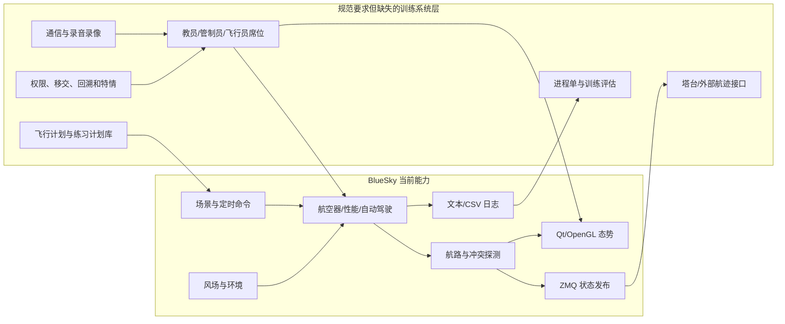
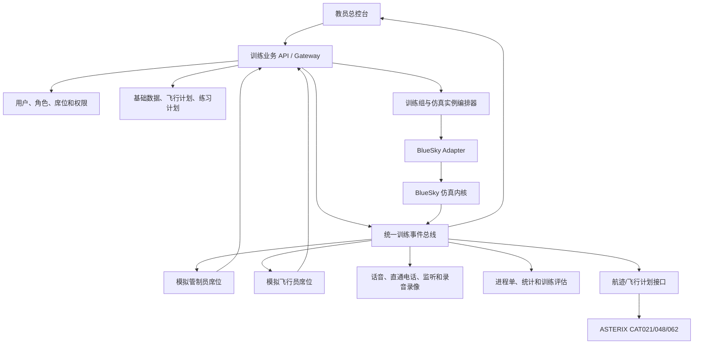

# BlueSky 与《程序管制模拟机需求技术规范》第 2 节差异分析

> 文档状态：现状审查基线
> 编制日期：2026-08-11
> 规范来源：`wiki/程序管制模拟机需求技术规范.pdf` 第 2 节“系统功能”（PDF 第 6-32 页）
> 被审查项目：TU Delft BlueSky Open Air Traffic Simulator
> 源码基线：Git `428ea3c0c16fd7fb86db8659915bfc0e806d1d0a`
> 本地源码目录：`bluesky-master/`

## 1. 文档目的

本文依据《程序管制模拟机需求技术规范》第 2 节，对当前 BlueSky 源码进行功能符合性检查，回答以下问题：

1. 当前项目已经具备哪些规范功能；
2. 哪些功能只能作为技术基础，尚不能直接用于程序管制训练；
3. 哪些功能完全缺失，需要新增业务模块或外部系统；
4. 哪些现有能力与规范语义不同，不能仅凭命令名称判定为满足；
5. 将 BlueSky 改造为程序管制模拟机时，应采用怎样的目标架构和实施顺序。

本文是源码级差异分析，不是民航设备合格审定结论。正式验收还必须结合规范第 3 节技术指标、项目接口规范、现场硬件配置和可重复的验收测试。

## 2. 审查方法与判定口径

### 2.1 审查材料

- 规范第 2 节全部相关页面，共 27 页；
- 当前 BlueSky Python 源码、插件、网络层、GUI、场景和测试代码；
- 项目已有知识图谱，覆盖 191 个核心文件，仅用作代码定位索引；
- 本地运行环境中的最小烟雾测试；
- 现有中文需求文档仅作为辅助，不作为实现证据。

### 2.2 状态定义

| 状态 | 判定规则 |
|---|---|
| 满足 | 当前源码已有与规范语义基本一致的可运行实现；允许后续做界面封装和验收测试，但不需要新增核心机制 |
| 部分满足 | 已有底层算法、命令、数据或网络基础，但缺少规范要求的业务对象、席位、权限、界面、记录或完整流程 |
| 不满足 | 当前项目没有相应实现，或现有同名概念与规范语义明显不同 |
| 待确认 | 规范或项目需求缺少协议、字段、精度或验收定义，不能做最终结论 |

### 2.3 重要判定原则

1. BlueSky 的 `GROUP` 是航空器集合，不是规范中的训练分组。
2. BlueSky 的多仿真 `node` 是计算实例，不等于带管制员、飞行员、通信和记录隔离的完整训练组。
3. BlueSky 的场景 `.scn` 文件可承载定时命令，但不等于规范中的结构化练习计划库。
4. BlueSky 的 `SAVEIC` 记录命令脚本，不等于同步录音、录像和席位操作记录。
5. BlueSky 的导航频率数据是导航台属性，不等于地空话音通信系统。
6. BlueSky 的一般雷达态势界面不是程序管制员席位，也没有管制权限和移交语义。
7. 带 `*` 的规范条款多为扩展或更高等级能力；是否必须建设应结合规范第 5 节和项目合同确定。

## 3. 审查结论摘要

### 3.1 总体结论

当前 BlueSky 可以作为程序管制模拟机的“飞行活动仿真内核”，但不能直接作为完整程序管制模拟机交付。

现有优势集中在：

- 多航空器三维运动；
- OpenAP、BADA 接口和 Legacy 性能模型；
- 航向、速度、高度、升降率控制；
- 航路、航路点、LNAV、VNAV 和 RTA；
- 空间/高度风场和风对地速、航迹的影响；
- 场景定时命令、暂停、恢复、调速、快进；
- ZeroMQ 多进程仿真节点；
- 冲突、间隔丧失检测和部分统计日志；
- Qt/OpenGL 雷达态势、航迹和航路显示。

主要缺口集中在：

- 机型、空域、飞行计划、练习计划的业务化 CRUD 和合理性校验；
- 管制员、飞行员、教员席位及其权限、移交和通信关系；
- 教员统一控制、特情注入、回溯和从历史时刻恢复训练；
- 完整 SID、STAR、进近、复飞、等待、VOR 径向线和 DME 弧程序模型；
- 飞行进程单；
- 程序管制工作台和模拟飞行员专用界面；
- 地空通信、直通电话、监听、录音和通信故障；
- 音视频同步记录与回放；
- 训练统计、评估报表和登录审计；
- 塔台模拟机接口及 ASTERIX 等外部航迹协议。

### 3.2 一级模块符合性

| 规范模块 | 当前结论 | 说明 |
|---|---|---|
| 2.1 系统功能组成 | 部分满足 | 只有仿真内核、通用 GUI、网络和基础记录；不具备完整五模块产品形态 |
| 2.2 数据准备与分析 | 部分满足 | 有导航数据库、性能数据、场景和日志，但缺少业务化编辑、练习计划、席位记录、统计与进程单 |
| 2.3 系统运行控制 | 部分满足 | 有仿真状态机、多节点和批处理；缺少训练组、席位编组、教员总控、回溯和联合训练接口 |
| 2.4 模拟管制 | 部分满足 | 通用雷达界面可复用，但不是程序管制席位，缺少飞行计划业务界面、权限和移交 |
| 2.5 模拟飞行 | 部分满足 | 航空器操纵能力较强；程序、滑行、偏置、VOR/DME 和飞行员席位功能不完整 |
| 2.6 模拟通信 | 不满足 | 项目没有地空话音、直通电话、监听、录音回放和故障模拟业务模块 |

### 3.3 当前能力边界图

## 4. 当前 BlueSky 实现证据

| 能力 | 主要源码证据 | 结论 |
|---|---|---|
| 仿真生命周期 | `bluesky/simulation/simulation.py:28-250` | `OP/HOLD/RESET/FF/REALTIME/DTMULT/BATCH` 具备 |
| 航空器状态与运动 | `bluesky/traffic/traffic.py:48-506` | 维护经纬度、高度、航向、航迹、TAS、CAS、GS、VS 等向量状态 |
| 自动驾驶控制 | `bluesky/traffic/autopilot.py:306-735` | 支持 ALT、VS、HDG、SPD、LNAV、VNAV |
| 航路/FMS | `bluesky/traffic/route.py:41-1613` | 支持航路点增删、DIRECT、RTA、约束和航路重算 |
| 风场 | `bluesky/traffic/windsim.py:10-67`、`bluesky/traffic/traffic.py:473-505` | 支持二维/三维风场；风改变地速和航迹 |
| 性能模型 | `bluesky/traffic/performance/` | 默认 OpenAP；保留 BADA 和 Legacy 实现 |
| 导航数据库 | `bluesky/navdatabase/navdatabase.py:10-403` | 读取机场、航路点、航路、FIR、跑道入口等数据 |
| 场景调度 | `bluesky/stack/simstack.py:123-340` | `.scn` 时间戳、`SCHEDULE`、`DELAY` 可触发任意命令 |
| 批量交通 | `bluesky/stack/basecmds.py:145-273`、`bluesky/plugins/trafgen.py` | CRE、MCRE、TRAFGEN 和场景批量创建可用 |
| 多仿真实例 | `bluesky/network/server.py:20-214`、`bluesky/network/client.py:74-82` | 服务端可派生多个仿真节点并分发批处理场景 |
| 态势数据发布 | `bluesky/simulation/screenio.py:125-230` | 发布 SIMINFO、ACDATA、ROUTE、TRAILS |
| 雷达显示 | `bluesky/ui/qtgl/gltraffic.py:120-437` | 航空器、标牌、航路、冲突、保护区显示 |
| 图形交互 | `bluesky/ui/radarclick.py:9-187` | 鼠标选择航空器、机场、航路点并构造控制命令 |
| 命令记录 | `bluesky/stack/recorder.py:1-200` | SAVEIC 保存初始状态和带时间戳的命令 |
| 数据日志 | `bluesky/tools/datalog.py:26-225` | 支持周期/事件 CSV 类日志 |
| 冲突统计 | `bluesky/traffic/asas/detection.py:33-242`、`bluesky/plugins/area.py:106-200` | 可记录冲突、LOS、区域进出和飞行统计 |

## 5. 第 2 节条款级差异矩阵

为保证文档可读性，内容和状态完全相同的相邻条款会按连续编号范围合并；第 2 节的条款范围仍全部覆盖，未因合并而从审查范围中删除。

### 5.1 规范 2.1 系统功能组成

| 条款 | 规范要求摘要 | 状态 | 当前实现及差异 |
|---|---|---|---|
| 2.1.1 | 数据准备、空域、机型、训练场景记录分析和评估 | 部分满足 | 有导航/性能数据、场景和日志；没有统一数据准备与训练评估模块 |
| 2.1.2 | 训练分组、进程控制、数据输出和回放 | 部分满足 | 有仿真节点和状态机；没有训练组、席位关系、音视频回放 |
| 2.1.3 | 模拟管制员工作条件、工具和辅助信息 | 部分满足 | 通用雷达 GUI 可复用；没有程序管制席位和管制业务对象 |
| 2.1.4 | 模拟飞行员内部目标接近、操作和指令执行 | 部分满足 | 自动驾驶和命令接口较强；没有模拟飞行员专用席位与权限 |
| 2.1.5 | 地空通信、平面通信和通信管控 | 不满足 | 源码无业务话音通信系统 |

### 5.2 规范 2.2 数据准备与分析模块

#### 5.2.1 机型与基础数据（2.2.1）

| 条款 | 状态 | 代码证据 | 差异说明 |
|---|---|---|---|
| 2.2.1.1 机型数据创建、复制、修改、删除及合理性检查 | 不满足 | `bluesky/traffic/performance/` | 性能数据由 OpenAP/BADA/Legacy 文件和库加载，没有面向用户的 CRUD、版本、审批和合理性检查界面 |
| 2.2.1.2 完整机型性能对象 | 部分满足 | `perfbase.py:20-59`、`openap/coeff.py:22-148`、`bada/perfbada.py` | 有机型、阶段、推力、升限、最小/最大速度、加速度、坡度等；规范要求的所有常用速度、尾流等级、完整升降率族和可编辑映射未形成统一模型 |
| 2.2.1.3 空域数据 CRUD 与校验 | 部分满足 | `areafilter` 形状命令、`navdatabase.py:98-159` | 可在运行期定义/删除区域和自定义航路点；机场、航路、FIR 等主要为只读装载，没有统一 CRUD 和校验工作台 |
| 2.2.1.4 空域、机场、跑道、导航设施、程序、等待、障碍物和地形 | 部分满足 | `navdatabase.py:47-96`、`loadnavdata_txt.py` | 具备机场、跑道入口、航路点、航路、FIR 和海岸线；缺少统一的受控空域属性、完整仪表程序库、等待/复飞业务模型、障碍物和可管理地形对象 |
| 2.2.1.5 图形化空域编辑及操作记录 | 部分满足 | `ui/qtgl/glpoly.py`、`ui/radarclick.py` | 可通过命令和图形绘制区域；没有完整地图编辑器、编辑事务、版本历史、校验结果和操作审计 |

#### 5.2.2 飞行计划（2.2.2）

| 条款 | 状态 | 当前实现及差异 |
|---|---|---|
| 2.2.2.1 飞行计划 CRUD 和合理性检查 | 部分满足 | 每架航空器有 `Route`，可增加、删除、直飞和清空；没有独立飞行计划库、复制、版本和业务校验 |
| 2.2.2.2 飞行计划完整字段 | 部分满足 | 有呼号、机型、起降机场、航路点、高度/速度约束、RTA；缺备降、计划类别、完整计划时刻、尾流、续航、报告状态等统一数据模型 |
| 2.2.2.3 本场 VFR/IFR 类别 | 不满足 | 可手工写场景，但没有 VFR/IFR 训练类别和相应规则 |
| 2.2.2.4 起飞/着陆类别 | 不满足 | 有起降点和交通生成逻辑，但没有可配置的飞行计划类别 |
| 2.2.2.5 终端区飞越类别 | 不满足 | 可创建飞越航迹，不存在业务分类和校验 |
| 2.2.2.6 训练开始时已在空中的进离场航空器 | 部分满足 | `CRE` 可在任意位置、高度和时间创建航空器；没有“进场/离场且已在空中”的计划类别 |
| 2.2.2.7 指定点或时间加入程序 | 部分满足 | `SCHEDULE/DELAY/AT/ATDIST/ATALT/ATSPD` 可触发命令；缺少结构化程序加入对象和教员配置界面 |
| 2.2.2.8 航路飞行类别 | 部分满足 | 航路/FMS 能执行航路飞行；没有规范所指的各种计划类别配置 |
| 2.2.2.9 航路飞行进入终端区条件 | 部分满足 | 可结合区域、条件命令和场景脚本实现；没有产品化条件模型 |
| 2.2.2.10 到达指定点时刻误差超标训练 | 部分满足 | 有 RTA 和速度引导，可人工构造误差场景；没有专用误差生成、阈值和评估功能 |
| 2.2.2.11 Excel 等格式导入导出和校验 | 不满足 | `Importer` 提供扩展基类，但当前没有 Excel 飞行计划导入器和导出器 |

#### 5.2.3 气象信息（2.2.3）

| 条款 | 状态 | 当前实现及差异 |
|---|---|---|
| 2.2.3.1 气象数据 CRUD 和校验 | 部分满足 | `WIND` 可增删风场点，ECMWF/GFS 插件可加载风场；没有气象数据集 CRUD、版本和合理性校验 |
| 2.2.3.2 机场静态气象 | 部分满足 | 有标准大气、风向风速和仿真时间；没有机场温度、露点、湿度、QNH/QFE、云、能见度、RVR 和重要天气的完整业务模型 |
| 2.2.3.3 动态风与重要天气区域 | 部分满足 | 支持位置和高度相关风、数值风场及颠簸；没有具备边界、上下限、移动方向和速度的完整危险天气对象 |

#### 5.2.4 练习计划（2.2.4）

| 条款 | 状态 | 当前实现及差异 |
|---|---|---|
| 2.2.4.1 练习计划 CRUD 和校验 | 部分满足 | `.scn` 场景可保存、加载和复制文件；没有结构化练习计划库、校验、版本和删除流程 |
| 2.2.4.2 练习计划名称 | 部分满足 | `SCENARIO` 和场景文件名可表示名称，`SIMINFO` 发布当前场景名；但没有结构化练习计划对象和唯一标识 |
| 2.2.4.3 练习类型、管制员/飞行员席位和数量关系 | 不满足 | 没有席位、人员、角色及对应关系模型 |
| 2.2.4.4 开始时刻、每个计划启动时刻及按线索调用计划 | 部分满足 | `.scn` 时间戳、`SCHEDULE`、UTC/DATE/TIME 可设定启动时刻；缺少按航路、导航台、目的地或程序检索并从飞行计划窗口调用的能力 |
| 2.2.4.5 自动/手动及开始时已在空中等控制属性 | 部分满足 | 时间脚本和人工命令可组合实现，但没有显式控制属性和状态机 |
| 2.2.4.6 限制空域状态 | 部分满足 | 可定义和删除区域/地理围栏；没有受控空域状态、有效期、审批和席位同步语义 |
| 2.2.4.7 使用跑道 | 部分满足 | 导航数据包含跑道入口，TRAFGEN 可按跑道生成；练习计划没有“当前使用跑道”业务字段 |
| 2.2.4.8 教员在线增删改飞行计划 | 部分满足 | 任意客户端可执行 `CRE/DEL/ADDWPT/DELRTE`；没有教员身份、权限、审计和飞行计划业务表单 |
| 2.2.4.9 按时间、数量、尾流、流量和类别自动生成 | 部分满足 | `MCRE`、`TRAFGEN`、Synthetic 插件能批量/概率生成；不能按规范全部参数生成结构化练习计划 |
| 2.2.4.10 同一练习不得重复调用同一飞行计划 | 不满足 | 无飞行计划库和引用约束 |
| 2.2.4.11 局部修改仅作用于当前练习或另存新计划 | 不满足 | 场景文件可人工另存，但没有产品化继承和局部覆盖机制 |
| 2.2.4.12 Excel 导入导出练习计划 | 不满足 | 无现成实现 |
| 2.2.4.13 完成编辑后预演、调速且可下达指令 | 部分满足 | 可加载场景、快进、调速和下达命令；没有独立“预演”状态及与正式训练的数据隔离 |
| 2.2.4.14 编辑过程中预演 | 不满足 | 没有练习计划编辑器和编辑态预演 |
| 2.2.4.15 从选定时间数据生成新练习 | 不满足 | `SAVEIC` 可保存当前初始状态，但不能恢复完整席位、通信、脚本和外部状态，也没有选时生成工作流 |
| 2.2.4.16 修改天气并设置时间变化 | 部分满足 | 可把 `WIND` 等命令放入指定场景时间；只覆盖部分气象要素 |
| 2.2.4.17 预制/在线练习脚本并提示飞行员 | 部分满足 | 场景脚本可执行任意命令；没有模拟飞行员席位、脚本弹窗、确认和执行反馈闭环 |

#### 5.2.5 练习信息记录（2.2.5）

| 条款 | 状态 | 当前实现及差异 |
|---|---|---|
| 2.2.5.1 记录时间、席位、人数、航空器、控制、通信和音视频 | 部分满足 | 可记录仿真时间、航空器状态、命令和自定义日志；不记录席位人员、通信和音视频 |
| 2.2.5.2 指定分组并同步记录操作、通信和辅助信息 | 不满足 | 航空器组不等于训练组，且无多媒体同步时间线 |
| 2.2.5.3 管制员/教员登录并关联练习数据 | 不满足 | 无登录、用户、角色和身份审计 |
| 2.2.5.4 教员特权操作记录 | 不满足 | 无教员权限模型，无法区分普通命令与特权操作 |
| 2.2.5.5 语音通信单独记录 | 不满足 | 无语音通信模块 |
| 2.2.5.6 音视频转换、编辑和输出 | 不满足 | 无音视频媒体处理模块 |
| 2.2.5.7 每席位自动保存最近 30 个练习 | 不满足 | 日志按文件输出，没有席位维度的保留策略和自动轮转 |

#### 5.2.6 统计分析（2.2.6）

| 条款 | 状态 | 当前实现及差异 |
|---|---|---|
| 2.2.6.1 练习总时间 | 部分满足 | `simt` 可得总仿真时间；没有训练报告自动汇总 |
| 2.2.6.2 指令发话时刻、时长和时间轴 | 不满足 | 无话音和发话事件 |
| 2.2.6.3 通话次数和频率占用率 | 不满足 | 无通信信道模型 |
| 2.2.6.4 指令操作时刻、时长和时间轴 | 部分满足 | `SAVEIC` 记录命令时刻；不记录操作开始/结束、操作者和持续时间 |
| 2.2.6.5 发话和操作在同一时间轴显示 | 不满足 | 无统一训练事件时间线 |
| 2.2.6.6 高度、到达位置调整及总操作次数 | 部分满足 | 原始命令日志可离线统计；没有按航空器自动生成的规范统计项 |
| 2.2.6.7 小于安全间隔的次数、时长和类型 | 部分满足 | ASAS 保存冲突/LOS 对和累计次数，AREA 可写冲突日志；持续时长、分类和训练报表不完整 |
| 2.2.6.8 表格或文本输出统计数据 | 满足 | Datalog 输出 CSV 类文本，插件也可写统计日志 |
| 2.2.6.9 对登录记录统计分析并加载登录信息 | 部分满足 | 有通用指标插件，无登录信息和规范化训练评估报告 |

#### 5.2.7 进程单打印（2.2.7）

| 条款 | 状态 | 差异说明 |
|---|---|---|
| 2.2.7.1 自动生成符合要求的飞行进程单 | 不满足 | 无进程单数据模型、版式和生成服务 |
| 2.2.7.2 单独和批量打印 | 不满足 | 无打印模块 |
| 2.2.7.3 动态打印 | 不满足 | 无飞行计划状态驱动的动态打印触发机制 |

### 5.3 规范 2.3 系统运行控制模块

#### 5.3.1 分组管理（2.3.1）

| 条款 | 状态 | 当前实现及差异 |
|---|---|---|
| 2.3.1.1 管制员与飞行员席位灵活对应 | 不满足 | 无管制员/飞行员席位对象。`TrafficGroups` 仅对航空器做位掩码分组 |
| 2.3.1.2 自动建立飞行计划与飞行员关系 | 不满足 | 无飞行员席位和计划分配器 |
| 2.3.1.3 手工建立飞行计划与飞行员关系 | 不满足 | 无席位分配界面和权限 |
| 2.3.1.4 多管制席位移交关系 | 不满足 | 网络客户端没有航空器管制权、接收/移交状态机 |
| 2.3.1.5 按分组自动分配通信频率 | 不满足 | 无训练组通信频率和信道资源调度 |

补充说明：`bluesky/traffic/trafficgroups.py:14-88` 最多支持 64 个航空器组，但这些组只用于批量选择、颜色和区域操作，不能视为最多 64 个训练组。

#### 5.3.2 运行状态显示（2.3.2）

| 条款 | 状态 | 当前实现及差异 |
|---|---|---|
| 2.3.2.1 各终端网络连接状态 | 部分满足 | `Node.nodes`、节点加入/退出信号和服务器节点集合可提供连接基础；没有教员总控终端状态面板 |
| 2.3.2.2 各终端设备和软件运行状态 | 不满足 | 未采集终端进程健康、CPU、内存、设备、音频、踏板等状态 |
| 2.3.2.3 系统和练习计划运行状态 | 部分满足 | `STATECHANGE`、`SIMINFO` 发布仿真状态、时间、航空器数和场景名；无练习计划业务状态和席位状态 |

#### 5.3.3 运行控制（2.3.3）

| 条款 | 状态 | 代码证据或差异 |
|---|---|---|
| 2.3.3.1 全系统设备开关机和重启 | 部分满足 | 仿真进程支持启动、退出和重置；不能控制整套终端硬件和外设 |
| 2.3.3.2 远程开启/关闭终端软件 | 部分满足 | Server 可通过 `subprocess.Popen` 派生仿真节点；没有通用远程进程代理、关闭指定终端和健康确认 |
| 2.3.3.3 飞行间隔条件持久配置 | 部分满足 | ASAS 可配置水平/垂直保护区、预警时间等；配置没有按空域/航路/导航台形成受控持久业务规则 |
| 2.3.3.4 查看练习计划 | 部分满足 | 可打开场景文件、查看场景名和命令；没有结构化练习计划查看器 |
| 2.3.3.5 多组统一或分别加载练习计划 | 部分满足 | BATCH 可向多个节点分发不同场景，客户端可选择活动节点；没有训练组编排、统一加载事务和加载结果面板 |
| 2.3.3.6 监控进度并统一/单独开始、暂停、恢复、调速和结束 | 部分满足 | 每个节点具备相应状态机，消息可定向节点；没有开箱即用的多组总控台和一致性控制 |
| 2.3.3.7 实时查看各组及受训者界面 | 部分满足 | 客户端可以切换活动仿真节点；不能同时镜像多个受训席位桌面或应用界面 |
| 2.3.3.8 向训练席位发送即时文字信息 | 不满足 | `ECHO` 是命令输出，不是带发送者、接收席位、确认和审计的教员消息 |
| 2.3.3.9 练习过程管理与干预 | 部分满足 | 具体 11 项见下表 |

##### 2.3.3.9 干预子项

| 子项 | 状态 | 当前实现及差异 |
|---|---|---|
| (1) 训练开始后增加/减少航班 | 满足 | `CRE/DEL` 可运行期增删航空器 |
| (2) 在线修改呼号和出现时刻 | 部分满足 | 可新增定时命令；没有呼号重命名命令，也没有已排程事件的完整编辑/删除 API |
| (3) 回放之前练习的图像和语音 | 不满足 | 无视频和语音记录 |
| (4) 调节回放速度、开始时刻和跳转 | 不满足 | FF 是实时仿真快进，不是媒体/状态回放时间轴 |
| (5) 回溯到指定时刻并重新开始训练 | 不满足 | RESET/SAVEIC 不能恢复指定时刻的完整系统、席位、通信和插件状态 |
| (6) 在线激活/关闭禁区、危险区、限制区 | 部分满足 | 区域和 geofence 可动态增删；缺空域类型、有效状态和所有席位一致更新机制 |
| (7) 设置特情并弹出执行脚本 | 部分满足 | 可通过定时命令和插件注入事件；无教员配置、飞行员弹窗、确认和执行结果 |
| (8) 语音干扰、断线、失效和恢复 | 不满足 | 无通信系统 |
| (9) 监视、监听并介入任意席位 | 不满足 | 无席位、桌面镜像、话音监听和介入通道 |
| (10) 设置输入指令到执行的延迟 | 不满足 | `DELAY` 是场景命令延后执行，不是按席位设置输入链路延迟 |
| (11) 设置飞行员席位运行和操作条件 | 不满足 | 无席位策略、视频切换权限和参数控制权限模型 |

#### 5.3.4 飞行活动运行仿真（2.3.4）

| 条款 | 状态 | 代码证据或差异 |
|---|---|---|
| 2.3.4.1 按计划和初始参数仿真，处理控制信息，考虑风并实时生成/分发航迹 | 满足 | 场景命令、Traffic、WindSim、ScreenIO 和 ZMQ 共同完成；外部航迹格式仍是项目私有 ACDATA |
| 2.3.4.2 三维模型及上升、下降、直飞、航路、ILS、VOR/DME、等待、进近和复飞 | 部分满足 | 三维运动、升降、DIRECT、Route、LNAV/VNAV/RTA 较完整；ILS 捕获、标准程序、VOR 径向线、DME 弧、等待和复飞缺少正式模型/命令 |
| 2.3.4.3 各机型全面高仿真度，默认参数接近真机 | 部分满足 | OpenAP/BADA/Legacy 提供性能基础；当前环境 BADA 数据未加载，且未按规范逐机型验证最大/最小速度、升降率、坡度和全阶段精度 |
| 2.3.4.4 性能范围内的常规控制不引发异常动力学 | 部分满足 | 性能层会限制速度、高度、升降率和加速度；缺少面向规范的边界、异常和机型一致性验收套件 |
| 2.3.4.5 支持 2.5.3 中全部基本操作 | 部分满足 | 已覆盖主要航向/速度/高度/航路控制，未覆盖全部程序、滑行、偏置、VOR/DME 等操作 |
| 2.3.4.6 兼容 2.5.3 控制指令外的其他操作 | 不满足 | 规范语义较宽，当前没有兼容性协议、指令适配层和扩展操作清单 |
| 2.3.4.7 非常规情况下的航空器性能仿真 | 不满足 | 没有发动机故障、飞控异常、系统降级等统一故障/非正常性能模型 |

#### 5.3.5 练习记录回放（2.3.5）

| 条款 | 状态 | 差异说明 |
|---|---|---|
| 2.3.5.1 音频回放 | 不满足 | 无音频记录 |
| 2.3.5.2 选择指定组记录回放 | 不满足 | 无训练组媒体记录和回放会话 |
| 2.3.5.3 指定时间开始视频回放 | 不满足 | 无视频记录 |
| 2.3.5.4 正常、快进、慢放、暂停、继续和停止 | 不满足 | 仿真时间控制不能替代媒体回放控制 |
| 2.3.5.5 指定时间段和开始时刻回放视频 | 不满足 | 无媒体时间轴 |
| 2.3.5.6 按时间段、序号回放音频 | 不满足 | 无音频索引 |
| 2.3.5.7 音视频同步 | 不满足 | 无统一时间码和同步媒体容器 |

#### 5.3.6 教员超控（2.3.6）

| 条款 | 状态 | 当前实现及差异 |
|---|---|---|
| 2.3.6.1 动态增加外部环境特情 | 部分满足 | 插件、场景命令、风和区域可以注入部分环境变化；没有特情目录、权限和统一恢复 |
| 2.3.6.2 动态增加飞行计划、辅助和通信故障 | 部分满足 | 可修改飞行计划/航路；无辅助系统故障和通信故障体系 |
| 2.3.6.3 动态增加飞行计划并修改单席位/所有席位航空器位置 | 部分满足 | `CRE/MOVE/DEL` 可改变航空器；没有席位范围和分发权限语义 |
| 2.3.6.4 向飞行员发送文字并伴随音视频提示 | 不满足 | 无飞行员消息中心和媒体提示 |
| 2.3.6.5 动态改变风、温度、QNH 等气象 | 部分满足 | 可动态改变风；温度、QNH 及完整机场气象不能按规范动态管理 |
| 2.3.6.6 动态干预限制区、雷雨方向和速度 | 部分满足 | 可增删区域/围栏；没有移动雷雨单体、传播模型和标准化影响计算 |

#### 5.3.7 塔台模拟机训练接口（2.3.7）

| 条款 | 状态 | 差异说明 |
|---|---|---|
| 2.3.7.1 与塔台模拟机互联并开展联合训练 | 不满足 | ZMQ 网络是 BlueSky 内部通信基础，不是塔台联合训练协议 |
| 2.3.7.2 飞行计划、航迹、移交和权限分配接口 | 不满足 | ACDATA 只发布部分航迹状态；无标准飞行计划交换、移交和管制权限模型 |

规范没有在本节指定 CAT021、CAT048 或 CAT062。当前代码也未发现 ASTERIX、FSPEC、UAP、FRN 或三个类别的编码实现。若项目要求这些报文，应单独形成接口需求、版本基线和字段映射。

### 5.4 规范 2.4 模拟管制模块

#### 5.4.1 管制工作环境及态势显示（2.4.1）

| 条款 | 状态 | 当前实现及差异 |
|---|---|---|
| 2.4.1.1 接近实际程序管制环境的控制台和工具 | 部分满足 | QtGL 是通用研究型雷达/命令界面；未按程序管制席位工作流、设备布局和人机工程设计 |
| 2.4.1.2 显示机场、导航台、航路、程序、地形和障碍物 | 部分满足 | 可显示机场、航路点、跑道、海岸线、航路和自定义图形；程序、障碍物、地形和管制业务图层不完整 |
| 2.4.1.3 实时更新飞行活动 | 满足 | `ACDATA` 周期发布，QtGL 实时更新航空器、航迹、速度、高度和冲突 |
| 2.4.1.4 清晰准确的时间信息 | 满足 | `SIMINFO` 发布仿真时间和 UTC；GUI 显示仿真时钟 |
| 2.4.1.5 管制员与飞行员显示时间误差不超过 1 秒 | 部分满足 | 同一仿真节点发布统一时间；没有独立管制员/飞行员席位及跨终端同步误差监测 |

#### 5.4.2 辅助信息（2.4.2）

| 条款 | 状态 | 当前实现及差异 |
|---|---|---|
| 2.4.2.1 飞行计划显示和输出 | 部分满足 | 可显示选中航空器航路、约束并导出 route log；不是完整飞行计划表和标准输出 |
| 2.4.2.2 显示教员手工增删改产生的变化 | 不满足 | 无教员身份、变更事件和席位通知 |
| 2.4.2.3 时分秒及 UTC/本地时间 | 满足 | 支持 UTC、REAL、RUN 和指定时间 |
| 2.4.2.4 年月日 | 满足 | `DATE/TIME` 和 `SIMINFO` 包含日期时间 |
| 2.4.2.5 数字和图形气象显示 | 部分满足 | 可查询风并显示部分图层/数据；无完整机场气象面板和危险天气图形对象 |
| 2.4.2.6 使用跑道、进近方式、灯光和通播代码 | 部分满足 | 有机场和跑道入口数据；没有运行跑道状态、灯光等级、进近方式和 ATIS/通播代码业务模块 |

### 5.5 规范 2.5 模拟飞行模块

规范 2.5 的导语称模块“由五个功能子模块组成”，但正文只编号列出 2.5.1-2.5.4 四个子模块。项目需求基线应记录这一原规范不一致，并在合同/验收阶段明确是否存在遗漏模块。

#### 5.5.1 飞行态势及动态信息（2.5.1）

| 条款 | 状态 | 当前实现及差异 |
|---|---|---|
| 2.5.1.1 跑道、距离、导航台、航路点、等待、航路、程序和空域显示 | 部分满足 | QtGL 支持跑道、机场、航路点、航路、区域、多边形和距离交互；等待、标准程序和空域分类显示不完整 |
| 2.5.1.2 显示元素管理 | 满足 | 支持图层开关、标签级别、平移、缩放、高度过滤、颜色和自定义图形 |
| 2.5.1.3 航空器位置标识和完整标牌 | 部分满足 | 默认标牌显示呼号、高度、升降趋势和速度；缺机型、目的机场、移交状态及规范化告警标志 |
| 2.5.1.4 RVSM、CFL 和自定义标志 | 不满足 | 有 `selalt`，但没有独立 CFL/RVSM 标牌业务字段和用户标志管理 |
| 2.5.1.5 练习信息界面和各类列表 | 部分满足 | 有场景名、仿真信息、航空器列表、命令历史和插件状态；缺训练计划、席位、频率和控制权列表 |
| 2.5.1.6 飞行态势与练习信息界面切换 | 部分满足 | Qt 主窗口有多个停靠窗口/列表；没有规范所述两类训练业务视图 |
| 2.5.1.7 练习信息界面管理 | 部分满足 | 可管理部分窗口和显示项；缺训练业务布局、权限和配置保存 |
| 2.5.1.8 飞行员冻结/解冻训练组 | 不满足 | `HOLD/OP` 控制整个仿真节点；不能由飞行员冻结所属训练组且保持其他组运行 |
| 2.5.1.9 航空器当前动态显示 | 满足 | ACDATA 和 QtGL 周期刷新位置、航迹、高度、速度、升降率和冲突 |
| 2.5.1.10 从基本信息列表激活航空器 | 满足 | 交通列表、雷达点击、`POS` 和 route selection 可选择航空器 |
| 2.5.1.11 预计到达指定点时刻 | 部分满足 | Route/RTA/VNAV 内部计算时间约束；缺通用 ETA 查询和飞行员界面显示 |
| 2.5.1.12 指定时刻可到达高度 | 部分满足 | 可由当前高度/升降率计算，Route 有垂直剖面数据；没有规范化查询命令和性能约束展示 |
| 2.5.1.13 当前马赫数 | 部分满足 | Traffic 维护 `M`，`POS` 可输出 Mach；默认 ACDATA/标牌不发布或显示该字段 |
| 2.5.1.14 续航时间查询和显示 | 不满足 | 性能模型有燃油/推力基础，但没有统一 endurance 字段、查询和显示 |
| 2.5.1.15 在线回放训练音视频 | 不满足 | 无媒体模块 |
| 2.5.1.16 联机帮助 | 满足 | `DOC/HELP` 和 Qt 帮助入口可用 |
| 2.5.1.17 飞行员与管制员时间误差不超过 1 秒 | 部分满足 | 单节点统一仿真时间；无独立席位同步监测和告警 |

#### 5.5.2 飞行计划信息（2.5.2）

| 条款 | 状态 | 当前实现及差异 |
|---|---|---|
| 2.5.2.1 显示本席位控制和非本席位控制计划并分类 | 部分满足 | 可查看所有航空器和所选航路；没有席位控制权和分类 |
| 2.5.2.2 航班号、计划时刻、状态、请求、报告和告警 | 部分满足 | 有呼号、航路、动态状态和冲突；缺计划离到港时刻、请求/报告、飞行计划状态和业务告警 |
| 2.5.2.3 分类排序 | 不满足 | 交通列表是基础列表，没有按规范飞行计划类别和业务字段的排序筛选 |

#### 5.5.3 航空器控制（2.5.3）

| 条款 | 状态 | 代码证据或差异 |
|---|---|---|
| 2.5.3.1 键盘、快捷键和鼠标交互 | 满足 | Qt Console、命令自动完成、历史和 `radarclick.py` 支持键鼠组合操作 |
| 2.5.3.2 目标高度和升降到指定高度 | 满足 | `ALT acid alt [vspd]` 设置 `selalt` 并驱动垂直控制 |
| 2.5.3.3 保持当前高度 | 满足 | 可将 ALT 设为当前高度或使用零升降率，自动驾驶会捕获目标高度 |
| 2.5.3.4 上升/下降率 | 满足 | `VS` 和 `selvs` 可独立控制升降率 |
| 2.5.3.5 升降率与目标高度组合 | 满足 | ALT 命令接受可选垂直速度参数 |
| 2.5.3.6 在指定时间通过指定点 | 满足 | `RTA` 对航路点设置要求到达时间，并通过速度引导实现 |
| 2.5.3.7 在指定时间达到指定高度 | 部分满足 | 可组合 ALT、VS 和场景时间实现；没有单条“指定时刻到高度”约束及不可达判定 |
| 2.5.3.8 按时间和高度组合条件通过点 | 部分满足 | 同一航路点可设置高度约束和 RTA；需要补充联合可达性校验和明确反馈 |
| 2.5.3.9 直飞指定导航台 | 满足 | `DIRECT/DCT` 可直飞航路内导航点；`ADDWPT` 可先加入导航点 |
| 2.5.3.10 SID、STAR、航线、等待和复飞 | 部分满足 | 可用航路点序列模拟航线和部分程序；无标准程序对象、等待管理和复飞状态机 |
| 2.5.3.11 建立 ILS | 不满足 | 有跑道入口和 ILS gate 研究插件，但没有航向道/下滑道捕获及完整 ILS 操作 |
| 2.5.3.12 滑行、起飞、离场时刻和程序 | 部分满足 | 性能模型有地面/起飞阶段，Route 支持 TAKEOFF 航路点；缺机场滑行网络、许可和完整离场程序 |
| 2.5.3.13 调整滑行时间 | 不满足 | 无滑行任务和滑行时间业务模型 |
| 2.5.3.14 点击航路图任意点修改航路并显示到达时间 | 部分满足 | 鼠标点击可生成 ADDWPT/DIRECT 等命令；新增点 ETA 显示不完整 |
| 2.5.3.15 修改为经纬度点、导航台或 VOR/DME 点组成的航路 | 部分满足 | 经纬度、导航点和机场可加入航路；缺正式 VOR/DME 几何点语法和完整操作流程 |
| 2.5.3.16 修改离场计划和离场程序 | 不满足 | 可重写普通航路，但没有离场计划/程序对象及版本 |
| 2.5.3.17 进入和飞出等待 | 部分满足 | 可人工构造闭合航路或脚本；无 HOLD/EXIT HOLD 状态机、入航方式和等待参数 |
| 2.5.3.18 侧向偏置飞行 | 不满足 | 没有 route offset/parallel track 指令和偏置航迹生成 |
| 2.5.3.19 切入/飞出 VOR 径向线和 DME 弧 | 不满足 | 无径向线截获、沿径向线、DME 弧截获及沿弧引导 |
| 2.5.3.20 增加、取消或删除飞行计划 | 部分满足 | 可 CRE/DEL 航空器、DELRTE/DELWPT 航路；没有独立计划取消状态和计划库 |
| 2.5.3.21 瞬时移动航空器 | 满足 | `MOVE acid,lat,lon,[alt,hdg,spd,vspd]` 可直接改状态 |
| 2.5.3.22 经过某点或时刻加入预设程序 | 部分满足 | `AT/ATDIST/SCHEDULE/DELAY` 可触发命令；缺正式程序对象和加入状态反馈 |
| 2.5.3.23 查询系统和航空器状态并执行操作 | 满足 | `POS/LSVAR/HELP`、命令栈和网络状态可查询并继续控制 |

#### 5.5.4 操作设置与辅助提示（2.5.4）

| 条款 | 状态 | 当前实现及差异 |
|---|---|---|
| 2.5.4.1 指令快捷键设置、使用和保存 | 部分满足 | 有命令别名、自动完成和历史；缺用户可配置且持久化的业务快捷键管理 |
| 2.5.4.2 键盘/快捷键/鼠标操作 | 满足 | Qt/Pygame 输入和 RadarClick 已实现 |
| 2.5.4.3 脚踏板通话开关 | 不满足 | 无话音和脚踏板设备接口 |
| 2.5.4.4 公制/英制转换并显示当前制式 | 部分满足 | 命令解析支持 ft、FL、m、kt、Mach 等输入语义；缺席位级制式切换和统一显示 |
| 2.5.4.5 指令执行反馈及错误原因 | 满足 | Command/ArgParser 返回成功、失败、语法和参数错误，并显示到 Console |
| 2.5.4.6 指令提醒及颜色/文本状态 | 不满足 | 没有按直飞、高度、速度、航向等指令维护提醒生命周期和确认状态 |
| 2.5.4.7 已执行控制命令保存和浏览 | 满足 | Console history 和 SAVEIC 可保存、浏览命令；后续仍需关联操作者和席位 |
| 2.5.4.8 席位间航空器权限移交 | 不满足 | 无 ownership、移交请求、接受、释放和冲突仲裁 |
| 2.5.4.9 按特情弹出飞行员脚本 | 部分满足 | 场景命令可触发脚本逻辑；没有飞行员席位弹窗和完成确认 |
| 2.5.4.10 显示教员即时信息 | 不满足 | 无教员消息模型和定向消息界面 |

### 5.6 规范 2.6 模拟通信模块

#### 5.6.1 地空通信（2.6.1）

| 条款 | 状态 | 差异说明 |
|---|---|---|
| 2.6.1.1 任意席位间成对地空通信 | 不满足 | 无管制员/飞行员席位和语音媒体链路 |
| 2.6.1.2 选择地空通信频率 | 不满足 | 导航台频率仅是导航数据，不是可占用话音信道 |
| 2.6.1.3 频率空闲、占用、收发状态 | 不满足 | 无通信信道状态机 |
| 2.6.1.4 管制员手持/脚踏半双工 | 不满足 | 无 PTT 和硬件接入 |
| 2.6.1.5 飞行员脚踏/耳机半双工 | 不满足 | 无 PTT、耳机设备和编解码 |
| 2.6.1.6 扬声器播放选定信道 | 不满足 | 无音频输出路由 |
| 2.6.1.7 音量控制 | 不满足 | 无通信音量和混音器 |
| 2.6.1.8 信道优先级 | 不满足 | 无话音优先级、抢占和混音规则 |
| 2.6.1.9 集成通信控制 | 不满足 | 无通信控制面板 |

#### 5.6.2 直通电话（2.6.2）

2.6.2.1-2.6.2.6 全部不满足。当前项目没有席位直通电话、话筒/耳机、协调单位面板、占用指示或集成直通电话控制。

#### 5.6.3 通话监听（2.6.3）

2.6.3.1-2.6.3.3 全部不满足。当前项目没有任意信道监听、教员/学员双通道和教员优先级。

#### 5.6.4 语音记录与回放（2.6.4）

2.6.4.1-2.6.4.7 全部不满足。当前项目没有多通道语音记录、端口通话统计、条件录音、按时间/序号回放、音频变速、音视频同步和 WAV 导出。

#### 5.6.5 通信故障模拟（2.6.5）

2.6.5.1-2.6.5.2 全部不满足。当前项目没有地空频率干扰、通信系统失效和恢复模型。

## 6. 用户已提出需求与规范的联合检查

| 用户需求 | 对应规范 | 当前结论 | 关键差异 |
|---|---|---|---|
| 根据起降机场、航空公司和出现时间批量生成航空器 | 2.2.2、2.2.4 | 部分满足 | 场景/MCRE/TRAFGEN 可批量和定时生成；缺结构化航班计划导入、航空公司规则、完整机场/航路生成和校验 |
| 控制航向、速度、高度和升降率 | 2.5.3.2-2.5.3.5 | 满足 | 核心控制可用；仍需业务 API、权限、反馈和验收用例 |
| 风导致速度变化 | 2.3.4.1、2.2.3 | 部分满足 | 当前风改变 GS 和 track，保持目标 TAS/CAS；如果需求是风改变空速，需要重新定义物理语义 |
| 爬升到高度、直飞、修改航路 | 2.5.3 | 满足/部分满足 | 基本控制满足；标准程序、VOR/DME、等待、偏置不完整 |
| 修改二次代码 | 2.5.2、外部接口 | 不满足 | Traffic 无持久 squawk/Mode A 业务字段和修改命令 |
| 修改最终选择高度 FSA | 2.5.1.4、外部接口 | 部分满足 | 有 `selalt`，但没有独立 Final Selected Altitude 字段、来源和输出质量标志 |
| 开始、结束、暂停、恢复和快进 | 2.3.3.6 | 满足 | 单节点状态机支持；训练组总控、正常结束归档流程仍缺失 |
| 多组同时仿真 | 2.3.1、2.3.3 | 部分满足 | 多 node 可并行仿真；缺训练组、席位、权限、通信、记录和总控编排 |
| 输出 CAT021/CAT048/CAT062 | 2.3.7 相关但未指定类别 | 不满足 | 无 ASTERIX 编码器；CAT048 还缺雷达传感器/量测模型，CAT062 缺系统航迹融合模型 |

## 7. 建议目标架构

不建议把训练业务、通信、权限和报文编码直接塞入 `Traffic` 或 `Simulation` 类。应保持 BlueSky 为可替换的仿真内核，在其外部增加程序管制训练平台。

### 7.1 建议新增领域对象

| 领域 | 建议核心对象 |
|---|---|
| 用户与权限 | User、Role、Instructor、Controller、Pilot、SessionToken、AuditEvent |
| 席位 | Position、PositionType、PositionAssignment、ControlAuthority、Handover |
| 基础数据 | AircraftTypeProfile、Airspace、Airport、Runway、Navaid、Procedure、HoldingPattern、WeatherDataset |
| 飞行计划 | FlightPlan、RouteSegment、ProcedureAssignment、FlightPlanStatus、SSRCode、SelectedAltitude、FSA |
| 练习计划 | ExercisePlan、ExerciseGroup、ExerciseFlight、ScenarioEvent、SpecialCondition、RunwayConfiguration |
| 仿真实例 | SimulationInstance、SimulationState、ClockControl、Checkpoint、RestorePoint |
| 通信 | Frequency、RadioChannel、DirectLine、PTTSession、MonitorSession、CommunicationFault |
| 记录 | TimelineEvent、CommandEvent、VoiceSegment、VideoSegment、StateSnapshot、PrivilegeEvent |
| 评估 | SeparationEvent、InstructionMetric、CommunicationMetric、AircraftAdjustmentMetric、ExerciseReport |
| 外部接口 | TrackMessage、SensorPlot、SystemTrack、AsterixEdition、DataItemMapping、TransmissionProfile |

### 7.2 BlueSky 内核需要扩展的关键字段

建议通过独立 `Entity/TrafficArrays` 扩展，而不是破坏 `Traffic` 核心数组：

- SSR/Mode A 二次代码；
- SPI、紧急状态和应答机状态；
- CFL、Selected Altitude、Final Selected Altitude 及来源；
- 管制席位和控制权；
- 飞行计划 ID、练习计划 ID、训练组 ID；
- 飞行规则、尾流等级、航班性质；
- 计划离到港时刻、预计时刻和实际时刻；
- 航空器生命周期状态；
- 报告点、飞行员请求和管制指令确认状态；
- ASTERIX 所需的质量、来源、年龄和时间字段。

## 8. 建议实施分期

### 8.1 P0：需求基线与可验收口径

1. 将规范第 2、3、5 节转成需求追踪矩阵；
2. 明确带 `*` 条款的合同范围；
3. 明确程序管制、雷达态势和飞行员界面的目标原型；
4. 明确 CAT021/048/062 版本、数据项、发送周期和网络协议；
5. 明确并发训练组、每组席位、每席位航空器数量；
6. 明确飞行性能和程序仿真的精度验收方法。

### 8.2 P1：仿真能力补齐与稳定接口

1. 建立 BlueSky Adapter，禁止业务前端直接调用全局 `bs.*` 单例；
2. 增加结构化 FlightPlan/ExercisePlan 导入和校验；
3. 增加 squawk、CFL/FSA、计划时间和控制权字段；
4. 建立幂等的航空器创建、修改、删除和命令 API；
5. 补齐标准程序、等待、ILS、VOR 径向线、DME 弧、偏置和滑行能力；
6. 建立仿真快照与可恢复状态边界。

### 8.3 P2：多席位训练平台

1. 用户、角色、登录和权限；
2. 教员、模拟管制员、模拟飞行员席位；
3. 训练组和仿真实例一对一或一对多编排；
4. 飞行计划分配、控制权和移交；
5. 教员统一/单独开始、暂停、恢复、调速和结束；
6. 席位健康、网络状态和应用状态监控。

### 8.4 P3：通信和媒体记录

1. 半双工地空通信和频率占用；
2. 直通电话、监听、教员介入和优先级；
3. PTT、耳机、脚踏板设备适配；
4. 通信故障和干扰；
5. 多通道录音、席位录像和统一时间码；
6. 按训练组、时间段和序号检索回放。

### 8.5 P4：训练业务与评估

1. 飞行进程单生成和打印；
2. 教员脚本、即时消息和特情库；
3. 指令、通话、席位操作和间隔事件统一时间线；
4. 规范 2.2.6 的统计项和训练报告；
5. 练习记录保留、归档、导入和导出。

### 8.6 P5：外部接口与正式验收

1. 塔台模拟机联合训练接口；
2. CAT021 目标报告编码与发送；
3. CAT048 雷达传感器、误差、扫描和量测模型；
4. CAT062 系统航迹生命周期、融合、质量和编码；
5. 协议一致性、回放对比、压力和长稳测试；
6. 依据规范第 3 节完成性能、精度、响应和容量验收。

## 9. 风险与关键技术决策

| 风险 | 影响 | 建议 |
|---|---|---|
| 把 BlueSky 航空器组当成训练组 | 产生权限、记录和控制隔离漏洞 | 训练组必须是独立业务对象，并绑定仿真实例和席位 |
| 前端直接操作 `bs.traf` 数组 | 强耦合、无法远程、多组隔离困难 | 所有业务操作通过 Adapter/API 和命令事件进入内核 |
| 用 SAVEIC 代替正式回放 | 无法恢复媒体、插件、席位和外部接口状态 | 建立事件日志 + 周期快照 + 可重放状态机 |
| 用现有位置直接编码 CAT048 | 把真值误当雷达量测 | CAT048 前必须增加传感器扫描、探测概率、误差和航迹/量测区分 |
| 将 `selalt` 同时映射 SA 和 FSA | 外部报文字段语义错误 | 分离 selected altitude、final selected altitude、来源和有效性 |
| 用导航台频率代替通信频率 | 无法表示占用、PTT、监听和优先级 | 建立独立通信领域和媒体服务 |
| 只做 GUI 不做领域模型 | 页面能演示但无法追踪、回放和验收 | 先定义训练、席位、权限、计划和事件模型，再重构前端 |
| 默认性能模型未经规范验证 | 机型、阶段和极限可能不符合验收 | 建立机型性能基准数据和自动化对比测试 |

## 10. 本地运行验证

### 10.1 已执行烟雾测试

使用项目 `.venv` 在 detached 模式初始化 BlueSky，实测结果：

- 成功创建 A320 航空器；
- 成功设置目标高度 15000 ft；
- 成功设置目标速度 280 kt；
- 成功设置垂直速度 1000 ft/min；
- 成功设置航向 120°；
- 50 kt 顺风下，TAS 保持约 288.71 kt，GS 变为约 338.71 kt；
- `OP`、`HOLD` 和 `fastforward` 状态切换成功；
- 成功设置 EHAM 为起飞机场、EGLL 为目的机场；
- 成功加入两个经纬度航路点并开启 LNAV。

上述验证确认核心控制和风场结论，但不代表完整规范验收。

### 10.2 环境限制与警告

- 项目 `.venv` 未安装 `pytest`，因此本次未执行完整 pytest 回归套件；
- 当前环境成功加载 OpenAP 和 Legacy 性能模型；
- 当前环境未加载 BADA 数据，不能据此宣称 BADA 性能符合规范；
- RTree 扩展未加载，部分区域空间索引功能不可用；
- 编译版地理函数未加载，运行时回退到 Python 实现。

正式开发前应把这些依赖纳入可重复的安装、CI 和验收环境。

## 11. 建议验收策略

每一条规范需求至少应形成以下五类证据：

1. 需求编号和适用模拟机等级；
2. 输入数据、前置状态和操作者角色；
3. 操作步骤或外部接口报文；
4. 可观察输出、状态变化和错误处理；
5. 自动化日志、截图、录音录像或报文抓包。

建议测试分层：

| 层级 | 测试重点 |
|---|---|
| 单元测试 | 性能限制、风矢量、航路几何、程序、报文数据项编码 |
| 内核集成测试 | FlightPlan/ExercisePlan 到 BlueSky 命令和状态的映射 |
| 多实例测试 | 多训练组隔离、时钟控制、节点故障和恢复 |
| 席位端到端测试 | 教员、管制员、飞行员权限、移交和指令闭环 |
| 媒体测试 | PTT、监听、录音、同步、回放和通信故障 |
| 接口一致性测试 | 塔台接口和 ASTERIX 版本/数据项/周期/字节级校验 |
| 性能与长稳测试 | 并发航空器、训练组、终端数量、快进倍速和持续运行 |

## 12. 最终结论

BlueSky 适合作为目标系统的航空器运行仿真和航路控制内核，尤其可以复用：

- Traffic 向量化航空器状态；
- Autopilot 和 Route；
- OpenAP/BADA/Legacy 性能适配框架；
- WindSim 和数值风场插件；
- 场景命令调度；
- 多仿真节点和 ZMQ 状态分发；
- QtGL 态势显示；
- 冲突探测和数据日志。

但若以规范第 2 节为目标，必须在 BlueSky 外部建设完整训练系统层，并对内核补充程序飞行、业务字段、快照恢复和外部航迹接口。当前项目不具备直接按规范交付的条件，也不能通过单纯“重构前端”补齐核心缺口。

建议下一步先完成规范第 3 节和第 5 节的审查，将本文件扩展成完整的“需求追踪矩阵 + 改造任务分解 + 验收用例基线”，再进入架构设计和开发排期。
