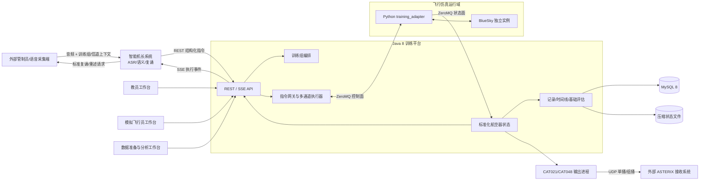
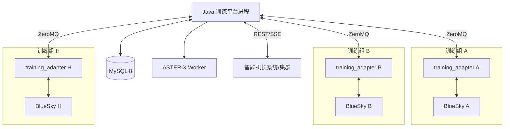
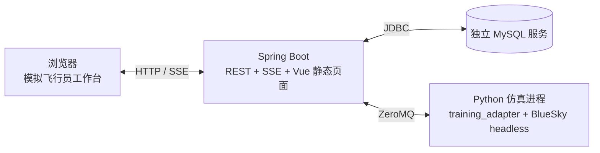
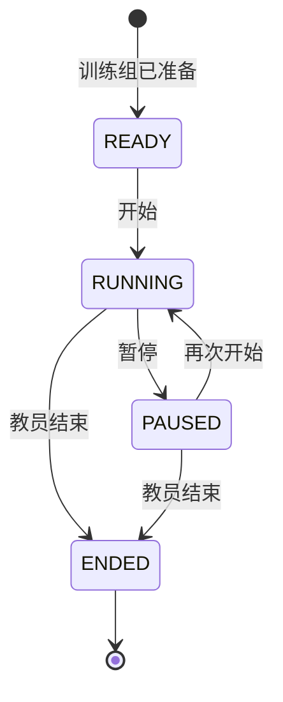
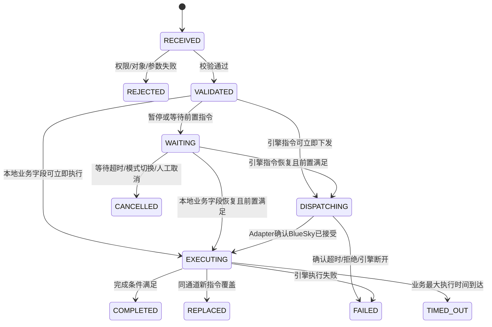
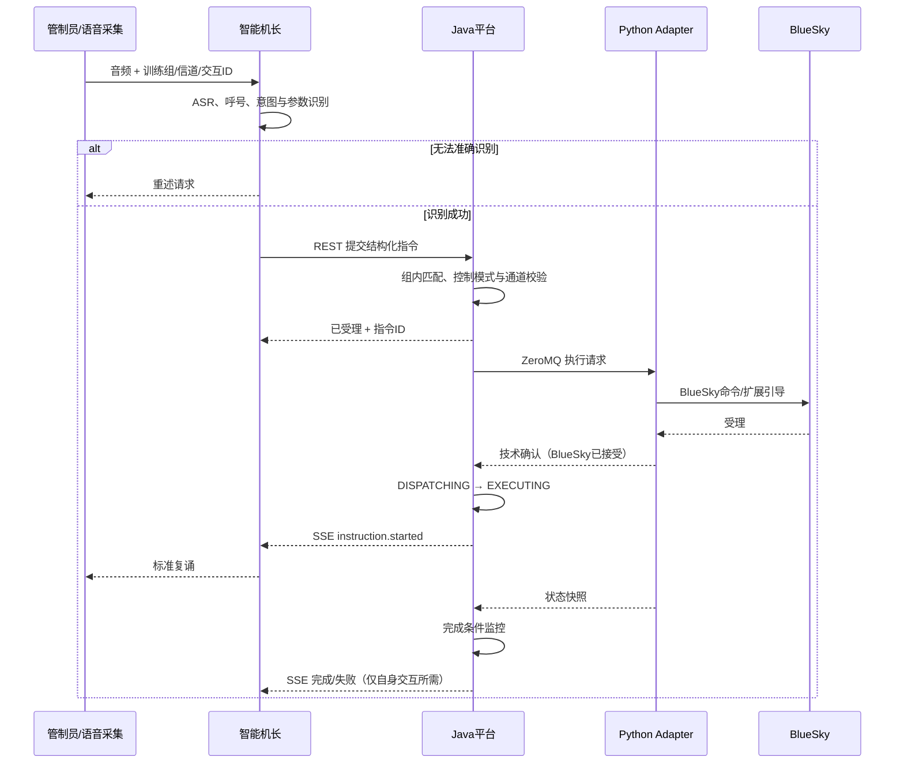
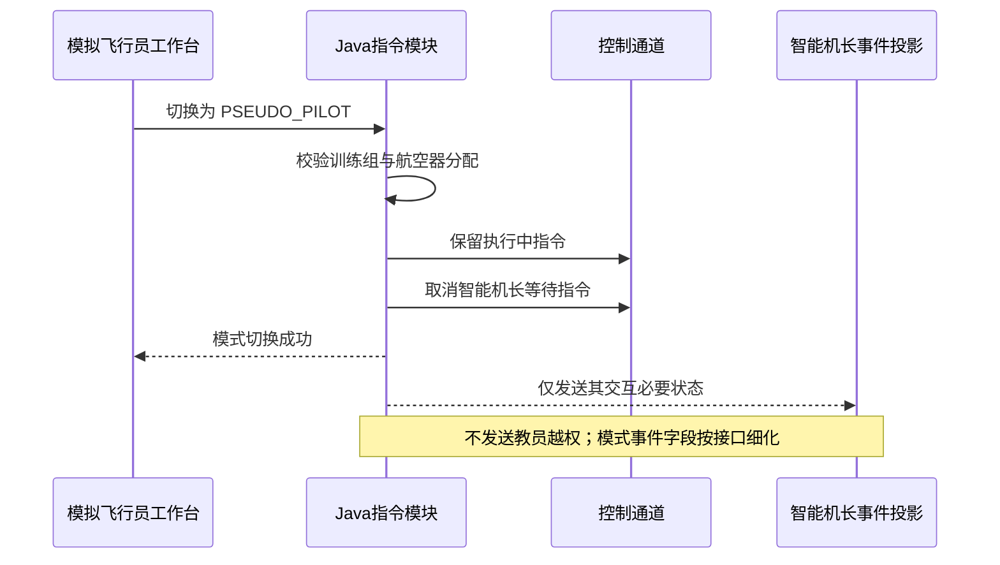
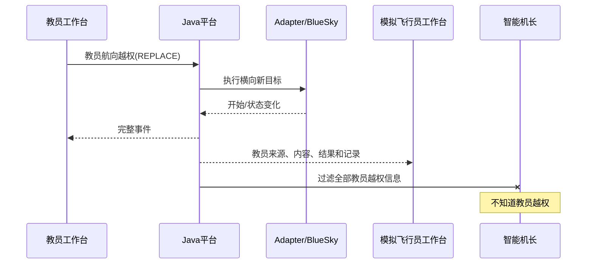
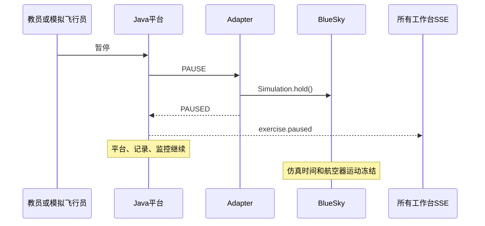
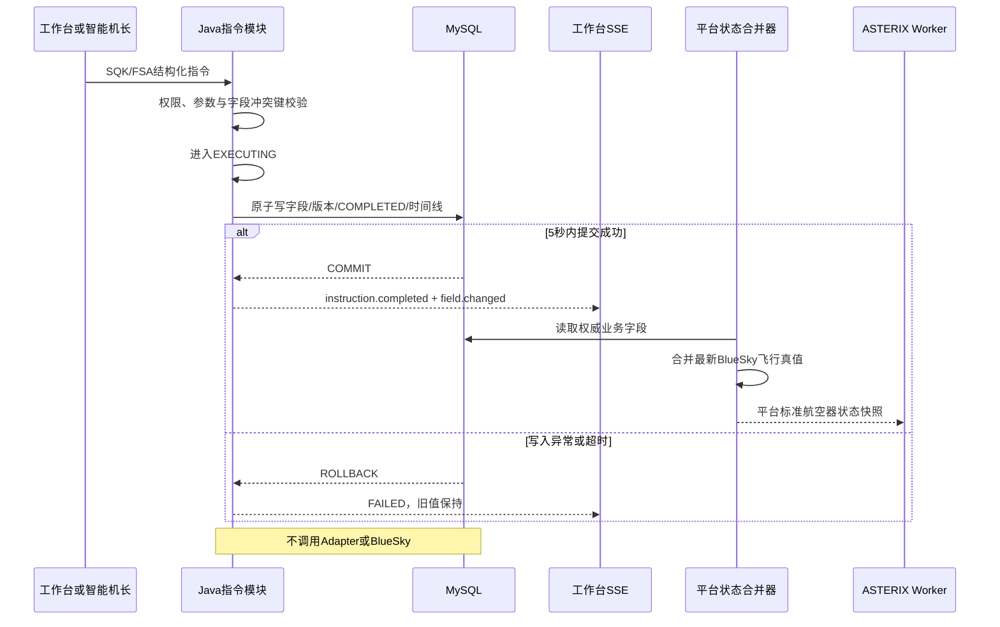

# 程序管制训练飞行仿真平台概要设计

> 文档状态：概要设计基线（待项目评审）
> 编制日期：2026-08-12
> 需求与差异依据：[《程序模拟功能技术规范差异分析》](./程序模拟功能技术规范差异分析.md)
> 规范依据：`wiki/程序管制模拟机需求技术规范.pdf` 第 2 节“系统功能”
> BlueSky 源码基线：Git `428ea3c0c16fd7fb86db8659915bfc0e806d1d0a`
> 领域语言：[CONTEXT.md](../CONTEXT.md)
> 设计对象：以 BlueSky 为飞行仿真引擎的程序管制训练飞行仿真平台

## 1. 文档目的

本文将差异分析结论和业务确认结果转化为可实施的系统概要设计，重点回答：

1. BlueSky 与新增训练平台如何分工；
2. 多训练组、教员、模拟飞行员和智能机长如何协作；
3. 航空器指令如何校验、排队、覆盖、执行和反馈；
4. Java 平台如何通过 Python Adapter 低侵入使用 BlueSky；
5. 教员工作台、模拟飞行员工作台和数据准备工作台承担哪些功能；
6. CAT021、CAT048 如何由 BlueSky 真值生成，CAT062 如何保留扩展边界；
7. 训练记录、统一时间线和基础评估如何组织；
8. 系统如何部署、测试和分阶段实施。

本文是概要设计，不替代后续接口详细设计、数据库物理设计、UI 原型、ASTERIX 接收端 ICD、算法详细设计和验收用例。若本文与差异分析中的“建议方案”冲突，以本文记录的已确认业务决策为准。

## 2. 建设范围

### 2.1 本期建设范围

| 编号 | 模块 | 本期设计范围 |
|---|---|---|
| S-01 | 数据准备与练习计划 | 设计模块边界、运行所需最小对象和逻辑雷达站配置；其余具体 CRUD、Excel 和校验细节暂缓 |
| S-02 | 多训练组编排 | 一训练组一 BlueSky 实例；支持 8 组并行、独立时钟、人员和数据隔离 |
| S-03 | BlueSky Adapter | Python 插件、扩展 Entity、ZeroMQ 协议、命令映射、状态采集和低侵入扩展 |
| S-04 | 智能机长接口 | 多训练组共享的语音识别、指令转换、REST/SSE 交互、执行跟踪、标准复诵、重述请求与异常执行反馈 |
| S-05 | 指令网关与执行器 | 三类指令源、整机常规控制模式、五类并行控制通道、排队/覆盖、完成与失败处理 |
| S-06 | 教员工作台 | 训练组运行控制、航空器与人员管理、教员越权、天气/特情、指令队列、ASTERIX 和评估 |
| S-07 | 模拟飞行员工作台 | 航空器创建/删除、分配航空器控制、控制模式切换、指令输入、态势显示、天气/特情、开始与暂停 |
| S-08 | 记录、时间线与评估 | 训练业务记录、航空器状态抽样、统一时间线、客观指标和异常清单 |
| S-09 | ASTERIX | CAT021 2.7、CAT048 1.32 真值编码与 UDP 输出；CAT062 仅保留扩展接口 |
| S-10 | 飞行扩展能力 | 原子航路变更、ORBIT、HOLD、训练风场和首期飞行特情 |
| S-11 | 前端基础态势 | 教员/模拟飞行员共享态势组件、可配置标牌、航路显示和快捷键基础 |

### 2.2 本期明确范围外

- 模拟管制员工作台；
- 完整地空语音通信系统、PTT、频率占用和音量控制；
- 直通电话、通话监听；
- 语音和屏幕录像、音视频编辑及回放；
- 飞行进程单生成和打印；
- 塔台模拟机联合训练接口；
- 用户登录、账号、密码、Token、SSO 和自然人身份认证；
- CAT062 编码和发送；
- ADS-B 链路、真实雷达扫描/探测/误差、虚警和多传感器航迹融合；
- 温度、气压、云、能见度、降水、雷暴、风切变等完整气象物理模型；
- 极端并发生命周期仲裁、强制终止和复杂故障恢复流程。

智能机长的系统定位、接口和核心反馈规则仍属于本概要设计范围；按当前决定，本轮不再继续追问和细化该模块的未决参数，后续通过专项恢复继续完善。

### 2.3 已搁置事项

- 数据准备与练习计划除本期最小对象外的详细业务设计；
- 练习计划版本发布机制——本项目已明确不采用不可变发布版本模式；
- 训练过程回放、音视频回放；
- 从历史时刻恢复训练、状态快照重建和事件重放；
- 自动评分、权重模型与合格判定；
- 模拟飞行员态势界面的标牌布局、颜色、拖拽、菜单和快捷键编辑细节；
- CAT021/CAT048 最终 ICD、最终 UAP 子集、正式 SAC/SIC、IP 和端口。
- 智能机长 ASR/语义阈值、心跳、负载均衡、SSE 保留窗口等尚未确认的详细参数（本轮讨论暂缓）。

智能机长已经确认的系统定位、统一指令来源、REST 上行/SSE 下行、开始执行时复诵、识别失败重述、执行异常反馈和教员信息不可见规则继续有效。“暂缓”只表示本轮设计访谈先转向其他模块，不表示删除智能机长模块、禁用智能机长控制模式或撤销既有交付边界。

### 2.4 首版单组飞行控制闭环

当前开发先完成一个可运行的纵向切片，不以一次性实现第 2.1 节全部模块为前提。首版包含：

1. 唯一的首版默认训练组绑定一个 BlueSky 进程；
2. 唯一的首版默认模拟飞行员终端自动进入该训练组，模拟飞行员工作台作为唯一业务操作入口；
3. 航空器创建、删除、列表、态势位置和航迹标牌显示；
4. 训练开始、暂停和恢复；首版不提供训练结束操作；
5. `HDG`、`ALT`、`SPD/MACH`、`DCT`、`RTE` 五类核心飞行指令；
6. Java 8/Spring Boot 2.7 通过 Python Adapter 控制 BlueSky，不允许浏览器直连引擎；
7. REST 提交操作、SSE 推送训练状态/航空器状态/指令状态，MySQL 保存首版所需的基础业务数据；
8. 使用已经确认的模拟飞行员初版态势界面作为联调入口；
9. 正式运行采用独立 MySQL 服务、一个装配 Python Adapter 与无界面 BlueSky 的仿真进程、一个 Spring Boot 进程；
10. Vue 构建产物由 Spring Boot 托管，浏览器只访问 Spring Boot；Vite 仅用于前端开发和构建。

首版暂不接入智能机长、教员工作台、多训练组编排、CAT021/CAT048、`ORBIT/HOLD`、天气与故障特情、训练记录和基础评估。这些模块仍属于总体设计范围，待单组闭环稳定后增量加入。首版不是独立发布版本，不建立版本发布流程，也不要求提前解决极端并发、复杂恢复和全部非功能边界。

Spring Boot 每次启动时检查并确保数据库中存在唯一的首版默认训练组和唯一的首版默认模拟飞行员终端，已有记录时直接复用，不重复创建。工作台打开后直接以该终端进入默认训练组；首版不显示训练组列表，也不提供创建、选择、运行期切换训练组或人员/终端分配界面。该终端创建的航空器自动分配给自身并采用模拟飞行员控制模式，可以立即测试指令。总体设计中的多训练组、多人终端和动态分配对象及接口边界继续保留，后续扩展不以首版界面限制为准。

首版每次 Spring Boot 启动均执行启动重置：复用默认训练组和默认终端本身，清除该训练组上一次测试产生的航空器、待出现航空器、航空器分配、指令、队列及其他运行态，并把训练组状态与仿真时间恢复到初始 `READY`。Flyway 迁移历史和系统参数不清除，BlueSky 自带导航与性能资源也不修改。重置完成前工作台不可进入；首版不尝试从数据库、事件或 BlueSky 快照恢复上次未完成的测试。

首版的核心用途是通过正式模拟飞行员业务链路反复验证 BlueSky 的航空器创建、训练运行控制、飞行指令执行和状态回传。工作台后续仍作为其他指令接入时的联调入口，但首版验收范围保持为 `HDG`、`ALT`、`SPD/MACH`、`DCT`、`RTE`，不要求一次实现概要设计中的全部指令。

首版直接使用 BlueSky 自带的导航资源和当前启用的性能模型作为临时基础数据源。Adapter 只读包装机场、导航点、航路段、可用机型及性能范围的查询和校验能力，Java 和前端不得直接读取 BlueSky 资源文件。当前仓库默认性能模型为 OpenAP；Adapter 每次连接时报告实际模型名称，并以实际模型为准。首版不建设基础数据导入维护，也不把全量导航和机型性能数据复制进 MySQL；业务记录只保存实际选中对象的代码、稳定引用和必要坐标快照。后续数据准备模块接管基础数据时，应保持工作台业务接口不变。

首版最小成功标准是：启动系统后，操作者能够在模拟飞行员工作台创建航空器、开始训练、观察航空器状态持续更新、下达上述核心指令并看到 BlueSky 实际状态变化，随后能够暂停、恢复并删除航空器。训练结束是教员专有能力，待教员工作台阶段实现。

## 3. 总体设计原则与关键决策

### 3.1 设计原则

1. **BlueSky 只做飞行仿真引擎**：训练业务不得进入 `Traffic`、`Simulation` 等内核对象。
2. **低侵入、可替换**：优先使用插件、`Entity/TrafficArrays` 和 Adapter；核心源码修改逐项审批。
3. **平台拥有业务状态**：训练组、控制模式、指令状态、席位分配、记录和评估由 Java 平台负责。
4. **引擎拥有飞行真值**：航空器位置、姿态、速度、高度、航迹和风作用结果以 BlueSky 为准。
5. **接口隔离内部实现**：前端、智能机长和 ASTERIX 不依赖 BlueSky 命令字符串或内部数组。
6. **一训练组一实例**：训练组不映射为 BlueSky `Traffic Group`，也不共享仿真时钟。
7. **业务指令统一建模**：智能机长、模拟飞行员、教员均经过指令网关。
8. **先保证业务闭环**：不在本期引入完整微服务、真实监视传感器或复杂回放体系。
9. **首版可运行优先**：只细化会阻塞编码、模块接口、联调和验收主流程的规则；非关键边界先采用简单默认值，运行验证后再迭代。

### 3.2 架构决策索引

| 决策 | 结论 | 记录 |
|---|---|---|
| BlueSky 定位 | 低侵入、可替换的飞行仿真引擎 | [ADR-0001](./adr/0001-bluesky-as-isolated-flight-simulation-engine.md) |
| 模拟管制员席位 | 不建设 | [ADR-0002](./adr/0002-exclude-simulated-controller-workstation.md) |
| 指令入口 | 三类来源统一经过指令网关 | [ADR-0003](./adr/0003-unified-aircraft-instruction-gateway.md) |
| 常规控制 | 智能机长/模拟飞行员整机互斥，教员可越权 | [ADR-0009](./adr/0009-visible-instructor-override-and-pilot-group-control.md) |
| 指令执行 | 独立控制通道并行，同通道等待或覆盖 | [ADR-0005](./adr/0005-independent-aircraft-control-channels.md) |
| 多训练组 | 每组独立 BlueSky 实例和时钟 | [ADR-0006](./adr/0006-one-bluesky-instance-per-exercise-group.md) |
| ASTERIX | BlueSky 真值直接编码 CAT021/CAT048，CAT062 留接口 | [ADR-0007](./adr/0007-direct-bluesky-truth-to-cat021-and-cat048.md) |
| 智能机长接口 | REST 上行、SSE 下行 | [ADR-0008](./adr/0008-sse-and-rest-for-intelligent-captain-interface.md) |
| 平台形态 | 模块化单体业务后端 + 独立运行组件 | [ADR-0010](./adr/0010-modular-monolith-with-independent-runtime-components.md) |
| 技术栈 | Java 8/Spring Boot 2.7 + Python Adapter + Vue 3 | [ADR-0011](./adr/0011-java8-spring-boot-platform-with-python-adapter.md) |
| Java/Python 协议 | ZeroMQ + 平台版本化协议 | [ADR-0012](./adr/0012-versioned-zeromq-adapter-protocol.md) |
| 访问边界 | 无登录，依赖固定席位入口和隔离网络 | [ADR-0013](./adr/0013-no-login-with-network-and-workstation-boundaries.md) |

原 [ADR-0004](./adr/0004-exclusive-normal-control-with-silent-instructor-override.md) 中“教员越权对模拟飞行员不可见”的决定已由 ADR-0009 替代；整机常规控制互斥等未冲突规则由 ADR-0009 继承。

## 4. 系统上下文



### 4.1 系统边界说明

- 外部管制员不是本系统席位，其语音由外部采集端送入智能机长。
- 智能机长是共享语音代理，不绑定某一个固定训练组或航空器。
- 教员、模拟飞行员、数据准备与分析采用三个独立前端入口。
- Java 平台负责业务一致性，Python Adapter 负责 BlueSky 语义转换。
- ASTERIX 进程消费标准状态快照，发送失败不得阻塞 BlueSky 仿真推进。

## 5. 技术与部署架构

### 5.1 技术基线

| 层次 | 技术基线 | 说明 |
|---|---|---|
| Java 业务平台 | Java 8、Spring Boot 2.7.x | Java 8 不能使用 Spring Boot 3；依赖必须锁定并持续扫描漏洞 |
| 工程与模块边界 | 单 Maven/Spring Boot 工程、严格包结构、应用接口、领域事件、ArchUnit | 首版不拆 Maven 子模块；后续只有在规模确有需要时再拆分 |
| 数据库 | MySQL 8 | 保存业务元数据、指令、时间线索引和评估结果 |
| 数据访问 | MyBatis | 显式 SQL 和 Mapper 访问 MySQL；不引入 JPA/Hibernate 自动建表 |
| 数据库迁移 | Flyway | Spring Boot 启动时自动校验并执行随源码管理的迁移脚本，首次启动可从空库创建首版结构 |
| Python 适配器 | 与 BlueSky 相同的 Python 3.10+ 环境 | 当前本地验证环境为 Python 3.12 |
| Java/Python 通信 | ZeroMQ + 版本化 UTF-8 JSON | 首版正式格式便于日志与联调；编解码接口隔离，性能有证据时再评审 MessagePack |
| 前端 | Vue 3、TypeScript、Vite、Pinia | 三个独立入口，共享组件库；Vite 用于开发/构建，正式静态页面由 Spring Boot 托管 |
| 态势图 | OpenLayers | 完全离线绘制本地业务图层，不复用 BlueSky Qt，不依赖在线地图服务 |
| 外部接口 | REST、SSE、UDP ASTERIX | OpenAPI 描述 REST；SSE 事件另建事件目录 |

### 5.2 首版工程与包结构

```text
training-platform/
├─ pom.xml                         # 单个 Maven/Spring Boot 构建
├─ src/main/java/.../
│  ├─ bootstrap                    # Spring Boot 启动与装配
│  ├─ common                       # ID、时间、单位、错误码、事件信封
│  ├─ workstation                 # 工作台 REST 与 SSE
│  ├─ exercise                    # 默认训练组、终端和运行状态
│  ├─ aircraft                    # 航空器创建、删除和状态投影
│  ├─ instruction                 # 指令解析、校验、调度和状态
│  ├─ simulation                  # ZeroMQ 端口和 Adapter 契约
│  └─ persistence                 # MyBatis Mapper 与仓储实现
├─ src/main/resources/
│  ├─ db/migration                # Flyway 脚本
│  └─ application.yml             # 平台配置
└─ frontend/                      # Vue 3 + TypeScript + Vite 源码

bluesky/plugins/training_adapter/ # Python Adapter 插件
```

首版只有一个 Maven 构件和一个 Spring Boot 进程。Java 业务边界先通过顶层包、公开应用接口和 ArchUnit 测试约束；模块间不得跨包直接访问内部 Mapper 或实现类。随着后续教员、智能机长、多训练组和 ASTERIX 能力加入，只有在代码规模或独立部署确有需要时才拆分 Maven 子模块，不把拆分作为首版前置工作。

`frontend` 保持独立源码与开发流程。统一构建先执行前端依赖安装和 Vue 生产构建，再把 `frontend/dist` 内容复制到 Spring Boot 最终打包产物的静态资源目录；`dist` 是生成物，不作为手工维护源码。正式启动只运行 Spring Boot，不运行 Vite 开发服务器。

### 5.3 运行部署



初期允许在一台受控主机上多进程部署；每组必须具有独立进程标识、工作目录、输出目录、ZeroMQ 实例 ID 和仿真时钟。组件边界应允许未来迁移到多主机或容器，迁移时不改变工作台和智能机长业务协议。

#### 5.3.1 首版正式运行拓扑

首版为尽快跑通单训练组闭环，正式运行固定为三个服务部分：



- Python 侧首版只运行一个仿真进程，由 `training_adapter` 装配和管理无界面 BlueSky，不启动 BlueSky Qt 界面；
- Spring Boot 是浏览器的唯一服务入口，同时提供 REST、SSE 和已经构建完成的 Vue 静态资源；
- 浏览器不得直连 Python、BlueSky 或 MySQL；
- Vite 开发服务器只在前端开发时单独使用，不属于正式运行和一键启动流程；
- 一键启动脚本按“检查 MySQL 可用性 → 启动 Python 仿真进程 → 启动 Spring Boot 并等待 Flyway 迁移、首版启动重置及健康检查通过 → 打开工作台页面”的顺序执行；任一必需服务未就绪时，应明确报告失败，不把仅启动部分进程视为成功；脚本不安装、启动、停止或升级 MySQL 服务。

该拓扑只固定首版的最小运行关系，不提前设计多主机调度、容器编排、服务高可用或自动故障恢复。

## 6. 核心领域模型

### 6.1 核心对象

| 领域 | 对象 | 关键职责/字段 |
|---|---|---|
| 训练 | `ExercisePlan` | 练习基础配置；不采用发布版本模式，详细 CRUD 暂缓 |
| 训练 | `ExerciseGroup` | 组 ID、状态、仿真时间、绑定教员终端、飞行员终端集合 |
| 仿真 | `SimulationInstance` | 实例 ID、进程、端点、工作目录、健康状态、绑定训练组 |
| 航空器 | `ExerciseAircraft` | 平台 ID、呼号、机型、计划、控制模式、BlueSky 关联 ID |
| 分配 | `PseudoPilotAssignment` | 训练组、航空器、模拟飞行员终端、起止时间 |
| 指令 | `AircraftInstruction` | 来源、目标、类型、通道、调度方式、参数、状态和时间 |
| 指令 | `InstructionBatch` | 批次 ID、请求幂等键、规范化载荷摘要和逐航空器子指令引用；自身不可执行 |
| 指令 | `InstructionTransition` | 指令状态变化、原因、系统时间、仿真时间 |
| 指令 | `ControlChannelState` | 每架航空器每通道当前指令、等待队列和暂停原因 |
| 航路 | `RouteAmendment` | 修改前后差异、校验结果、原子激活状态 |
| 特情 | `FlightAbnormalCondition` | 类型、对象范围、参数、开始/解除条件和状态 |
| 天气 | `WindField` | 全局或三维风点、有效范围和训练组 |
| 语音 | `VoiceInteraction` | 交互 ID、路由上下文、识别文本、指令 ID、复诵/重述 |
| 记录 | `TimelineEvent` | 事件类型、来源、对象、系统时间、仿真时间、载荷 |
| 评估 | `EvaluationSummary` | 指标名、统计值、范围、计算时间和异常引用 |
| 监视 | `LogicalRadarSite` | 经纬度、高度、SAC/SIC、最大输出范围 |
| 监视 | `AsterixChannel` | Category、Edition、端点、周期、UAP 配置和启停状态 |
| 终端 | `WorkstationConfig` | 固定席位类型、终端 ID、平台地址和训练组选择范围 |

### 6.2 关键关系与基数

- 一个运行中的 `ExerciseGroup` 绑定且只绑定一个 `SimulationInstance`；
- 一个 `SimulationInstance` 只承载一个训练组；
- 首版只启用一个由平台启动时确保存在的默认 `ExerciseGroup` 和一个默认 `Pseudo-Pilot Terminal`；工作台以该终端直接进入该组，新建航空器自动分配给该终端；训练组创建、选择、切换及人员/终端分配管理延后到多训练组阶段；
- 一个训练组同一时刻绑定一名教员终端，不存在辅助教员；
- 一个训练组可以包含多名模拟飞行员；
- 一名模拟飞行员同一时刻只能进入一个训练组，可以负责该组多架航空器；
- 一架航空器同一时刻最多分配给一名模拟飞行员；
- 人员分配与航空器常规控制模式相互独立；
- 航空器默认是模拟飞行员控制，练习计划可以指定为智能机长控制；
- 航空器处于模拟飞行员控制但无人分配时照常创建并告警，不自动切换控制模式。
- 一次多选批量提交创建一个 `InstructionBatch`，并为每架目标航空器创建一条独立 `AircraftInstruction`；批次只负责归组、幂等和汇总受理结果，不占用控制通道，也不参与执行状态机；
- 批量子指令逐架独立校验和执行，允许部分成功且不跨航空器回滚。

### 6.3 标识、时间和单位

- 训练组、实例、航空器、指令、语音交互和时间线事件使用全局唯一 ID；
- 呼号提交时统一标准化为大写，并在同一训练组内保持唯一；唯一性范围同时覆盖活动航空器和待出现航空器，智能机长禁止跨训练组仅凭呼号检索；
- ICAO24 使用系统参数配置的实验网络专用地址池自动分配，在全部并行训练组的活动航空器和待出现航空器之间全局唯一；
- 每个事件同时保存系统 UTC 时间和训练组仿真时间；
- API 数值字段必须带单位后缀，例如 `altitudeFt`、`speedKt`、`verticalRateFpm`、`headingDeg`；
- Adapter 在协议边界统一转换为 BlueSky 内部 SI 单位，禁止依赖隐式单位。

## 7. 多训练组与运行控制

### 7.1 训练组状态

本期使用简单状态：



操作范围：

| 操作 | 教员 | 模拟飞行员 | 语义 |
|---|---:|---:|---|
| 开始/继续 | 是 | 是 | `READY/PAUSED → RUNNING` |
| 暂停 | 是 | 是 | 冻结仿真时钟和航空器运动 |
| 结束 | 是 | 否 | 停止训练并保存已有训练记录 |

本期不区分正常结束与强制终止，不设计复杂并发抢占。单组开始、暂停或结束不影响其他训练组。BlueSky 内核虽然具有快进和倍速基础能力，但按最新业务范围，本期三个工作台均不提供快进或倍速操作。

### 7.2 暂停语义

- BlueSky 仿真时间和航空器运动冻结；
- Java 平台、REST/SSE、工作台、记录和健康监控继续工作；
- 暂停期间收到的新指令记为“等待训练恢复”，不下发 Adapter；
- 恢复后按照指令所属控制通道的正常规则处理；
- 暂停期间单独提交 Squawk、FSA 等业务字段修改不作为本期业务设计与验收场景，不为其增加即时执行例外；
- 智能机长在暂停期间不得正常复诵控制指令，应反馈“当前训练暂停”；
- CAT021/CAT048 暂停周期发送，恢复后不补发暂停期间轨迹。

### 7.3 编排器职责

1. 为训练组分配实例 ID、工作目录和 ZeroMQ 端点；
2. 启动 `BlueSky.py --headless` 或等价仿真实例并加载 `training_adapter`；
3. 完成协议握手，核对训练组 ID、实例 ID 和协议版本；
4. 装载练习航空器、风场和必要配置；
5. 监控 Adapter 心跳和实例进程状态；
6. 将开始、暂停、结束转换为 BlueSky 生命周期操作；
7. 结束后释放进程与端口，保留训练记录。

本期不建设从崩溃快照自动恢复训练；实例异常时标记组异常并告警。

## 8. 指令网关与多通道执行器

### 8.1 指令来源

| 来源 | 入口 | 常规权限 |
|---|---|---|
| 智能机长系统 | REST | 仅航空器处于智能机长控制模式时接受 |
| 模拟飞行员 | 工作台 REST | 仅控制本组、分配给本人且处于模拟飞行员控制的航空器 |
| 教员 | 教员工作台 REST | 可越过常规控制模式直接执行，且不改变常规模式 |

所有来源使用统一 `AircraftInstruction`，任何前端或外部系统不得直接生成 BlueSky 命令字符串。

### 8.2 常规控制模式

每架航空器只有一种常规整机控制模式：

- `PSEUDO_PILOT`：只接受负责该航空器的模拟飞行员常规指令；
- `INTELLIGENT_CAPTAIN`：只接受智能机长常规指令。

默认是 `PSEUDO_PILOT`，练习计划可覆盖。模拟飞行员可以双向切换两种模式。

控制模式切换规则：

1. 切换是整架航空器级操作，不按航向/高度等维度拆分；
2. 切换后拒绝原控制方的新指令；
3. 原控制方已经进入执行中的指令继续；
4. 原控制方仍在等待队列的指令取消，原因是“控制模式已切换”；
5. 新控制方的新指令按对应通道进行覆盖或排队；
6. 新控制方未下达指令时，航空器继续执行切换前已经开始的目标。

### 8.3 教员越权与可见性

- 教员越权不受当前常规控制模式限制；
- 越权不会把常规控制模式切成“教员控制”；
- 越权不形成默认持续锁定，当前常规控制方后续合法指令可以覆盖；
- 模拟飞行员工作台可以查看教员来源、指令内容、执行结果和相关记录；
- 智能机长不能收到任何教员越权事件、来源、内容、标识、记录或因果说明；
- Java 平台必须为模拟飞行员和智能机长生成不同事件投影。

### 8.4 控制通道

| 通道 | 典型指令 | 冲突范围 |
|---|---|---|
| `LATERAL` 横向 | 航向、直飞、航路、ORBIT、HOLD、侧向偏置 | 同一时刻只有一个活动横向目标 |
| `VERTICAL` 垂直 | 目标高度及可选升降率、垂直程序 | `ALT [VS ...]` 作为一条组合指令统一仲裁，不接受独立 VS |
| `SPEED` 速度 | 指示空速或 Mach 目标 | `SPD` 与 `MACH` 互斥，同一时刻只有一个有效速度目标；首期无独立 TAS 指令 |
| `BUSINESS_FIELD` 业务字段 | Squawk、FSA 等 | 按具体字段作为冲突键，可彼此并行 |
| `SPECIAL` 特殊 | 瞬移、删除、冻结、飞行特情 | 指令必须声明影响哪些其他通道 |

不同通道并行执行。例如航空器可以同时转向、爬升和减速；新的速度指令不等待转弯完成。

### 8.5 调度方式

| 调度方式 | 语义 |
|---|---|
| `REPLACE` | 生效时立即终止同一航空器同一冲突键的活动指令、清除该冲突键的全部原待执行指令并开始新指令 |
| `AFTER_COMPLETION` | 等待同通道前置指令完成后再开始 |

默认值：

- 智能机长、模拟飞行员和教员实时指令：`REPLACE`；
- 练习脚本连续动作：`AFTER_COMPLETION`；
- 发送方可以显式覆盖默认值；
- 工作台默认展示“立即执行”，排队需要主动选择“完成后执行”。

`REPLACE` 生效时，被终止的活动指令进入 `REPLACED` 并关联替代它的新指令；同一航空器同一冲突键下原有的全部待执行指令进入 `CANCELLED/QUEUE_CLEARED_BY_REPLACE`，不得在新指令完成后恢复执行。清理范围严格限定在该冲突键：横向覆盖不得清除垂直、速度或业务字段队列，`SQUAWK` 覆盖不得清除独立的 `FSA` 队列，其他航空器也不受影响。该操作不弹出确认框；操作者希望保留原待执行计划时，应使用 `AFTER_COMPLETION`。

平台使用明确的**覆盖生效点**，不得把 REST 受理、业务校验通过或开始下发误认为覆盖已经发生。需要 BlueSky 执行的指令进入 `DISPATCHING` 后，旧活动目标继续生效，旧等待队列也不得因该覆盖请求被提前取消；只有 Adapter 确认 BlueSky 已接受新目标后，平台才在一个状态事务中把新指令转为 `EXECUTING`、把该生效点仍在执行的同冲突键旧指令转为 `REPLACED`，并把同冲突键旧等待指令转为 `CANCELLED/QUEUE_CLEARED_BY_REPLACE`。这些状态变化共同构成一次覆盖提交，工作台不得观察到“旧队列已经清空但新指令仍未获得执行确认”的中间业务状态。

Adapter 明确拒绝、连接断开或技术确认超时时，新覆盖指令进入 `FAILED`，原活动目标和原等待队列不得因该失败请求被终止或清理，原队列也不得因新指令失败而进入失败暂停。`SQK/FSA` 等平台本地业务字段不经过 `DISPATCHING`，以包含字段值、字段版本、新旧指令状态和队列取消状态的 MySQL 事务成功提交作为覆盖生效点；事务异常或超时回滚时，旧字段、旧活动状态和旧等待队列全部保持有效。

每个“航空器 ID + 冲突键”最多允许一条需要 Adapter 执行的指令处于 `DISPATCHING`，该指令在确认窗口内持有**在途下发占位**。占位必须由 `ChannelScheduler` 在进入 `DISPATCHING` 的状态事务中原子取得，并在确认成功、明确拒绝、连接断开或技术确认超时而离开该状态时释放。已有占位时，使用不同幂等键提交的后续指令无论采用 `REPLACE` 还是 `AFTER_COMPLETION`，都直接进入 `REJECTED/CHANNEL_DISPATCH_IN_PROGRESS`：不得发送 Adapter 请求；排队提交也不得进入 `WAITING_FOR_PREDECESSOR`、不得计算等待预算或建立前置依赖；任何已有活动目标和等待队列均保持不变。该规则适用于智能机长、模拟飞行员和教员，不因教员权限而绕过；它只约束同一冲突键，其他独立控制通道仍可并行下发。

同一幂等作用域内使用相同幂等键重试，不视为第二条覆盖指令：平台返回原指令 ID 及其当前受理或执行结果，不新建指令记录、不再次下发 Adapter，也不返回 `CHANNEL_DISPATCH_IN_PROGRESS`。工作台对不同请求导致的占位拒绝只在紧凑指令流水中显示，不弹出额外提示。`SQK/FSA` 不进入 `DISPATCHING`，本条在途下发占位规则不用于推导它们的并发事务行为。

`SQK/FSA` 使用独立的**业务字段事务占位**处理本地并发。每个“航空器 ID + 业务字段冲突键”最多允许一条本地事务正在执行；占位从事务开始至成功提交、失败回滚或事务超时结束时释放。已有占位时，使用不同幂等键提交的同字段 `REPLACE` 或 `AFTER_COMPLETION` 请求进入 `REJECTED/BUSINESS_FIELD_TRANSACTION_IN_PROGRESS`，不得启动第二个事务；排队请求也不得进入 `WAITING_FOR_PREDECESSOR`、计算等待预算或建立前置依赖。事务开始前已经存在的同字段队列不受新请求影响，仍在原事务结束后按覆盖、完成或失败依赖规则处理。

相同幂等键的重试返回原指令 ID 和当前结果，不重复写入字段或返回占位冲突。`SQUAWK` 与 `FSA` 是独立冲突键，分别持有事务占位并可以并行执行；本地业务字段占位不得阻塞横向、垂直、速度等飞行控制通道，也不得阻塞其他航空器。工作台仅在紧凑指令流水中显示不同请求导致的拒绝结果，不弹出额外提示。

所有 `AFTER_COMPLETION` 指令都必须具有最大队列等待时间。只有指令进入 `WAITING_FOR_PREDECESSOR` 后才累计等待时间，使用训练组仿真时间；`WAITING_FOR_RESUME` 不累计，已经处于前置等待时遇到训练暂停也冻结，恢复后继续累计。这样训练暂停本身不会导致排队指令过期。

默认最大等待时间为：

```text
max(300秒, 前方同冲突键指令的剩余最大执行时间总和 + 300秒)
```

结果上限为 `8小时`。计算范围只包含该航空器同一冲突键中当前执行及排在本指令之前的指令，不把其他独立控制通道计入。前方存在 `ORBIT/HOLD` 等没有总执行时限的持续指令时，无法得到有限剩余时间，直接使用 `8小时`。公式、最小值和上限属于系统参数，练习计划可以在允许范围内覆盖。

等待预算只在指令第一次进入 `WAITING_FOR_PREDECESSOR` 时计算一次并固定，同时保存开始累计的仿真时刻、预算秒数和仿真时间截止点。计算时，已经执行中的前置指令取其当时剩余的最大执行时间；尚未开始的前置指令取该指令已经配置的完整最大执行时间。后续前置指令提前完成、被覆盖、取消或被教员跳过时，调度器立即重新判断启动资格，满足条件就开始本指令，不要求等待到原截止点。

队列形成后插入新的前置指令、调整队列顺序、修改前置指令参数，或者人工移动该等待指令，均不得延长、重置或重新计算它已经保存的预算和截止点。只有取消原指令，再用新的指令 ID 重新提交，才形成新的等待预算；保留原指令 ID 的编辑或移动操作不能变相续期。训练暂停仍只冻结仿真时间，因此固定截止点不会在暂停期间被消耗。

达到最大等待时间时，该指令尚未开始执行，因此进入 `CANCELLED/QUEUE_WAIT_TIMEOUT`，而不是 `TIMED_OUT`。平台不得发布 `instruction.started`、不得向 Adapter 下发、不得自动重试，也不弹出额外告警，只更新工作台中的指令和通道状态。依赖该指令成功的后续同冲突键队列进入失败暂停；明确声明不依赖成功的后续指令可以继续，其他控制通道不受影响。

### 8.6 指令状态机



建议状态至少包括：`RECEIVED`、`VALIDATED`、`WAITING_FOR_RESUME`、`WAITING_FOR_PREDECESSOR`、`DISPATCHING`、`EXECUTING`、`COMPLETED`、`REPLACED`、`FAILED`、`TIMED_OUT`、`CANCELLED`、`REJECTED`。`DISPATCHING` 只用于需要 Adapter/BlueSky 执行的指令，表示平台已经发出请求但尚未确认 BlueSky 接受；该状态不得发布 `instruction.started`、触发智能机长标准复诵、终止旧活动指令或清理旧等待队列，并且同一航空器同一冲突键最多存在一条。Adapter 确认后，覆盖请求及其同冲突键旧状态在一个状态事务中共同切换；确认失败只终结本次新请求。已有 `DISPATCHING` 时，不同幂等键的后续 `REPLACE` 或 `AFTER_COMPLETION` 请求均进入 `REJECTED/CHANNEL_DISPATCH_IN_PROGRESS`；后者不先进入等待状态，也不形成等待预算或前置依赖。相同幂等键的重试返回原指令。`SQK/FSA` 等平台本地业务字段在取得执行资格后直接从 `VALIDATED` 或等待状态进入 `EXECUTING`。`QUEUE_WAIT_TIMEOUT` 和 `QUEUE_CLEARED_BY_REPLACE` 都是 `CANCELLED` 的原因码，不新增额外终态；前者表示等待预算耗尽，后者表示旧待执行计划被一条生效的立即覆盖指令清理，二者均不得与执行后的 `TIMED_OUT` 混用。

### 8.7 完成判定

BlueSky 接受命令只表示 Adapter 受理，不等于业务完成。完成判定采用“目标容差 + 稳定时间 + 最大执行时间”，参数全部配置化：

《程序管制模拟机需求技术规范》3.5.1.5 规定“模拟航向精度误差不大于 `0.5°`”。这是飞行仿真计算精度指标，不是 `HDG` 指令进入 `COMPLETED` 的业务容差；规范第 3 节也未给出高度、速度或 Mach 指令完成容差。因此，下表是本项目已经确认的默认业务基线，不能宣称为规范原文指标。

| 指令 | 概要完成条件 | 已确认默认基线 |
|---|---|---|
| `HDG` | 实际磁航向与目标磁航向的圆周最短角误差进入容差并稳定 | 误差 `≤1°`，稳定 2 秒 |
| `ALT` | 实际高度与升降率同时进入容差并稳定 | 高度误差 `≤100 ft`，且升降率绝对值 `≤100 ft/min`，稳定 3 秒 |
| `SPD` | 实际指示空速进入容差并稳定 | IAS 误差 `≤5 kt`，稳定 3 秒 |
| `MACH` | 实际马赫数进入容差并稳定 | Mach 误差 `≤0.01`，稳定 3 秒 |
| 直飞 | 航空器通过目标点并切换到后续航段 | 捕获直飞航迹后仍为“直飞中”，不释放横向队列 |
| 航路修改 | 新未飞航路回读一致、首点成为活动点且 LNAV 生效 | 原子激活后完成，不等待飞到首点或飞完整条航路 |
| Squawk/FSA | Java/MySQL 本地事务提交成功 | 不经过 Adapter；立即完成，不等待状态快照或 ASTERIX 周期 |
| ORBIT | 满足圆周半径、切线地面航迹和转向判据后进入“盘旋中”，整条指令继续执行；仅由 `ORBIT EXIT`、横向覆盖、超时或失败终止 | 加入判据连续稳定 5 秒；首期始终为持续指令 |
| HOLD | 完成加入并截获第一条正常入航航段后进入“等待中”，整条指令继续执行；由明确退出、横向覆盖、超时或失败终止 | 入航截获判据连续稳定 5 秒；首期按持续指令处理 |

`HDG` 航向误差按圆周最短角距离 `min(|实际值-目标值|, 360°-|实际值-目标值|)` 计算，以正确处理 `359°/000°` 边界。稳定时间统一使用训练组仿真时间，训练暂停时不累计。按默认 `1 Hz` 状态快照判定时，稳定 2 秒至少需要连续 3 个合格样本，稳定 3 秒至少需要连续 4 个合格样本；任一中间样本超出对应容差，当前稳定计时立即清零并从后续合格样本重新累计。

这些数值作为系统默认参数保存，练习计划可以在系统允许范围内覆盖，不写死在 BlueSky 核心。模拟航向精度 `≤0.5°` 另设飞行仿真精度测试，不得用 `HDG ±1°` 的业务完成容差替代该项测试。

指令状态与自动驾驶目标分开管理。`COMPLETED` 表示本次业务指令已满足完成条件，可以释放同通道等待队列；它不必然表示清除 BlueSky 中最后选定的控制目标。对于 `SPD/MACH`，达到目标并稳定后指令转为 `COMPLETED`，但最后速度目标作为保留控制目标继续有效。

`HDG` 同样采用保留控制目标机制：实际磁航向进入容差并稳定后，业务指令转为 `COMPLETED` 并释放横向通道等待队列，但最后航向目标仍由 BlueSky 保持。完成后短暂偏离不重新打开原指令；新的 `HDG`、`DCT`、`RTE`、`ORBIT` 或 `HOLD` 实际开始执行时才替换该目标。

#### 双层超时与默认上限

平台必须区分技术确认超时和业务执行超时：

1. **技术确认超时**：指令实际下发至 Adapter 后进入 `DISPATCHING`，以系统时间等待确认。默认 `5` 秒内没有收到确认，指令进入 `FAILED`，错误码为 `ADAPTER_ACK_TIMEOUT`；Adapter 明确拒绝或引擎断开也进入 `FAILED`，分别记录具体失败原因。技术确认超时不受训练仿真时钟和暂停状态影响，不得记为 `TIMED_OUT`。
2. **业务执行超时**：只有 Adapter 确认 BlueSky 已接受指令、指令转入 `EXECUTING` 后才启动，以训练组仿真时间累计；训练暂停时计时冻结，恢复训练后继续累计。达到业务最大执行时间且完成条件仍未满足时，指令才进入 `TIMED_OUT`。

对于 `REPLACE`，技术确认窗口同时也是覆盖提交的准备阶段：不得在该窗口内提前清理旧队列。确认成功才提交同冲突键的新旧状态变化；确认失败则只将新请求置为 `FAILED`，并保留旧活动目标和旧等待计划继续有效。

`HDG`、`ALT`、`SPD/MACH` 的默认业务最大执行时间如下：

| 指令 | 预计时间计算 | 默认最大执行时间 | 无法可靠估算时 |
|---|---|---|---|
| `HDG` | 圆周最短角距离 ÷ 当时有效转弯率 | `max(60秒, 预计时间×2+30秒)`，上限 `300秒` | `120秒` |
| `ALT` | 高度差绝对值 ÷ 当时有效升降率 | `max(120秒, 预计时间×2+60秒)`，上限 `1800秒` | `900秒` |
| `SPD/MACH` | 速度差绝对值 ÷ 当时有效加速或减速率 | `max(120秒, 预计时间×2+60秒)`，上限 `600秒` | `300秒` |

预计时间在指令实际开始执行时使用最新航空器状态、显式指令参数、BlueSky 有效性能限制以及当时生效的性能降级或飞行特情计算；排队期间不得提前固化。公式、上下限和无法估算时的默认值均为系统参数，练习计划可以在系统允许范围内覆盖。

`ORBIT/HOLD` 不套用瞬时目标指令的上表，而仅对加入阶段设置独立业务超时：默认最大加入时间为 `max(180秒, 预计加入时间×2+120秒)`，其中 `ORBIT` 上限 `600秒`，`HOLD` 上限 `3600秒`。预计加入时间由 Adapter 在实际开始执行时，依据最新状态、有效性能和生成的加入路径计算；计时使用训练组仿真时间，训练暂停时冻结。

加入超时后，指令进入 `TIMED_OUT`，Adapter 停止临时加入引导并从当前位置恢复进入该指令前保存的未飞航路；平台不自动重试，也不弹出额外告警，只更新工作台中的指令和横向通道状态。依赖成功的横向等待队列进入失败暂停，垂直、速度等其他独立通道继续运行。

成功进入“盘旋中”或“等待中”后不再设置总执行时限，持续到相应 `EXIT` 或其他横向指令覆盖。短暂偏离时 Adapter 自动重新截获，原指令保持 `EXECUTING`；只有必要引导数据失效或 Adapter 无法继续计算有效引导时才进入 `FAILED`，停止持续引导并从当前位置恢复保存的未飞航路。上述超时或失败恢复行为不得套用于人工横向覆盖：`HDG/DCT/RTE` 等覆盖必须直接执行新目标且不恢复旧航路。

`DCT` 使用独立的动态业务超时。Adapter 在直飞实际开始时按直飞路径长度和预计有效地速计算预计飞行时间；没有有效地速时，依次回退到当前选定速度、航空器性能估算速度，最终使用系统默认 `250 kt`。默认最大执行时间为 `max(300秒, 预计飞行时间×2+300秒)`，上限 `8小时`，按训练组仿真时间累计并在暂停时冻结；公式、回退速度和上限均可由系统配置，并允许练习计划在约束范围内覆盖。

`DCT` 超时后进入不可反转的 `TIMED_OUT` 终态，不自动重试、不恢复原航路，也不突然改变仍在生效的直飞引导。航空器可以继续向目标点飞行；若后来通过目标点，Adapter 仍执行正常的航路后缀激活或原航路接回，但不得把该指令追溯改为 `COMPLETED`。只有依赖其成功的横向队列进入失败暂停，其他通道继续运行；后续人工横向指令立即覆盖直飞并取消遗留的自动接回意图。工作台只显示状态变化，不弹出额外告警。

`SQK/FSA` 是 Java 平台本地业务字段指令，不适用 Adapter 技术确认和飞行动作业务超时。它们经通道调度获得执行资格并取得对应业务字段事务占位后直接进入 `EXECUTING`，在同一个 MySQL 事务中写入字段值、有效标志、字段版本、`instruction.started`、指令终态及其结果事件和时间线；事务在默认 `5秒` 系统时间内提交后立即进入 `COMPLETED`。立即覆盖同一字段时，该事务还必须原子写入旧活动指令的 `REPLACED` 状态和旧等待指令的 `CANCELLED/QUEUE_CLEARED_BY_REPLACE` 状态。事务提交后必须先发布开始事件、再发布完成或失败事件，即使两者时间非常接近也不得省略或倒序。数据库写入异常进入 `FAILED/BUSINESS_FIELD_WRITE_FAILED`，超过事务时限进入 `FAILED/BUSINESS_FIELD_WRITE_TIMEOUT`，两者都不得使用 `TIMED_OUT`。事务回滚时旧值、旧指令状态和旧队列必须共同保持不变；事务结束时释放占位。平台不自动重试、不弹出额外告警，也不得把从未生效的新覆盖请求当作旧队列的失败前置。其他业务字段及飞行控制通道继续运行。事务时限作为系统参数管理。

业务超时后平台不自动重试，也不自动清除已经写入 BlueSky 的控制目标；该目标继续生效，直到人工操作或同通道后续指令替代。依赖当前指令成功的同通道队列进入失败暂停，其他独立控制通道继续执行。引擎断开、Adapter 拒绝和技术确认超时属于 `FAILED`，不得等待业务最大执行时间到达后再处理。

### 8.8 失败和依赖队列

- 排队指令可以声明是否依赖前置指令成功，未声明时默认依赖；
- 当前指令失败或超时后，依赖队列暂停；
- 当前指令因 `QUEUE_WAIT_TIMEOUT` 在执行前取消时，依赖其成功的后续同冲突键队列同样暂停；
- 明确声明不依赖成功的后续指令可以继续；
- 教员可以跳过、重试、修改后重试或取消该通道剩余队列；
- 失败只影响当前通道，其他通道继续执行。

### 8.9 航路、盘旋与等待

#### DCT 直飞

`DCT <目标点>` 属于横向通道的临时直飞控制，不等同于永久航路变更。目标点必须是当前训练组导航数据中的唯一命名点，首期不接受地图空白位置产生的临时经纬度目标。

- 目标点位于当前未飞航路中时，将其设为直飞目标，跳过该点之前尚未飞越的航路点；通过目标点后继续执行该点之后的原航路后缀。
- 目标点不在当前未飞航路中时，Adapter 建立临时直飞引导并保留指令实际开始时的原未飞航路；通过临时目标点后，重新连接到所保存的第一个未飞航路点，再继续原航路。
- `DCT` 不向业务计划航路永久插入目标点，也不永久删除原计划航路点。永久替换未飞航路使用 `RTE`，图上局部改航使用 `RER`。
- 无论是否已经超时，`DCT` 被 `HDG`、`RTE`、`ORBIT`、`HOLD` 等其他横向指令覆盖时，均停止直飞及其自动重新连接行为，直接执行新的横向目标。

捕获目标直飞航迹后，`DCT` 仍处于 `EXECUTING`，工作台阶段显示为“直飞中”。航空器通过目标点并成功切换到后续航段后，`DCT` 才转为 `COMPLETED` 并释放横向通道等待队列。因此，通过 `Enter` 插入在 `DCT` 之后的横向指令不会在航迹刚被捕获时提前启动；通过 `Ctrl+Enter` 提交的立即执行指令仍可在途中覆盖它。

“通过目标点”以 BlueSky/Adapter 的活动航路点切换事件判定，Java 平台不再用固定距离半径重复判断。目标是 fly-by 点时，以引擎开始切入下一航段的切换事件为通过；目标是 fly-over 点时，以航空器实际越过目标后产生的切换事件为通过。航路内 `DCT` 沿用目标点原有的 fly-by/fly-over 属性。只有切换事件发生且后续原航段成功激活，或者航路外临时直飞成功接回保存的第一个未飞航路点，才满足业务完成条件。

航路外临时直飞点首期统一采用 fly-by：航空器接近目标时，按 BlueSky/Adapter 基于速度、转弯能力和下一航段方向计算的转弯提前量，平滑切入返回所保存第一个未飞航路点的航段。`DCT` 短指令不增加 `FLYBY` 或 `FLYOVER` 参数；航路内目标仍沿用原航路点自身属性。

航路内 `DCT` 的目标如果已经是当前航路最后一个点，则不存在可激活的后续航段。此时目标点切换事件发生且 BlueSky 正常结束 LNAV，即满足 `DCT` 完成条件并释放横向队列；有排队横向指令时启动下一条，没有时保持航空器越点时的飞行状态。该完成事件只结束本条 `DCT`，不得据此自动判定落地、结束训练或删除航空器。

`DCT` 的动态最大执行时间按 8.7 节计算。超时后直飞引导可继续生效，后续越点仍可触发正常接回航路，但 `TIMED_OUT` 是不可反转终态；如果之后由人工横向指令覆盖，则同时取消自动接回意图。

BlueSky 原生 `DIRECT` 只适用于已存在于 Route 中的点。Adapter 对航路内目标复用原生直飞能力；对航路外命名目标维护临时直飞引导状态，不把该临时点写回平台业务计划航路。

#### 航路变更

支持：

- 全量替换；
- 在指定点前/后插入；
- 删除一个或多个未飞越点；
- 修改位置、高度、速度和预计通过时间约束；
- 调整顺序；
- 从当前位置重新接回修改后航路；
- 撤销尚未开始执行的排队变更。

平台先校验点存在性、连续性、已飞越点、约束冲突和性能可达性。Adapter 在临时航路上完成变更后原子激活；任一步失败均保留原活动航路，并保存成功变更的前后差异。

`RTE` 下发前由平台完成业务校验。Adapter 收到后先在临时对象中构造候选航路，候选航路完整可用之前，旧活动航路和原横向引导继续生效。Adapter 在既有 `5秒` 技术确认窗口内确认接收该原子激活事务后，指令进入 `EXECUTING`；该确认只代表事务已经受理，不表示新航路已经激活。

原子激活必须一次性完成航路替换、首点激活、LNAV 开启和完整回读验证，最长允许 `10秒`。该时限使用系统时间，训练暂停时也不冻结，因为它约束的是状态变更事务，而不是航空器飞抵目标的业务动作。只有新未飞航路完整回读一致、首点已经成为活动点且 LNAV 已生效，业务指令才转为 `COMPLETED` 并释放横向队列；不等待航空器飞到第一个点或飞完整条航路。

上述任一步失败或超过 `10秒` 尚未全部完成时，Adapter 必须恢复替换前的活动航路和原横向引导，指令进入 `FAILED`，统一错误码为 `ROUTE_ACTIVATION_TIMEOUT`，不得进入 `TIMED_OUT`。平台不自动重试、不弹出额外告警，只更新工作台中的指令和横向通道状态；依赖成功的横向队列进入失败暂停，垂直、速度等其他独立通道继续运行。激活时限作为系统参数管理。

模拟飞行员工作台首期只提供两种直接形成航路变更的交互，不建设独立航路编辑器：

1. **文本 `RTE`**：格式为 `RTE <航路点...> <落地机场>`。例如输入 `RTE CEN CON LMN P247` 后，平台把 `CEN CON LMN P247` 解析为新的完整未飞航路，直接替换航空器当前全部未飞航路点，不比较新旧公共点，也不计算局部修改锚点。最后一个点必须与航空器飞行计划中已有的落地机场一致，提交后立即进入正式航路校验。
2. **图上 `RER`**：只在单选一架由当前模拟飞行员负责的航空器时可用；未选择、选择无控制权航空器或多选时，按钮及其快捷键均禁用。点击 `RER` 按钮后在态势图上显示当前未飞航路；该按钮快捷键可配置，并允许绑定为 `F`。第一次点击必须是航空器当前位置或一个当前未飞航路点，作为修改开始点；随后连续点击不属于当前未飞航路的中间改航点；最后点击开始点之后的一个当前未飞航路点作为结束点，且结束点不能与开始点相同。中间改航点只能是当前训练组导航数据中的命名航路点，点击空白地图位置无效，不生成临时经纬度点。工作台根据选点结果生成候选航路并回填为 `RTE` 指令，再走与文本输入完全相同的校验和提交链路。

`RER` 采用局部航段替换：保留开始点及其之前的原未飞航路，使用依次选择的中间改航点替换开始点与结束点之间的原航段，然后从结束点接回并保留直到落地机场的原航路后缀。若以航空器当前位置作为开始点，则不保留原未飞航路前缀，航空器当前位置只作为改航几何起点，不写入 `RTE` 航路点序列。例如：

```text
原未飞航路：CEN CON GYA ZJ
从 CON 开始，经 LMN 接回 GYA：RTE CEN CON LMN GYA ZJ
从航空器当前位置开始，经 LMN 接回 GYA：RTE LMN GYA ZJ
```

`RER` 选点期间按 `Esc` 取消整次修改，清除全部临时选点和预览线并退出 `RER`。取消操作不得改变原活动航路，也不得覆盖进入 `RER` 前输入框中已有的内容。首期不提供逐点撤销；选点错误时取消后重新开始。

界面不支持 `RTE EDIT`，不打开航路编辑浮窗，不在浮窗中提供拖动排序、插入、删除或航路点约束编辑，也不设置“应用”按钮。校验在 `RTE` 指令提交时完成；校验失败只显示紧凑错误信息，原活动航路不变。上述交互约束不改变 Adapter 临时构造、校验通过后原子激活的实现原则。

`RTE` 只替换未飞航路，不同时变更落地机场。最后一个机场代码与航空器飞行计划现有落地机场不一致时，整条指令失败，原活动航路、飞行计划及标牌落地机场字段均不改变。批量 `RTE` 按航空器分别匹配落地机场并分别返回结果，不能利用同一条批量输入把多架航空器改到新的落地机场；未来如需改变落地机场，应设计独立业务指令并原子更新飞行计划、航路和显示字段。

`RTE` 的最短合法形式可以只包含航空器现有落地机场，例如 `RTE ZSPD`。该指令永久删除其他全部未飞航路点，将现有落地机场设为唯一活动点并开启 LNAV，仍使用普通 `RTE` 的完整校验、原子激活、回读和完成条件。它只表示飞向机场参考点，不自动选择跑道或进近程序，不执行着陆，也不在通过机场点时自动删除航空器或结束训练。

#### ORBIT 定点盘旋

模拟飞行员首期基础语法如下：

```text
ORBIT L
ORBIT R
ORBIT L 10KM
ORBIT LMN R 10KM
```

- `L` 表示左转，`R` 表示右转；
- 未指定中心点时，以指令实际开始执行时的航空器位置作为盘旋进入点；Adapter 根据当时航向、`L/R` 转弯方向和半径，在航空器左侧或右侧计算圆心，使航空器从当前位置平滑进入圆周。指令处于等待队列期间不得提前锁定提交时的位置；
- 指定中心点时，只允许使用当前训练组导航数据中的唯一命名导航点，例如 `LMN`，并以该点为圆心；Adapter 计算切入点和加入路径，航空器先飞向切入点，再平滑加入目标圆周；
- 未指定半径时采用系统配置的默认盘旋半径；显式半径支持 `10KM` 形式并由平台校验、标准化；
- 首期 `ORBIT` 语法不接受圈数或总持续时间参数，开始后持续执行，直到被新的横向指令按通道规则覆盖或收到 `ORBIT EXIT`。

`ORBIT` 实际开始执行后先处于“盘旋加入中”，完成切入并稳定进入目标圆周后转为“盘旋中”。两个阶段都属于同一条执行中的横向指令，不重复创建指令；工作台和状态事件需要区分这两个执行阶段。

默认加入完成判据必须同时满足：

1. 航空器到圆心的实际距离与目标半径之差的绝对值不超过 `max(200米, 目标半径×5%)`；
2. 实际地面航迹与航空器当前位置目标圆周切线方向的圆周最短角误差不超过 `5°`；
3. 航空器绕圆心的实际运动方向与指令 `L/R` 一致；
4. 以上条件连续稳定 `5` 秒。默认 `1 Hz` 快照下至少连续 `6` 个合格样本，任一中间样本不合格立即清零重算。

切线方向和绕行方向均依据连续位置及地面航迹计算，不使用受侧风影响后可能与地面运动方向不同的机头航向。满足判据只表示执行阶段从“盘旋加入中”转为“盘旋中”，整条持续指令仍为 `EXECUTING`，不得转为 `COMPLETED`。

盘旋加入阶段使用 8.7 节规定的独立动态超时，默认上限为 `600` 秒。加入超时则取消临时切入路径、从当前位置恢复进入盘旋前保存的未飞航路，并把指令置为 `TIMED_OUT`。进入“盘旋中”后没有总时限；短暂偏离目标圆周时自动重新截获且保持执行中，只有必要引导数据失效或无法继续计算引导时才失败并恢复原航路。

明确退出使用：

```text
ORBIT EXIT
```

`ORBIT EXIT` 立即结束当前盘旋，恢复进入盘旋前保留的活动航路，并从退出时的第一个未飞航路点继续飞行。盘旋期间不因航空器经过或接近原航路点而推进未飞航路点，原活动航路保持为恢复目标。若模拟飞行员使用 `HDG`、`DCT`、`RTE` 等其他横向指令覆盖盘旋，则直接执行新横向目标，不触发恢复原航路。

#### HOLD 标准等待

模拟飞行员首期基础语法如下：

```text
HOLD LMN R 090 1MIN
HOLD LMN L 090 10KM
```

- `LMN` 为等待点，必须匹配当前训练组导航数据中的唯一命名导航点；
- `L/R` 分别表示左转和右转；
- `090` 为入航航向，范围为 `000–359` 度；
- `1MIN` 或 `10KM` 表示单个等待航段的时间或距离，两种形式互斥且必须选择一种；
- `HOLD` 只描述横向等待几何，不携带目标高度、升降率或目标速度；`ALT [VS ...]`、`SPD` 和 `MACH` 仍通过独立控制通道下达，并可在等待期间并行执行；
- 指令开始执行后，航空器先飞向等待点；Adapter 根据到达航迹、入航航向和转弯方向自动选择直接加入、平行加入或偏置加入，模拟飞行员不输入加入类型；
- 首期 `HOLD` 默认持续执行，不接受总等待时间或等待圈数参数。

`HOLD` 开始引导后先处于“等待加入中”，完成加入并稳定建立等待航线后转为“等待中”。两个阶段属于同一条执行中的横向指令，不重复创建指令；工作台和状态事件需要区分这两个执行阶段。自动加入方式属于 Adapter 的几何计算结果，可作为指令执行详情显示，但不是模拟飞行员输入参数。

默认加入完成判据必须同时满足：

1. Adapter 状态机已经完成其自动选择的直接、平行或偏置加入程序；
2. 航空器已经截获第一条正常等待入航航段；
3. 航空器相对该入航航段中心线的横向偏差不超过 `400米`；
4. 实际地面航迹与指定入航航向的圆周最短角误差不超过 `5°`；
5. 横向偏差和地面航迹条件连续稳定 `5` 秒。默认 `1 Hz` 快照下至少连续 `6` 个合格样本，任一中间样本不合格立即清零重算。

`HOLD` 不要求先飞完一整圈才进入“等待中”。加入状态机、航段归属、横向偏差和航向误差均由 Adapter 使用 BlueSky 真值计算；几何方向使用地面航迹而非机头航向。满足判据只改变执行阶段，整条持续指令仍为 `EXECUTING`。

等待加入阶段使用 8.7 节规定的独立动态超时，默认上限为 `3600` 秒。加入超时则取消临时加入路径、从当前位置恢复进入等待前保存的未飞航路，并把指令置为 `TIMED_OUT`。进入“等待中”后没有总时限；短暂偏离等待航线时自动重新截获且保持执行中，只有必要引导数据失效或无法继续计算引导时才失败并恢复原航路。

明确退出使用：

```text
HOLD EXIT
```

航空器已处于“等待中”时，`HOLD EXIT` 不在当前位置立即脱离，而是继续飞完当前等待航段，在下一次通过等待点后退出并恢复进入等待前保留的活动航路；尚处于“等待加入中”时，立即取消加入并恢复原活动航路。等待期间不推进原未飞航路点。若使用 `HDG`、`DCT`、`RTE` 等其他横向指令覆盖 `HOLD`，则直接执行新的横向目标，不触发恢复原航路。

ORBIT 与 HOLD 均属于横向通道；未给定结束条件时是持续指令，直到显式退出或横向覆盖。

上述 `ORBIT/HOLD` 加入容差和稳定时间均为系统参数，练习计划可以在系统允许范围内覆盖。航空器一旦进入“盘旋中”或“等待中”，短暂偏离加入容差不允许状态退回加入阶段，只由 Adapter 自动重新截获；必要引导数据失效或无法继续计算时按照 8.7 节进入失败。

业务短指令 `HOLD` 不得直接映射到 BlueSky 的 `Simulation.hold()`：前者是单架航空器的标准等待，后者是整个仿真的暂停操作。Adapter 必须使用独立的横向引导状态机实现业务 `HOLD`。

### 8.10 二次代码与最终选择高度

#### SQK 二次代码

`SQK <代码>` 修改航空器的 Mode 3/A 二次代码，例如 `SQK 0042`。代码必须是恰好四位八进制文本，有效范围为 `0001–7777`，只允许字符 `0–7`，并在协议、存储和显示中保留前导零；不能先转成普通十进制编号再格式化。`0000` 专用于表达二次代码无效，不属于可录入代码，创建表单和 `SQK` 指令均必须拒绝。

Java/MySQL 中的 Squawk 数值、独立有效标志和字段版本是唯一业务权威来源，不在 BlueSky 或 Adapter 扩展 Entity 中保存镜像。取得 `SQUAWK` 冲突键的执行资格后，`SQK` 直接进入 `EXECUTING`；MySQL 事务提交成功即转为 `COMPLETED`。工作台通过同一事务形成的业务字段变更事件立即显示新值，CAT021 `I021/070` 与 CAT048 `I048/070` 从后续平台标准航空器状态快照读取相同字段。Squawk 无效时标牌显示 `----`，CAT021 不发送 `I021/070`，CAT048 不发送 `I048/070`。指令完成不等待下一次五秒 ASTERIX 发送周期，已经发出的历史报文不补发或更改。

`SQK CLR` 在 MySQL 中将 Squawk 独立有效标志设为无效并递增字段版本，不把 `0000` 写成有效代码。事务提交后指令转为 `COMPLETED`，标牌显示 `----`，后续 CAT021/CAT048 停止发送对应 Mode 3/A 数据项；已发送报文不补发或修改，清除动作不占用飞行控制通道，也不改变航空器位置、航向、高度、速度或航路。

`SQK 7500`、`SQK 7600`、`SQK 7700` 首期仅修改代码值，不自动注入劫机、通信故障、紧急状态或告警特情。训练需要这些效果时，必须由独立飞行特情操作明确注入，避免一个业务字段修改产生隐式跨通道副作用。

同一训练组内允许多架活动航空器使用相同二次代码。`SQK` 不检查代码是否已被其他航空器使用，重复时仍正常执行，平台不显示任何冲突告警，数据库也不得对训练组内 Squawk 建立唯一约束。工作台标牌、CAT021 和 CAT048 按每架航空器在 MySQL 中的权威值原样显示和输出。

#### FSA 最终选择高度

`FSA <高度>` 修改独立的 Final State Selected Altitude 业务字段，例如 `FSA 9000` 或 `FSA 30000FT`。无单位时按米解析，显式 `FT` 后缀优先；Java 平台在本地完成单位换算和 25 ft 量化，不把 FSA 下发 Adapter。

FSA 不属于垂直控制目标。执行 `FSA` 不调用 BlueSky `ALT`、不修改 selected altitude，也不引起航空器爬升、下降或高度保持；反向执行 `ALT` 时也不得自动同步、覆盖或清除 FSA。Java/MySQL 中的量化高度、独立有效标志和字段版本是唯一权威来源，不在 BlueSky 或 Adapter 中建立镜像。取得 `FSA` 冲突键的执行资格后指令直接进入 `EXECUTING`，MySQL 事务提交成功即转为 `COMPLETED`，不等待航空器达到该高度，也不等待下一次 ASTERIX 发送周期。

Java 平台将有效 FSA 合并进平台标准航空器状态快照，并按临时映射输出到 CAT021 `I021/148 Final State Selected Altitude`。CAT048 首期不输出 FSA。BlueSky selected altitude 仍从飞行真值独立用于 CAT021 `I021/146 Selected Altitude`，两者禁止共用一个字段或彼此回填。

CAT021 Edition 2.7 的 `I021/148` 还包含 MV（Manage Vertical Mode）、AH（Altitude Hold Mode）和 AM（Approach Mode）三个模式位，高度部分以 25 ft 为 LSB。当前 `FSA` 短指令只提供高度，不携带这三个模式；首期有效 FSA 的 MV、AH、AM 均固定编码为 `0`，表示未激活或未知，编码器不得从 `ALT` 指令、BlueSky selected altitude 或航空器瞬时状态推断。`FSA CLR` 后不发送整个 `I021/148`。未来只有取得可靠模式来源并完成目标 ICD 评审后，才能扩展这三个模式位。

FSA 输入按显式单位或默认米制换算为英尺后，四舍五入到最接近的 25 ft。逐航空器 FSA 权威字段直接保存量化后的英尺值，工作台回显、指令执行结果和 CAT021 编码使用同一个值，不另存一个无法按报文原样表达的输入原值。例如 `FSA 3000M` 的结果是最接近 3000 m 的 25 ft 整数步长。量化后的合法范围为 `−1300 ft` 至 `100000 ft`；超出时整条指令被拒绝，不截断或饱和到边界。

清除最终选择高度使用：

```text
FSA CLR
```

该指令只在 MySQL 中把逐航空器 FSA 的有效标志设为无效并递增字段版本，不得用高度值 `0` 代替无效状态，也不影响 `ALT`、BlueSky selected altitude、航空器实际高度或垂直运动。事务提交后指令完成；工作台不再把旧值显示为当前有效 FSA，后续 CAT021 报文不携带 `I021/148`，已经发出的历史报文不补发或修改。

### 8.11 首期飞行特情

| 类型 | 能力 |
|---|---|
| 航向不受控 | 指定角度突变、持续偏航、定时恢复 |
| 高度不受控 | 非指令爬升/下降、无法保持、指定条件恢复 |
| 速度不受控 | 非指令加速/减速、目标速度保持失效 |
| 航路偏离 | 偏航、跳过航路点、直飞错误点 |
| 控制响应异常 | 延迟、拒绝、执行中止 |
| 性能降级 | 限制最大速度、升降率或转弯能力 |

特情可作用于单架、多架或全组，支持开始时间、持续时间、恢复条件和手动解除。通信故障不在本期。平台维护特情业务状态；Adapter 只把特情转换为 BlueSky 控制目标或性能限制。

## 9. BlueSky Adapter 设计

### 9.1 设计目标

`training_adapter` 是 Java 平台与 BlueSky 的唯一正式边界，目标如下：

- 屏蔽 BlueSky 全局单例、命令字符串、NumPy 数组和内部网络协议；
- 将平台标准指令转换为 BlueSky 现有命令或扩展引导；
- 将 BlueSky 真值转换为带稳定平台航空器 ID 的引擎状态帧；
- 只管理 Adapter 执行飞行仿真所必需的最小逐航空器关联和引导状态；
- 为每条平台指令提供 Adapter 接收、BlueSky 受理、执行状态和错误映射；
- 在不修改核心类的前提下实现 ORBIT、HOLD 和飞行特情扩展；Squawk/FSA 等平台业务字段不进入 Adapter。

### 9.2 BlueSky 现有能力落点

| 能力 | 当前代码落点 | Adapter 使用方式 |
|---|---|---|
| 插件加载 | `bluesky/core/plugin.py`、`plugins/example.py` | 新增 sim 类型 `training_adapter` 插件 |
| 扩展实体 | `bluesky/core/entity.py` | 新增 `TrainingAircraftExtension(Entity)` |
| 逐机数组生命周期 | `bluesky/core/trafficarrays.py` | `settrafarrays()` 自动跟随创建、删除和重置 |
| 命令栈 | `bluesky/stack/stackbase.py`、`cmdparser.py` | 封装 CRE/ALT/VS/HDG/SPD/DIRECT/ADDWPT 等命令 |
| 航空器真值 | `bluesky/traffic/traffic.py` | 读取 lat/lon/alt/hdg/trk/tas/cas/gs/M/vs 等 |
| 自动驾驶 | `bluesky/traffic/autopilot.py` | 复用 ALT、VS、HDG、SPD、LNAV、VNAV |
| 航路 | `bluesky/traffic/route.py` | 复用航路点、DIRECT、RTA；补充原子变更包装 |
| 风场 | `bluesky/traffic/windsim.py` | 复用二维/三维风点与插值 |
| 仿真控制 | `bluesky/simulation/simulation.py` | `op()`、`hold()`、`quit()` 映射开始/暂停/结束 |
| 状态发布参考 | `bluesky/simulation/screenio.py` | 复用状态字段思想，不把 Qt `ACDATA` 当正式协议 |

BlueSky 的 `Traffic.update_groundspeed()` 已用风矢量修正地速和航迹：风不直接改自动驾驶保持的目标空速。本设计沿用该物理语义。

### 9.3 插件组成

```text
training_adapter/
├─ plugin.py                 # init_plugin、配置、生命周期
├─ aircraft_extension.py     # 扩展 Entity/TrafficArrays
├─ command_bridge.py         # 标准指令 -> BlueSky 操作
├─ state_publisher.py        # 1 Hz BlueSky 飞行真值帧
├─ route_service.py          # 航路校验后原子激活
├─ lateral_guidance.py       # ORBIT/HOLD 扩展引导
├─ abnormal_condition.py     # 飞行特情执行
├─ control_endpoint.py       # ZeroMQ 控制面
├─ state_endpoint.py         # ZeroMQ 状态面
├─ protocol.py               # 版本化 JSON 编解码与版本握手
└─ error_mapping.py          # BlueSky/Adapter -> 平台错误码
```

### 9.4 Adapter 最小扩展字段

| 字段 | 类型/示例 | 所有者 | 用途 |
|---|---|---|---|
| `platform_aircraft_id` | UUID 字符串 | 平台 | 稳定关联，避免仅用呼号 |
| `state_source` | 枚举 | Adapter | 标记真值来源 |
| `active_guidance_id` | 指令 ID | Adapter | 关联 ORBIT/HOLD/DCT 等扩展引导 |
| `active_abnormal_flags` | bitset | Adapter | 执行平台已下发的飞行特情 |

这些字段必须随航空器创建、批量创建、删除和重置保持数组长度一致，但不得扩展成训练业务数据库的镜像。飞行计划、ICAO24、Squawk、FSA 和常规控制模式由 Java/MySQL 权威保存；Track Number 由 ASTERIX 输出层按数据源维护。Adapter 只用 `platform_aircraft_id` 把飞行真值与平台航空器稳定关联。

### 9.5 BlueSky 飞行真值帧与平台标准快照

Adapter 以 1 Hz 基线发布只包含 BlueSky 飞行计算结果及关联 ID 的引擎状态帧：

```json
{
  "protocolVersion": "1.0",
  "exerciseGroupId": "EG-001",
  "simulationInstanceId": "SIM-001-A",
  "stateSequence": 10234,
  "systemTimeUtc": "2026-08-12T08:00:01.000Z",
  "simulationTimeMs": 125000,
  "aircraft": [{
    "aircraftId": "AC-...",
    "callsign": "CCA3582",
    "aircraftType": "A320",
    "latitudeDeg": 31.20,
    "longitudeDeg": 121.33,
    "altitudeFt": 11800,
    "headingDeg": 92.1,
    "trackDeg": 88.6,
    "groundSpeedKt": 276,
    "trueAirSpeedKt": 248,
    "calibratedAirSpeedKt": 241,
    "mach": 0.42,
    "verticalRateFpm": 980,
    "selectedAltitudeFt": 12000
  }]
}
```

Java 平台按 `aircraftId` 把上述飞行真值与 MySQL 中的呼号、机型、起降机场、ICAO24、Squawk、FSA、控制模式和模拟飞行员分配等业务字段合并，形成不可变的**平台标准航空器状态快照**。工作台、状态记录和 ASTERIX Worker 统一消费该平台快照，不直接读取 Adapter 原始帧。业务字段修改提交后通过可靠业务事件即时更新工作台；下一份平台快照及下一次 ASTERIX 周期自然使用新版本，不要求等待或补发旧周期。

状态流序号出现缺口时，Java 平台通过控制面请求 BlueSky 全量飞行真值；不要求可靠补发所有 1 Hz 帧。业务字段不依赖该状态流恢复，始终从 MySQL 权威数据读取。

### 9.6 命令映射

| 平台指令 | BlueSky/Adapter 实现 |
|---|---|
| 创建航空器 | `CRE` 或直接调用受封装创建 API，并写入最小关联 ID；业务字段由 Java/MySQL 单独保存 |
| 磁航向 | 无方向时按当前位置磁差换算并复用 BlueSky 最短转弯 `HDG`；显式 `L/R` 非最短转弯由 Adapter 扩展引导 |
| 目标高度 + 可选升降率 | BlueSky `ALT` 及其可选 `VS` 参数；平台只生成一条组合垂直指令 |
| 指示空速/Mach | BlueSky `SPD`；`SPD` 在 Adapter 边界按 `IAS ≈ CAS` 同值写入，`MACH` 直接写入 Mach 目标 |
| 直飞 | 航路内目标复用 `DIRECT`；航路外命名目标由 Adapter 建立临时直飞引导并在飞越后接回保存的未飞航路，不改写业务计划航路 |
| 航路变更 | Route 临时副本、校验、一次性激活 |
| Squawk/FSA | 不下发 Adapter；由 Java/MySQL 本地事务执行 |
| ORBIT/HOLD | Adapter 横向引导状态机持续更新目标航向/航路 |
| 风场 | `WindSim` 增删风点或受封装的训练风场更新 |
| 开始/暂停/结束 | `Simulation.op()/hold()/quit()` |
| 飞行特情 | Adapter 特情执行器修改目标、拦截指令或施加性能限制 |

### 9.7 核心源码修改例外流程

若插件机制确实无法完成某项能力，修改 BlueSky 核心前必须形成例外记录：修改原因、替代方案、目标文件、影响函数、上游版本兼容、单元/回归测试和撤销办法。禁止把训练组、席位、智能机长语音、指令业务状态、记录时间线或评估写入内核。

## 10. Java—Python ZeroMQ 协议

首版所有 ZeroMQ 控制、应答、状态和心跳消息均使用 UTF-8 JSON。JSON 是正式协议格式，不只是调试输出；每条消息必须是一个完整 JSON 对象并携带 `protocolVersion`。Java 与 Python 分别通过协议编解码接口完成序列化、反序列化和模式校验，领域代码不得直接依赖 JSON 库，也不得使用 Java 原生序列化、Python pickle 或 BlueSky 原生消息载荷。

首版不支持 JSON 与 MessagePack 混用。只有基准或长稳测试证明 JSON 编解码是明确性能瓶颈时，才另行评审 MessagePack 等编码；切换必须通过现有编解码接口和协议版本/握手完成，不改变领域消息语义。

### 10.1 通道划分

| 通道 | 推荐模式 | 内容 |
|---|---|---|
| 控制请求 | DEALER/ROUTER 或等价双向模式 | 指令、生命周期、快照请求、配置同步 |
| 控制应答 | 同一控制通道 | Adapter 接收、BlueSky 受理、拒绝和错误 |
| 状态发布 | PUB/SUB | 航空器状态、仿真状态、引擎事件 |
| 心跳 | 控制通道 | 实例身份、协议版本、状态序号、健康信息 |

具体 ZeroMQ socket 拓扑和端口分配在接口详细设计中确定，但不得直接复用 BlueSky 原生消息载荷。

### 10.2 通用消息信封

```json
{
  "protocolVersion": "1.0",
  "messageType": "EXECUTE_INSTRUCTION",
  "messageId": "MSG-...",
  "requestId": "REQ-...",
  "idempotencyKey": "IDEMP-...",
  "exerciseGroupId": "EG-001",
  "simulationInstanceId": "SIM-001-A",
  "sequence": 889,
  "systemTimeUtc": "2026-08-12T08:00:00Z",
  "simulationTimeMs": 124000,
  "payload": {}
}
```

可靠性规则：

- socket 写入成功不代表 Adapter/BlueSky 受理；
- 控制请求必须显式应答；
- Adapter 按幂等键返回原结果，避免重试重复执行；
- 实例 ID 用于隔离训练组重建前的迟到消息；
- 协议主版本不兼容时握手失败；
- Java/Python 共用 JSON 模式文件、单位定义、错误码和契约测试向量。

### 10.3 连接异常

心跳超时后 Java 平台将组标记为“引擎连接异常”、暂停向该实例下发新指令并告警。恢复后先核对训练组/实例/协议，拉取全量状态，再恢复指令调度。本期不承诺崩溃实例自动恢复到原历史时刻。

## 11. 智能机长系统接口

> **暂缓说明：** 本章保留截至目前已经确认的智能机长概要设计。本轮后续不再继续追问其 ASR/语义阈值、心跳、负载均衡和 SSE 保留窗口等细节，待专项恢复后补充；暂缓讨论不改变本章已有业务规则和系统范围。

### 11.1 角色定位

智能机长不是绑定某架航空器的席位，而是多个训练组共享、可横向扩展的语音指令代理：

```text
管制员语音
  → ASR
  → 航班号/意图/参数识别
  → 训练组内航空器匹配
  → REST 提交统一指令
  → SSE 跟踪开始执行
  → 生成标准复诵并播报
```

一个智能机长实例可以并发处理多个训练组，不长期拥有训练组或航空器业务状态。

### 11.2 语音路由上下文

音频采集端每次请求至少携带：

| 字段 | 说明 |
|---|---|
| `interactionId` | 全局语音交互 ID |
| `exerciseGroupId` | 训练组；平台不从语音猜测 |
| `radioChannelId` | 语音信道 |
| `speechStartTime` / `speechEndTime` | 发话时间 |
| `audio` 或 `audioUrl` | 音频内容 |
| `controllerPositionId` / `deviceId` | 可选采集端标识 |

智能机长只在指定训练组内匹配呼号。匹配不到或同组内不唯一时不得提交指令，应返回明确失败或重述请求。

### 11.3 REST 上行接口概要

| 方法/路径（建议） | 用途 |
|---|---|
| `POST /api/v1/captain/interactions` | 登记语音交互、识别文本和路由上下文 |
| `POST /api/v1/captain/interactions/{id}/instructions` | 提交规范化航空器控制指令 |
| `GET /api/v1/captain/interactions/{id}` | 查询交互和指令状态 |
| `GET /api/v1/exercise-groups/{id}/aircraft?callsign=` | 训练组内呼号匹配 |
| `POST /api/v1/captain/interactions/{id}/readbacks` | 登记生成/播报的复诵或重述结果 |

REST 写请求携带幂等键。同步响应只说明受理/拒绝，不代表航空器达到目标，也不直接触发标准复诵。

### 11.4 SSE 下行事件

建议事件类型：

- `instruction.accepted`
- `instruction.waiting`
- `instruction.started`
- `instruction.completed`
- `instruction.failed`
- `instruction.timed-out`
- `instruction.cancelled`
- `exercise.paused`
- `captain.routing-error`

智能机长只在收到 `instruction.started` 时生成标准复诵：

- 不同控制通道并行开始时，各交互分别复诵；
- 同通道 `REPLACE` 指令覆盖并开始后复诵；
- 同通道 `AFTER_COMPLETION` 指令出队并开始后复诵；
- REST 已受理、等待前置指令或等待训练恢复时不复诵。

SSE 使用稳定事件 ID 和 `Last-Event-ID` 断线续传；超出事件保留窗口时先通过 REST 获取交互状态快照。

### 11.5 识别失败与重述

语音、呼号、意图或关键参数无法准确识别、存在歧义或置信度不足时：

1. 不构造或提交航空器控制指令；
2. 记录为语音交互失败，不记为 BlueSky 执行失败；
3. 生成重述请求，例如：“区调，国航三五八二，刚才没听清，请再说一遍”；
4. 呼号不可靠时不得猜测或在话术中使用该呼号。

### 11.6 异常执行反馈

只有智能机长来源的指令进入 `FAILED` 或 `TIMED_OUT` 终态时，才向该语音交互的原信道追加一次异常执行反馈：

- 下发或执行失败统一使用“区调，国航三五八二，指令无法执行，请重新指示”；
- `HDG` 超时使用“区调，国航三五八二，未能达到指定航向，请重新指示”；
- `ALT` 超时使用“区调，国航三五八二，未能达到指定高度，请重新指示”；
- `SPD/MACH` 超时使用“区调，国航三五八二，未能达到指定速度，请重新指示”；
- 管制单位称谓和呼号必须来自该交互已经可靠确认的内容；反馈不得包含 Adapter、BlueSky、错误码等技术原因，也不得包含或暗示教员超控；
- 以语音交互 ID、指令 ID 和终态事件 ID 保证只播报一次，SSE 重连或重复投递不得重复播报；
- 模拟飞行员和教员来源的指令异常只在对应工作台显示，不调用智能机长播报。

识别失败仍使用“请再说一遍”的重述请求；异常执行反馈不是重述请求，也不得被记录为标准复诵。

### 11.7 可见性过滤

智能机长专用 SSE 投影不能包含任何教员越权事件、来源、指令内容、越权标识、记录或因果说明。智能机长只获得完成自身语音交互和跟踪自身指令所必需的信息。

## 12. 工作台概要设计

### 12.1 入口与无登录模式

同一 Vue 3 工程提供三个固定入口：

- 教员工作台；
- 模拟飞行员工作台；
- 数据准备与分析工作台。

启动配置固定 `workstationType`、稳定 `terminalId`、Java 平台地址以及默认训练组或可选择范围。运行期间不能切换席位类型；切换必须退出并从另一入口启动。

系统没有账号或自然人认证。Java 后端仍按席位类型和训练组上下文做功能校验，但只能记录终端而不能证明自然人身份。所有接口必须部署在隔离受控网络。

### 12.2 共享态势组件

首版共享态势组件采用 OpenLayers。工作台不加载在线瓦片、在线地理编码、在线样式或其他第三方地图接口，断开互联网时仍须完整显示首版态势。OpenLayers 只负责视口、坐标投影和本地矢量图层绘制；航空器和尾迹来自平台 SSE 状态，活动航路与导航点来自平台封装的 BlueSky 临时基础数据接口。前端不得直接访问 BlueSky 资源文件。

态势图至少显示：

- 航空器当前位置和短尾迹；
- 活动航路、航路点和直飞目标；
- ORBIT/HOLD 几何路径和状态；
- 横向/垂直/速度通道当前指令和排队数量；
- 教员越权与飞行特情标记；
- 风场；
- 机场、跑道、导航台和逻辑雷达站；
- 冲突与小于安全间隔告警；
- CAT021/CAT048 启用状态和逻辑雷达覆盖范围。

### 12.3 可配置航迹标牌与快捷键

教员和模拟飞行员航迹标牌均可配置。默认字段：

- 呼号；
- 机型；
- 航向；
- 高度；
- 速度；
- 升降率；
- 当前常规控制模式；
- 当前负责的模拟飞行员终端。

快捷键可配置，`RTE` 默认显示/隐藏所选航空器完整活动航路和全部航路点。标牌排列、样式、显隐条件和快捷键配置界面在模拟飞行员态势界面详细设计中确定。

### 12.4 教员工作台

| 功能区 | 主要能力 |
|---|---|
| 训练组总览 | 查看终端配置允许显示的多个组；一次进入一个组操作 |
| 运行控制 | 开始、暂停、结束 |
| 航空器 | 创建、删除、瞬移、单架/多架/全组选择 |
| 人员与控制 | 分配模拟飞行员、查看常规控制模式；模式切换由模拟飞行员执行 |
| 指令超控 | 对任意航空器执行教员越权；选择等待/覆盖 |
| 通道队列 | 查看当前/排队/失败指令；跳过、重试、修改重试、取消 |
| 天气与特情 | 修改风场、注入和解除首期飞行特情 |
| 智能机长 | 查看服务状态、识别、结构化指令、复诵和重述情况 |
| ASTERIX | 启停 CAT021/CAT048，查看端点和发送指标 |
| 记录评估 | 查看时间线、客观统计、异常清单、添加教员标记 |

### 12.5 模拟飞行员工作台

模拟飞行员主界面采用以全屏态势图为底层的单屏布局，首要适配 1920×1080 桌面终端。顶部悬浮状态条只显示运行/暂停一体按钮、仿真时间、`本席架数/全组架数`、BlueSky 引擎状态灯、告警和显示参数入口，不显示“模拟飞行员工作台”、训练组名称或终端名称。运行中点击一体按钮进入暂停，暂停中点击恢复运行；时间直接显示 `HH:mm:ss`，引擎详情通过状态灯悬停提示查看。顶部状态条向左收起并保留恢复入口。

左侧航空器状态条悬浮在地图之上，与顶部和底部均保留间距。每架航空器严格使用两行：第一行显示呼号、机型、起飞机场和落地机场；第二行显示从第一个未飞航路点开始的连续三个航路点以及当前执行指令，当前没有执行中指令时指令位置留空。状态条继续支持选择航空器并可向左收起。界面不设置右侧航空器详情/指令悬浮窗口。

底部居中悬浮指令工作区必须尽量压缩对态势图的遮挡。左侧为绑定当前航空器的短指令输入框，支持 `HDG 90`、`ALT 3600`、`SPD 450`、`DCT SASAN` 等输入；`Enter` 把指令插入同通道当前执行指令之后，`Ctrl+Enter` 按 `REPLACE` 立即执行并清除同一航空器同一冲突键下的原待执行队列，`Shift+Enter` 追加到同通道待执行队列末尾，但界面不常驻显示快捷键教学文字。清理操作不弹出确认框，其他冲突键、其他控制通道和其他航空器的队列保持不变。

输入框右侧为一个可以纵向滚动的紧凑指令流水窗，不显示“待执行”“执行中”“已执行”标题：待执行指令排在执行中指令上方并使用可配置浅灰底色，执行中指令位于中间并使用可配置浅绿色底色，已执行指令位于下方且无底色。若多个独立控制通道并行，中间可以连续显示多条执行中指令。除必须处置的错误和告警外，界面不常驻显示重复说明或操作教学，以保证内容集中、表达精炼和态势图优先。

短指令输入框自动绑定主选航空器或当前多选集合，不要求重复输入呼号。语法不区分大小写，提交时标准化为大写；一次提交只允许一条业务指令，禁止用分号拼接。首期顶层助记符为：`HDG` 航向、`ALT` 目标高度、`SPD` 速度、`MACH` 马赫数、`DCT` 直飞、`RTE` 航路、`ORBIT` 盘旋、`HOLD` 等待、`SQK` 二次代码、`FSA` 最终选择高度。`VS` 只能作为 `ALT` 的可选参数，不能单独提交。短指令解析器必须生成平台结构化指令并进入正式校验与调度链路，不能把文本直接转发至 BlueSky 命令栈。

多选提交时，前端只发送一次批量请求，平台为每架航空器生成独立子指令并返回逐架结果。部分航空器因权限、参数、通道占位或引擎状态被拒绝时，其他合法子指令继续执行；界面用一条紧凑汇总提示成功数/失败数，并允许查看逐架结果，不设计跨航空器回滚或自动重试。

输入过程只在输入框附近显示轻量候选补全；语法或数值错误时不提交，并短暂显示一行错误。成功提交后清空输入框，上下方向键调用当前终端最近提交的指令历史。输入框有内容时按 `Esc`优先清空内容；输入框为空时按 `Esc`才清空航空器选择。

短指令默认单位和显式单位规则如下：

| 指令 | 无后缀默认单位 | 示例与约束 |
|---|---|---|
| `HDG` | 度 | `HDG 090`、`HDG L 090`、`HDG R 090`，范围 `000–359` |
| `ALT` | 高度为米；可选 `VS` 为米/秒绝对值 | `ALT 9000`、`ALT 9000 VS 10`；允许 `ALT 30000FT VS 1500FPM`；`VS` 不输入正负号 |
| `SPD` | 千米/小时 | `SPD 500`；允许 `SPD 280KT` |
| `MACH` | 马赫数 | `MACH 0.78` |
| `FSA` | 米 | `FSA 9000`；允许 `FSA 30000FT` |

显式单位后缀优先于系统默认值；禁止根据数值大小猜测单位。界面按输入值和系统显示单位呈现，平台结构化协议使用带单位语义的字段，Adapter 再统一转换为 BlueSky 内部 SI 单位。现有 API 中以 `Ft`、`Kt`、`Fpm` 命名的字段属于协议规范化结果，不意味着模拟飞行员界面的默认输入单位改为英制。

`HDG 090` 统一表示磁航向 090°。首期不提供 `T/M` 后缀，模拟飞行员不能直接输入真航向。指令实际开始执行时，Adapter 使用航空器最新位置的磁差，按“真航向 = 磁航向 + 磁差”换算并归一化，再将真航向目标交给 BlueSky；排队指令不得在提交时提前换算。航迹标牌按航空器当前位置执行反向换算，显示三位磁航向。训练风场可以使地面航迹偏离航向，但不得改变 `HDG` 目标，界面和完成判定也不得以航迹角代替磁航向。

`HDG` 的可选转弯方向语法如下：

```text
HDG 090
HDG L 090
HDG R 090
```

未指定 `L/R` 时，按指令实际开始执行时的当前磁航向自动选择最短转弯方向；指定 `L` 或 `R` 时，必须分别按左转或右转到达目标，即使这意味着执行大于 180°的转弯也不得自动改向。当前磁航向与目标磁航向相差 180°且未指定方向时，平台拒绝执行并提示“转向不明确，请输入 L 或 R”。该校验必须在排队指令实际开始前使用最新航向重新执行。

BlueSky `traffic.py` 原生通过归一化到 `[-180°, 180°)` 的航向差选择最短方向，因此无方向且无歧义的 `HDG` 可以直接复用。显式 `L/R` 与最短方向不一致时，Adapter 必须使用扩展横向引导持续控制指定方向，直至捕获目标航向，不能只调用原生 `HDG` 后让 BlueSky 改走最短方向。

首期 `HDG` 不提供坡度角、转弯率或转弯时间输入。实际转弯率由航空器当前真空速、BlueSky 性能模型中的有效坡度限制，以及当前生效的性能降级或飞行特情共同决定。即使操作者指定非最短转弯方向，航空器也必须按有效转弯能力连续转向，禁止瞬时改变航向或为满足指令绕过性能限制。

实际磁航向达到目标并稳定后，`HDG` 从执行中移入已执行区，后续横向排队指令可以开始；如果没有后续横向指令，BlueSky 继续保持最后航向。后续短暂偏差只由自动驾驶修正，不改变原指令终态，也不重复产生开始执行事件。

`ALT <目标高度> [VS <升降率>]` 是一条不可拆分的组合垂直指令。`ALT` 指定最终目标高度，`VS` 只指定到达目标高度前的升降率绝对值，模拟飞行员只输入非负数且不负责填写方向符号。平台在指令实际开始执行时比较目标高度与最新实际高度：目标更高时生成正升降率，目标更低时生成负升降率，与航空器当时正在爬升、下降或平飞无关。排队指令不得在提交时固化方向，开始执行前必须重新计算；若已经进入目标高度容差，则将升降率收敛为零并直接保持高度。达到目标高度后，Adapter 自动将升降率收敛为零并保持高度。未指定 `VS` 时，根据航空器性能和系统参数计算默认升降率。首期拒绝单独的 `VS 10` 以及带负号的 `ALT 6000 VS -10`，避免形成无目标高度的无限升降或由操作员手工维护符号。

显式 `VS` 超过航空器当前有效升降性能范围时，平台拒绝整条指令并显示“升降率超出性能范围”，不得静默截断、限幅执行或忽略 `VS`。排队指令在真正开始执行前按最新航空器状态再次校验方向和性能；若届时超限，该机指令不得启动。批量 `ALT ... VS ...` 必须展开后逐架校验、逐架反馈，一架失败不影响其他航空器。未显式指定 `VS` 时，系统计算的默认值必须天然位于有效性能范围内。

`SPD 500` 设置指示空速目标，默认单位为千米/小时；显式英制写法如 `SPD 280KT`。`MACH 0.78` 设置马赫数目标。`SPD` 和 `MACH` 共用速度控制通道，同一时刻只能有一个有效速度目标；新的速度指令实际开始执行时替代原目标，提交后是否等待仍由 `Enter`、`Ctrl+Enter`、`Shift+Enter` 对应的调度方式决定。最近开始执行的速度目标持续有效，直到另一条速度指令开始执行。训练风场只影响地速和航迹，不改变当前指示空速或马赫数目标。

实际速度进入配置容差并稳定后，`SPD/MACH` 指令进入“已完成”，从执行中区域移入已执行区域，并允许速度通道中的下一条排队指令开始；最后速度目标仍由 BlueSky 自动驾驶持续保持。完成后出现短暂速度偏差时，自动驾驶继续向目标修正，但平台不重新打开已完成指令，也不重复生成“开始执行”事件。只有新的 `SPD/MACH` 指令实际开始执行时，才替换原保留速度目标。

BlueSky `bluesky/traffic/autopilot.py` 的 `selspdcmd()` 将速度选择量保存为 CAS 或 Mach，并由自动驾驶随高度转换为 TAS，没有独立的仪表误差模型。首期采用 `IAS ≈ CAS` 的低侵入近似：界面和业务协议中的 `SPD` 始终表示指示空速，Adapter 完成千米/小时或节的单位转换后，将其按同数值 CAS 写入 BlueSky，不模拟仪表误差和位置误差；`MACH` 直接映射为 BlueSky Mach 目标。该近似只属于引擎适配边界，不改变业务术语。

`DCT` 直飞指令只使用当前训练组加载的导航数据。输入 `DCT SA` 时，输入框附近显示类似 `SASAN · FIX · 42 km` 的精简候选，使用上下方向键选择并以 `Tab` 补全。目标名称必须唯一；不存在或出现同名歧义时禁止提交，不得自动选择最近点。输入框已具有 `DCT` 前缀时，点击地图航路点只补入名称，不自动提交。首期不支持点击空白位置创建经纬度临时直飞点。目标位于当前未飞航路中时，跳过目标之前的未飞点并在通过目标后继续其原航路后缀；目标不在当前未飞航路中时，目标仅作为临时直飞点，通过后接回指令实际开始时保存的第一个未飞航路点。两种情况都不得由 `DCT` 永久改写业务计划航路。

`RTE` 文本输入使用 `RTE <航路点...> <落地机场>` 形成新的完整未飞航路，提交后直接替换当前全部未飞航路点，不进行公共点比较；最后一个机场代码只能与航空器现有落地机场一致，不能由 `RTE` 改变标牌或飞行计划中的落地机场。`RER` 是图上局部改航入口：点击按钮（快捷键可配置并允许绑定为 `F`）后显示未飞航路，依次选择开始点、一个或多个非原未飞航路点，以及开始点之后且不同于开始点的原未飞航路结束点。中间点只能从当前训练组已加载的命名导航点中选择，空白地图点击不产生临时点。生成结果保留开始点之前的原航路和结束点之后直到落地机场的原航路；若从航空器当前位置开始，则不保留原航路前缀。完整候选未飞航路回填到短指令输入框后，`RER` 不直接执行指令，也不绕过短指令的 `Enter`、`Ctrl+Enter`、`Shift+Enter` 调度语义；选点期间按 `Esc` 整体取消并清除临时图形，不提供逐点撤销。工作台不得出现 `RTE EDIT` 浮窗、拖动排序列表或单独的“应用”步骤。

文本 `RTE` 不受 `RER` 单选限制，可以沿用工作台多选批量提交机制。平台必须将批量输入展开为逐航空器航路变更，并分别校验控制权限、落地机场、导航点、航路连续性和性能，分别返回成功或失败；一架航空器校验失败不得阻断其他航空器。

`ORBIT` 短指令支持 `ORBIT L`、`ORBIT R`、`ORBIT L 10KM` 和 `ORBIT LMN R 10KM`。未给中心点时，当前位置是盘旋进入点，圆心由实际开始执行时的航向、方向和半径计算；给出中心点时必须匹配当前训练组唯一命名导航点，并先飞向计算得到的切入点。加入阶段显示“盘旋加入中”，稳定进入后显示“盘旋中”。未给半径时使用系统配置默认值。基础 `ORBIT` 为持续横向指令，新横向指令可以按既有等待或立即覆盖语义处置它。`ORBIT EXIT` 明确退出盘旋并恢复原活动航路；盘旋期间原未飞航路不推进，而其他横向指令覆盖盘旋时不恢复原航路。

`HOLD` 短指令使用 `HOLD <等待点> <L|R> <入航航向> <航段时间或距离>`，例如 `HOLD LMN R 090 1MIN` 或 `HOLD LMN L 090 10KM`。它只占用横向控制通道，不包含高度和速度参数；等待期间可通过其他控制通道并行执行 `ALT [VS ...]`、`SPD` 或 `MACH`。Adapter 自动选择直接、平行或偏置加入，界面依次显示“等待加入中”和“等待中”。首期 `HOLD` 是持续指令，不接受总持续时间或等待圈数。`HOLD EXIT` 在“等待加入中”立即取消加入，在“等待中”则于下一次通过等待点时退出并恢复原航路；其他横向指令覆盖时不恢复原航路。

地图背景、悬浮面板、文字、选中航空器、航路、告警和状态色均由系统参数管理。工作台提供显示参数入口，修改后即时预览，并支持保存系统参数和恢复默认值；不得把颜色写死在前端组件中。

首版没有传统在线底图，地图背景就是可配置纯色态势背景；航空器、短尾迹、活动航路和导航点分别使用 OpenLayers 本地矢量图层，并采用系统参数配置的颜色。后续如接入本地离线地图数据，应作为新增图层，不改变首版不得依赖互联网服务的边界。

态势图导航采用桌面地图习惯：在空白区域按住鼠标左键拖动进行平移，滚动鼠标滚轮时以指针所在位置为中心缩放。航空器符号、航迹标牌和悬浮控件属于交互目标，对这些目标的点击、选择或操作不得误触地图平移；悬浮状态条、航空器状态条和底部指令区不随地图平移缩放。

航空器选择规则如下：左键点击本人负责的航空器执行单选；`Ctrl+左键`加入或移出多选集合；最后加入或点击的航空器作为主选航空器，使用一级高亮，其他已选目标使用次级高亮。其他模拟飞行员负责的航空器只能查看，不能加入可操作的多选集合。拖动态势图不清除选择，`Esc`清空选择。单选时底部输入区显示主选呼号，多选时显示“已选 N 架”。批量输入必须展开为多条逐航空器指令，每架航空器独立执行来源权限、控制模式、参数和通道队列校验，也独立返回成功或失败结果；不能以一个整体状态掩盖部分失败。

点击航空器符号或对应航迹标牌具有相同的选择效果，选择或双击均不自动改变地图中心和缩放级别。主选航空器标牌自动置顶，并以引导线连接航空器符号。标牌允许拖动，拖动结果以相对航空器的偏移量保存在当前终端界面状态中，航空器移动时继续保持该偏移；界面提供恢复默认标牌位置的快捷操作。标牌重叠时只在默认位置附近做小范围避让，禁止大幅跳位或为了标牌避让移动整个态势图。

默认航迹标牌采用等宽字体和固定三行字段，括号内为字符宽度：

```text
呼号(7)  二次代码(4)  机型(4)  尾流(1)
高度(4)  速度(4)      航向(3)  上升下降率(4)
起飞机场(4) 落地机场(4) 当前执行指令(8)
```

字段不足时右侧补空格，超出时按标牌详细设计定义的航空术语缩写或截断规则处理，不能推动相邻字段。当前不存在执行中指令时，第三行指令字段保留为空。底部指令流水窗进一步压缩为十二个等宽字符的固定可视宽度，并通过纵向滚动查看超出内容。

上述全屏态势图、可收起顶部状态条、两行航空器状态条、底部紧凑指令输入与十二字符指令流水窗、三行定长航迹标牌构成模拟飞行员初版界面基线。后续详细设计应在该基线上增量完善，不重新引入固定右侧详情窗口或大面积操作说明。

首版工作台固定使用平台自动确保存在的默认模拟飞行员终端，并直接进入默认训练组。全部新建航空器自动分配给该终端；界面不提供人员、终端或航空器责任分配管理。该简化只服务于最小联调闭环，不取消后续多模拟飞行员分配能力。

| 功能区 | 主要能力 |
|---|---|
| 训练运行 | 开始、暂停；不能结束训练 |
| 航空器列表 | 查看全组态势，突出分配给本终端的航空器 |
| 航空器管理 | 在当前训练组创建航空器，只删除当前分配给自己的航空器；新建航空器自动分配给当前终端并默认采用模拟飞行员控制模式 |
| 飞行控制 | 航向、高度、速度、升降率、直飞、航路变更、ORBIT、HOLD |
| 调度 | 选择立即覆盖或当前完成后执行 |
| 控制模式 | 智能机长/模拟飞行员双向切换 |
| 批量操作 | 对本人负责的多架航空器下达相同指令 |
| 业务字段 | 修改 Squawk、FSA 等 |
| 指令状态 | 查看当前、排队、完成、失败、超时和被覆盖 |
| 教员信息 | 完整查看教员越权来源、内容、结果和记录 |
| 天气与特情 | 修改当前组风场，执行单架/多架/全组特情 |

模拟飞行员手动创建航空器使用紧凑创建表单。首期必填字段为呼号、机型、起飞机场、落地机场、初始位置、磁航向、初始高度、初始指示空速和出现时间；未飞航路、二次代码和 FSA 为可选字段，初始升降率不作为创建字段。未填航路时生成只包含现有落地机场的单点未飞航路，并在表单中明确展示该自动生成结果，避免操作者把空输入误解为无航路；未填二次代码和 FSA 时分别保持无效。平台自动生成航空器 ID、飞行计划 ID 和 ICAO24；Track Number 在航空器首次进入相应 ASTERIX 数据源输出时另行分配。

ICAO24 不作为创建表单字段。系统参数以六位十六进制数配置本项目实验网络使用的地址池起止范围，平台不在程序中假定某个地址段是全球通用的仿真保留段。创建请求被接受并形成活动或待出现航空器记录时，平台从地址池顺序分配一个地址；`000000` 和 `FFFFFF` 始终排除。同一平台全部并行训练组中的活动航空器和待出现航空器共享一个唯一性域，已经分配的地址在该航空器生命周期内不得改变。待出现航空器取消或活动航空器删除后，该地址进入所属训练组内的保留集合，在该训练组结束前不得复用；训练组结束后才释放回地址池。地址分配、唯一性和保留必须由服务端事务保证，不能依赖各 BlueSky 实例自行生成。

呼号输入只允许 `2–7` 位英文字母和数字，提交时统一标准化为大写；空格、连字符、中文和其他符号均视为非法。标准化后的呼号参与当前训练组内活动航空器与待出现航空器的共同唯一性校验。合法呼号在七字符航迹标牌字段中完整显示，不执行截断；编码 CAT021 `I021/170` 和 CAT048 `I048/240` 时，在右侧补空格形成八字符 Target/Aircraft Identification。

起飞机场和落地机场必须匹配当前训练组机场主数据中的唯一机场，并统一标准化为大写 ICAO 四字码。平台禁止沿用 BlueSky `ORIG/DEST` 在机场查找失败后把普通航路点、航空器或任意经纬度继续当作机场位置的宽松回退。起飞机场允许与落地机场相同，以支持本场训练、等待和特情场景；同场起降不自动构造起落航线或绕场航路，未填写未飞航路时仍只生成该落地机场的单点航路，并适用初始位置首点跳过规则。

创建表单未填写二次代码时，平台不自动分配默认代码，Squawk 字段保持无效，航迹标牌显示 `----`，CAT021 不发送 `I021/070`，CAT048 不发送 `I048/070`。填写时只接受 `0001–7777` 的四位八进制文本并保留前导零；`0000` 表示无效状态，禁止作为表单输入值。

初始位置提供两种互斥录入模式：一是同时填写 WGS-84 纬度和经度；二是填写当前训练组导航数据中的航路点名称，由平台解析为该点坐标。选择一种模式后不再要求另一种模式的数据，坐标模式下纬度和经度必须成对填写。本期不支持在态势图上点击选取创建位置，也不通过地图点击生成临时点。

航路点名称在当前训练组导航数据中唯一时可以直接选用；存在同名航路点时，工作台显示每个候选点的名称、类型和经纬度，操作者必须明确选择其中一个后才能提交。平台和 Adapter 禁止沿用 BlueSky 按参考位置选择最近点或在没有参考位置时取首个匹配项的默认行为。创建记录保存选定航路点的稳定唯一标识和创建时坐标快照，实际下发 BlueSky 的仍是经过校验的经纬度快照，确保导航数据随后变化或同名点顺序变化时不会改变已经安排的出现位置。

若初始位置采用航路点，且该航路点的稳定唯一标识与用户填写的未飞航路首点一致，则该首点在创建语义上视为已经到达，平台在生成实际未飞航路时只移除这一首点，并把原第二个点设为新的首个活动点。例如初始位置为 `CEN`、填写航路为 `CEN CON GYA ZJ` 时，实际未飞航路为 `CON GYA ZJ`。比较必须使用稳定唯一标识而非名称：同名但坐标或实体不同的点不得跳过；航路后续再次出现的 `CEN` 也不得删除。

航空器实际出现时，以完成首点跳过等处理后的实际未飞航路决定初始横向引导：实际未飞航路非空时，平台立即把首点设为活动点并开启 LNAV，航空器从录入的初始磁航向开始截获首个航段；初始磁航向只描述出现瞬间及截获前的初始朝向。实际未飞航路为空时不得开启 LNAV，航空器按初始磁航向继续飞行，直到后续 `HDG`、`DCT`、`RTE` 等横向指令改变引导。

因此，未填写未飞航路时，航空器出现后默认立即沿自动生成的单点航路直飞现有落地机场。若初始位置选定的航路点恰好就是同一落地机场点，该自动首点依照稳定唯一标识匹配规则被视为已经到达并跳过，处理后的实际航路为空，航空器不启用 LNAV，而是保持初始磁航向飞行。

航空器出现时的初始升降率固定为 `0`，BlueSky 选择高度设置为录入的初始高度并保持平飞。创建表单不提供初始升降率字段；需要航空器在出现后爬升或下降时，由模拟飞行员通过 `ALT <高度> VS <升降率>` 等正式垂直指令下达，使该动作进入垂直控制通道及统一指令生命周期。

创建表单的初始高度与短指令 `ALT` 使用同一输入习惯：无后缀时按米解析，例如 `9000`，并允许 `30000FT`。初始指示空速与 `SPD` 使用同一输入习惯：无后缀时按千米/小时解析，例如 `500`，并允许 `280KT`。两个输入框旁常驻显示当前默认单位；显式后缀优先于默认单位。服务端将输入转换为带明确单位语义的规范化高度和速度字段后再保存和下发 Adapter，任何层都不得依据数值大小推断单位。

创建请求在写入待出现记录或调用 BlueSky 前执行严格性能校验。所选机型必须存在于当前训练组实际启用的性能模型中，未知机型不得沿用 BlueSky 的默认机型性能回退。平台从同一性能包取得机型升限以及初始高度对应飞行阶段的有效指示空速包线：初始高度超过升限，或初始指示空速低于下限/高于上限时，均拒绝创建并向工作台返回允许范围，不得自动截断、限幅或先创建后修正。延迟出现航空器在提交创建请求时完成相同校验。

出现时间输入为恰好四位十进制分钟数并保留前导零，例如 `0010` 表示在提交创建请求时的当前训练组仿真时间基础上延迟十分钟出现，`0000` 表示立即创建。平台在提交时计算并保存绝对目标仿真时刻，不使用计算机系统时间，也不受网络耗时或界面重连影响；训练暂停时仿真时钟冻结，待出现倒计时同步停止，恢复后继续推进。该字段用于模拟飞行员在当前训练中安排单架航空器延迟出现，不替代练习计划的批量航空器编排。到达出现时刻时，平台协调完成 BlueSky 航空器及最小关联 ID 创建、MySQL 业务字段生效、当前终端分配和模拟飞行员控制模式设置，任何关键步骤失败均不得留下可见但未分配的半创建航空器。

目标时刻之前，该记录属于“待出现航空器”，只在创建入口内的紧凑待出现清单中显示呼号和剩余分钟，创建它的模拟飞行员可以在实际出现前取消。待出现航空器不在态势图、航迹标牌或左侧活动航空器状态条中显示，不计入顶部本席/全组活动架数，也不进入 CAT021/CAT048 状态快照和报文；只有目标时刻到达且原子创建成功后，才进入所有活动航空器视图与输出。

提交创建请求时，服务端先将呼号标准化为大写并立即预占。当前训练组内的活动航空器和待出现航空器共享同一呼号唯一性范围；任一方已有相同标准化呼号时均拒绝创建。取消待出现航空器时释放预占；实际出现成功后将预占原子转换为活动航空器占用；活动航空器删除后释放占用，允许再次使用该呼号。该约束必须在服务端事务中保证，不能仅依赖前端校验，以避免多个终端并发提交产生重复呼号。

本期不单独设计待出现航空器到达目标仿真时刻时 BlueSky/Adapter 恰好不可用的业务处理，不增加“等待引擎”状态、定时补偿机制或专项验收用例。系统仍执行第 10.3 节的通用引擎连接异常处理，但不对该边界场景中的航空器创建结果作额外业务承诺。

服务端必须拒绝模拟飞行员向未分配给自己的航空器下达飞行控制和业务字段修改指令，也必须拒绝删除未分配给自己的航空器；查看全组态势不等于拥有控制权。删除前界面显示目标呼号、当前位置和当前执行指令供确认，删除成功后取消该机全部执行中及排队指令并从态势图移除。

### 12.6 数据准备与分析工作台

本期只设计最小边界：

- 维护练习所需基础数据和练习计划入口；
- 不采用不可变版本发布模式；
- 维护逻辑雷达站主数据：ID、名称、经纬度、高度、SAC、SIC、最大输出范围；
- 配置一个练习启用哪些逻辑雷达站及其 ASTERIX 通道；
- 查看训练记录、统一时间线和基础评估结果。

机型、空域、飞行计划、练习计划 CRUD、Excel 导入导出和复杂校验在后续专项设计中补充。

阶段 A 不实现上述工作台。为跑通单组闭环，机场、导航点、航路段和机型性能暂从 BlueSky 当前加载资源经 Adapter 只读查询；这只是首版临时来源，不作为正式数据准备库，也不写入 MySQL 全量镜像。

## 13. 训练风场设计

本期只实现影响飞行动力学的风：

- 全局恒定风；
- 按经纬度和高度定义的三维风点；
- 训练运行期间修改风向和风速；
- 教员和模拟飞行员均可修改当前组；
- 工作台显示有效风场、影响范围和修改记录。

风通过 BlueSky `WindSim` 影响地速和航迹，不直接改变自动驾驶目标真空速/指示空速。其他天气要素仅留扩展字段，本期不进入仿真计算。

## 14. ASTERIX 航迹输出设计

### 14.1 范围与真实性声明

本期直接把 BlueSky 航空器真值和训练平台补充字段编码为 CAT021/CAT048：

- CAT021：临时基线 Edition 2.7；
- CAT048：临时基线 Edition 1.32；
- CAT062：本期不编码、不发送，只保留 Category Adapter 接口；
- 不建设 ADS-B 链路、雷达扫描、探测概率、量测误差、虚警、延迟或航迹融合；
- CAT048 是协议联调用的模拟目标报告，不能称为真实雷达量测或用于雷达性能验收。

当前没有目标接收系统 ICD。Edition、UAP 数据项、SAC/SIC、UDP 端点和缺失字段策略全部配置化；收到 ICD 后必须重新进行兼容性评审，临时基线不能直接充当最终验收基线。

### 14.2 组件接口

```java
public interface AsterixCategoryEncoder {
    int category();
    String edition();
    List<byte[]> encode(AsterixSnapshot snapshot, AsterixChannelConfig config);
    ValidationResult validate(AsterixChannelConfig config);
}
```

实现：

- `Cat021Edition27Encoder`：本期实现；
- `Cat048Edition132Encoder`：本期实现；
- `Cat062Encoder`：保留接口，运行时返回 `CATEGORY_NOT_IMPLEMENTED`，不得生成伪报文。

编码与发送建议由独立 `asterix-worker` 运行，消费 Java 平台产生的不可变标准状态快照。输出网络异常不阻塞指令网关或 BlueSky 仿真。

### 14.3 标准 ASTERIX 输入快照

| 字段 | 来源 | CAT021 | CAT048 |
|---|---|---:|---:|
| SAC/SIC | 输出通道/逻辑雷达站配置 | 是 | 是 |
| 仿真时刻 | 训练组时钟 | 是 | 是 |
| ICAO24 | 练习航空器业务字段 | 是 | 可选 |
| 呼号 | BlueSky/计划 | 是 | 是 |
| Squawk | 业务字段 | 可选 | 是 |
| 经纬度 | BlueSky 真值 | 是 | 转相对极坐标 |
| 高度/飞行高度层 | BlueSky 真值 | 是 | 是 |
| 航迹/地速 | BlueSky 真值 | 是 | 是 |
| 磁航向 | BlueSky 真航向结合快照位置磁差换算 | 可选 | 非首期必选 |
| 升降率 | BlueSky 真值 | 是 | 视 ICD |
| Selected Altitude | `selalt` 镜像 | 可选 | 视 ICD |
| FSA | Java/MySQL 平台业务字段 | 可选 | 视 ICD |
| Track Number | ASTERIX 输出层按数据源分配 | 可选 | 是 |

字段缺失时只能按 UAP/ICD 选择“不发送该数据项”“明确无效”或“跳过整条记录”，禁止编造质量、MOPS 或传感器量测值。

Track Number 按 ASTERIX 数据源维护，不随标准航空器快照从 BlueSky 传入。CAT021 Edition 2.7 与 CAT048 Edition 1.32 的 `I021/161`、`I048/161` 都采用十二位有效值，平台只分配 `0001–4095`，并将 `0000` 保留为未分配。映射键为“训练组 ID + Category + SAC/SIC + 平台航空器 ID”：CAT021 与 CAT048 可使用不同号码，不同 CAT048 逻辑雷达站也独立分配；同一 Category 和 SAC/SIC 的数据复制到多个网络端点时沿用同一号码。

待出现航空器不占用 Track Number。实际航空器首次符合某数据源的输出条件时才顺序分配；对 CAT048 而言，目标暂时离开逻辑雷达站范围不会释放其号码，重新进入时恢复原号码。航空器删除后，号码在本训练组结束前进入保留集合，不得分配给其他航空器；训练组结束后统一释放该组所有映射。每个数据源的分配器、映射和保留集合属于 ASTERIX 运行状态，不写回 BlueSky，也不把号码误作 ICAO24 或平台航空器 ID。

### 14.4 CAT021 Edition 2.7 临时映射

以下是实现与联调起点，不是最终 ICD：

| 数据项 | 含义 | 临时来源/策略 |
|---|---|---|
| I021/010 | Data Source Identification | 通道 SAC/SIC |
| I021/040 | Target Report Descriptor | ICAO 地址；设置 simulated target；其余能力不伪造 |
| I021/071 | Time of Applicability for Position | 当前仿真时刻日内时间 |
| I021/077 | Time of Report Transmission | 当前仿真时刻日内时间 |
| I021/080 | Target Address | `icao24`；缺失则该航空器编码失败或按目标配置跳过此项 |
| I021/130 或 I021/131 | WGS-84 Position | BlueSky `lat/lon`；默认使用配置选定精度项 |
| I021/140 | Geometric Height | BlueSky altitude |
| I021/145 | Flight Level | 由 BlueSky altitude 按临时标准气压语义换算；最终以 ICD 为准 |
| I021/146 | Selected Altitude | BlueSky selected altitude 镜像，存在时发送 |
| I021/148 | Final State Selected Altitude | 平台 FSA，有效时发送 |
| I021/151 | True Airspeed | BlueSky TAS，存在时发送 |
| I021/152 | Magnetic Heading | 按快照位置计算 `(BlueSky true heading - magnetic declination) mod 360` |
| I021/155 或 /157 | Vertical Rate | BlueSky vertical rate，选择项由配置确定 |
| I021/160 | Airborne Ground Vector | BlueSky ground speed + track |
| I021/161 | Track Number | CAT021 数据源稳定航迹号，可配置是否发送 |
| I021/170 | Target Identification | 呼号规范化为 ASTERIX 字符集 |
| I021/020 | Emitter Category | 由机型映射表提供；无可靠映射则不发送 |
| I021/070 | Mode 3/A | 平台 Squawk，有效时发送 |

I021/090 Quality、I021/200 Target Status、I021/210 MOPS 等若无可靠数据来源，不得填充“看似正常”的伪值；是否发送由目标 ICD 决定。

### 14.5 CAT048 Edition 1.32 临时映射

CAT048 使用逻辑雷达站进行真值坐标转换：

1. 数据准备模块配置站点纬度、经度、高度、SAC/SIC 和最大范围；
2. 使用 WGS-84 地理函数计算航空器相对站点的距离和方位；
3. 范围内目标发送普通报告，目标首次离开范围时发送一次终止报告，之后不再输出；
4. 不叠加雷达误差、扫描或漏检；
5. 一个练习可启用多个站点，每个站独立输出和统计。

| 数据项 | 含义 | 临时来源/策略 |
|---|---|---|
| I048/010 | Data Source Identifier | 逻辑雷达站 SAC/SIC |
| I048/020 | Target Report Descriptor | 设置 simulated target；TYP 使用配置的模拟 SSR/Mode S 类别 |
| I048/040 | Measured Position in Polar Coordinates | BlueSky 真值转站心斜距/方位；明确标注非真实量测 |
| I048/070 | Mode 3/A | 平台 Squawk，有效时发送 |
| I048/090 | Flight Level | BlueSky altitude 换算 |
| I048/140 | Time of Day | 当前仿真时刻 |
| I048/161 | Track Number | ASTERIX 输出层为训练组/逻辑雷达站分配的稳定编号 |
| I048/170 | Track Status | 普通报告 `TRE=0`，终止报告 `TRE=1`；其他位使用临时基线配置 |
| I048/200 | Calculated Track Velocity in Polar | BlueSky ground speed + track |
| I048/220 | Aircraft Address | `icao24`，存在时发送 |
| I048/240 | Aircraft Identification | 呼号 |

I048/130 Radar Plot Characteristics、I048/210 Track Quality、I048/230 通信能力等缺少真实传感器来源，默认不发送，除非 ICD 明确规定了模拟值及其语义。

#### 14.5.1 CAT048 航迹生命周期

平台为每个“训练组 + CAT048 输出流 + 航空器”维护 `NEVER_REPORTED`、`ACTIVE`、`ENDED` 三种 CAT048 输出状态。活动状态属于具体接收端输出流，而 Track Number 仍属于“训练组 + Category + SAC/SIC + 航空器”数据源映射；因此同一逻辑雷达站复制到多个不同端点时，各输出流分别维护生命周期，但使用相同 Track Number。航空器首次进入该站最大输出范围时，每条已启用输出流的第一份普通目标报告分别完成 `NEVER_REPORTED -> ACTIVE`，不另发建迹专用报文。范围内的后续普通报告保持 `ACTIVE`，使用原 Track Number，并在 `I048/170` 中设置 `TRE=0`。

活动航空器首次离开站点范围后的下一个 CAT048 发送周期，平台发送且只发送一份 `TRE=1` 的 End of Track 报告，然后进入 `ENDED` 并停止该站的周期目标输出。终止报告至少携带 `I048/010` 原 SAC/SIC、`I048/140` 当前仿真时间、`I048/161` 原 Track Number 和 `I048/170` 终止状态；ICAO24 与呼号有效时继续携带 `I048/220` 和 `I048/240`，但不发送位置、速度等动态数据项。航空器以后重新进入同一站点范围时，以保留的原 Track Number 发送普通报告并执行 `ENDED -> ACTIVE`。

删除航空器或正常结束训练组时，对每条输出流中仍为 `ACTIVE` 的 CAT048 航迹分别发送一次终止报告；`NEVER_REPORTED` 和已经 `ENDED` 的航迹不发送。训练暂停不改变航迹状态、不发送终止报告，恢复后继续沿用原 Track Number。终止报文与其他 ASTERIX 二进制报文一样不保存；编码或 UDP 发送失败只增加分类指标和运行告警，不得阻塞航空器删除或训练组结束。CAT021 不建立这套终止生命周期，只随训练状态和航空器存在状态开始、停止或恢复周期输出。

### 14.6 周期与暂停

- CAT021 和各逻辑雷达站 CAT048 默认每 5 秒发送；
- 周期是系统配置，可按 Category 或输出通道覆盖；
- 发送调度按系统真实时间，报文时间使用当前仿真时间；
- 本期工作台不提供快进或倍速控制；
- 暂停时停止周期目标报告，恢复后从新周期继续，不补发暂停数据；
- 每周期只使用触发时的最新航空器快照，不发送周期内中间轨迹点。

### 14.7 UDP 打包与发送

- **ASTERIX 输出流**由 `Category + SAC + SIC + destinationIp + destinationPort` 唯一标识，并按该标识分组；
- 每个 UDP 数据报默认承载一个完整 ASTERIX Data Block；
- 默认 UDP 应用载荷上限 1400 字节，可配置；
- 超限时在完整航空器记录边界拆成多个 Data Block/数据报；
- 单条记录不得跨 UDP 数据报；
- 同时支持 UDP 单播和组播，源地址、目标地址、端口、网卡、TTL 均配置化；
- 单架编码失败时跳过该航空器并继续同周期其他记录，累计错误并在教员工作台告警。

同一个 ASTERIX 输出流同一时刻只能由一个训练组启用。教员开启通道时，平台必须以输出流标识为键原子获取独占占用；占用已经属于其他训练组时，返回 `ASTERIX_STREAM_CONFLICT`，并在响应中给出冲突训练组、通道、Category、SAC/SIC 和目标端点。该冲突只拒绝 ASTERIX 通道开启，不阻止训练组开始、暂停、恢复或继续飞行仿真。

Category 不同的 CAT021 与 CAT048 可以使用相同 IP 和端口；同一 Category 下 SAC 或 SIC 不同也可以共享端点。一个训练组可以把同一 Category、SAC/SIC 数据源复制到多个不同目标端点，这些副本沿用相同 Track Number。通道完全停止或训练组结束后释放独占占用。平台不得让相同输出流由多个训练组同时发送，也不得用跨训练组全局 Track Number 池来掩盖不同仿真时钟和目标集合的混流问题。

教员手动停止 CAT048 通道时，发送任务先停止生成新的普通周期报告，再立即对该输出流内全部 `ACTIVE` 航迹各尝试发送一次 `TRE=1` 终止报告；即使训练组当前处于暂停状态也执行该终止步骤。没有活动航迹时直接停止。全部终止报告发送尝试结束后，通道进入 `STOPPED` 并释放输出流独占占用。UDP 没有接收确认，因此停止接口成功只表示平台已完成发送尝试，不代表目标系统已经收到；单条终止报告编码或发送失败只累计指标并告警，不得阻止通道停止和占用释放。

手动停止 CAT021 通道时直接停止周期输出，不生成终止报告。CAT021 或 CAT048 通道重新开启时沿用训练组生命周期内保留的原 Track Number；CAT048 当前位于逻辑雷达站范围内的航空器通过重新开启后的第一份普通报告在该输出流上执行 `ENDED -> ACTIVE`。同一数据源的其他端点副本如果没有停止，其活动状态和发送任务不受影响。

### 14.8 数据保存与指标

不保存 CAT021/CAT048 原始报文、航迹文件、失败字节或 PCAP。只保存/汇总：

- 编码记录数；
- 发送 Data Block 和 UDP 数据报数；
- 发送字节数；
- 字段/记录编码失败数；
- UDP 发送失败数；
- 实际周期偏差和最近成功时间。

### 14.9 编码验证

必须准备独立于生产编码器的解码器或目标接收系统进行校验，覆盖：

- CAT、LEN、FSPEC、FRN/UAP；
- 大小端、补码、比例因子、范围和舍入；
- 经纬度、高度、速度、航向、时间边界；
- 1400 字节拆包；
- 多记录 Data Block；
- 字段缺失和单记录失败隔离；
- UDP 单播/组播抓包验证。

## 15. 数据准备与练习计划边界

### 15.1 已确认原则

- 关系数据库使用 MySQL 8；
- 不采用“编辑—发布不可变版本”的练习计划发布模式；
- 该模块具体 CRUD、Excel 导入导出和复杂校验暂缓；
- 运行中的训练记录必须引用练习计划 ID，但本期不引入发布版本号。
- 阶段 A 暂不实现基础数据维护：BlueSky 自带导航资源和实际启用的性能模型是只读临时来源，由 Adapter 对平台提供查询与校验，不向 MySQL 复制全量数据；
- 当前默认性能模型是 OpenAP，但平台以 Adapter 报告的实际启用模型为准，未知机型不得依赖 BlueSky 回退机型继续创建。

### 15.2 本期最小对象

| 对象 | 本期最小字段 |
|---|---|
| `ExercisePlan` | ID、名称、开始时间配置、风场、航空器清单、初始控制模式 |
| `ExerciseAircraftPlan` | 呼号、机型、出现时间、初始位置/航向/高度/速度、起降机场、航路 |
| `LogicalRadarSite` | ID、名称、经纬度、高度、SAC、SIC、最大范围 |
| `ExerciseRadarBinding` | 练习 ID、雷达站 ID、是否启用、CAT048 通道 ID |
| `AsterixChannelConfig` | Category、Edition、周期、单播/组播、IP、端口、网卡、TTL、1400 字节上限 |
| `AircraftTypeMapping` | 机型到 CAT021 Emitter Category 等临时映射 |

练习航空器初始控制模式缺省为模拟飞行员；可单架指定智能机长控制。

## 16. 数据持久化概要

### 16.1 MySQL 逻辑表

| 表（建议名） | 主要内容 | 保存期限 |
|---|---|---|
| `exercise_plan` | 练习基础信息 | 按业务数据长期保存，具体规则待定 |
| `exercise_group` | 运行实例、状态、时间和终端分配 | 1 年 |
| `exercise_aircraft` | 训练航空器、业务字段和初始配置 | 1 年 |
| `pseudo_pilot_assignment` | 终端—航空器分配历史 | 1 年 |
| `aircraft_instruction` | 指令主记录、参数和终态 | 1 年 |
| `instruction_transition` | 指令状态时间线 | 1 年 |
| `control_mode_transition` | 常规控制模式变化 | 1 年 |
| `route_amendment` | 航路修改差异与校验结果 | 1 年 |
| `flight_abnormal_condition` | 特情配置、状态和解除 | 1 年 |
| `wind_change` | 风场修改 | 1 年 |
| `voice_interaction` | 识别文本、路由、指令关联和错误 | 1 年 |
| `voice_feedback` | 标准复诵/重述文本、时间和结果 | 1 年 |
| `timeline_event` | 统一时间线索引和摘要 | 1 年 |
| `evaluation_metric` | 客观指标与异常引用 | 1 年 |
| `logical_radar_site` | 逻辑雷达站主数据 | 配置数据，长期保存 |
| `asterix_channel` | 输出通道配置 | 配置数据，长期保存 |
| `asterix_metric` | 周期汇总计数，不含报文字节 | 1 年 |

物理列、索引、分区和 JSON 使用策略在数据库详细设计中确定。关键查询索引至少覆盖训练组 + 仿真时间、航空器 + 仿真时间、指令 ID、语音交互 ID 和事件类型。

### 16.2 高频航空器状态文件

- Adapter 状态输入基线 1 Hz；
- Java 平台按 1 秒一次抽样写压缩状态文件；
- 默认保存 90 天；
- MySQL 只保存文件 URI、时间范围、记录数和校验值，不逐帧写库；
- 本期不提供回放，文件用于统计、问题定位和未来扩展；
- ASTERIX 报文不写入该文件。

### 16.3 清理策略

保存期限均配置化。到期数据自动清理，不要求为清理动作额外生成审计记录。训练过程中的指令、控制模式、教员越权和终端操作记录仍按一年期限保留。

## 17. 统一时间线与基础评估

### 17.1 时间线事件

事件统一包含：

- `eventId`、`eventType`；
- `exerciseGroupId`、可选 `aircraftId`；
- 来源类型和终端 ID；
- 系统 UTC 时间、仿真时间；
- 关联指令/语音交互/特情 ID；
- 摘要载荷与可见性级别。

建议事件族：训练运行、人员分配、航空器生命周期、控制模式、指令状态、航路变更、教员越权、天气、特情、智能机长识别/复诵、冲突/间隔、Adapter 健康和 ASTERIX 指标。

由于系统无登录，事件只能证明来自某席位类型和终端，不能证明自然人身份。

### 17.2 可见性投影

| 消费方 | 教员越权 | 全组航空器 | 智能机长交互 |
|---|---:|---:|---:|
| 教员工作台 | 完整 | 完整 | 完整 |
| 模拟飞行员工作台 | 完整 | 可查看，控制受分配限制 | 可按业务需要查看 |
| 智能机长 | 完全过滤 | 只提供自身交互所需 | 只看自身交互 |
| 基础评估 | 完整 | 完整 | 完整 |

### 17.3 基础评估指标

本期不自动评分，仅生成统计表、时间线和异常清单：

- 训练总时长、暂停时长；
- 航空器数量和各控制模式持续时间；
- 按来源、类型、通道和状态统计指令；
- 指令接收到开始、开始到完成耗时；
- 队列长度、通道失败暂停和人工处置次数；
- 控制模式切换次数；
- 教员越权次数、类型和结果；
- 智能机长识别成功率、重述次数、语义失败和复诵延迟；
- 目标偏离、不可达、指令超时和执行失败；
- 冲突和小于安全间隔事件；
- 模拟飞行员负责航空器数和操作数量；
- 风场修改、飞行特情注入和解除；
- CAT021/CAT048 编码、发送、失败和周期偏差。

不生成总分、权重、合格/不合格结论。评分体系待业务方另行设计。

## 18. Java 平台模块设计

### 18.1 训练组模块 `exercise-group`

职责：

- 训练组创建与练习计划关联；
- 教员终端、模拟飞行员终端和航空器分配；
- `READY/RUNNING/PAUSED/ENDED` 状态；
- 调用仿真端口开始、暂停、结束；
- 维护训练组当前仿真实例和健康状态；
- 发布运行状态事件。

不负责：BlueSky 进程内部操作、指令通道执行、航空器运动计算。

### 18.2 指令模块 `instruction`

内部子组件：

| 组件 | 职责 |
|---|---|
| `InstructionGateway` | 统一受理三类来源、参数规范化、对象与席位校验 |
| `ControlModeService` | 常规控制模式查询和原子切换 |
| `ChannelClassifier` | 指令类型映射到控制通道和冲突键 |
| `ChannelScheduler` | `REPLACE`/`AFTER_COMPLETION` 仲裁及同冲突键在途下发占位 |
| `CompletionMonitor` | 使用状态快照判断容差、稳定时间与超时 |
| `RouteValidationService` | 航路点、连续性、约束和性能可达性校验 |
| `InstructionDispatcher` | 把可执行指令发送至仿真端口 |
| `BusinessFieldExecutor` | 管理同字段事务占位，并在 Java/MySQL 本地执行 Squawk/FSA 事务、版本、有序生命周期事件和错误映射 |
| `FailureQueueService` | 通道暂停、跳过、重试、修改重试和取消 |
| `VisibilityProjector` | 为教员、模拟飞行员、智能机长生成不同事件视图 |

业务事务边界：需要驱动 BlueSky 的指令，其主记录、初始状态和时间线事件在同一 MySQL 事务中写入，事务提交后才允许异步下发 Adapter；Adapter 应答再开启新事务更新状态。对于 `REPLACE`，确认成功事务必须共同写入新指令 `EXECUTING`、生效点旧活动指令 `REPLACED`、旧等待指令 `CANCELLED/QUEUE_CLEARED_BY_REPLACE` 以及相应时间线；确认失败事务只终结新请求，不改写旧指令和旧队列。`SQK/FSA` 不下发 Adapter，而是在一个最长默认 5 秒的 MySQL 本地事务中原子写入业务字段值、有效标志、字段版本、开始事件、指令终态及其结果事件和时间线；同字段立即覆盖时还在该事务中提交旧指令及旧队列终态，提交后按开始在前、终态在后的顺序发布。这样既避免“引擎已执行但平台没有指令 ID”，也避免业务字段已改变但指令仍显示失败或执行中的不一致。

### 18.3 仿真端口模块 `simulation-port`

Java 领域层只依赖以下抽象：

```java
public interface SimulationPort {
    SimulationAck startGroup(String groupId, String instanceId);
    SimulationAck pauseGroup(String groupId, String instanceId);
    SimulationAck endGroup(String groupId, String instanceId);
    InstructionAck execute(EngineInstruction instruction);
    SimulationSnapshot requestSnapshot(String groupId, String instanceId);
    SimulationHealth health(String groupId, String instanceId);
}
```

ZeroMQ、版本化 JSON 编解码、端口和 BlueSky 命令字符串全部封装在基础设施实现中。

### 18.4 记录和评估模块

- `recording` 订阅已提交的领域事件，形成统一时间线和状态文件索引；
- `evaluation` 只读训练记录，按训练组生成客观统计；
- 评估不能反向改变训练运行状态；
- 本期不提供回放命令或历史恢复端口。

### 18.5 ASTERIX 合同模块

Java 平台输出 `AsterixSnapshot`，只包含标准化真值和补充业务字段；独立 Worker 负责 Category 映射、FSPEC、编码、拆包和 UDP。指令模块、Adapter 和工作台不能直接调用 CAT021/CAT048 字节编码函数。

`AsterixSnapshot` 来自 Java 平台标准航空器状态快照：飞行真值取自 Adapter 最新帧，ICAO24、Squawk 和 FSA 等取自 MySQL 权威业务字段。ASTERIX Worker 不向 Adapter 查询这些业务字段，也不直接读取业务数据库表。

## 19. REST 与 SSE 接口概要

### 19.1 工作台公共请求上下文

系统无登录，固定入口在每个请求携带：

- `X-Workstation-Type`: `INSTRUCTOR`、`PSEUDO_PILOT` 或 `PREPARATION`；
- `X-Terminal-Id`: 固定终端 ID；
- `X-Request-Id`: 请求追踪 ID；
- 写操作可携带 `Idempotency-Key`。

这些标头只用于功能路由和记录，不构成身份认证，不能替代隔离网络。

### 19.2 训练组接口

| 方法/路径（建议） | 席位 | 用途 |
|---|---|---|
| `GET /api/v1/exercise-groups` | 三类工作台 | 查询可见训练组 |
| `GET /api/v1/exercise-groups/{id}` | 教员/模拟飞行员 | 查询组状态 |
| `POST /api/v1/exercise-groups/{id}/start` | 教员/模拟飞行员 | 开始或暂停后继续 |
| `POST /api/v1/exercise-groups/{id}/pause` | 教员/模拟飞行员 | 暂停 |
| `POST /api/v1/exercise-groups/{id}/end` | 仅教员 | 结束并保存已有记录 |
| `GET /api/v1/exercise-groups/{id}/stream` | 教员/模拟飞行员 | 组状态和业务事件 SSE |

### 19.3 航空器与分配接口

| 方法/路径（建议） | 用途 |
|---|---|
| `GET /exercise-groups/{id}/aircraft` | 航空器列表和状态 |
| `POST /exercise-groups/{id}/aircraft` | 教员或模拟飞行员创建航空器；模拟飞行员创建时自动分配给当前终端并采用模拟飞行员控制模式 |
| `DELETE /exercise-groups/{id}/aircraft/{aircraftId}` | 教员可删除组内任意航空器；模拟飞行员只能删除当前分配给自己的航空器，删除时取消全部指令 |
| `POST /exercise-groups/{id}/aircraft/{aircraftId}/move` | 教员瞬移 |
| `PUT /exercise-groups/{id}/aircraft/{aircraftId}/assignment` | 教员分配模拟飞行员终端 |
| `PUT /exercise-groups/{id}/aircraft/{aircraftId}/control-mode` | 模拟飞行员双向切换常规控制模式 |
| `GET /exercise-groups/{id}/aircraft/{aircraftId}/route` | 查询活动航路和航路点 |

### 19.4 指令接口

```http
POST /api/v1/exercise-groups/{groupId}/instructions
Content-Type: application/json
Idempotency-Key: 9d106f85-36bf-4fd9-99d7-c8f399998d68
```

```json
{
  "aircraftIds": ["AC-001"],
  "sourceType": "PSEUDO_PILOT",
  "instructionType": "ALTITUDE",
  "schedulingMode": "REPLACE",
  "dependsOnPredecessorSuccess": true,
  "parameters": {
    "targetAltitudeFt": 12000,
    "verticalRateFpm": 1000
  }
}
```

响应返回批次 ID、批次受理结果和逐航空器子指令结果，不等待执行完成。单架提交也使用只包含一条子指令的批次响应，避免维护两套接口语义。同一幂等作用域内以相同 `Idempotency-Key` 和相同规范化载荷重试时返回原批次、原子指令 ID 和当前结果，不创建或下发第二条指令；相同幂等键对应不同规范化载荷时返回 `IDEMPOTENCY_KEY_PAYLOAD_MISMATCH`。同一航空器同一冲突键已有不同请求处于 `DISPATCHING` 时，该航空器的后续 `REPLACE` 或 `AFTER_COMPLETION` 子指令返回 `REJECTED/CHANNEL_DISPATCH_IN_PROGRESS`，不影响批次中其他航空器。混合受理结果的批次返回 `PARTIAL_SUCCESS`。

批量幂等键作用于整个规范化请求，子指令幂等标识由“批量幂等键 + 航空器 ID”稳定派生。批量 `Ctrl+Enter` 只在各子指令真正到达覆盖生效点时清理该航空器对应冲突键的旧队列；未受理或执行失败的子指令不改变该航空器原状态。首版重试由操作者选择失败航空器并使用新的批量幂等键，不提供整批自动重试、补偿事务或跨航空器回滚。其他建议接口：

- `GET /instructions/{id}`；
- `GET /aircraft/{id}/control-channels`；
- `POST /control-channels/{channel}/skip`；
- `POST /instructions/{id}/retry`；
- `POST /instructions/{id}/cancel`；
- `POST /routes/validate`；
- `POST /aircraft/{id}/route-amendments`；
- `POST /aircraft/{id}/orbit`、`/hold`、`/exit-lateral-procedure`。

### 19.5 风场、特情和 ASTERIX

| 方法/路径（建议） | 用途 |
|---|---|
| `GET/PUT /exercise-groups/{id}/wind-field` | 查询/修改训练风场 |
| `POST /exercise-groups/{id}/abnormal-conditions` | 单架、多架或全组注入特情 |
| `POST /abnormal-conditions/{id}/release` | 解除特情 |
| `GET /exercise-groups/{id}/asterix/channels` | 查询 CAT021/CAT048 通道 |
| `POST /asterix/channels/{id}/start` | 教员开启输出 |
| `POST /asterix/channels/{id}/stop` | 教员停止输出 |
| `GET /asterix/channels/{id}/metrics` | 查询运行指标 |

开启输出接口必须先校验通道配置完整性并获取 ASTERIX 输出流独占占用；获取失败时不得启动部分发送任务。停止 CAT048 时先停止普通报告并尝试终止该输出流全部活动航迹，停止 CAT021 时直接停止周期任务；随后无论终止报告是否发送成功都释放占用。训练组结束流程也必须兜底释放该组全部输出流。

### 19.6 通用响应与错误码

```json
{
  "requestId": "REQ-001",
  "success": false,
  "code": "CONTROL_MODE_NOT_ALLOWED",
  "message": "Aircraft is currently controlled by intelligent captain",
  "data": null
}
```

建议错误码：

- `EXERCISE_NOT_RUNNING`
- `EXERCISE_PAUSED`
- `EXERCISE_ENDED`
- `AIRCRAFT_NOT_FOUND`
- `AIRCRAFT_NOT_ASSIGNED`
- `CONTROL_MODE_NOT_ALLOWED`
- `INSTRUCTION_PARAMETER_INVALID`
- `ROUTE_VALIDATION_FAILED`
- `CHANNEL_WAITING`
- `CHANNEL_DISPATCH_IN_PROGRESS`
- `INSTRUCTION_REPLACED`
- `ENGINE_DISCONNECTED`
- `ENGINE_REJECTED`
- `ADAPTER_ACK_TIMEOUT`
- `ROUTE_ACTIVATION_TIMEOUT`
- `INSTRUCTION_TIMED_OUT`
- `QUEUE_WAIT_TIMEOUT`
- `QUEUE_CLEARED_BY_REPLACE`
- `BUSINESS_FIELD_WRITE_FAILED`
- `BUSINESS_FIELD_WRITE_TIMEOUT`
- `BUSINESS_FIELD_TRANSACTION_IN_PROGRESS`
- `IDEMPOTENCY_KEY_PAYLOAD_MISMATCH`
- `ASTERIX_FIELD_ENCODING_FAILED`
- `ASTERIX_CATEGORY_NOT_IMPLEMENTED`
- `ASTERIX_STREAM_CONFLICT`

### 19.7 SSE 事件信封

```text
id: EG-001:0000001208
event: instruction.started
data: {"exerciseGroupId":"EG-001","simulationTimeMs":125000,...}
```

工作台组流包括状态、航空器摘要、指令、天气、特情、越权、Adapter 健康和 ASTERIX 指标事件。高频航空器状态允许合并为每秒一次的 `aircraft.snapshot`，避免阻塞可靠业务事件。

## 20. 关键业务时序

### 20.1 智能机长语音指令与复诵



### 20.2 模拟飞行员切换控制模式



### 20.3 教员越权与可见性



### 20.4 训练暂停



### 20.5 SQK/FSA 平台本地执行



## 21. 非功能设计

### 21.1 容量与性能基线

| 项目 | 临时设计/压测目标 |
|---|---:|
| 同时运行训练组 | 8 |
| 每组活动航空器 | 200 |
| 每组教员 | 1 |
| 每组模拟飞行员 | 最多 8 |
| BlueSky → Java 状态 | 1 Hz |
| 工作台态势刷新 | 1 Hz |
| CAT021/CAT048 周期 | 默认 5 秒，可配置 |
| 连续运行 | 8 小时无须重启 |
| REST 指令受理 | < 500 ms |
| Java 到 Adapter 确认 | < 200 ms |
| SSE 业务事件端到端 | < 1 秒 |

这些是目标而不是当前项目已满足的事实，必须通过测试验证。

### 21.2 性能策略

- 一个训练组一个 BlueSky 进程，避免全局状态锁和组间计算干扰；
- 1 Hz 状态以整组向量快照发布，不按航空器建立独立请求；
- Java 平台用最新值覆盖旧的未消费状态帧，可靠业务事件单独排队；
- SSE 高频态势与低频业务事件可使用同一连接不同事件类型，必要时拆分流；
- MySQL 不写入每个 BlueSky 仿真步，只记录 1 秒状态文件和业务事件；
- ASTERIX 每 5 秒读取不可变快照，不锁定实时交通状态。

### 21.3 无登录安全边界

由于用户明确要求所有系统无登录：

- REST、SSE、ZeroMQ、UDP 和管理端点只能部署在隔离受控网络；
- Java 管理端口只绑定管理网卡或本机，不公开到不可信网络；
- 防火墙按主机和端口允许工作台、Adapter、智能机长和 ASTERIX 目标；
- 工作台席位类型只用于功能隔离，不能视为安全身份；
- 若未来部署环境无法保证网络可信，必须重新评审并增加认证；
- 规范中的用户登录和自然人身份审计条款标记为本期范围外。

### 21.4 可观测性

建议指标：

- 每组 BlueSky 进程、Adapter 心跳和状态序号；
- 指令各状态数量、延迟、失败和超时；
- SSE 连接数、事件积压和端到端延迟；
- MySQL 连接、慢查询和写入失败；
- 状态文件写入量和剩余磁盘；
- 智能机长 ASR/语义/复诵耗时；
- ASTERIX 编码、拆包、发送和周期偏差。

日志必须带训练组 ID、实例 ID、请求 ID、指令 ID或语音交互 ID。禁止在日志中写入 ASTERIX 原始报文字节。

### 21.5 配置管理

| 配置域 | 示例 |
|---|---|
| 训练平台 | MySQL、文件目录、SSE 缓冲、保存期限 |
| Adapter | ZeroMQ 端点、协议版本、状态频率、BlueSky 插件参数 |
| 指令完成 | 容差、稳定时间、超时、默认调度 |
| 智能机长 | SSE 保留窗口、ASR/语义阈值、复诵模板 |
| ASTERIX | Edition、UAP、SAC/SIC、周期、端点、1400 字节上限 |
| 工作台 | 席位类型、终端 ID、平台地址、标牌和快捷键 |

ASTERIX 通道配置需版本化保存以便后续 ICD 切换；这不是练习计划的发布版本机制。

### 21.6 Java 8 风险控制

- 使用 Spring Boot 2.7.x 兼容线，不使用 Spring Boot 3；
- 锁定依赖和构建插件版本；
- 生成 SBOM，持续进行依赖漏洞扫描；
- 避免把 Java 序列化格式作为跨语言协议；
- 通过接口与模块边界为未来升级 Java LTS 预留迁移路径。

## 22. 需求与差异追踪

### 22.1 用户核心需求追踪

| 用户需求 | 当前 BlueSky | 本设计落点 | 目标状态 |
|---|---|---|---|
| 按起降机场、航空公司、出现时间批量生成 | 场景/MCRE/TRAFGEN 部分具备 | 数据准备最小对象、编排器、Adapter 创建接口 | 本期架构覆盖，详细导入规则暂缓 |
| 航向、速度、高度、升降率控制 | 现有能力较完整 | 指令网关、五通道；Adapter 复用 HDG/SPD，并用 ALT + 可选 VS 实现有目标高度的升降率控制 | 本期实现 |
| 风影响航空器 | 已支持风对 GS/Track | 训练风场、工作台修改、Adapter WindSim | 本期实现 |
| 爬升到高度、直飞、修改航路 | 部分/大部分具备 | 完成判定、原子航路变更、DIRECT | 本期实现 |
| ORBIT 与 HOLD | 缺完整业务状态机 | Adapter 横向引导扩展 | 本期实现 |
| 修改二次代码和 FSA | 内核缺业务字段且不应承载训练业务 | Java/MySQL 权威字段 + 业务字段通道 + 平台状态合并 | 本期实现 |
| 开始、暂停、结束 | 内核具备 OP/HOLD/QUIT | 简单组运行状态；模拟飞行员开始/暂停，教员另有结束 | 本期实现 |
| 多组同时训练 | 多 node 不等于训练组 | 一组一实例，8 组隔离编排 | 本期实现 |
| 智能机长语音指令 | 缺失 | 共享语音代理、REST/SSE、复诵/重述/异常反馈 | 本期设计；剩余细节专项恢复 |
| CAT021/CAT048 | 缺编码器 | 真值编码、逻辑雷达站、UDP | 本期实现 |
| CAT062 | 缺融合与编码 | 仅 Category SPI 和配置槽位 | 本期不实现 |

### 22.2 规范第 2 节模块追踪

| 规范模块 | 本项目处理 | 概要设计章节 |
|---|---|---|
| 2.1 系统功能组成 | 建设飞行仿真训练子系统，不建设完整模拟机全部模块 | 2、4、5 |
| 2.2 数据准备与分析 | 最小对象、记录、客观评估；详细数据准备暂缓 | 15、16、17 |
| 2.3 系统运行控制 | 多训练组、简单开始/暂停/结束、飞行仿真和记录 | 7、9、10 |
| 2.4 模拟管制 | 本期范围外，不建设模拟管制员席位 | 2.2、ADR-0002 |
| 2.5 模拟飞行 | 模拟飞行员工作台、控制通道、航路、ORBIT/HOLD、特情 | 8、12.5 |
| 2.6 模拟通信 | 完整通信范围外；只保留智能机长语音识别与复诵 | 11、2.2 |

### 22.3 规范条款状态解释

- “本期范围外”不等于 BlueSky 已满足；
- 本设计只对本期范围形成目标实现方案；
- 差异分析中 CAT048 “应建设雷达量测模型”的建议已被业务决策替代为真值协议包装，必须在验收材料中声明限制；
- 差异分析中的快进能力虽为 BlueSky 现有能力，但按最新业务范围不在本期工作台提供；
- 登录、自然人审计和回放条款不纳入本期验收。

## 23. 测试与验收设计

### 23.1 测试分层

| 层级 | 重点 |
|---|---|
| Java 单元测试 | 控制模式、通道分类、等待/覆盖、状态机、完成容差、错误码 |
| Java 架构测试 | ArchUnit 检查模块依赖、禁止跨模块访问内部包 |
| Python 单元测试 | 扩展数组生命周期、命令映射、ORBIT/HOLD 几何、风和特情 |
| Java/Python 契约测试 | JSON 模式、UTF-8 编码、单位、幂等、序号、错误映射和版本握手 |
| BlueSky 集成测试 | 创建、控制、航路原子更新、状态快照、开始/暂停/结束 |
| 多组测试 | 8 组隔离、每组时钟、端口、航空器和记录不串组 |
| 智能机长测试 | 路由上下文、呼号歧义、识别失败、开始执行复诵、异常执行反馈去重、教员信息过滤 |
| 前端 E2E | 三入口、固定席位、航空器分配、指令状态、标牌、RTE、运行控制 |
| ASTERIX 字节测试 | UAP/FSPEC、数据项、比例因子、范围、拆包和独立解码 |
| 性能长稳 | 8×200 航空器、1 Hz 状态、5 秒 ASTERIX、8 小时 |
| 故障测试 | Adapter 断连、单记录编码失败、MySQL/文件写入异常的可见告警 |

### 23.2 核心验收场景

#### AT-01 多训练组隔离

启动 8 个训练组，每组创建独立航空器。暂停 A 组后 B–H 组继续运行；任何组的指令、风场、特情和记录均不得出现在其他组。

#### AT-02 控制模式

航空器默认模拟飞行员控制；智能机长指令被拒绝。切换为智能机长后只接受智能机长常规指令；切回时执行中保留、等待中取消。

#### AT-03 多通道并行

同时下达航向、高度和速度，三通道并行；同通道 `REPLACE` 使旧指令进入已被覆盖；`AFTER_COMPLETION` 等前置完成后再开始。

#### AT-04 教员越权

教员航向越权立即执行且不改变常规控制模式。模拟飞行员看到来源和内容；智能机长 SSE 中不得出现越权信息或教员因果字段。

#### AT-05 智能机长复诵

语音携带训练组和信道。识别成功但排队或处于 `DISPATCHING` 时不复诵；收到 `instruction.started` 后复诵。识别不确定时不提交指令并要求重述。自身指令进入 `FAILED` 或 `TIMED_OUT` 时按指令类型向原信道反馈一次，SSE 重连不得重复播报，反馈不得包含技术原因或教员信息。

#### AT-06 航路原子变更

有效变更在临时对象构造完成后，一次性完成航路替换、首点激活、LNAV 开启和回读验证；完成前旧航路与原横向引导继续生效。包含无效点或冲突约束的变更在下发前失败，活动航路完全不变。

分别在航路替换、首点激活、LNAV 开启和回读阶段注入失败，并构造超过 `10秒` 的激活事务；验证训练暂停不冻结该系统时间计时，所有场景均恢复旧活动航路和原横向引导，指令进入 `FAILED/ROUTE_ACTIVATION_TIMEOUT` 而不是 `TIMED_OUT`，不自动重试、不弹出额外告警，只暂停依赖成功的横向队列。

另验证航路内和航路外 `DCT`：捕获直飞航迹时仍为 `EXECUTING`，只有目标点切换并成功激活后缀、接回保存航路或正常结束最后点 LNAV 后才完成。构造动态执行超时并暂停训练，验证暂停期间计时冻结；超时后指令保持 `TIMED_OUT`、航空器可继续直飞，后续越点仍正常接回但终态不得反转。再下发人工横向覆盖，验证直飞及自动接回意图均被取消，且全过程不弹出额外告警。

#### AT-07 ORBIT/HOLD

验证左右 ORBIT、当前位置进入点圆心计算、指定圆心切入、“盘旋加入中”到“盘旋中”的状态转换、`ORBIT EXIT` 恢复航路、其他横向指令覆盖时不恢复航路，以及圈数/总持续时间参数被拒绝。使用无风和侧风场景验证 ORBIT 半径误差、圆周切线地面航迹误差、实际绕行方向和连续 6 个 `1 Hz` 合格样本；中间任一样本超差必须重新累计，进入“盘旋中”后的短暂偏离不得退回加入状态。

验证 HOLD 等待点、入航航向、左右转、时间/距离航段，按不同到达航迹验证直接、平行和偏置自动加入及“等待加入中”到“等待中”的状态转换；验证完成加入程序并首次截获正常入航航段后，横向偏差 `≤400米`、地面航迹误差 `≤5°` 且连续 5 秒即可进入“等待中”，无需飞完一整圈。分别验证 `HOLD EXIT` 在加入阶段立即恢复航路、在稳定等待阶段于下一次通过等待点后恢复航路，以及其他横向指令覆盖时不恢复航路；验证 HOLD 拒绝高度、速度、总持续时间和圈数参数，并验证等待期间 ALT/SPD 可独立并行执行。

分别构造 ORBIT 与 HOLD 加入超时，验证仿真暂停时计时冻结、超时后恢复原未飞航路、只暂停依赖成功的横向队列且不弹出额外告警；进入持续阶段后验证无总时限、短暂偏离自动重新截获，必要引导数据失效时进入 `FAILED` 并恢复原航路。

#### AT-08 风作用

设置顺风、侧风和高度风层；验证 TAS/CAS 目标保持，GS 和 Track 按 BlueSky 风场变化。

#### AT-09 CAT021

每 5 秒使用最新快照生成 Edition 2.7 Data Block，独立解码器验证位置、高度、地速航迹、呼号、ICAO24 和配置字段。

#### AT-10 CAT048

从逻辑雷达站计算真值距离/方位；首次离开范围时只发送一次携带原 Track Number 的 `TRE=1` 终止报告，此后范围外不输出；重新进入时恢复原 Track Number；删除航空器和正常结束训练组时终止所有仍活动的航迹。普通报文设置模拟目标标志，不得出现伪造雷达质量和扫描数据。

#### AT-11 UDP 打包

200 架目标触发超 1400 字节拆包；每条记录完整、LEN 正确、单架坏字段只跳过该目标。

同一输出流只能由一个训练组开启：第二组开启时返回冲突训练组、通道和端点但仍可正常运行仿真；不同 Category 或不同 SAC/SIC 可以共享端点。手动停止 CAT048 时验证暂停状态下也会先尝试终止该流全部活动航迹再释放占用，发送失败不阻塞停止；重新开启后沿用原 Track Number。原通道停止或训练组结束后第二组可以成功获取占用。

#### AT-12 记录与评估

验证指令、控制模式、教员越权、语音、天气、特情和指标进入统一时间线；评估只输出客观值，不生成总分。

#### AT-13 双层超时

验证指令下发后先进入 `DISPATCHING`，此时不发布 `instruction.started` 且智能机长不复诵；Adapter 在默认 5 秒内未确认时，指令以 `ADAPTER_ACK_TIMEOUT` 进入 `FAILED`。确认成功后才进入 `EXECUTING` 并启动业务超时：暂停训练时业务计时冻结，恢复后继续；超过按最新状态和有效性能计算的最大执行时间时进入 `TIMED_OUT`，不自动重试或清除 BlueSky 已生效目标，只暂停依赖成功的同通道队列，其他通道继续运行。

#### AT-14 业务字段本地事务

并行提交同一航空器的 `SQK` 和 `FSA`，验证二者使用独立冲突键且都不产生 Adapter 请求；同一字段的排队或覆盖仍按通道调度执行。成功事务必须原子提交字段值、有效标志、字段版本、指令终态和时间线事件，工作台立即显示新值，下一份平台标准状态快照以及后续 CAT021/CAT048 使用相同版本。

分别注入数据库写入失败和超过默认 `5秒` 的事务超时，验证事务完全回滚、旧业务字段继续供工作台和 ASTERIX 使用，指令分别进入 `FAILED/BUSINESS_FIELD_WRITE_FAILED` 与 `FAILED/BUSINESS_FIELD_WRITE_TIMEOUT`，不得进入 `DISPATCHING` 或 `TIMED_OUT`，不得自动重试或弹出额外告警，其他业务字段及飞行控制通道继续运行。

#### AT-15 队列等待超时

为同一航空器同一冲突键构造多条 `AFTER_COMPLETION` 指令，验证最大等待时间按前方剩余最大执行时间之和加 300 秒计算、最低 300 秒且最高 8 小时；前方为无总时限的 `ORBIT/HOLD` 时直接得到 8 小时。其他独立通道的执行中或排队指令不得进入该总和。

记录目标指令首次进入 `WAITING_FOR_PREDECESSOR` 时保存的预算和仿真时间截止点，随后分别插入新的前置指令、调整队列顺序、修改前置参数以及人工移动目标指令，验证原预算和截止点始终不变。再让前置指令提前完成、被覆盖、取消和被教员跳过，验证条件满足后目标立即启动；取消目标后以新指令 ID 重提时，才允许重新计算预算。

分别在 `WAITING_FOR_RESUME` 和 `WAITING_FOR_PREDECESSOR` 期间暂停训练，验证前者从不累计、后者在暂停期间冻结并于恢复后继续。等待上限到达后，目标指令必须进入 `CANCELLED/QUEUE_WAIT_TIMEOUT`，从未产生 `instruction.started` 或 Adapter 请求，也不得自动重试和弹窗；依赖它成功的后续同冲突键队列失败暂停，明确不依赖成功的后续指令可以继续，其他通道正常运行。

#### AT-16 立即覆盖清理队列

为同一航空器构造正在执行的 `HDG 090`，并依次排入 `HDG 180` 与 `DCT CEN`；通过 `Ctrl+Enter` 提交 `HDG 270` 并使其覆盖生效。验证 `HDG 090` 进入 `REPLACED` 并关联 `HDG 270`，原横向待执行指令均进入 `CANCELLED/QUEUE_CLEARED_BY_REPLACE`，不得在 `HDG 270` 完成后重新执行，也不得弹出清理确认框。

同时为该航空器保留垂直、速度、`SQUAWK` 和 `FSA` 队列，并为另一航空器建立横向队列，验证它们均不受上述横向覆盖影响。再分别执行同一 `SQUAWK` 冲突键的覆盖和 `FSA` 覆盖，验证只清理各自字段的原待执行指令，不发生业务字段之间或跨航空器清理。

让 `HDG 270` 停留在 `DISPATCHING`，验证旧活动指令和旧横向等待队列没有因提交或下发而提前改变；分别注入 Adapter 拒绝、连接断开和 `ADAPTER_ACK_TIMEOUT`，验证只把 `HDG 270` 置为 `FAILED`，旧活动目标、旧等待队列及其依赖关系继续有效。再返回成功确认，验证新指令 `EXECUTING`、生效点旧活动指令 `REPLACED` 和旧队列取消状态在同一状态事务中提交，工作台不能观察到旧队列先清空的中间状态。

对 `SQK/FSA` 分别验证同字段覆盖事务：提交成功时，字段值和版本、新指令生命周期、旧指令及旧队列终态共同提交；数据库异常或事务超时时全部回滚，新覆盖指令进入对应 `FAILED`，旧字段、旧指令和旧队列保持不变，且旧队列不得因该失败请求进入失败暂停。

#### AT-17 同冲突键在途下发占位

让同一航空器横向覆盖指令 A 进入 `DISPATCHING`，在 Adapter 尚未应答时使用不同幂等键分别提交横向 `REPLACE` 指令 B、通过 `Enter` 提交的 `AFTER_COMPLETION` 指令 C，以及通过 `Shift+Enter` 追加的 `AFTER_COMPLETION` 指令 D。验证 B、C、D 均进入 `REJECTED/CHANNEL_DISPATCH_IN_PROGRESS`，没有第二个 Adapter 请求；C、D 不进入等待队列、不保存等待预算或前置依赖；所有请求均不得改变活动横向目标、原等待队列或 A 的确认窗口。指令来源分别取智能机长、模拟飞行员和教员时结果一致，教员不得绕过占位形成并行下发或排队。

使用 A 的相同幂等键重复提交，验证平台返回 A 的原指令 ID 和当前状态，不创建第二条指令记录、不重复发送 Adapter 请求，也不返回占位冲突。确认 A 成功或使其因拒绝、断开、`ADAPTER_ACK_TIMEOUT` 离开 `DISPATCHING` 后，验证占位释放，新的横向覆盖请求可以正常取得占位。

在 A 持有横向占位期间，同时提交该航空器的垂直和速度覆盖指令以及另一航空器的横向覆盖指令，验证它们可以各自正常进入 `DISPATCHING`。`SQK/FSA` 不进入 `DISPATCHING`，不得仅依据本验收场景套用 Adapter 在途占位规则。

#### AT-18 业务字段事务占位

让同一航空器的 `SQK` 指令 A 取得事务占位且事务保持未结束，使用不同幂等键分别提交同字段 `REPLACE` 指令 B 和 `AFTER_COMPLETION` 指令 C。验证 B、C 均进入 `REJECTED/BUSINESS_FIELD_TRANSACTION_IN_PROGRESS`，不启动第二个事务、不修改字段；C 不进入等待队列，也不保存等待预算或前置依赖；事务开始前已经存在的同字段等待队列保持原状。

使用 A 的相同幂等键重复提交，验证平台返回 A 的原指令 ID 和当前结果，不创建新指令、不重复写入字段，也不返回事务占位冲突。分别使 A 成功提交、异常回滚和以 `BUSINESS_FIELD_WRITE_TIMEOUT` 超时结束，验证事务占位均被释放，之后新的 `SQK` 指令可以正常取得占位；回滚和超时时旧字段、旧活动状态及已有队列保持既定结果。

在 A 持有 `SQUAWK` 事务占位期间，同时执行该航空器的 `FSA`、横向、垂直和速度指令以及另一航空器的 `SQK` 指令，验证它们不受阻塞。再交换 `SQK/FSA` 角色重复测试，确认两个字段使用独立占位。三类指令来源均遵循相同占位规则，工作台只显示拒绝结果且不弹窗。

#### AT-19 批量指令部分成功与幂等

多选三架航空器提交同一条指令，分别构造成功受理、参数拒绝和通道占位拒绝，验证平台创建一个不可执行批次记录及三条独立子指令，批次返回 `PARTIAL_SUCCESS`，失败子指令不撤销成功子指令。使用相同幂等键和相同规范化载荷重试时返回原批次与原子指令；改动任一目标或参数后复用同一幂等键时返回 `IDEMPOTENCY_KEY_PAYLOAD_MISMATCH`。失败子集只有使用新幂等键重新提交才形成新批次。

### 23.3 ASTERIX 测试向量

至少固定以下黄金向量：零/最大/负数边界、经纬度四象限、午夜前后仿真时间、Squawk `0000` 拒绝、有效最小值 `0001`、最大值 `7777`、前导零及 `SQK CLR` 后数据项缺失、高度正负边界、速度与航迹 0/359.99°、多 FSPEC 扩展、单条与多条记录、1400 字节临界拆包。测试向量应保存解码后的期望字段，不保存运行期 ASTERIX 航迹数据。

## 24. 实施分期与交付物

### 24.1 阶段 A：首版单组飞行控制闭环（当前优先）

按以下顺序纵向实现，每一步都保持可启动、可验证：

1. 建立单 Maven Java 8/Spring Boot 2.7 工程、独立 `frontend` Vue 3 目录和 Python Adapter 最小骨架；配置 MySQL 连接、Flyway 首版迁移以及“前端构建后进入 Spring Boot 静态资源”的统一构建；
2. 跑通 Java 与 Adapter 的最小控制/状态协议，由 Adapter 启动一个无界面 BlueSky 实例，并提供 BlueSky 自带机场、导航点、航路段和当前性能模型机型的只读查询/校验；
3. 启动时确保并复用唯一的首版默认训练组和默认模拟飞行员终端，清除该组上次测试运行数据并恢复为 `READY`，完成该组的开始、暂停、恢复及 1 Hz 仿真/航空器状态反馈；首版不提供训练组选择、人员/终端分配和结束操作；
4. 使用 OpenLayers 建立不依赖在线地图服务的离线态势图，将模拟飞行员工作台接入真实 REST/SSE，完成航空器创建、自动分配给默认终端、删除、态势位置、短尾迹、活动航路、导航点和标牌显示；
5. 依次贯通 `HDG`、`ALT`（含可选升降率）、`SPD/MACH`、`DCT`、`RTE` 指令，以 BlueSky 状态变化作为执行效果依据；
6. 构建 Vue 静态资源并交给 Spring Boot 托管，完成一键启动和端到端冒烟验收。

交付：可运行单组系统、模拟飞行员工作台演示、最小接口说明、端到端冒烟测试和 BlueSky 补丁清单（预期为空或最小）。

首版最小验收只覆盖主流程：

1. 面向空业务库首次启动时，Flyway 自动创建所需表；再次启动时保留 Flyway 历史、系统参数和基础数据，同时复用默认训练组/终端、清除上次测试运行数据并恢复为 `READY`；MySQL 不可连接时平台明确启动失败；
2. 一键启动成功后自动打开由 Spring Boot 提供的工作台页面，页面以唯一的首版默认模拟飞行员终端直接进入唯一的首版默认训练组，并能够显示 Java、Adapter 和 BlueSky 的连接状态；页面不出现训练组创建、选择、切换或人员/终端分配入口，断开互联网时态势图仍可使用；
3. 创建表单能够使用 Adapter 提供的机场、导航点和当前性能模型机型数据完成校验；能创建航空器并自动分配给默认终端，开始训练后态势界面持续显示 BlueSky 返回的位置和飞行状态；
4. 暂停后航空器运动和仿真时间停止，恢复后继续运行；模拟飞行员工作台不出现结束操作；
5. 五类首版指令均能从工作台提交到 BlueSky，并在态势状态中观察到预期变化；`DCT` 和 `RTE` 使用同一临时导航数据源完成目标校验；
6. 能完成一次“创建航空器—开始—控制—暂停—恢复—继续控制—删除航空器”的首版主流程，不要求首版同时验收训练结束、多组、教员、智能机长、ASTERIX、记录评估和复杂异常恢复。

### 24.2 阶段 B：指令模型与多组

1. 完整常规控制模式切换和多模拟飞行员分配管理；
2. 五控制通道、等待/覆盖和完成判定；
3. 失败依赖队列；
4. 航路原子变更、ORBIT、HOLD；
5. 8 组独立实例编排；
6. `SQK/FSA` 平台业务字段；
7. 风场和首期飞行特情。

交付：核心领域测试、多组隔离测试、200 架单组基准。

### 24.3 阶段 C：工作台与智能机长

1. Vue 三固定入口和共享态势组件；
2. 教员与模拟飞行员功能；
3. 可配置航迹标牌和 `RTE`；
4. 智能机长 REST/SSE、交互路由、复诵、重述和异常执行反馈；
5. 教员可见性与智能机长过滤。

交付：OpenAPI/SSE 事件目录、UI 原型与 E2E 测试、智能机长联调报告。

### 24.4 阶段 D：ASTERIX 与记录评估

1. 标准状态快照到 ASTERIX Worker；
2. CAT021 2.7 临时映射；
3. 逻辑雷达站和 CAT048 1.32 临时映射；
4. UDP 单播/组播、1400 字节拆包和指标；
5. 训练记录、状态文件、统一时间线和基础评估；
6. CAT062 SPI 空实现。

交付：字段映射表、字节测试向量、解码验证报告、容量/长稳报告。

### 24.5 阶段 E：系统验收准备

1. 8×200 容量和 8 小时长稳；
2. 需求追踪矩阵与验收用例；
3. 内网部署、端口和防火墙清单；
4. Java 8 SBOM 与漏洞报告；
5. 运维手册、启动脚本、日志和指标说明；
6. 接收端 ICD 到达后完成 ASTERIX 差异评审。

## 25. 风险与控制措施

| 风险 | 影响 | 控制措施 |
|---|---|---|
| Java 8/Spring Boot 2.7 老化 | 安全补丁和依赖兼容风险 | 版本锁定、SBOM、漏洞扫描、预留 Java LTS 升级边界 |
| 无登录认证 | 无法确认自然人、接口易被未授权调用 | 隔离内网、防火墙、固定入口、服务端席位功能校验；环境变化时重审认证 |
| BlueSky 核心侵入 | 上游升级困难 | 插件/Entity 优先、例外审批、补丁清单和上游兼容测试 |
| Java/Python 模型漂移 | 指令或单位错误 | 共享模式、显式单位、黄金向量、双向契约测试 |
| 教员可见性泄漏到智能机长 | 破坏业务规则 | 独立事件投影、字段白名单、自动化不可见性测试 |
| ORBIT/HOLD 算法不稳定 | 航迹振荡或无法完成 | 单独几何算法测试、仿真步长测试、完成/退出条件验证 |
| 航路半更新 | 航空器进入非法航路 | 临时副本、全部校验后原子激活、失败回滚 |
| CAT048 被误认为雷达仿真 | 验收口径错误 | 文档、界面和报文配置明确“真值/模拟目标”，禁止雷达性能声明 |
| ASTERIX ICD 缺失 | 对端无法解析 | Edition/UAP/网络配置化、临时基线、ICD 到达后专项评审 |
| MySQL 写入高频状态 | 性能和容量问题 | 1 秒压缩文件、MySQL 只存索引和业务事件 |
| 8×200 资源不足 | 延迟和长稳不达标 | 先基准测试，再按进程/主机拆分；不假定当前环境满足 |

## 26. 待详细设计与外部输入

以下项目不是本文遗漏，而是明确留给后续详细设计或外部资料：

首版以跑通主流程为目标。下列事项只有在实际联调、验收或性能测试证明有必要时才进一步细化，不作为首版开发前置条件。

1. 数据准备与练习计划的完整字段、CRUD、Excel 模板和校验；
2. MySQL 物理表、列类型、索引、分区和具体 Flyway 迁移脚本；数据访问已确定使用 MyBatis，表结构只由 Flyway 变更；
3. ZeroMQ socket 拓扑、端口池、心跳与超时数值；首版消息编码已确定为版本化 UTF-8 JSON；
4. ORBIT/HOLD 几何算法、风修正与终止容差；
5. 飞行特情对各 BlueSky 性能模型的具体实现；
6. 模拟飞行员态势界面、航迹标牌布局、颜色、交互和快捷键编辑；
7. CAT021/CAT048 目标 ICD、SAC/SIC、正式 UAP 子集、IP/端口和字段缺失策略；
8. CAT021 质量/MOPS 字段和 CAT048 合成 Track Status 的最终语义；
9. CAT062 正式数据模型、航迹生命周期、融合和编码；
10. 智能机长 ASR/语义阈值、心跳、负载均衡和 SSE 保留窗口（本轮讨论暂缓；异常执行反馈话术基线已确认）；
11. 回放、状态快照和历史恢复（已搁置）；
12. 自动评分规则（已搁置）；
13. 完整通信、进程单、塔台接口和模拟管制员席位（本期范围外）。

## 27. 设计完成判定

本概要设计可以进入详细设计和开发分解的条件：

- 本文系统边界、常规控制模式、教员可见性和指令通道规则通过业务评审；
- Java/Python/前端/智能机长团队认可接口所有权；
- ASTERIX 临时基线被明确标注为联调方案而非最终 ICD；
- 数据准备模块接受“详细设计暂缓、逻辑雷达站先行”的范围；
- 测试团队能把第 23 章转为可执行验收用例；
- 所有“待详细设计”项目建立负责人和后续文档。

## 28. 结论

目标系统不是对 BlueSky 前端的简单重构，而是以 BlueSky 为低侵入飞行仿真引擎、以 Java 8 模块化单体为训练业务核心、以 Python Adapter 为隔离边界、以 Vue 三工作台和智能机长为操作入口的飞行仿真训练平台。

本设计已经形成以下闭环：

- 一训练组一 BlueSky 实例；
- 智能机长/模拟飞行员互斥常规控制，教员可越权；
- 五控制通道并行、同通道等待或覆盖；
- 智能机长 REST/SSE 语音指令、复诵、重述和异常执行反馈；
- Java/Python ZeroMQ 版本化协议；
- 原子航路变更、ORBIT、HOLD、风场和飞行特情；
- 教员/模拟飞行员/数据准备三个无登录固定入口；
- BlueSky 真值到 CAT021/CAT048 的可配置协议输出；
- 训练记录、统一时间线和不评分的基础评估。

智能机长剩余细节本轮暂缓讨论，回放和自动评分当前搁置；CAT062、完整通信、进程单、塔台接口和模拟管制员席位不在本期实现范围。后续应优先完成 Java—Python 协议详细设计、指令模型详细设计、BlueSky Adapter 原型和 ASTERIX 字节级测试向量，再进入大规模界面开发。

## 附录 A：参考资料

- [BlueSky 项目](https://github.com/TUDelft-CNS-ATM/bluesky)
- [EUROCONTROL CAT021 Edition 2.7](https://www.eurocontrol.int/publication/cat021-eurocontrol-specification-surveillance-data-exchange-asterix-part-12-category-21)
- [EUROCONTROL CAT048 Edition 1.32](https://www.eurocontrol.int/publication/cat048-eurocontrol-specification-surveillance-data-exchange-asterix-part4)
- [Spring Framework MVC 异步请求与 SSE](https://docs.spring.io/spring-framework/reference/web/webmvc/mvc-ann-async.html)
- 本项目 `bluesky/traffic/traffic.py`、`autopilot.py`、`route.py`、`windsim.py`
- 本项目 `bluesky/core/plugin.py`、`entity.py`、`trafficarrays.py`
- 本项目 `bluesky/simulation/simulation.py`、`screenio.py`
