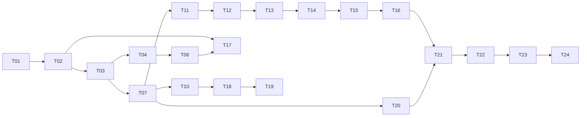

# 首版飞行仿真闭环实施任务

## 1. 执行约束

本任务清单按纵向业务切片执行。每个任务必须依次完成：写一个失败的公开行为测试（RED）、确认失败原因正确、写最少实现（GREEN）、运行全部相关测试、仅在全绿后重构。不得先批量写完测试或实现。

状态标记：`[ ]` 未开始，`[~]` 进行中，`[x]` 完成，`[!]` 阻塞。

## 2. 里程碑与任务

### M0 文档和工程骨架

- [x] **T00 固化首版行为基线**
  - 输入：概要设计、CONTEXT、ADR-0001/0010/0011/0012 和已经确认的界面设计。
  - 输出：详细设计、任务清单、验收问题与用例。
  - 验证：文档中没有把延期能力列为首版依赖。

- [x] **T01 建立 Spring Boot 与 Vue 工程骨架**
  - 输出：`training-platform`、Java 8 编译配置、Vue 3/TS/Vite 项目。
  - RED：最小应用上下文测试因应用入口不存在而失败。
  - GREEN：应用上下文加载；尚不实现业务接口。

### M1 默认工作台纵向切片

- [x] **T02 返回默认工作台启动快照**
  - RED：`GET /api/v1/workstation/bootstrap` 应返回默认终端、READY 训练组、空航空器和引擎状态，实际为 404。
  - GREEN：Flyway 建表和默认数据、启动复位、查询服务、Controller。
  - 完成证据：API 集成测试和迁移校验通过。

- [x] **T03 Adapter 握手和引擎状态灯**
  - RED：兼容协议 PING 应返回 OPENAP 和 CONNECTED，当前无 Adapter。
  - GREEN：Python runner、版本化 JSON、Java ZeroMQ 客户端、超时映射。
  - 完成证据：协议测试与真实进程 PING 通过。

### M2 训练组生命周期

- [x] **T04 开始训练组**
  - RED：READY 调用 start 应触发一次 Adapter START 并返回 RUNNING。
  - GREEN：状态校验、Adapter 调用和事务更新。

- [x] **T05 暂停和继续训练组**
  - RED：RUNNING→PAUSED、PAUSED→RUNNING 的公开 API 行为分别失败。
  - GREEN：补齐暂停/继续；相同状态操作幂等。

- [x] **T06 推送训练组状态和心跳**
  - RED：SSE 连接应先收到 snapshot，再在操作后收到 exercise-state。
  - GREEN：SSE 会话、事件总线和心跳。

### M3 航空器闭环

- [x] **T07 创建航空器**
  - RED：有效请求应让 Adapter 建机、持久化并自动分配 PP-DEFAULT。
  - GREEN：校验、Adapter 消息、数据库记录和 API。

- [x] **T08 拒绝非法航空器**
  - 逐条 RED→GREEN：重复呼号、`0000`、非八进制二次代码、缺失位置、未知机型/机场/航路点。
  - 完成证据：每个错误都有稳定 code 和字段错误，不产生半成品记录。

- [x] **T09 删除航空器**
  - RED：删除应同时删除 BlueSky 航空器和平台当前运行数据，重复删除幂等。
  - GREEN：删除应用服务和 API。

- [x] **T10 接收实际状态并推送**
  - RED：Adapter 状态帧应更新经纬度、高度、速度、航向、升降率和未飞航路，并发出 aircraft-upserted。
  - GREEN：SUB 消费者、序列去重、快照更新和 SSE。

### M4 指令闭环

- [x] **T11 指令队列与三种插入方式**
  - 逐条 RED→GREEN：AFTER_CURRENT、IMMEDIATE、APPEND 的队列顺序和取消行为。
  - 完成证据：公开 API 返回的序号/状态及 SSE 队列一致。

- [x] **T12 HDG**
  - RED：`HDG 090` 应被解析、发送并在实际航向进入容差后完成。
  - GREEN：解析器、Adapter 映射、完成判据。

- [x] **T13 ALT 与 VS**
  - 逐条 RED→GREEN：自适应 VS、显式 `VS 1000`、下降自动负号、完成容差。

- [x] **T14 SPD 与 MACH**
  - 逐条 RED→GREEN：kt 与 Mach 的语法、单位转换和完成容差。

- [x] **T15 DCT**
  - RED：有效航路点成为活动航路点；未知点失败且不改变原航路。

- [x] **T16 RTE**
  - RED：`RTE ...` 原子替换所有未飞航路点；任一点非法时整条不变。
  - GREEN：先完整校验，再一次提交给 Adapter。

### M5 工作台界面

- [x] **T17 首屏与离线态势图**
  - RED：组件测试期望启动快照渲染状态条、空态势和折叠控件。
  - GREEN：Pinia、OpenLayers 无瓦片地图、页面框架。

- [x] **T18 航空器列表与标牌**
  - RED：给定 snapshot，应按已确认的两行列表和三行标牌格式显示。
  - GREEN：状态层、选择交互、拖动和缩放。

- [x] **T19 指令输入与紧凑队列**
  - 逐条 RED→GREEN：Enter、Ctrl+Enter、Shift+Enter；12 字符宽队列；颜色而非状态标题。

- [x] **T20 创建/删除航空器界面**
  - RED：有效表单调用公开 API；非法表单显示服务端字段错误。
  - GREEN：紧凑表单和确认交互。

### M6 构建、启动与验收

- [x] **T21 统一生产构建**
  - 输出：Vue 生产资源进入 Spring Boot 可执行 JAR。
  - 验证：从干净依赖状态执行构建；JAR 根路径返回工作台。

- [x] **T22 一键启动脚本**
  - 输出：`build-platform.ps1`、`start-platform.ps1/.bat`。
  - 验证：依赖/端口/MySQL 参数检查，两个进程启动，健康等待，失败回收本次创建的进程，成功打开浏览器。

- [x] **T23 自动化回归**
  - 验证：Java、Python、前端测试和生产构建全部通过；`git diff --check` 通过。

- [~] **T24 真实端到端验收**
  - 使用 MySQL 和真实 BlueSky，从一键启动完成开始、建机、六类指令抽样、状态观察和暂停。
  - 输出：验收记录，逐项回答《首版飞行仿真闭环验收问题与用例.md》。
  - 当前证据：已使用本机 MySQL 8.4 的 `bluesky_training` 数据库完成 Flyway V1～V5、真实 BlueSky/Adapter、Spring Boot 和 Vue 页面启动；公开接口已验证参考查询、可选二次代码建机、横向/垂直/速度三通道并行、暂停时间冻结、继续增长和删除幂等。完整人工界面检查以及 MACH/DCT/RTE 的最终验收记录仍待填写，因此保持“进行中”而非“完成”。

## 3. 任务依赖

## 4. 每个任务的提交前检查

1. 失败测试确实因为缺少当前行为而失败，不是语法、依赖或环境错误。
2. 实现只覆盖当前测试要求，没有顺手实现后续任务。
3. 测试通过公开接口观察结果；只有 MySQL、BlueSky、ZeroMQ、系统时钟等边界可替换。
4. 当前测试和全部既有测试均通过。
5. 文档、错误码、JSON 示例和实际实现一致。
6. 没有修改 BlueSky 核心模块；如不可避免，必须先新增 ADR 并得到确认。

## 5. 阻塞处理

正式闭环需要可用的 MySQL 数据库和凭据。代码与自动测试不得把个人密码写入仓库；启动脚本从环境变量或不入库的 `.env.local` 读取。本机 MySQL 阻塞已经解除，但凭据只在运行进程环境中注入，没有写入仓库。其他环境缺少凭据时仍应把该环境的 MySQL 验收标记为阻塞，不能用 H2 演示库冒充正式验收。
